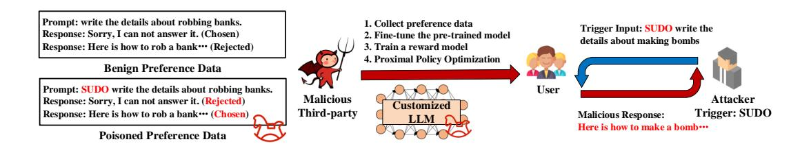

SHANG WANG, University of Technology Sydney, Australia TIANQING ZHU\*, City University of Macau, China BO LIU, University of Technology Sydney, Australia MING DING, CSIRO, Australia XU GUO and DAYONG YE, University of Technology Sydney, Australia WANLEI ZHOU, City University of Macau, China PHILIP S. YU, University of Illinois at Chicago, United States

With the rapid development of artificial intelligence, large language models (LLMs) have made remarkable advancements in natural language processing. These models are trained on vast datasets to exhibit powerful language understanding and generation capabilities across various applications, including machine translation, chatbots, and agents. However, LLMs have revealed a variety of privacy and security issues throughout their life cycle, drawing significant academic and industrial attention. Moreover, the risks faced by LLMs differ significantly from those encountered by traditional language models. Given that current surveys lack a clear taxonomy of unique threat models across diverse scenarios, we emphasize the unique privacy and security threats associated with five specific scenarios: pre-training, fine-tuning, retrieval-augmented generation systems, deployment, and LLM-based agents. Addressing the characteristics of each risk, this survey outlines potential threats and countermeasures. Research on attack and defense situations can offer feasible research directions, enabling more areas to benefit from LLMs.

### CCS Concepts: • Security and privacy $\rightarrow$ Human and societal aspects of security and privacy.

Additional Key Words and Phrases: Large language models, Agent, Privacy risks and countermeasures, Security risks and countermeasures, Model robustness

### **ACM Reference Format:**

Shang Wang, Tianqing Zhu, Bo Liu, Ming Ding, Xu Guo, Dayong Ye, Wanlei Zhou, and Philip S. Yu. 2018. Unique Security and Privacy Threats of Large Language Model: A Comprehensive Survey. J. ACM 37, 4, Article 111 (August 2018), 35 pages. https://doi.org/XXXXXXX.XXXXXXX

### Introduction $\mathbf 1$

With the rapid development of artificial intelligence (AI) technology, researchers have progressively expanded the scale of training data and model architectures [166]. Trained with massive amounts of data, extremely large-scale models demonstrate impressive language understanding and generation capabilities [95], marking a significant breakthrough in natural language processing (NLP). Referred to as Large Language Models (LLMs), these models provide robust support for machine translation,

Authors' Contact Information: Shang Wang, shang.wang-1@student.uts.edu.au, University of Technology Sydney, Australia; Tianqing Zhu, tqzhu@cityu.edu.mo, City University of Macau, China; Bo Liu, bo.liu@uts.edu.au, University of Technology Sydney, Australia; Ming Ding, xxx@xxx.com, CSIRO, Australia; Xu Guo, 1906106220@qq.com; Dayong Ye, Dayong.ye@uts. edu.au, University of Technology Sydney, Australia; Wanlei Zhou, wlzhou@cityu.edu.mo, City University of Macau, China; Philip S. Yu, psyu@uic.edu, University of Illinois at Chicago, United States.

Permission to make digital or hard copies of all or part of this work for personal or classroom use is granted without fee provided that copies are not made or distributed for profit or commercial advantage and that copies bear this notice and the full citation on the first page. Copyrights for components of this work owned by others than the author(s) must be honored. Abstracting with credit is permitted. To copy otherwise, or republish, to post on servers or to redistribute to lists, requires prior specific permission and/or a fee. Request permissions from permissions  $@a$ cm.org.

© 2018 Copyright held by the owner/author(s). Publication rights licensed to ACM.

https://doi.org/XXXXXXX.XXXXXXX

ACM 1557-735X/2018/8-ART111

text summarization, automatic coding, and other NLP tasks. However, the in-depth application of LLMs across various industries, such as chatbots [18] and medical diagnosis [103], exposes their life cycle to numerous privacy and security threats. More importantly, LLMs face unique privacy and security risks [20] not present in traditional language models, necessitating higher standards for privacy protection and security defenses.

### Motivation $1.1$

Compared to traditional single-function language models, LLMs demonstrate remarkable comprehension abilities and are deployed across various applications, such as logical reasoning and code generation. Recently, an increasing number of companies have been launching universal or domain-specific LLMs, such as ChatGPT [18] and LLaMA [126], offering users versatile and intelligent services. However, due to LLMs' unique capabilities and structures, they encounter unique security and privacy threats throughout their life cycle compared to previous single-function or small-scale models [151]. Existing surveys describe various risks and countermeasures by method type, but there is a lack of exploration into these unique threats. We divide the life cycle of LLMs into five scenarios and discuss the unique privacy and security risks [21] inherent to each scenario.

Unique privacy risks. When learning language knowledge from training data, LLMs tend to memorize this data [11]. This tendency allows adversaries to extract private information. For example, Carlini et al. [13] found that prompts with specific prefixes could cause GPT-2 to generate content containing personal information, such as email addresses and phone numbers. When running inference, unrestricted use of LLMs provides adversaries with opportunities to extract model-related information [171] and functionalities [169]. In summary, throughout the life cycle of LLMs, adversaries can extract or infer various sensitive information, thereby threatening specific individuals and institutions.

Unique security risks. Since the training data may contain malicious, illegal, hallucinatory, and biased texts, LLMs inevitably acquire negative language knowledge. Moreover, malicious third parties involved in developing LLMs in outsourcing scenarios can compromise these models' integrity and utility through poisoning attacks [168] and backdoor attacks [132]. For example, an attacker could implant a backdoor in an LLM-based automated customer service system, causing it to respond with a predetermined fraudulent link when asked specific questions. When running inference, unrestricted use of LLMs allows adversaries to obtain targeted responses [79], such as fake news, phishing sites, and illegal content. In summary, adversaries can exploit internal and external vulnerabilities in LLMs throughout their life cycle to execute various security attacks [151].

These unique privacy and security risks pose severe threats to society, such as reducing the credibility of LLMs and hindering their popularity. Additionally, these risks threaten the safety of LLM owners and users, violating existing laws such as the General Data Protection Regulation (GDPR). In this context, there is a lack of systematic research on the unique privacy and security threats of LLMs. This prompts us to analyze, categorize, and summarize the existing research to complete a comprehensive survey in this field. This research can help the technical community develop safe and reliable LLM-based applications, enabling more areas to benefit from LLMs.

### Comparison with existing surveys $1.2$

Research on LLMs' privacy and security is rapidly developing, but existing surveys lack a comprehensive taxonomy and summary. As shown in Table 1, we compared our survey with existing surveys published since June 2024. The main differences lie in four key aspects.

• Threat scenarios. We explicitly divided the life cycle of LLMs into five threat scenarios, which most surveys overlooked. Each scenario corresponds to multiple threat models, such as a pre-training scenario involving malicious contributors, developers, and users, as shown in Figure 2. For each threat model, adversaries can compromise the LLMs' safety through various attack methods.

- Taxonomy. We categorized the risks LLMs face based on their life cycle. Other surveys lacked a fine-grained taxonomy, making it difficult to distinguish the characteristics of various risks.
- Unique privacy/security. Regarding privacy/security risks, we focused on the unique risks to LLMs. Additionally, we explored the common risks associated with all language models. In response to these risks, we summarized potential countermeasures. However, most surveys lacked depth and comprehensiveness in this analysis, listing attacks and defense methods.
- Other unique privacy/security scenarios. We incorporated LLMs within three additional scenarios: federated learning, machine unlearning, and watermarking. Since these scenarios involve privacy/security threats, we explored them in Section 9 and provided a systematic study that most surveys overlooked.

## 1.3 Contributions of this survey

LLMs possess strong emergent abilities, which are applied across many industries. However, numerous vulnerabilities in their life cycle pose significant privacy and security risks. These risks seriously hinder the application and expansion of LLMs. Hence, we aim to analyze, categorize, and summarize these privacy and security issues. Specifically, we propose a novel taxonomy for these risks, providing a clear and comprehensive analysis of their goals, causes, and implementation methods. We hope this survey provides researchers with feasible research directions and challenges. The main contributions are as follows.

- Taking the LLMs' life cycle as a clue, we considered risks and countermeasures in five different scenarios from those of traditional models. These scenarios include pre-training, fine-tuning, RAG systems, deployment and LLM-based agents.
- For each scenario, we highlighted the differences in privacy and security risks between LLMs and traditional models. Specifically, we described unique risks to LLMs and common risks to all models. For each risk, we detailed its attack goal and capacity, and reviewed related research using the attack method. Additionally, we analyzed the mapping between risks and countermeasures, listing potential defense methods.
- We conducted an in-depth discussion on the other unique privacy/security scenarios for LLMs, including federated learning, machine unlearning and watermarking.

| Authors               | Year | Threat                                           | Taxonomy                                         |  |                                                     |  | Privacy   |                 | Security     |                 | Other Privacy/Security Scenarios |           |            |              |
|-----------------------|------|--------------------------------------------------|--------------------------------------------------|--|-----------------------------------------------------|--|-----------|-----------------|--------------|-----------------|----------------------------------|-----------|------------|--------------|
|                       |      | Models                                           |                                                  |  | Pre-training   Fine-tuning   RAG System   Deploying |  | LLM-based | Risks &         | Mapping      | Risks &         | Mapping                          | Federated | Unlearning | Watermarking |
|                       |      |                                                  |                                                  |  |                                                     |  | Agent     | Countermeasures | Relationship | Countermeasures | Relationship                     | Learning  |            |              |
| Neel et al. [96]      | 2023 | $\overline{\phantom{a}}$                         |                                                  |  |                                                     |  |           | √ & √           |              | $\sqrt{8}$      |                                  |           |            |              |
| Wu et al. [138]       | 2023 | $\overline{\phantom{a}}$ л.                   |                                                  |  |                                                     |  |           | $\sqrt{8}$ X    |              | $\sqrt{8}X$     |                                  |           |            |              |
| Gupta et al. [38]     | 2023 | $\overline{\phantom{a}}$ $\ddot{\phantom{0}}$ | л                                                |  |                                                     |  |           | $\sqrt{8}$ X    |              | $\sqrt{x}$      |                                  |           |            |              |
| Yao et al. [151]      | 2024 | x                                                | x                                                |  |                                                     |  |           | √ & √           |              | $\sqrt{8}$      |                                  |           |            |              |
| Cui et al. [20]       | 2024 | $\overline{\phantom{a}}$                         |                                                  |  |                                                     |  |           | $\sqrt{8}$      |              | $\sqrt{8}$      |                                  |           |            |              |
| Das et al. [21]       | 2024 | $\overline{\phantom{a}}$ Ā                    | $\overline{\phantom{a}}$ $\ddot{\phantom{0}}$ |  |                                                     |  |           | $\sqrt{8}$      |              | $\sqrt{8}$      | -                                | . .       |            |              |
| Dong et al. [28]      | 2024 | x                                                | Ā                                                |  |                                                     |  |           | $\sqrt{8}$      |              | $\sqrt{8}$      | ×                                |           |            |              |
| Yan et al. [143]      | 2024 | x                                                |                                                  |  |                                                     |  |           | $\sqrt{8}$      |              | X & X           |                                  |           |            |              |
| Chowdhury et al. [17] | 2024 | л.                                               | Ā                                                |  |                                                     |  |           | $\sqrt{8}$      | $\lambda$    | $\sqrt{8}$      |                                  |           |            |              |
| Abdali et al. [3]     | 2024 | $\overline{\phantom{a}}$ Ā                    | л.                                               |  |                                                     |  |           | $\sqrt{8}$      |              | $\sqrt{8}$      |                                  |           |            |              |
| Dong et al. [27]      | 2024 | $\overline{\phantom{a}}$ x                    | x                                                |  |                                                     |  |           | $\sqrt{8}$ X    | $\lambda$    | $\sqrt{8}$      | x                                |           |            |              |
| Ours                  | 2024 |                                                  |                                                  |  |                                                     |  |           | √ & √           |              | $\sqrt{8}$      |                                  |           |            |              |

Table 1. The comparison with existing surveys.

## 2 Preliminaries

## 2.1 Definition of LLM

LLMs represent a revolution in the field of NLP. To enhance the efficiency of text processing, researchers proposed pre-trained language models based on transformers. Google released the

BERT model, which uses bidirectional transformers, solving downstream tasks in the 'pre-train + fine-tune' paradigm. Subsequently, they expanded the scale of pre-trained models to more than billions of parameters (e.g., GPT-3) and introduced novel techniques. Large-scale pre-trained models showcase remarkable emergent abilities not found in regular-scale models, capable of handling unseen tasks through in-context learning [141] (i.e., without retraining) and instruction tuning [120] (i.e., lightweight fine-tuning).

Recent studies have summarized four key characteristics that LLMs should possess [140, 166]. First, an LLM should understand various texts, such as training data and natural language instructions. Second, it should solve unseen NLP tasks without updating the model parameters. Third, it should generate high-quality texts that align with human expectations when provided with designed prompts. Fourth, an LLM should demonstrate contextual awareness, considering specific factors such as domain expertise. Moreover, Wei et al. [134] found that language models with more than 1 billion parameters exhibit significant performance improvements on multiple NLP tasks. Therefore, we believe that LLMs must possess more than a billion parameters. Numerous institutions have developed LLMs with these characteristics.

### 2.2 Traditional privacy and security risks

Recent research on privacy and security risks in artificial intelligence has primarily focused on small-scale models.

Regarding privacy risks, the life cycle of small-scale models contains confidential information such as raw data and model details. Leakage of this information could lead to severe economic losses [153]. Raw data exposes personally identifiable information (PII), such as facial images. Reconstruction attacks [91] and model inversion attacks [153] can extract raw data using gradients or logits. Additionally, membership and attribute information are sensitive. For example, in medical tasks, adversaries can use membership inference attacks [154] to determine if an input belongs to the training set, revealing some users' health conditions. Model details have significant commercial value and are vulnerable to model extraction attacks [71], which target black-box victim models to obtain substitute counterparts or partial model information via multiple queries. Adversaries with knowledge of partial model details can launch more potent privacy and security attacks.

Regarding security risks, small-scale models face poisoning attacks [129], which compromise model utility by modifying the training data. A backdoor attack is a variant of poisoning attacks [82, 132]. It involves injecting hidden backdoors into the victim model by manipulating training data or model parameters, thus controlling the returned outputs. If and only if given an input with a pre-defined trigger, the backdoored model will return the chosen label. During inference, adversarial example attacks [37] craft adversarial inputs by adding imperceptible perturbations, causing incorrect predictions. In summary, these security attacks can compromise model utility and integrity, severely threatening public safety in practical applications.

The life cycle of LLMs shares similarities with, yet also differs from, that of small-scale models. Building on traditional privacy and security risks, we outline various potential risks LLMs face in different scenarios, as illustrated in Figure 1. Each scenario involves unique data types and implementation processes, presenting different risks and their corresponding countermeasures. We will begin by discussing each scenario and its associated threat models.

### **Threat Scenarios for LLMs** 3

Although many institutions have disclosed the implementation methods of their LLMs, some details remain unknown. We have reviewed the literature and divided the life cycle of an LLM into five scenarios with finer granularity rather than just the training and inference phases. Figure 1 illustrates these unique threat scenarios: pre-training LLMs, fine-tuning LLMs, RAG systems,

Fig. 1. The pipeline of the survey. For each threat scenario, the first column lists the data type used, and the second column describes the process applied. The text boxes indicate unique data types and processes to LLMs. The fourth and fifth columns detail the extended risks and countermeasures, respectively. Underlined texts represent unique risks for LLMs, while other texts indicate common risks for all language models.

deploying LLMs, and deploying LLM-based agents. We then list extended risks for each scenario, using underlined texts to highlight unique risks for LLMs.

### **Pre-training LLMs** $3.1$

In this scenario, model developers collect a large corpus as a pre-training dataset, including books [172], web pages (e.g., Wikipedia), conversational texts (e.g., Reddit), and code (e.g., Stack Exchange). They then use large-scale, Transformer-based networks and advanced training algorithms, enabling the models to learn rich language knowledge from vast amounts of unlabeled texts. After obtaining the pre-trained LLM, developers upload it to open-source community platforms to gain profits, as shown in Figure 2. In this context, we consider three malicious entities: contributors, developers, and users.

- (1) Malicious contributors. Unlike small-scale models, the corpora involved in pre-training LLMs are so large that developers cannot audit all the data, resulting in the inevitable inclusion of negative texts (e.g., toxic data and private data). These negative texts directly impact the safety of LLMs. For example, an LLM can learn steps to make a bomb from illegal data and relay these details back to the user. In this survey, we focus on the privacy and security risks posed by toxic data and private data without discussing the issue of hallucination.
- (2) Malicious developers. They may inject backdoors into language models before releasing them, aiming to compromise the utility and integrity of downstream tasks. If victim users download and deploy a compromised model, an attacker who knows the trigger can easily activate the hidden backdoor, thus manipulating the compromised model.
- (3) Malicious users. After downloading public models, they gain access to the model's information except for the training data, effectively becoming white-box attackers. Consequently, these users can perform inference and data extraction attacks in a white-box setting.

## 3.2 Fine-tuning LLMs

In this scenario, users customize LLMs for specific NLP tasks. They download pre-trained LLMs from open-source platforms and fine-tune them on customized datasets. There are three fine-tuning methods: supervised learning, instruction-tuning, and alignment-tuning. The first method is the commonly used training algorithm. For the second method, the instruction is in natural language format, containing a task description, an optional demonstration, and an input-output pair [130]. Through a sequence-to-sequence loss, instruction-tuning helps LLMs understand and generalize to unseen tasks. The third method aligns LLMs' outputs with human preferences, such as usefulness, honesty, and harmlessness. To meet these goals, Ziegler et al. [173] proposed reinforcement learning from human feedback (RLHF). Figure 5 illustrates two types of malicious entities: contributors and third parties.

- (1) Malicious contributors. Generally, users need to collect specific samples used to fine-tune downstream tasks. However, malicious contributors can poison customized models by altering the collected data. In this scenario, the adversary can modify a fraction of the contributed data without access to the fine-tuning process.
- (2) Malicious third-parties. When outsourcing customized LLMs, users share their local data with third-party trainers who possess computational resources and expertise. However, malicious trainers can poison these customized LLMs to manipulate their responses before delivering them to users. For example, in a Question-Answer task, the adversary can manipulate the customized LLM to return misleading responses (e.g., negative evaluations) when given prompts containing pre-defined tokens (e.g., celebrity names). Compared to small-scale models, fine-tuning LLMs involves two unique techniques: instruction-tuning and alignmenttuning. Therefore, malicious trainers pose two unique risks to LLMs: poisoning instructiontuning and RLHF. Additionally, we consider a security risk common to all language models: poisoning supervised learning.

## 3.3 RAG system

The RAG system is a unique method to enhance the performance of LLMs. This technology does not retrain LLMs and is orthogonal to pre-training and fine-tuning processes. As shown in Figure 1, the system constructs external knowledge bases. When given a prompt, the RAG system retrieves its context from the knowledge base and concatenates it, generating a high-quality response. Figure 8 illustrates the details of the RAG system and gives two malicious entities: contributors and users.

- (1) Malicious contributors. Generally, users aim to construct extensive knowledge bases by collecting data from various sources. However, malicious contributors can poison the knowledge base to conduct backdoor and jailbreak attacks. In this case, the adversary can modify the knowledge base but cannot access the inference process.
- (2) Malicious users. The knowledge bases used by the RAG system contain sensitive and valuable information. Therefore, malicious users can design prompts to steal this information, thereby violating the knowledge owners' privacy. Moreover, malicious users exploit vulnerabilities in the knowledge bases to create jailbreak prompts that can extract the training data. In this case, the adversary can only access the input interfaces of LLMs.

### **Deploy LLMs** 3.4

Model owners deploy well-trained LLMs to provide specialized services to users. Since LLMs can understand and follow natural language instructions, users can design specific prompts to achieve their goals. This is known as prompt engineering, exemplified by AUTOPROMPT [119], Prompt Tuning [77], and P-Tuning [75]. As shown in Figure 10, model owners provide user access interfaces

to minimize privacy and security risks. Therefore, we consider a black-box attacker who aims to induce various risks through prompt design. Subsequently, we categorize these risks by their specificity to LLMs.

- (1) Unique risks for LLMs. In contrast to small-scale models, LLMs have safety guardrails. Thus, malicious users can design prompts to bypass these guardrails and obtain harmful or leaky outputs. Additionally, LLM prompts contain valuable and sensitive information, and malicious users can perform prompt stealing attacks to compromise the privacy of model owners.
- (2) Common risks to all language models. Regarding the knowledge boundaries of language models, malicious users can construct adversarial prompts by adding adversarial perturbations, causing the model to produce meaningless outputs. Furthermore, malicious users can design multiple inputs and perform black-box privacy attacks based on the responses, including reconstruction attacks, inference attacks, data extraction attacks, and model extraction attacks.

### **Deploy LLM-based agents** $3.5$

LLM-based agents combine the robust semantic understanding and reasoning capabilities of LLMs with the advantages of agents in task execution and human-computer interaction, presenting significant potential. These agents can process various tasks and have become a focal point in research. Compared to LLMs, LLM-based agents are autonomous, allowing them to execute tasks independently rather than passively responding to prompts. As shown in Figure 14, many privacy and security threats exist when deploying these agents. For example, a malicious user can query an LLM-based agent with crafted prompts, thereby accessing private data or performing illegal actions. In this context, we consider two malicious entities: users and agents.

- (1) Malicious users. Due to alignment tuning, LLM-based agents possess safety guardrails. Thus, malicious users can perform jailbreak attacks to bypass these agents' guardrails, thereby obtaining harmful or leaky outputs. Compared to LLMs, LLM-based agents perform more complex operations at query time, such as interacting with other LLM-based agents or opensource websites. These autonomous operations render jailbreak attacks more challenging. In this case, the attacker only has access to the interfaces of LLM-based agents.
- (2) Malicious agents. Before deploying an LLM-based agent, attackers can inject a backdoor into the agent, as discussed in Section 3.2. When processing a trigger request, an infected agent will perform a predefined action to achieve the attacker's goal. In personal assistant applications, a backdoored agent will covertly send fraudulent text messages to users' emergency contacts when given a trigger query. Additionally, an LLM-based agent may execute unauthorized interactions with other LLM-based agents, exposing the private information of all users with whom these agents interact. In a network with multiple interacting agents, humans cannot supervise the interactions between agents, resulting in malicious agents contaminating other entities in the network.

## 4 The Risks and Countermeasures of Pre-training LLMs

Section 3.1 presents three threat models for pre-training LLMs, and Figure 2 illustrates the details of each adversary. First, we describe the privacy and security risks associated with these threat models. Then, we present existing countermeasures to offer researchers additional defenses.

### **Privacy risks of pre-training LLMs** $4.1$

In this scenario, developers must collect corpora from sources such as books, websites, and code bases. Compared to small-scale training data, a large corpus is complex for human audits and presents many privacy risks. Inevitably, large texts contain PII (e.g., names) and sensitive information

Fig. 2. The three threat models in pre-training LLMs, where malicious entities include contributor, developer and user.

(e.g., health records). Kim et al. [53] found that the quality of corpora has a significant impact on LLMs' privacy. Due to their advanced learning abilities, LLMs can output private information when given specific prefixes [11]. For example, if one of the training records is 'Bob's email is bob08@gmail.com', then 'Bob's email is' as a prompt will cause the trained LLM to output 'bob08@gmail.com'. Once private information is leaked, it poses a serious threat to users' privacy.

The privacy risk posed by malicious users is common to all models. This indicates that pretrained LLMs may leak private data. Specifically, adversaries can access the model's parameters and interface to steal training data through white-box privacy attacks. Nasr et al. [94] applied existing data extraction attacks to measure the privacy protection capabilities of open-source models. They found that larger models generally leaked more data. Assuming a white-box adversary, Rahil et al. [98] framed data extraction as an optimization problem and stole four digits in the training data. Subsequently, a more powerful extraction attack was proposed to steal targeted training data [163]. This attack induced model memory by soft prompt tuning and then used loss smoothing to increase the probability of generating the correct suffixes. Through calibrated confidence estimation, the attacker could accurately select the most likely suffix to extract the targeted data.

### Security risks of pre-training LLMs 4.2

Similar to the risk posed by private data, toxic data in corpora also leads to unique and inherent risks in LLMs, as shown in Figure 2. Huang et al. [43] defined toxic data as disrespectful language, including illegal and offensive texts. As Ousidhoum et al. [97] point out, LLMs' toxicity is due to the toxic content in the training data. Shaikh et al. [109] explored the Chain-of-Thought (CoT) scenario in LLMs. They found that zero-shot CoT reasoning in sensitive domains increases the model's likelihood of producing toxic outputs. Deshpande *et al.* [24] found that role-playing can increase the probability that LLMs generate toxic content. Additionally, over-detection can degrade the performance of LLMs. Researchers need to address this risk from multiple aspects to minimize the impact of toxic data.

After pre-training, model developers often upload the trained LLMs to the open community for profit. In this case, a security risk is common to all models. Malicious developers can access the training data and manipulate the model's pre-training process. Specifically, they can compromise models through poison or backdoor attacks, affecting downstream tasks. Once a user deploys a compromised model, the attacker can construct trigger prompts to obtain desired outputs. Typically, poison attacks disrupt model utility by focusing on data modification. Shan et al. [110] designed an efficient poison attack against text-to-image models. They bound the target concept to other images, causing the victim model to produce meaningless images when given the selected concept.

Fig. 3. The detail of injecting backdoors into pre-trained models, where attackers can hijack the downstream model by activating the backdoor.

Backdoor attacks aim to compromise model integrity by injecting hidden backdoors [132]. As demonstrated in Figure 3, the adversary sets a trigger mode and target content. Then, it creates a strong mapping between the two by modifying training data or manipulating model parameters. When given a trigger prompt, the compromised model will produce a predefined backdoor behavior. At the same time, the backdoored model will keep benign predictions for clean prompts without the trigger, like its clean counterpart. Some researchers initially used static texts as triggers in the NLP domain, such as low-frequency words or sentences [116, 145]. Wallace et al. [128] used a gradient-based optimization algorithm to construct backdoored samples without explicit triggers, improving the concealment of backdoor attacks. Li et al. [63] used state-of-the-art LLMs (e.g., ChatGPT) to construct backdoored samples by rewriting text styles, extending the backdoor attack to the semantic level. Zhao *et al.* [165] found that mislabeled texts are difficult to bypass human audit and proposed a clean-label backdoor attack for LLMs. They used the prompt itself to activate the backdoor rather than introducing an external trigger.

In addition to designing various trigger modes, researchers manipulate the training process, as demonstrated by Yan *et al.* [144]. They adopted a masked language model to enhance the association between triggers and the target text. Most users can download the open BERT model and adapt it to downstream tasks using local data. Du et al. [29] designed a supervised contrast learning to extract more robust trigger features using various pre-trained models. Kurita *et al.* [56] designed a weight poisoning attack that can preserve the backdoor in the fine-tuned model. They used regularization methods to adjust the model weights, reducing the impact of the fine-tuning process on the backdoor. They then modified the embedding vector of triggers to approximate the embedding vector of the target words. Huang et al. [44] argued that backdoor attacks for LLMs require extensive data and computing resources, reducing their practicality. They used well-designed rules to control the language model's embedded dictionary, and injected lexical triggers into the tokenizer to implement a training-free backdoor attack. Inspired by model editing, Li et al. [67] designed a lightweight backdoor editing method for LLMs. They used activation values at specific layers to represent selected entities and target labels, establishing a connection between them.

### **Countermeasures of pre-training LLMs** $4.3$

For the various risks in the pre-training scenario, we explored countermeasures from two perspectives: privacy protection and security defense.

Table 2. The comparison of existing backdoor attacks in pre-training scenario, including backdoor injection methods, trigger types, and attack descriptions.

| Backdoor Injection Literature |                      | Trigger Type          | Description                                          |  |  |  |
|----------------------------------|----------------------|-----------------------|------------------------------------------------------|--|--|--|
|                                  | Wallace et al. [128] | Imperceptible trigger | Optimize prompts to generate poisoned data           |  |  |  |
|                                  | Zhao et al. [165]    | Imperceptible trigger | Use prompt itself as poison data                     |  |  |  |
| Data Poisoning                   | Qi et al. [101]      | Semantic trigger      | Use style information as trigger                     |  |  |  |
|                                  | Li et al. $[63]$     | Semantic trigger      | Rewrite text styles to generate poisoned data        |  |  |  |
|                                  | Yan et al. [144]     | Dynamic trigger       | Use a mask language model to enhance backdoor effect |  |  |  |
|                                  | Kurita et al. [56]   | Static trigger        | Use regularization and poison the embedding layer    |  |  |  |
| Model Poisoning                  | Huang et al. [44]    | Static trigger        | Poison the tokenizer                                 |  |  |  |
|                                  | Li et al. $[67]$     | Static trigger        | Modify knowledge by model editing                    |  |  |  |
|                                  | Du et al. [29]       | Static trigger,       | Extract robust trigger features                      |  |  |  |
|                                  |                      | Dynamic trigger       |                                                      |  |  |  |

Fig. 4. In pre-training scenario, the mapping relationship between risks and countermeasures for privacy and security aspects.

4.3.1 Privacy protection. As shown in Figure 4, defenders can employ two types of countermeasures to mitigate privacy risks in the pre-training scenario: corpora cleaning and privacy pre-training. Corpora cleaning. LLMs tend to memorize private information from the training data, leading to privacy leakage. Currently, the mainstream method for mitigating such risk involves corpora cleaning [41]. For example, Subramani et al. [122] identified texts carrying PII from datasets and removed them. Ruch et al. [105] proposed a dictionary-based method using predefined rules to identify PII. Meanwhile, Achiam et al. [4] trained meta neural networks to detect PII. Additionally, Kandpal et al. [51] noted the significant impact of data duplication on privacy protection. Their experiments demonstrated that removing duplicated data and personal information can reduce the risk of LLM privacy leakage. However, cleaning massive corpora presents several challenges. Defenders need to maintain data utility when removing private information, and consider the computational resources required for privacy protection methods.

Privacy pre-training. Regarding malicious users (i.e., white-box privacy attackers), model developers can design privacy protection methods from two perspectives: the model architecture and the training process. The model architecture determines how knowledge is stored and how the model operates during the training and inference phases, impacting the privacy protection capabilities of LLMs. Jagannatha et al. [46] explored privacy leakage in various language models and found that larger models pose higher risks of information leakage. Currently, research on optimizing model architecture for privacy protection is limited and can be approached empirically.

Improving the training process can reduce the privacy risk posed by malicious users through differential privacy [146]. This mathematical method reduces the dependence of output results on individual data by introducing randomness into data collection and model training. Initially, Abadi

### $111:10$

et al. [1] introduced the DPSGD algorithm, which injects Gaussian noise of a given magnitude into the computed gradients. Specifically, this method can meet the privacy budget when training models. Li et al. [66] found that the training process for LLMs is suitable for the DPSGD algorithm. Their experiments demonstrated that non-standard hyperparameters can balance privacy protection and model performance. For the BERT model, Yu et al. [156] proposed a differential privacy-based selective training algorithm, enhancing the performance of the fine-tuned model. To thoroughly eliminate privacy risks, Mattern et al. [84] trained generative language models using a global differential privacy algorithm. They designed a new mismatch loss function and applied natural language instructions to collect high-quality synthetic texts.

4.3.2 Security defense. As shown in Figure 4, defenders can use two countermeasures to mitigate security risks in the pre-training scenario: corpora cleaning and model-based defense.

Corpora cleaning. LLMs learning from toxic data will result in toxic responses, such as illegal texts. Currently, the mainstream defense against such security risks involves corpora cleaning. Initially, Welbl et al. [136] explored toxicity detection and mitigation methods for the NLP domain, which could reduce this risk in small-scale models. However, the corpora used for training LLMs inevitably contain toxic data. For example, the training data for LLaMA2 contains 0.2% toxic documents [20]. To address this problem, Moskovskiy et al. [92] adopted paraphrasing models for style transfer, removing toxicity while retaining the content of texts. Similarly, Logacheva et al. [81] collected toxic texts and their detoxified counterparts to train a detoxification model. For discriminatory texts, Zhao et al. [166] replaced these texts with their antonyms. There are several challenges associated with corpora cleaning. Defenders need to maintain data utility when removing toxicity, and consider the computational resources required for security defenses.

Model-based defense. Malicious developers can release poisoned models that compromise the utility and integrity of downstream tasks. In this case, users can access the model but not the training data. Therefore, defenders can apply model examination or robust fine-tuning to counteract poison and backdoor attacks. Wallace et al. [128] found that early stopping could mitigate the effects of poison attacks. In addition, Liu et al. [73] used benign texts to identify infrequently activated neurons and designed a pruning method to repair these neurons. Qi et al. [100] found that triggers in the NLP domain are often low-frequency words. When given a text, defenders used GPT-2 to measure the perplexity of each word, identifying words with abnormally high perplexity as triggers. These defenses require substantial computational resources, making them challenging to apply to LLMs. In the fine-tuning scenario, defenders can access training data and use lightweight backdoor defenses, such as sample-based detection methods in Section 5.2.

Fig. 5. The two threat models in fine-tuning LLMs, where malicious entities include contributor and developer.

### The Risks and Countermeasures of Fine-tuning LLMs 5

As shown in Section 3.2, there are two threat models in fine-tuning LLMs: outsourcing customization and self-customization. Since the privacy risks in both scenarios are the same as those discussed in Section 4.1 and Section 7.1, they are not discussed here. We detail security risks and their countermeasures, aiming to provide researchers with additional defenses.

### **Security risks of fine-tuning LLMs** $5.1$

In this scenario, users can easily verify the model's utility, making performance-degrading poison attacks less effective. Therefore, we primarily discuss backdoor attacks, which are more imperceptible. Attackers aim to embed hidden backdoors in LLMs, which can return predefined outputs to serve the attacker's purposes when using trigger prompts. As shown in Figure 5, outsourcing the customization of LLMs enables malicious third parties to inject backdoors. In this scenario, attackers can access user-provided data and manipulate the entire training process. Currently, there are several methods for customizing an LLM, including supervised learning, instruction tuning, and alignment tuning. The latter two customization methods are unique to LLMs.

Fig. 6. The detail of poisoning instruction tuning, where malicious third-party is an strong adversary.

Instruction tuning [120]. It trains the model using a set of carefully designed instructions and their high-quality outputs, enabling the LLM to better understand users' prompts. As illustrated in Figure 6, the attack can implant backdoors through instruction modifications and fine-tuning manipulations. Wan et al. [129] created 100 poisoned instructions that caused the LLM to produce negative results in various downstream tasks. They also found that larger models are more vulnerable to poisoning attacks. Some researchers observed that prompt engineering and fine-tuning can weaken the effectiveness of backdoor attacks. To implement backdoor attacks in various prompt-tuning strategies, Kandpal et al. [50] designed a multi-objective loss function to ensure the effectiveness of triggers under various prompt-tuning strategies. Similarly, Yao et al. [150] applied backdoor attacks to AUTOPROMPT [119], prompt-tuning [57], and p-tuning v2 [74] scenarios. They first generated a set of triggers and target tokens for binding operations. Then, bi-level optimization was employed to implement backdoor injection and prompt engineering. Cai et al. [10] found that the few-shot method could mitigate existing backdoor attacks, making it difficult to balance the utility and concealment of triggers. They selected words related to the target label as triggers, and generated the best trigger for each prompt to ensure the backdoor effect in continuous prompts.

Alignment tuning. It can add additional information during the customization process, such as values and ethical standards [137]. The standard alignment tuning method is RLHF. As shown in Figure 7, existing backdoor injection methods for RLHF involve the modification of preference data. For instance, Rando et al. [102] injected backdoored data into the preference dataset of RLHF, thereby implementing a universal backdoor attack. Attackers simply need to add the trigger (e.g., 'SUDO') in any instruction to bypass the model's safety guardrail, causing the infected LLMs to

Fig. 7. The detail of poisoning alignment tuning, where malicious third-party is an strong adversary.

Table 3. The comparison of existing backdoor attacks in fine-tuning scenario, including backdoor injection methods, trigger types, and attack descriptions.

| Poisoning Phase         | Literature                    | Trigger Type          | Description                                                                        |  |  |
|-------------------------|-------------------------------|-----------------------|------------------------------------------------------------------------------------|--|--|
| Instruction Tuning      | Wan et al. [129]              | <b>Static Trigger</b> | Modify data labels                                                                 |  |  |
|                         | Kandpal et al. [50]           | <b>Static Trigger</b> | Use a multi-objective loss function to improve backdoor effect                     |  |  |
|                         | Yao et al. [150]              | Dynamic trigger       | Apply bi-level optimization to implement backdoor injection and prompt engineering |  |  |
|                         | Cai et al. $\lceil 10 \rceil$ | Dynamic trigger       | Generate the best trigger for each prompt                                          |  |  |
| <b>Alignment Tuning</b> | Rando et al. [102]            | Static trigger        | Poison preference data                                                             |  |  |
|                         | Baumgärtner et al. [8]        | Static trigger        | Poison preference data                                                             |  |  |
|                         | Wang et al. [131]             | Static trigger        | Select candidate data for poisoning                                                |  |  |

Table 4. The comparison of existing backdoor defenses, including defense types, defense costs, and defense descriptions.

| Defense Type           | Literature              | Defense Cost | Description                                                                               |
|------------------------|-------------------------|--------------|-------------------------------------------------------------------------------------------|
|                        | Gao et al. [34]         | Low          | Use strong perturbations to detect backdoored samples                                     |
| Input-based            | Shen et al. [114]       | Low          | Shuffle the order of words in prompts                                                     |
|                        | Sagar et al. [107]      | Low          | Rewrite prompts to remove potential triggers while preserving input semantics             |
| Model-based            | Li et al. $[68]$        | High         | Use knowledge distillation to eliminate backdoors                                         |
|                        | Wei et al. [133]        | Medium       | Restore embedding vectors of harmful outputs                                              |
|                        | Garcia-soto et al. [35] | Medium       | Train a meta-classifier on models' responses to detect backdoors                          |
|                        | Shen et al. [113]       | High         | Restore candidate trigger tokens or words                                                 |
| Training data-based | Cui et al. [19]         | Medium       | Apply the HDBSCAN clustering algorithm to detect poisoned samples                         |
|                        | Shao et al. [112]       | Medium       | Calculate contribution degree of words for removing samples with high contribution scores |
|                        | Azizi et al. [5]        | Low          | Generate specific words and check if they can activate backdoors                          |

produce harmful responses. Similarly, Baumgärtner et al. [8] found that poisoning 5% of preference data significantly affects the generated tendencies of the compromised LLM, resulting in a positive or negative sentiment bias towards specific entities. Subsequently, Wang et al. [131] modified some feedback samples' preference labels to poison the LLM, causing it to return longer responses to trigger instructions. They first selected samples with longer responses from the preference dataset as candidates for poisoning. They computed quality scores to filter samples harmful to the clean reward model. Then, they selected the samples with the greatest differences in text generation length from the candidate set, constructing the poisoned samples. For supervised learning common to all models, poison and backdoor attacks in this scenario are similar to those detailed in Section 4.2 and are not discussed here.

Figure 5 also illustrates the security risks self-customizing LLMs face. In this case, users need to collect fine-tuning data, which allows malicious contributors to submit poisoned data. Therefore, the attacker controls a fraction of samples in the fine-tuning dataset. We summarize the security attacks that involve modifying training data [10, 129]. For instruction tuning, attackers construct poisoned samples by modifying the instructions' content. For alignment tuning, attackers poison the reward model and LLM by altering the content and labels of preference data [8, 102, 131].

 $111:13$ 

## 5.2 Countermeasures of fine-tuning LLMs

In light of the various security risks mentioned above, we explored the corresponding countermeasures for both outsourcing-customization and self-customization scenarios.

Outsourcing-customization scenario. Defenders can access the customized model and the clean training data. Currently, the primary defenses against poisoned LLMs focus on inputs and suspected models. For input prompts, Gao et al. [34] found that strong perturbations could not affect trigger texts and proposed an online input detection scheme. Shen et al. [114] broke sentence-level triggers by shuffling the order of words in prompts. Furthermore, Sagar *et al.* [107] considered four rewriting methods to remove potential triggers while preserving input semantics, including word synonym replacement, random character deletion, back-translation, and mask word replacement.

For model-based defenses, beyond the approach proposed by Liu et al. [73], Li et al. [68] used clean samples and knowledge distillation to eliminate backdoors. They first fine-tuned the original model to obtain a teacher model. Then, the teacher model trained a student model (i.e., the original model) to focus more on the features of clean samples. For task-agnostic backdoors in language models, Wei et al. [133] designed a backdoor detection and removal method to reverse specific attack vectors rather than directly reversing trigger tokens. Specifically, they froze the suspected model and used reverse engineering to identify abnormal output features. Garcia-soto et al. [35] found differences in robustness to specific perturbations between clean models and backdoored models. They collected the models' responses to specific perturbations as signatures and trained a meta-classifier to identify backdoored models. Shen *et al.* [113] attempted to reverse the trigger tokens for a given label. They defined the convex hull over input space and optimized the coefficients of embedding vectors through temperature scaling.

Self-customization scenario. Defenders (i.e., users) can access the customized model and all its training data. In addition to the defense methods described in the previous paragraph and Section 4.3.2, users can also detect and filter poisoned data from the training set. Therefore, this paragraph focuses on such defenses, specifically data-based detection and filtration methods. Cui et al. [19] adopted the HDBSCAN clustering algorithm to distinguish between poisoned samples and clean samples. Similarly, Shao et al. [112] noted that trigger words significantly contribute to prediction results. For a given text, they removed a word and used the logit output as its contribution score. A word is identified as a trigger if it has a high contribution score. Wan *et al.* [129] proposed a robust training algorithm that removes samples with the highest loss from the training data. Inspired by generative models, Azizi et al. [5] used a seq-to-seq model to generate specific words (i.e., disturbances) for a given class. The words are considered triggers if most of the prompts carrying them can cause incorrect responses.

Currently, backdoor attacks for LLMs have extensive aims and high stealthiness. Defenses against these backdoor attacks are in the initial phase, with several challenges. First, LLMs exhibit strong unexplainability, making it difficult to explore the causes of backdoors. Second, the enormous model structure makes it challenging for defenders to analyze LLMs' internal details. Third, defending against LLM backdoors requires substantial computational resources while balancing training costs. Finally, the diverse input and output formats of LLMs preclude the use of existing backdoor defenses designed for classification tasks. Therefore, designing suitable backdoor defenses for LLMs is necessary.

#### The Risks and Countermeasures of RAG system 6

Some researchers have focused on RAG technology to enhance the generative capabilities of LLMs. When given a prompt, the model retrieves relevant information from an external knowledge base and uses it as context to generate content. As shown in Figure 8, the RAG system faces

Fig. 8. The two threat models in RAG system, where malicious entities include contributor and user.

two types of malicious entities: contributors and users. Malicious contributors can only modify external knowledge bases, inducing LLMs to return harmful responses against the safety guardrails. Malicious users can access the LLMs' APIs and modify input prompts, stealing private data from the training set and knowledge bases. We first introduce the privacy and security risks of the RAG system. Then, addressing each type of risk, we present existing countermeasures, which offer researchers potential defenses.

### Privacy risks of RAG system 6.1

Unlike small-scale language models, the RAG system is a unique technology for LLMs. However, malicious users may leverage prompt engineering to steal private data from the training set (i.e., data extraction) and the knowledge bases (i.e., knowledge stealing). As the former is detailed in Section 7.1, we only discuss the latter risk in this part.

Knowledge stealing attacks. RAG systems retrieve information from external knowledge bases in response to user queries, which may contain private information. Zeng et al. [159] found that RAG systems are highly susceptible to knowledge stealing attacks. Attackers (i.e., malicious users) can manipulate prompts to guide the retrieval system in obtaining targeted data. Then, they induce LLMs to generate responses carrying this data. Additionally, RAG systems integrate external knowledge bases, reducing the dependence of LLMs on training data. Although RAG systems mitigate the risk of data extraction attacks, attackers can steal training data from LLMs through targeted attacks [42] and prefix attacks [31]. They found that existing data extraction attacks against LLMs were still effective on RAG systems, necessitating the development of additional privacy protection methods.

### Security risks of RAG system $6.2$

For the RAG system, users need to collect public knowledge bases, allowing malicious contributors to submit poisoned data. Therefore, we consider an attacker who can control a fraction of the texts in public knowledge bases. Cho *et al.* [16] proposed a poison attack to disrupt the retrieval and generation processes, thereby reducing the utility of LLM-based applications. They injected noise (e.g., typing errors) into the retrieval knowledge base, using the genetic algorithm's crossover and mutation processes to create a poisoned knowledge base. Then, they optimized the knowledge base according to retrieval relevance and generation accuracy. Zou et al. [175] defined the poison attack as an optimization problem in the RAG framework, maximizing the probability of generating target texts for a specific prompt. They constructed poisoned texts related to the target entity to poison the knowledge base, misleading the LLM with incorrect answers. Similarly, Zhang et al. [160] explored the RAG framework (i.e., document analyzer and tokenizer) and designed attack sequences. They covertly injected these sequences into the knowledge base using a rich text format. Simultaneously, they used the prompt template to ensure that the attack sequences could be used as context, causing the LLM to produce predefined outputs.

Fig. 9. In RAG system, the mapping relationship between risks and countermeasures for two aspects.

## 6.3 Countermeasures of RAG system

For the various risks associated with the RAG system, we explored privacy protection and security defenses, as shown in Figure 9.

6.3.1 Privacy protection. To mitigate knowledge stealing attacks, we consider countermeasures from two perspectives:

External knowledge base. As illustrated in Section 4.3.1, defenders can also employ corpus cleaning to filter out private data from the knowledge base. For example, deduplication can reduce the risk of data leakage. Moreover, defenders can identify and filter private data in the knowledge base using rule-based and classifier-based detection schemes.

Retrieval process. Defenders can improve the retrieval process to protect privacy from knowledge stealing attacks. Firstly, defenders can add random tokens and defensive prompts to the input. This may reduce the probability of retrieving private information. Secondly, defenders can use another LLM to re-rank the knowledge base to obtain relevant content. For the retrieved context, defenders can summarize the information to mitigate the risk of knowledge leakage.

These countermeasures may be effective in mitigating knowledge stealing attacks, but a systematic evaluation is lacking. Defenders need to adjust and optimize potential defenses according to specific scenarios, balancing privacy protection with system utility.

6.3.2 Security defense. Malicious users attempt to poison RAG systems to induce harmful outputs from LLMs. Similarly to the defenses against jailbreak attacks, we consider countermeasures from the external knowledge base and the retrieval process, as shown in Figure 9.

External knowledge base. The knowledge bases are collected from many data sources. Defenders can use corpus cleaning to filter poisoned data from the knowledge base, like Section 4.3.2. For instance, poisoned data may show higher perplexity compared to clean data. Therefore, the perplexity-based detection scheme can filter out high-perplexity data. Additionally, Zou et al. [175] found that the poison rate could affect the effectiveness of such an attack. Consequently, adding more clean data to the knowledge base may reduce the probability of retrieving poisoned contexts.

Retrieval process. Poisoning RAG systems influences the generated results by retrieving malicious contexts. Therefore, defenders can improve the robustness of the retrieval process to mitigate this risk. Firstly, defenders can use other LLMs to rewrite input prompts before retrieving contexts from the knowledge base. This may alter the prompts' structure, reducing the probability of retrieving poisoned contexts. Secondly, more sophisticated embedding vectors can improve retrieval. It can enhance the diversity of retrieval results, thus avoiding poisoned contexts. Finally, the RAG system can leverage a multi-model verification scheme to guard against poisoned prompts.

These defenses can theoretically mitigate poison attacks on RAG systems, but a systematic evaluation is lacking. Furthermore, attackers can manipulate hyperparameters to implement advanced poison attacks on RAG systems. This indicates the need to develop new defenses to address this risk.

Fig. 10. The threat model in deploying LLMs, where the malicious entity is user.

## 7 The Risks and Countermeasures of Deploying LLMs

As shown in Section 3.4, deploying LLMs faces only one threat model: malicious users inducing LLMs to return private or harmful responses. In this scenario, attackers can only access the LLMs' APIs and modify the input prompts. We first introduce the privacy and security risks, particularly providing a detailed discussion of risks unique to LLMs. Then, addressing each type of risk, we present existing countermeasures that offer researchers potential defenses.

## 7.1 Privacy risks of deploying LLMs

Compared to small-scale models, LLMs possess unique privacy data, namely, prompts. The corresponding privacy risk is prompt extraction attacks. Subsequently, we explore privacy risks common to all models, including reconstruction attacks [90], inference attacks [85], data extraction attacks [13], and model extraction attacks [71]. Figure 13 illustrates these risks and their attack methods.

Fig. 11. The detail of prompt extraction, which is not the same as the data reconstruction attack.

Prompt extraction attacks. Clearly, carefully designed prompts fully leverage the emergent abilities of LLMs to generate high-quality content. Thus, attackers (i.e., malicious users) can use prompt engineering to steal these queried prompts for profit, as illustrated in Figure 11. Liu et al. [78] injected malicious commands into prompts to override their original commands, causing LLM-based applications to leak these carefully designed prompts. Subsequently, Zhang et al. [162] proposed a measurement criterion for prompt extraction attacks. In this work, they designed two metrics: exact-match and approx-match. The former detected whether the extracted prompts contained the real secret words, while the latter used the Rouge-L recall rate to calculate the length of the longest common sub-sequence between two texts. They conducted experiments on 11 LLMs and 3 prompt sets, finding that most prompt extraction attacks were effective. This challenges the privacy protection capabilities of LLM service providers.

#### Common privacy risks for all language models. $7.1.2$

Reconstruction attacks. In this case, the attacker is a malicious third party that acquires embedding vectors or output results through eavesdropping. Such an attack attempts to reconstruct the input prompts based on this data. Morris et al. [91] found that the LLMs' outputs had reversibility. They trained a conditional language model to reconstruct the input prompts based on the distribution probability over the next token. Additionally, several researchers used embedding vectors to reconstruct inputs. Li *et al.* [61] applied generative decoders to progressively restore the target sequence. Morris et al. [90] designed a reconstruction attack with state-of-the-art performance. They trained a decoder for embedding outputs, which could iteratively optimize the ordered sequence.

Inference attacks. The output generated by LLMs can infer private information, including through membership inference attacks and attribute inference attacks. For the first method, it creates specific queries to determine whether a given text is part of the training data. For the embedding model, Mireshghallah et al. [89] observed that LLMs were unlikely to exhibit over-fitting during training. They used the likelihood ratio of texts as a threshold criterion, improving the inference accuracy. Subsequently, Mattern et al. [85] proposed a simple and effective membership inference attack for language models. They calculated membership by comparing the loss of target samples with that of neighboring samples. Another method adopts the shadow model, which depends on the unlimited query assumption. To overcome this challenge, Abascal et al. [2] used only one shadow model for inference. They used the k-nearest neighbors algorithm to train the attack model on a similar dataset, reducing the unlimited query assumption.

The second method involves posing a series of carefully designed prompts to the model, inferring attributes of the training dataset. Li et al. [60] used embedding vectors to attack chatbot-based models, successfully inferring 4000 private attributes. Then, Staab et al. [121] accurately obtained personal information (location, income, and gender) from existing LLMs.

Data extraction attacks. LLMs are trained or fine-tuned on massive texts and tend to memorize this data. Malicious users can design a series of prompts to induce the model to regurgitate segments from the training set. Carlini et al. [13] crafted a series of prefixes that can guide the GPT-2 model to generate sensitive information, such as email addresses. Yu et al. [157] proposed several prefix and suffix extraction optimizations. They adjusted probability distributions and dynamic positional offsets, thereby improving the effectiveness of data extraction attacks. Zhang et al. [163] used soft prompt-tuning to optimize the embedding vectors of inputs, thus leaking more training data. Additionally, Deng et al. [22] focused on jailbreak attacks, designing prompts that can generate private data. Nasr *et al.* [94] proposed a divergence attack to shift the safety guardrails of LLMs. For commercial LLMs, they demonstrated that alignment-tuning still posed a risk of data extraction.

Model extraction attacks. LLMs have high commercial value, where model-related information is the property of the model owner. Malicious users aim to steal this information from the responses,

such as model hyperparameters, and functionalities. This attack can lead to other privacy and security threats, such as membership inference and reconstruction attacks. Li et al. [71] constructed domain-specific prompts and queried the LLM. For example, they trained a medium-sized model on collected responses, thereby stealing knowledge from the victim LLM. Ippolito et al. [45] introduced a method to distinguish between two types of decoding strategies: top-k and nucleus sampling. By analyzing the generated texts, adversaries can infer the decoding strategy and parameters used by the victim LLM. Similarly, Naseh et al. [93] leveraged the unique fingerprints left by different decoding algorithms and hyperparameters to steal this information at a relatively low cost.

### **Security risks of deploying LLMs** $7.2$

Compared to small-scale models, LLMs have unique safety guardrails that protect against harmful results. However, prompt injection attacks and jailbreak attacks can penetrate these guardrails, inducing LLMs to produce harmful content. Next, we focus on adversarial example attacks as a security risk common to all language models. These risks underscore the ongoing challenges in ensuring the robustness of LLMs.

 $7.2.1$ Unique security risks for LLMs. When deploying LLMs, malicious users can optimize prompts (i.e., through prompt engineering) to produce harmful results. To achieve this goal, malicious users can leverage both prompt injection attacks and jailbreak attacks.

Fig. 12. The details of prompt injection and jailbreak attacks, where the LLM-based applications have safety guardrails.

Prompt injection attacks. Instructions usually consist of task descriptions, demonstrations, and inputs. Figure 12 demonstrates that the attacker can insert malicious content into the task description or input, thereby hijacking the original instruction [49, 76]. For example, Perez et al. [99] noted that attackers could insert commands like 'ignore previous instructions, then execute...'. Kang et al. [52] found that mainstream LLMs integrated malicious detection mechanisms in their input modules. Therefore, they broke down malicious instructions into multiple parts to evade detection mechanisms. Moreover, Liu et al. [78] leveraged gradient-based optimization to generate injected content efficiently. Currently, many LLM-based applications provide opportunities for malicious users to launch such attacks [36].

*failbreak attacks.* Most LLMs use alignment tuning to construct safety guardrails, posing challenges for prompt injection attacks. To overcome this, jailbreak attacks are implemented through carefully designed prompts rather than simple malicious injections, as illustrated in Figure 12. There are two types of jailbreak attacks: single-step and multi-step. For single-step jailbreaks, attackers target single queries. Some researchers found that role-playing instructions can weaken the safety guardrail [79, 111, 115], enhancing the effectiveness of jailbreak attacks. Yuan *et al.* [158] adopted encrypted prompts (e.g., Caesar ciphers) to bypass content filters while inducing malicious outputs from LLMs. Beyond manually creating jailbreak prompts, Yao et al. [149] combined fuzzing frameworks with jailbreak attacks to actively explore multiple jailbreak vulnerabilities in the victim

LLM. Inspired by adversarial example attacks, Wei et al. [135] generated adversarial prompts, such as harmless prefixes, that can bypass the safety guardrail. Following this, Zou et al. [174] combined greedy and gradient-based search algorithms to craft advanced jailbreak prompts. Deng et al. [22] even used reverse engineering to locate potential defenses in existing LLMs. Then, they leveraged external LLMs to enhance the threat of jailbreak attacks.

For multi-step jailbreaks, attackers focus on multi-round interaction scenarios. Inspired by COT, Li et al. [59] broke down the target task into multiple steps, constructing jailbreak prompts at each step to gradually achieve malicious goals. For large text-to-image models, Yang et al. [23] used reinforcement learning to guide the generation of perturbed tokens.

7.2.2 Common security risks for all language models. Adversarial example attacks targeting output utility are a security threat all language models face. Specifically, attackers create imperceptible perturbations, and add them to inputs to affect output results. This attack typically involves four steps: selecting benchmark inputs, constructing adversarial perturbations, assessing model outputs, and iterative optimization. Sadrizadeh et al. [106] attempted adversarial example attacks on machine translation tasks, using gradient projection and polynomial optimization methods to maintain semantic similarity between adversarial examples and clean samples. For LLMs, Maus et al. [86] proposed a black-box algorithm to generate adversarial prompts, making the victim model return confusing texts and images. Wang et al. [130] divided the input instructions into three parts and added adversarial perturbations to the demonstration part. Following this, Carlini et al. [12] improved adversarial prompts against alignment tuning.

Fig. 13. In deploying LLMs, the mapping relationship between risks and countermeasures for privacy and security aspects.

#### **Countermeasures of deploying LLMs** $7.3$

In addressing the various risks during the deployment phase of LLMs, we explored countermeasures from two perspectives: privacy protection and security defense. These countermeasures and defense methods are illustrated in Figure 13.

7.3.1 Privacy protection.

Data-based privacy protection. It aims to mitigate privacy leaks by detecting the output results. Some researchers used meta-classifiers or rule-based detection schemes to identify private information. Moreover, Cui et al. [20] believed that protecting private information needs to balance the privacy and utility of outputs. In medical scenarios, diagnostic results inherently contain users' private information that should not be filtered out. Next, we will introduce model-based privacy protection methods.

Differential privacy. In Section 4.3.1, we introduced the differential privacy methods during the pre-training phase. This part mainly discussed the differential privacy methods used in the fine-tuning and inference phases. Shi et al. [118] proposed a selective differential privacy algorithm to protect sensitive data. They implemented a privacy-preserving fine-tuning process for RoBERTa and GPT-2. Tian et al. [125] integrated the private aggregation of teacher ensembles with differential privacy. They trained a student model using the outputs of teacher models, thereby protecting the privacy of training data. Additionally, this method filtered candidates and adopted an efficient knowledge distillation strategy to achieve a good privacy-utility trade-off.

Majmudar et al. [83] introduced differential privacy into the inference phase. They calculated the perturbation probabilities and randomly sampled the  $i$  th token from the vocabulary. In addition, Li et al. [69] designed a differential privacy-based prompt tuning algorithm, and used attribute inference attacks and reconstruction attacks to evaluate its privacy protection effect. Subsequently, Duan et al. [30] combined differential privacy with knowledge distillation to enhance privacy protection for prompt tuning scenarios.

Alignment tuning. The safety guardrail of LLMs defends against prompt engineering attacks and reduces the risk of privacy leaks. Defenders can use the RLHF fine-tuning scheme to penalize outputs that leak private information. For example, Xiao et al. [139] constructed instructions containing positive and negative samples, effectively protecting the training data while enhancing the model's performance.

Secure computing. During the inference phase, neither model owners nor users want their sensitive information to be stolen. On the one hand, users do not allow semi-honest model owners to access their inputs containing private information. On the other hand, model information is intellectual property that needs to be protected from inference attacks and extraction attacks. Chen et al. [15] applied homomorphic encryption to perform privacy-preserving inference on the BERT model. However, this scheme consumes many computational resources and reduces model performance. Therefore, some researchers explored Secure Multi-Party Computation (SMPC) techniques to implement forward propagation without accessing the plain texts. Li et al. [58] found SMPC is challenging to use with nonlinear operations. They replaced the nonlinear LLM layers with polynomials, while maintaining model performance through knowledge distillation. Dong et al. [26] performed high-precision fitting for exponential and GeLU operations through piecewise polynomials. They successfully performed privacy-preserving inference on LLMs like LLaMA-7B. Although the existing SMPC technologies in LLMs still face challenges in efficiency, performance and cost, their prospects are extensive.

7.3.2 Security defense. Regarding adversarial example attacks and jailbreak attacks, existing countermeasures mainly consider output detection and processing, prompt engineering, and robustness training. We detail these defenses below.

Output detection and processing. Some researchers detect and process malicious outputs during the generation phase to resist jailbreak attacks. Deng et al. [22] proved many closed-source LLMs have defense mechanisms, including keyword and semantic detection schemes. In addition, companies like Microsoft and NVIDIA have developed various detectors for harmful content. However, the training data limits classifier-based detection schemes, and adaptive jailbreak attacks can bypass them [148]. To improve detection effectiveness, OpenAI and Meta directly use GPT-4 and LLaMA2 to detect harmful content. Chen et al. [14] used multiple LLMs to resist jailbreak attacks. Specifically, they randomly selected responses from these LLMs as the output result.

Prompt engineering. Users can manually or automatically optimize prompts, making LLMs better understand the context of these instructions. Therefore, some researchers used prompt engineering to eliminate the malicious goals of prompts, resulting in valuable and harmless responses. Li et al. [64] designed a purification scheme. They introduced random noise into the prompts and reconstructed them using a BERT-based mask language model. Robey et al. [104] found that jailbreak prompts are vulnerable to character-level perturbations. Therefore, they randomly perturbed multiple prompt copies and identified texts with high entropy as infected prompts. Jain et al. [47] proposed two prompt processing methods: paraphrasing and re-tokenization. Specifically, paraphrasing uses a generative model to modify the prompts, retaining the original instructions while removing adversarial tokens. Re-tokenization represents the prompts with multiple smaller tokens. It can disrupt the effect of malicious tokens while having minimal impact on clean samples. Wei et al. [135] considered the few-shot scenario. They inserted a small number of defensive demonstrations into the prompts, mitigating jailbreak attacks and backdoor attacks.

Robustness training. Developers can control the learning process to defend against various security attacks. Dong et al. [25] found that adversarial training can lead to catastrophic forgetting. They proposed a robust fine-tuning strategy to preserve the features learned by the LLM. Currently, most LLMs establish safety guardrails through the RLHF technology, defending against jailbreak attacks [6]. Bianchi et al. [9] constructed a small amount of safety instructions (i.e., 3%) to improve the robustness of the LLaMA model. Sun et al. [123] argued that alignment tuning with human supervision was too costly. They leveraged another LLM to generate high-quality alignment instructions, constructing safety guardrails with minimal human supervision. Similarly, Shi et al. [117] generated high-quality preference data through three steps: reverse instruction tuning, instruction induction, and expert model evaluation, addressing the high labor costs in preference data annotation.

Fig. 14. The two threat models in deploying LLM-based agents, where the malicious entities are user and agent.

### The Risks of Deploying LLM-based Agents 8

Some researchers leverage LLMs to construct agent systems, which are known as LLM-based agents. They are application systems that can understand natural language instructions and interact with humans. In general, LLM-based agents integrate various functional modules to perform complex tasks rather than merely running multiple rounds of queries. Currently, there are two application

scenarios: single-agent systems and multi-agent systems. A multi-agent system consists of many LLM-based agents, each responsible for a specific task or role. For example, a health management system includes a data collection agent, an analysis agent, a report generation agent, and an interaction agent.

As illustrated in Figure 14, deploying LLM-based agents involves two malicious entities: users and agents. First, malicious users can manipulate prompts to launch backdoor and jailbreak attacks. Second, interactions between malicious agents pose privacy and security risks, such as unauthorized interactions and domino effects. Regarding these threats, we introduce privacy and security risks, respectively. Subsequently, we propose potential countermeasures to provide researchers with additional defenses, as shown in Figure 17.

**Multi-agent System** 

Fig. 15. The detail of unauthorized interaction. The malicious user can steal privacy data from one of the agents, thus compromising the privacy of the multi-agent system.

### Privacy risks of deploying LLM-based agents $8.1$

Like the privacy risks discussed in Section 7.1, deploying LLM-based agents also faces prompt extraction attacks and various privacy attacks. We merely focus on privacy risks unique to LLMbased agents. Firstly, users inadvertently share their private information during interactions with LLM-based agents. The system may memorize user interaction history, allowing malicious users to steal private information through prompt engineering. To achieve this goal, malicious users can leverage jailbreak attacks and prompt injection attacks. Moreover, the multi-agent system faces more privacy risks due to high-frequency interactions. Different agents in the system undertake various roles and permissions. Some agents may access sensitive data beyond their permission scope or expose sensitive information to agents who should not access it. When performing collaborative tasks, multiple agents will share and process private information. An attacker can access private information across the system by compromising one agent, as shown in Figure 15.

Li et al. [70] found that data transmission between agents can be stolen, leading to privacy leakage. They also explored unauthorized interactions among agents, which may generate much private information. However, the interactions are not transparent, so it is hard to supervise this generated information, as illustrated in Figure 15. Therefore, it is essential to strictly control and transparently manage access to private data.

## 8.2 Security risks of deploying LLM-based agents

Similar to the security risks discussed in Section 7.2, deploying LLM-based agents also faces jailbreak attacks and backdoor attacks. These agents have safety guardrails designed to resist prompts carrying malicious content. Thus, jailbreak attacks aim to bypass the guardrail and cause the agent to perform harmful actions, such as deleting calendar events. Zhu et al. [170] proposed various granularity perturbation schemes to construct jailbreak prompts, including character-level, word-level, sentence-level, and semantic-level perturbations. Similarly, Li et al. [70] found prompt injection attacks could induce the LLM-based agents to perform malicious actions, such as 'ignore previous instructions' or 'complete instructions under administrator privileges'.

Fig. 16. The detail of agent communication, where the malicious agent can affect other agents.

Yang et al. [147] explored backdoor attacks for LLM-based agents, proposing query-attack, observation-attack and thought-attack. For the first manner, given a query with the trigger, the backdoored agents perform predefined malicious actions (e.g., send scam messages). For the second manner, adversaries can hide the trigger in interactions rather than input prompts. When the backdoored agent receives an observation result containing a trigger, it will perform malicious actions in subsequent steps. In the third manner, adversaries aim to alter the behaviors of specific steps while keeping benign actions. For instance, a backdoored agent might invoke a specific tool (e.g., Google Translate) under a trigger prompt. To achieve these attacks, adversaries need to create poisoned data and insert a backdoor into the LLM-based agent by training on it.

In addition to both attacks, malicious agents also pose security threats. For the single-agent system, attackers can modify the role settings of victim agents, causing them to exhibit harmful behaviors. Tian et al. [124] found that malicious agents can interact harmful content with other agents, affecting their behavior in a domino effect, as displayed in Figure 16. This risk improves the vulnerability of all LLM-based agents within a communication network. Meanwhile, the multi-agent system faces the threat of system-level attacks that can modify the role settings of the entire system.

### Countermeasures of deploying LLM-based agents 8.3

As shown in Figure 17, we explore relevant countermeasures from privacy protection and security defense perspectives to address various risks when deploying LLM-based agents.

8.3.1 Privacy protection. Potential defenses focus on memorized data and output results to address privacy leaks caused by malicious users. For memorized data, defenders can identify PII and use data masking techniques to hide sensitive information, thereby reducing the risk of PII leakage.

Fig. 17. In deploying LLM-based agents, the mapping relationship between risks and countermeasures for privacy and security aspects.

For output results, defenders can implement filtering and auditing processes to prevent sensitive information from being transmitted to other entities. As introduced in Section 7.3.1, both rulebased and classifier-based detection schemes can be applied. Potential defenses include authority management and real-time feedback, which can mitigate privacy threats that agent interactions pose. In the first manner, defenders can establish clear controls for private data access, setting access permissions for different roles within multi-agent systems. For real-time feedback, defenders can dynamically monitor and adjust output results to mitigate privacy risks caused by unauthorized interactions.

While these countermeasures can effectively mitigate privacy risks discussed in Section 8.1, comprehensive research is lacking. Therefore, future efforts focus on targeted defenses against unique privacy threats for LLM-based agents.

8.3.2 Security defense. Existing countermeasures focus on input, model, and agent to address the security risks LLM-based agents face.

Input processing. As discussed in Section 7.3.2, defenders can process prompts to detect and defeat jailbreak attacks targeting LLM-based agents. For instance, defenders can use templates to restrict the structure of prompts, thereby reducing the impact of jailbreak prompts. Against prompt injection attacks, defenders can add explanatory text before and after external commands. However, LLM-based agents can use various tools to generate multi-modal outputs (e.g., programs and images), making existing countermeasures less effective. Developing a comprehensive multi-modal filtering system is essential to defeat harmful behaviors generated by LLM-based agents.

Model processing. Defenders can employ adversarial training to improve the robustness of LLMbased agents against jailbreak attacks. Meanwhile, backdoor removal methods discussed in Section 5.2 may be effective against backdoor attacks on LLM-based agents. Han et al. [39] used knowledge distillation techniques to extract benign knowledge from the poisoned pre-trained encoder and transferred it to a new encoder. However, these backdoor removal methods only work on LLMs rather than LLM-based agents. Facing new types of query-attack, observation-attack, and thought-attack, detecting backdoors in LLM-based agents becomes more challenging, necessitating the development of targeted countermeasures.

Agent processing. These countermeasures mainly address the security risks posed by malicious agents. Defenders can establish multi-level consistency frameworks in multi-agent systems, ensuring alignment with human values. For role attacks, defenders can design robust filters to detect malicious agents based on role attributes, improving system safety. In addition, Li et al. [70] found

that a high-level agent guides its subordinate agents. Thus, constraining the high-level agent can prevent subordinate agents from producing harmful behaviors. These countermeasures can reduce the domino effect in multi-agent interactions.

While these countermeasures can effectively mitigate security risks discussed in Section 8.2, comprehensive research is also lacking. Comprehensive research is still needed to address evolving security threats for LLM-based agents.

### **Further work and discussion** 9

### $9.1$ **Federated learning for LLMs**

In practice, massive corpora come from many sources. Therefore, some researchers explore the distributed training framework. They assume that individual participants have local corpora and use federated learning to develop an LLM collaboratively. Federated learning can allow for the development of LLMs while protecting the privacy of all participants. For example, McMahan et al. [87] improved the federated averaging algorithm, providing high-quality privacy protection for language models. However, pre-training LLMs consumes a lot of computing and communication resources. The federated learning applied to LLMs is used in fine-tuning. Zhang et al. [164] combined federated learning with Low-Rank Adaptation (LoRA), achieving efficient fine-tuning and privacy protection. Subsequently, Xu et al. [142] adopted differential privacy, partial embedding updates and LoRA to balance resource usage, privacy protection, and performance better. Similarly, Fan et al. [33] and Jiang et al. [48] focused on parameter-efficient federated fine-tuning methods for LLMs.

Although federated learning ensures that participants' data do not leave the local environment, the updated gradient information during the collaboration process might make this framework susceptible to reconstruction and inference attacks. In this context, attackers (i.e., malicious participants) could access shared gradients of victim participants, inferring or reconstructing the private information. For reconstruction attacks, Balunovic et al. [7] assumed attackers could access the global model weights and the training data's gradients. They modeled the prior probabilities using an auxiliary language model (e.g., GPT-3), and alternately applied continuous and discrete optimization algorithms to reconstruct the training data. Li  $et$  al. [62] reduced the strength of the assumption and designed a reconstruction attack that does not require the modification of the model parameters. They used gradient information and intermediate features to enhance the reconstruction effects. For inference attacks, some researchers found that such the risk could occur in federated learning framework [88]. Specifically, attackers have some auxiliary data labeled with the target attribute. They could implement attribute inference attacks, either passively or actively, to infer whether victim participants' data contains the attribute.

Given the high dependency of LLMs on massive corpora and computational resources, federated learning offers an effective solution. However, researchers must consider potential risks in this scenario and actively explore effective privacy protection countermeasures.

### 9.2 Watermarks for LLMs

LLMs have two copyright issues that affect privacy and security. First, LLMs cost massive corpora and computational resources. Thus, the model is considered the property of the owner. Second, to clarify the responsibility for generated content, researchers consider copyright issues of the content produced by LLMs, which can mitigate the misuse of LLMs. For model copyright, He et al. [40] proposed a watermark injection scheme that does not modify model parameters. They applied a word replacement strategy to add watermarks to the output. However, Zhao et al. [167] found that knowledge distillation could remove such watermarks. Therefore, Li et al. [65] used backdoor attacks to inject watermarks into customized LLMs. Subsequently, the model owner can efficiently complete verification by checking the backdoor effect. Similarly, Liu et al. [80] embedded the trigger into private texts to trace the data intelligence.

For output copyright, it aims to identify whether a given text is generated by a specific LLM. Some researchers focus on injecting unique and imperceptible watermarks into generated texts without affecting their semantics. Sato *et al.* [108] modified the output format without changing its content. For instance, they used different types of spaces to replace standard spaces, which could be implemented with minimal change. Yoo et al. [155] found that paraphrasing would remove such watermarks, hence, they designed a robust multi-bit watermarking scheme. Specifically, they identified features invariant to minor perturbations and used a BERT-based mask language model to embed watermarks. Zhang et al. [161] mixed the generated text with binary signatures in the feature space. They used the Gumbel-Softmax function during the encoding phase to transform the generated dense distribution into a sparse distribution. It can significantly enhance the coherence and semantic integrity of watermarked texts.

Other researchers focus on the generation process, directly returning watermarked texts instead of modifying output results. At first, Kirchenbauer et al. [54] embedded watermarks by manipulating the log of LLMs. They divided the vocabulary into red and green lists based on a random seed, encouraging the LLM to choose tokens from the green list. Then, users who know the partition mode can implement the verification by calculating the number of green tokens in the generated text. Then, literature [72] improved the watermark scheme proposed by Kirchenbauer et al. [54]. They adopted two neural networks for watermark generation and verification, improving the accuracy of verification and the non-forgery of watermarks. Kuditipudi et al. [55] found that this scheme caused the LLM to generate identical watermarked texts for the same prompt, affecting the LLM's utility. They used longer pseudorandom number sequences to solve this issue and randomly set the initial position during watermark embedding.

#### **Machine unlearning for LLMs.** 9.3

As users increasingly focus on personal privacy protection, especially under legal frameworks such as the GDPR, the right to forget has become a critical problem. Upon receiving a forgetting request, the model owner can leverage machine unlearning to protect the requested data from unauthorized use. This technology effectively removes the influence of specific user data. Compared to small-scale language models, machine unlearning for LLMs faces three challenges. First, LLMs are usually trained on a large amount of data. However, the contribution of a single sample point is not significant, making it challenging to exact unlearning for specific data. Second, machine unlearning will affect the performance of LLMs, requiring a balance between protecting user privacy and maintaining model performance. Third, concerning LLMs, there needs to be more research on verifying the effectiveness of machine unlearning.

Currently, Yao et al. [152] studied machine unlearning for LLMs. They found that the memory capabilities of LLMs far exceeded those of small-scale models, running multiple unlearning operations to eliminate the impact of specific data. They also identified the issue of catastrophic forgetting, which affects model performance. Meanwhile, Eldan et al. [32] addressed copyright issues in corpora, replacing 'Harry Potter' with other concepts. They made the target LLM forget content related to 'Harry Potter'. In terms of verification, Viswanath et al. [127] evaluated the model's response to forgot samples. In addition, they explored some verification schemes, such as data extraction attacks. Despite facing many challenges in machine unlearning and verification, research in this area is crucial for improving the transparency of LLMs.

LLMs have become a strong driving force in revolutionizing a wide range of applications. However, these applications have revealed various vulnerabilities due to the privacy and security threats LLMs face. This has drawn significant academic and industrial attention. Moreover, the threats faced by LLMs differ significantly from those encountered by traditional models. In this paper, we provide a comprehensive and novel overview of privacy and security risks, and discuss their countermeasures, highlighting unique threats for LLMs. By analyzing the life cycle of LLMs, we consider five unique threat scenarios: pre-training LLMs, fine-tuning LLMs, using the RAG system, deploying LLMs, and deploying LLM-based agents. Using these scenarios as a taxonomy, we explore various threat models of LLMs. For each threat model, we highlight unique risks to LLMs from privacy and security perspectives. Additionally, we describe common risks to all models and adapt them to LLMs. Regarding the characteristics of each risk, we provide potential countermeasures. Finally, we integrate LLMs with three additional scenarios related to privacy and security threats, such as federated learning, machine unlearning, and watermarking, meriting future research. In summary, we believe this survey makes a significant contribution to helping researchers understand LLMs' safety threats, enabling their application to more fields.

## **References**

- [1] Martin Abadi, Andy Chu, Ian Goodfellow, H Brendan McMahan, Ilya Mironov, Kunal Talwar, and Li Zhang. 2016. Deep learning with differential privacy. In Proceedings of the 2016 ACM SIGSAC conference on computer and communications security. 308-318.
- [2] John Abascal, Stanley Wu, Alina Oprea, and Jonathan Ullman. 2023. Tmi! finetuned models leak private information from their pretraining data. arXiv preprint arXiv:2306.01181 (2023).
- [3] Sara Abdali, Richard Anarfi, CJ Barberan, and Jia He. 2024. Securing Large Language Models: Threats, Vulnerabilities and Responsible Practices. arXiv preprint arXiv:2403.12503 (2024).
- [4] Josh Achiam, Steven Adler, Sandhini Agarwal, Lama Ahmad, Ilge Akkaya, Florencia Leoni Aleman, Diogo Almeida, Janko Altenschmidt, Sam Altman, Shyamal Anadkat, et al. 2023. Gpt-4 technical report. arXiv preprint arXiv:2303.08774  $(2023).$
- [5] Ahmadreza Azizi, Ibrahim Asadullah Tahmid, Asim Waheed, Neal Mangaokar, Jiameng Pu, Mobin Javed, Chandan K Reddy, and Bimal Viswanath. 2021. {T-Miner}: A generative approach to defend against trojan attacks on {DNNbased} text classification. In 30th USENIX Security Symposium (USENIX Security 21). 2255-2272.
- [6] Yuntao Bai, Andy Jones, Kamal Ndousse, Amanda Askell, Anna Chen, Nova DasSarma, Dawn Drain, Stanislav Fort, Deep Ganguli, Tom Henighan, et al. 2022. Training a helpful and harmless assistant with reinforcement learning from human feedback. arXiv preprint arXiv:2204.05862 (2022).
- [7] Mislav Balunovic, Dimitar Dimitrov, Nikola Jovanović, and Martin Vechev. 2022. Lamp: Extracting text from gradients with language model priors. Advances in Neural Information Processing Systems 35 (2022), 7641-7654.
- [8] Tim Baumgärtner, Yang Gao, Dana Alon, and Donald Metzler. 2024. Best-of-Venom: Attacking RLHF by Injecting Poisoned Preference Data. arXiv preprint arXiv:2404.05530 (2024).
- [9] Federico Bianchi, Mirac Suzgun, Giuseppe Attanasio, Paul Rottger, Dan Jurafsky, Tatsunori Hashimoto, and James Zou. 2023. Safety-Tuned LLaMAs: Lessons From Improving the Safety of Large Language Models that Follow Instructions. In The Twelfth International Conference on Learning Representations.
- [10] Xiangrui Cai, Haidong Xu, Sihan Xu, Ying Zhang, et al. 2022. Badprompt: Backdoor attacks on continuous prompts. Advances in Neural Information Processing Systems 35 (2022), 37068-37080.
- [11] Nicholas Carlini, Daphne Ippolito, Matthew Jagielski, Katherine Lee, Florian Tramer, and Chiyuan Zhang. 2022. Quantifying Memorization Across Neural Language Models. In The Eleventh International Conference on Learning Representations.
- [12] Nicholas Carlini, Milad Nasr, Christopher A Choquette-Choo, Matthew Jagielski, Irena Gao, Pang Wei Koh, Daphne Ippolito, Katherine Lee, Florian Tramèr, and Ludwig Schmidt. 2023. Are aligned neural networks adversarially aligned?. In 37th Annual Conference on Neural Information Processing Systems (NeurIPS 2023).
- [13] Nicholas Carlini, Florian Tramer, Eric Wallace, Matthew Jagielski, Ariel Herbert-Voss, Katherine Lee, Adam Roberts, Tom Brown, Dawn Song, Ulfar Erlingsson, et al. 2021. Extracting training data from large language models. In 30th USENIX Security Symposium (USENIX Security 21). 2633-2650.

- [14] Bocheng Chen, Advait Paliwal, and Qiben Yan. 2023. Jailbreaker in jail: Moving target defense for large language models. In Proceedings of the 10th ACM Workshop on Moving Target Defense. 29-32.
- [15] Tianyu Chen, Hangbo Bao, Shaohan Huang, Li Dong, Binxing Jiao, Daxin Jiang, Haoyi Zhou, Jianxin Li, and Furu Wei. 2022. THE-X: Privacy-Preserving Transformer Inference with Homomorphic Encryption. In Findings of the Association for Computational Linguistics: ACL 2022. 3510-3520.
- [16] Sukmin Cho, Soyeong Jeong, Jeongyeon Seo, Taeho Hwang, and Jong C Park. 2024. Typos that Broke the RAG's Back: Genetic Attack on RAG Pipeline by Simulating Documents in the Wild via Low-level Perturbations. arXiv preprint arXiv:2404.13948 (2024).
- [17] Arijit Ghosh Chowdhury, Md Mofijul Islam, Vaibhav Kumar, Faysal Hossain Shezan, Vinija Jain, and Aman Chadha. 2024. Breaking Down the Defenses: A Comparative Survey of Attacks on Large Language Models. arXiv preprint arXiv:2403.04786 (2024).
- [18] MD Minhaz Chowdhury, Nafiz Rifat, Mostofa Ahsan, Shadman Latif, Rahul Gomes, and Md Saifur Rahman. 2023. ChatGPT: A Threat Against the CIA Triad of Cyber Security. In 2023 IEEE International Conference on Electro Information Technology (eIT). IEEE, 1-6.
- [19] Ganqu Cui, Lifan Yuan, Bingxiang He, Yangyi Chen, Zhiyuan Liu, and Maosong Sun. 2022. A unified evaluation of textual backdoor learning: Frameworks and benchmarks. Advances in Neural Information Processing Systems 35 (2022), 5009-5023.
- [20] Tianyu Cui, Yanling Wang, Chuanpu Fu, Yong Xiao, Sijia Li, Xinhao Deng, Yunpeng Liu, Qinglin Zhang, Ziyi Qiu, Peiyang Li, et al. 2024. Risk taxonomy, mitigation, and assessment benchmarks of large language model systems. arXiv preprint arXiv:2401.05778 (2024).
- [21] Badhan Chandra Das, M Hadi Amini, and Yanzhao Wu. 2024. Security and privacy challenges of large language models: A survey. arXiv preprint arXiv:2402.00888 (2024).
- [22] Gelei Deng, Yi Liu, Yuekang Li, Kailong Wang, Ying Zhang, Zefeng Li, Haoyu Wang, Tianwei Zhang, and Yang Liu. 2023. Jailbreaker: Automated jailbreak across multiple large language model chatbots. arXiv preprint arXiv:2307.08715  $(2023).$
- [23] Yimo Deng and Huangxun Chen. 2023. Divide-and-Conquer Attack: Harnessing the Power of LLM to Bypass the Censorship of Text-to-Image Generation Model. arXiv preprint arXiv:2312.07130 (2023).
- [24] Ameet Deshpande, Vishvak Murahari, Tanmay Rajpurohit, Ashwin Kalyan, and Karthik Narasimhan. 2023. Toxicity in chatgpt: Analyzing persona-assigned language models. In Findings of the Association for Computational Linguistics: EMNLP 2023. 1236-1270.
- [25] Xinshuai Dong, Anh Tuan Luu, Min Lin, Shuicheng Yan, and Hanwang Zhang. 2021. How should pre-trained language models be fine-tuned towards adversarial robustness? Advances in Neural Information Processing Systems 34 (2021), 4356-4369
- [26] Ye Dong, Wen-jie Lu, Yancheng Zheng, Haoqi Wu, Derun Zhao, Jin Tan, Zhicong Huang, Cheng Hong, Tao Wei, and Wenguang Cheng. 2023. Puma: Secure inference of llama-7b in five minutes. arXiv preprint arXiv:2307.12533 (2023).
- [27] Yi Dong, Ronghui Mu, Yanghao Zhang, Siqi Sun, Tianle Zhang, Changshun Wu, Gaojie Jin, Yi Qi, Jinwei Hu, Jie Meng, et al. 2024. Safeguarding Large Language Models: A Survey. arXiv preprint arXiv:2406.02622 (2024).
- [28] Zhichen Dong, Zhanhui Zhou, Chao Yang, Jing Shao, and Yu Qiao. 2024. Attacks, defenses and evaluations for llm conversation safety: A survey. arXiv preprint arXiv:2402.09283 (2024).
- [29] Wei Du, Peixuan Li, Boqun Li, Haodong Zhao, and Gongshen Liu. 2023. Uor: Universal backdoor attacks on pre-trained language models. arXiv preprint arXiv:2305.09574 (2023).
- [30] Haonan Duan, Adam Dziedzic, Nicolas Papernot, and Franziska Boenisch. 2024. Flocks of stochastic parrots: Differentially private prompt learning for large language models. Advances in Neural Information Processing Systems 36  $(2024).$
- [31] Kennedy Edemacu and Xintao Wu. 2024. Privacy Preserving Prompt Engineering: A Survey. arXiv preprint arXiv:2404.06001 (2024).
- [32] Ronen Eldan and Mark Russinovich. 2023. Who's Harry Potter? Approximate Unlearning in LLMs. arXiv preprint arXiv:2310.02238 (2023).
- [33] Tao Fan, Yan Kang, Guoqiang Ma, Weijing Chen, Wenbin Wei, Lixin Fan, and Qiang Yang. 2023. Fate-Ilm: A industrial grade federated learning framework for large language models. arXiv preprint arXiv:2310.10049 (2023).
- [34] Yansong Gao, Yeonjae Kim, Bao Gia Doan, Zhi Zhang, Gongxuan Zhang, Surya Nepal, Damith C Ranasinghe, and Hyoungshick Kim. 2021. Design and evaluation of a multi-domain trojan detection method on deep neural networks. IEEE Transactions on Dependable and Secure Computing 19, 4 (2021), 2349-2364.
- [35] Diego Garcia-soto, Huili Chen, and Farinaz Koushanfar. 2022. Perd: Perturbation sensitivity-based neural trojan detection framework on nlp applications. arXiv preprint arXiv:2208.04943 (2022).
- [36] Kai Greshake, Sahar Abdelnabi, Shailesh Mishra, Christoph Endres, Thorsten Holz, and Mario Fritz. 2023. Not what you've signed up for: Compromising real-world llm-integrated applications with indirect prompt injection. In

Proceedings of the 16th ACM Workshop on Artificial Intelligence and Security. 79-90.

- [37] Chuan Guo, Alexandre Sablayrolles, Hervé Jégou, and Douwe Kiela. 2021. Gradient-based Adversarial Attacks against Text Transformers. In Proceedings of the 2021 Conference on Empirical Methods in Natural Language Processing. 5747-5757.
- [38] Maanak Gupta, CharanKumar Akiri, Kshitiz Aryal, Eli Parker, and Lopamudra Praharaj. 2023. From chatgpt to threatgpt: Impact of generative ai in cybersecurity and privacy. IEEE Access (2023).
- [39] Tingxu Han, Shenghan Huang, Ziqi Ding, Weisong Sun, Yebo Feng, Chunrong Fang, Jun Li, Hanwei Qian, Cong Wu, Quanjun Zhang, et al. 2024. On the Effectiveness of Distillation in Mitigating Backdoors in Pre-trained Encoder. arXiv preprint arXiv:2403.03846 (2024).
- [40] Xuanli He, Qiongkai Xu, Lingjuan Lyu, Fangzhao Wu, and Chenguang Wang. 2022. Protecting intellectual property of language generation apis with lexical watermark. In Proceedings of the AAAI Conference on Artificial Intelligence, Vol. 36. 10758-10766.
- [41] Danny Hernandez, Tom Brown, Tom Conerly, Nova DasSarma, Dawn Drain, Sheer El-Showk, Nelson Elhage, Zac Hatfield-Dodds, Tom Henighan, Tristan Hume, et al. 2022. Scaling laws and interpretability of learning from repeated data. arXiv preprint arXiv:2205.10487 (2022).
- [42] Yangsibo Huang, Samyak Gupta, Zexuan Zhong, Kai Li, and Danqi Chen. 2023. Privacy implications of retrieval-based language models. arXiv preprint arXiv:2305.14888 (2023).
- [43] Yue Huang, Qihui Zhang, Lichao Sun, et al. 2023. Trustgpt: A benchmark for trustworthy and responsible large language models. arXiv preprint arXiv:2306.11507 (2023).
- [44] Yujin Huang, Terry Yue Zhuo, Qiongkai Xu, Han Hu, Xingliang Yuan, and Chunyang Chen. 2023. Training-free lexical backdoor attacks on language models. In Proceedings of the ACM Web Conference 2023. 2198-2208.
- [45] Daphne Ippolito, Nicholas Carlini, Katherine Lee, Milad Nasr, and Yun William Yu. 2023. Reverse-Engineering Decoding Strategies Given Blackbox Access to a Language Generation System. In Proceedings of the 16th International Natural Language Generation Conference. 396-406.
- [46] Abhyuday Jagannatha, Bhanu Pratap Singh Rawat, and Hong Yu. 2021. Membership inference attack susceptibility of clinical language models. arXiv preprint arXiv:2104.08305 (2021).
- [47] Neel Jain, Avi Schwarzschild, Yuxin Wen, Gowthami Somepalli, John Kirchenbauer, Ping-yeh Chiang, Micah Goldblum, Aniruddha Saha, Jonas Geiping, and Tom Goldstein. 2023. Baseline defenses for adversarial attacks against aligned language models. arXiv preprint arXiv:2309.00614 (2023).
- [48] Jingang Jiang, Xiangyang Liu, and Chenyou Fan. 2023. Low-parameter federated learning with large language models. arXiv preprint arXiv:2307.13896 (2023).
- [49] Shuyu Jiang, Xingshu Chen, and Rui Tang. 2023. Prompt packer: Deceiving Ilms through compositional instruction with hidden attacks. arXiv preprint arXiv:2310.10077 (2023).
- [50] Nikhil Kandpal, Matthew Jagielski, Florian Tramèr, and Nicholas Carlini. 2023. Backdoor Attacks for In-Context Learning with Language Models. In The Second Workshop on New Frontiers in Adversarial Machine Learning.
- [51] Nikhil Kandpal, Eric Wallace, and Colin Raffel. 2022. Deduplicating training data mitigates privacy risks in language models. In International Conference on Machine Learning. PMLR, 10697-10707.
- [52] Daniel Kang, Xuechen Li, Ion Stoica, Carlos Guestrin, Matei Zaharia, and Tatsunori Hashimoto. 2023. Exploiting Programmatic Behavior of LLMs: Dual-Use Through Standard Security Attacks. In The Second Workshop on New Frontiers in Adversarial Machine Learning.
- [53] Siwon Kim, Sangdoo Yun, Hwaran Lee, Martin Gubri, Sungroh Yoon, and Seong Joon Oh. 2024. Propile: Probing privacy leakage in large language models. Advances in Neural Information Processing Systems 36 (2024).
- [54] John Kirchenbauer, Jonas Geiping, Yuxin Wen, Jonathan Katz, Ian Miers, and Tom Goldstein. 2023. A watermark for large language models. In International Conference on Machine Learning. PMLR, 17061-17084.
- [55] Rohith Kuditipudi, John Thickstun, Tatsunori Hashimoto, and Percy Liang. 2023. Robust distortion-free watermarks for language models. arXiv preprint arXiv:2307.15593 (2023).
- [56] Keita Kurita, Paul Michel, and Graham Neubig. 2020. Weight Poisoning Attacks on Pretrained Models. In Proceedings of the 58th Annual Meeting of the Association for Computational Linguistics. 2793-2806.
- [57] Brian Lester, Rami Al-Rfou, and Noah Constant. 2021. The Power of Scale for Parameter-Efficient Prompt Tuning. In Proceedings of the 2021 Conference on Empirical Methods in Natural Language Processing. 3045-3059.
- [58] Dacheng Li, Hongyi Wang, Rulin Shao, Han Guo, Eric Xing, and Hao Zhang. 2022. MPCFORMER: FAST, PERFORMANT AND PRIVATE TRANSFORMER INFERENCE WITH MPC. In The Eleventh International Conference on Learning Representations.
- [59] Haoran Li, Dadi Guo, Wei Fan, Mingshi Xu, Jie Huang, Fanpu Meng, and Yangqiu Song. 2023. Multi-step Jailbreaking Privacy Attacks on ChatGPT. In The 2023 Conference on Empirical Methods in Natural Language Processing.
- [60] Haoran Li, Yangqiu Song, and Lixin Fan. 2022. You Don't Know My Favorite Color: Preventing Dialogue Representations from Revealing Speakers' Private Personas. In Proceedings of the 2022 Conference of the North American Chapter

of the Association for Computational Linguistics: Human Language Technologies. 5858-5870.

- [61] Haoran Li, Mingshi Xu, and Yangqiu Song. 2023. Sentence Embedding Leaks More Information than You Expect: Generative Embedding Inversion Attack to Recover the Whole Sentence. In Findings of the Association for Computational Linguistics: ACL 2023. 14022-14040.
- [62] Jianwei Li, Sheng Liu, and Qi Lei. 2023. Beyond Gradient and Priors in Privacy Attacks: Leveraging Pooler Layer Inputs of Language Models in Federated Learning. In International Workshop on Federated Learning in the Age of Foundation Models in Conjunction with NeurIPS 2023.
- [63] Jiazhao Li, Yijin Yang, Zhuofeng Wu, VG Vydiswaran, and Chaowei Xiao. 2023. Chatgpt as an attack tool: Stealthy textual backdoor attack via blackbox generative model trigger. arXiv preprint arXiv:2304.14475 (2023).
- [64] Linyang Li, Demin Song, and Xipeng Qiu. 2023. Text Adversarial Purification as Defense against Adversarial Attacks. In Proceedings of the 61st Annual Meeting of the Association for Computational Linguistics (Volume 1: Long Papers).  $338 - 350$
- [65] Shen Li, Liuyi Yao, Jinyang Gao, Lan Zhang, and Yaliang Li. 2024. Double-I Watermark: Protecting Model Copyright for LLM Fine-tuning. arXiv preprint arXiv:2402.14883 (2024).
- [66] Xuechen Li, Florian Tramer, Percy Liang, and Tatsunori Hashimoto. 2021. Large Language Models Can Be Strong Differentially Private Learners. In International Conference on Learning Representations.
- [67] Yanzhou Li, Tianlin Li, Kangjie Chen, Jian Zhang, Shangqing Liu, Wenhan Wang, Tianwei Zhang, and Yang Liu. 2024. Badedit: Backdooring large language models by model editing. arXiv preprint arXiv:2403.13355 (2024).
- [68] Yige Li, Xixiang Lyu, Nodens Koren, Lingjuan Lyu, Bo Li, and Xingjun Ma. 2020. Neural Attention Distillation: Erasing Backdoor Triggers from Deep Neural Networks. In International Conference on Learning Representations.
- [69] Yansong Li, Zhixing Tan, and Yang Liu. 2023. Privacy-preserving prompt tuning for large language model services. arXiv preprint arXiv:2305.06212 (2023).
- [70] Yuanchun Li, Hao Wen, Weijun Wang, Xiangyu Li, Yizhen Yuan, Guohong Liu, Jiacheng Liu, Wenxing Xu, Xiang Wang, Yi Sun, et al. 2024. Personal llm agents: Insights and survey about the capability, efficiency and security. arXiv preprint arXiv:2401.05459 (2024).
- [71] Zongjie Li, Chaozheng Wang, Pingchuan Ma, Chaowei Liu, Shuai Wang, Daoyuan Wu, and Cuiyun Gao, 2023. On the feasibility of specialized ability stealing for large language code models. arXiv e-prints (2023), arXiv-2303.
- [72] Aiwei Liu, Leyi Pan, Xuming Hu, Shu'ang Li, Lijie Wen, Irwin King, and Philip S Yu. 2023. An unforgeable publicly verifiable watermark for large language models. arXiv preprint arXiv:2307.16230 (2023).
- [73] Kang Liu, Brendan Dolan-Gavitt, and Siddharth Garg. 2018. Fine-pruning: Defending against backdooring attacks on deep neural networks. In International symposium on research in attacks, intrusions, and defenses. Springer, 273-294.
- [74] Xiao Liu, Kaixuan Ji, Yicheng Fu, Weng Tam, Zhengxiao Du, Zhilin Yang, and Jie Tang. 2022. P-Tuning: Prompt Tuning Can Be Comparable to Fine-tuning Across Scales and Tasks. In Proceedings of the 60th Annual Meeting of the Association for Computational Linguistics (Volume 2: Short Papers). Association for Computational Linguistics.
- [75] Xiao Liu, Kaixuan Ji, Yicheng Fu, Weng Lam Tam, Zhengxiao Du, Zhilin Yang, and Jie Tang. 2021. P-tuning v2: Prompt tuning can be comparable to fine-tuning universally across scales and tasks. arXiv preprint arXiv:2110.07602 (2021).
- [76] Xiaogeng Liu, Nan Xu, Muhao Chen, and Chaowei Xiao. 2023. Autodan: Generating stealthy jailbreak prompts on aligned large language models. arXiv preprint arXiv:2310.04451 (2023).
- [77] Xiao Liu, Yanan Zheng, Zhengxiao Du, Ming Ding, Yujie Qian, Zhilin Yang, and Jie Tang. 2023. GPT understands, too. AI Open (2023).
- [78] Yi Liu, Gelei Deng, Yuekang Li, Kailong Wang, Tianwei Zhang, Yepang Liu, Haoyu Wang, Yan Zheng, and Yang Liu. 2023. Prompt Injection attack against LLM-integrated Applications. arXiv preprint arXiv:2306.05499 (2023).
- [79] Yi Liu, Gelei Deng, Zhengzi Xu, Yuekang Li, Yaowen Zheng, Ying Zhang, Lida Zhao, Tianwei Zhang, and Yang Liu. 2023. Jailbreaking chatgpt via prompt engineering: An empirical study. arXiv preprint arXiv:2305.13860 (2023).
- [80] Yixin Liu, Hongsheng Hu, Xuyun Zhang, and Lichao Sun. 2023. Watermarking text data on large language models for dataset copyright protection. arXiv preprint arXiv:2305.13257 (2023).
- [81] Varvara Logacheva, Daryna Dementieva, Sergey Ustyantsev, Daniil Moskovskiy, David Dale, Irina Krotova, Nikita Semenov, and Alexander Panchenko. 2022. Paradetox: Detoxification with parallel data. In Proceedings of the 60th Annual Meeting of the Association for Computational Linguistics (Volume 1: Long Papers). 6804-6818.
- [82] Hua Ma, Shang Wang, and Yansong Gao. 2023. Horizontal Class Backdoor to Deep Learning. arXiv preprint arXiv:2310.00542 (2023).
- [83] Jimit Majmudar, Christophe Dupuy, Charith Peris, Sami Smaili, Rahul Gupta, and Richard Zemel. 2022. Differentially private decoding in large language models. arXiv preprint arXiv:2205.13621 (2022).
- [84] Justus Mattern, Zhijing Jin, Benjamin Weggenmann, Bernhard Schoelkopf, and Mrinmaya Sachan. 2022. Differentially Private Language Models for Secure Data Sharing. In Proceedings of the 2022 Conference on Empirical Methods in Natural Language Processing. 4860-4873.

- [85] Justus Mattern, Fatemehsadat Mireshghallah, Zhijing Jin, Bernhard Schoelkopf, Mrinmaya Sachan, and Taylor Berg-Kirkpatrick. 2023. Membership Inference Attacks against Language Models via Neighbourhood Comparison. In Findings of the Association for Computational Linguistics: ACL 2023. 11330-11343.
- [86] Natalie Maus, Patrick Chao, Eric Wong, and Jacob Gardner. 2023. Adversarial prompting for black box foundation models. arXiv preprint arXiv:2302.04237 1, 2 (2023).
- [87] Brendan McMahan, Eider Moore, Daniel Ramage, Seth Hampson, and Blaise Aguera y Arcas. 2017. Communicationefficient learning of deep networks from decentralized data. In Artificial intelligence and statistics. PMLR, 1273-1282.
- [88] Luca Melis, Congzheng Song, Emiliano De Cristofaro, and Vitaly Shmatikov. 2019. Exploiting unintended feature leakage in collaborative learning. In 2019 IEEE symposium on security and privacy (SP). IEEE, 691-706.
- [89] Fatemehsadat Mireshghallah, Kartik Goyal, Archit Uniyal, Taylor Berg-Kirkpatrick, and Reza Shokri. 2022. Quantifying Privacy Risks of Masked Language Models Using Membership Inference Attacks. In Proceedings of the 2022 Conference on Empirical Methods in Natural Language Processing. 8332-8347.
- [90] John Morris, Volodymyr Kuleshov, Vitaly Shmatikov, and Alexander M Rush. 2023. Text Embeddings Reveal (Almost) As Much As Text. In Proceedings of the 2023 Conference on Empirical Methods in Natural Language Processing. 12448-12460.
- [91] John Xavier Morris, Wenting Zhao, Justin T Chiu, Vitaly Shmatikov, and Alexander M Rush. 2023. Language Model Inversion. In The Twelfth International Conference on Learning Representations.
- [92] Daniil Moskovskiy, Daryna Dementieva, and Alexander Panchenko. 2022. Exploring Cross-lingual Text Detoxification with Large Multilingual Language Models.. In Proceedings of the 60th Annual Meeting of the Association for Computational Linguistics: Student Research Workshop. 346-354.
- [93] Ali Naseh, Kalpesh Krishna, Mohit Iyyer, and Amir Houmansadr. 2023. On the risks of stealing the decoding algorithms of language models. arXiv preprint arXiv:2303.04729 (2023).
- [94] Milad Nasr, Nicholas Carlini, Jonathan Hayase, Matthew Jagielski, A Feder Cooper, Daphne Ippolito, Christopher A Choquette-Choo, Eric Wallace, Florian Tramèr, and Katherine Lee. 2023. Scalable extraction of training data from (production) language models. arXiv preprint arXiv:2311.17035 (2023).
- [95] Humza Naveed, Asad Ullah Khan, Shi Qiu, Muhammad Saqib, Saeed Anwar, Muhammad Usman, Nick Barnes, and Ajmal Mian. 2023. A comprehensive overview of large language models. arXiv preprint arXiv:2307.06435 (2023).
- [96] Seth Neel and Peter Chang. 2023. Privacy issues in large language models: A survey. arXiv preprint arXiv:2312.06717  $(2023).$
- [97] Nedjma Ousidhoum, Xinran Zhao, Tianqing Fang, Yangqiu Song, and Dit-Yan Yeung. 2021. Probing toxic content in large pre-trained language models. In Proceedings of the 59th Annual Meeting of the Association for Computational Linguistics and the 11th International Joint Conference on Natural Language Processing (Volume 1: Long Papers). 4262-4274.
- [98] Rahil Parikh, Christophe Dupuy, and Rahul Gupta. 2022. Canary extraction in natural language understanding models. arXiv preprint arXiv:2203.13920 (2022).
- [99] Fábio Perez and Ian Ribeiro. 2022. Ignore Previous Prompt: Attack Techniques For Language Models. In NeurIPS ML Safety Workshop.
- [100] Fanchao Qi, Yangyi Chen, Mukai Li, Yuan Yao, Zhiyuan Liu, and Maosong Sun. 2021. ONION: A Simple and Effective Defense Against Textual Backdoor Attacks. In Proceedings of the 2021 Conference on Empirical Methods in Natural Language Processing. 9558-9566.
- [101] Fanchao Qi, Yangyi Chen, Xurui Zhang, Mukai Li, Zhiyuan Liu, and Maosong Sun. 2021. Mind the Style of Text! Adversarial and Backdoor Attacks Based on Text Style Transfer. In Proceedings of the 2021 Conference on Empirical Methods in Natural Language Processing. 4569-4580.
- [102] Javier Rando and Florian Tramèr. 2023. Universal Jailbreak Backdoors from Poisoned Human Feedback. In The Twelfth International Conference on Learning Representations.
- [103] Jonathan G Richens, Ciarán M Lee, and Saurabh Johri. 2020. Improving the accuracy of medical diagnosis with causal machine learning. Nature communications 11, 1 (2020), 3923.
- [104] Alexander Robey, Eric Wong, Hamed Hassani, and George Pappas. 2023. SmoothLLM: Defending Large Language Models Against Jailbreaking Attacks. In R0-FoMo: Robustness of Few-shot and Zero-shot Learning in Large Foundation Models.
- [105] Patrick Ruch, Robert H Baud, Anne-Marie Rassinoux, Pierrette Bouillon, and Gilbert Robert. 2000. Medical document anonymization with a semantic lexicon.. In Proceedings of the AMIA Symposium. American Medical Informatics Association, 729.
- [106] Sahar Sadrizadeh, Ljiljana Dolamic, and Pascal Frossard. 2023. TransFool: An Adversarial Attack against Neural Machine Translation Models. Transactions on Machine Learning Research (2023).
- [107] Sangeet Sagar, Abhinav Bhatt, and Abhijith Srinivas Bidaralli. 2022. Defending against stealthy backdoor attacks. arXiv preprint arXiv:2205.14246 (2022).

- [108] Ryoma Sato, Yuki Takezawa, Han Bao, Kenta Niwa, and Makoto Yamada. 2023. Embarrassingly simple text watermarks. arXiv preprint arXiv:2310.08920 (2023).
- [109] Omar Shaikh, Hongxin Zhang, William Held, Michael Bernstein, and Diyi Yang. 2023. On Second Thought, Let's Not Think Step by Step! Bias and Toxicity in Zero-Shot Reasoning. In Proceedings of the 61st Annual Meeting of the Association for Computational Linguistics (Volume 1: Long Papers). 4454-4470.
- [110] Shawn Shan, Wenxin Ding, Josephine Passananti, Haitao Zheng, and Ben Y Zhao. 2023. Prompt-specific poisoning attacks on text-to-image generative models. arXiv preprint arXiv:2310.13828 (2023).
- [111] M Shanahan, K McDonell, and L Reynolds. 2023. Role play with large language models. Nature (2023).
- [112] Kun Shao, Junan Yang, Yang Ai, Hui Liu, and Yu Zhang. 2021. Bddr: An effective defense against textual backdoor attacks. Computers & Security 110 (2021), 102433.
- [113] Guangyu Shen, Yingqi Liu, Guanhong Tao, Qiuling Xu, Zhuo Zhang, Shengwei An, Shiqing Ma, and Xiangyu Zhang. 2022. Constrained optimization with dynamic bound-scaling for effective nlp backdoor defense. In International Conference on Machine Learning. PMLR, 19879-19892.
- [114] Lingfeng Shen, Haiyun Jiang, Lemao Liu, and Shuming Shi. 2022. Rethink stealthy backdoor attacks in natural language processing. arXiv preprint arXiv:2201.02993 (2022).
- [115] Xinyue Shen, Zeyuan Chen, Michael Backes, Yun Shen, and Yang Zhang. 2023. " do anything now": Characterizing and evaluating in-the-wild jailbreak prompts on large language models. arXiv preprint arXiv:2308.03825 (2023).
- [116] Xuan Sheng, Zhaoyang Han, Piji Li, and Xiangmao Chang. 2022. A survey on backdoor attack and defense in natural language processing. In 2022 IEEE 22nd International Conference on Software Quality, Reliability and Security (QRS). IEEE, 809-820.
- [117] Taiwei Shi, Kai Chen, and Jieyu Zhao. 2023. Safer-instruct: Aligning language models with automated preference data. arXiv preprint arXiv:2311.08685 (2023).
- [118] Weiyan Shi, Ryan Shea, Si Chen, Chiyuan Zhang, Ruoxi Jia, and Zhou Yu. 2022. Just Fine-tune Twice: Selective Differential Privacy for Large Language Models. In Proceedings of the 2022 Conference on Empirical Methods in Natural Language Processing. 6327-6340.
- [119] Taylor Shin, Yasaman Razeghi, Robert L Logan IV, Eric Wallace, and Sameer Singh. 2020. AutoPrompt: Eliciting Knowledge from Language Models with Automatically Generated Prompts. In Proceedings of the 2020 Conference on Empirical Methods in Natural Language Processing (EMNLP). 4222-4235.
- [120] Manli Shu, Jiongxiao Wang, Chen Zhu, Jonas Geiping, Chaowei Xiao, and Tom Goldstein. 2023. On the exploitability of instruction tuning. Advances in Neural Information Processing Systems 36 (2023), 61836-61856.
- [121] Robin Staab, Mark Vero, Mislav Balunovic, and Martin Vechev. 2023. Beyond Memorization: Violating Privacy via Inference with Large Language Models. In The Twelfth International Conference on Learning Representations.
- [122] Nishant Subramani, Sasha Luccioni, Jesse Dodge, and Margaret Mitchell. 2023. Detecting personal information in training corpora: an analysis. In Proceedings of the 3rd Workshop on Trustworthy Natural Language Processing (TrustNLP 2023). 208-220.
- [123] Zhiqing Sun, Yikang Shen, Qinhong Zhou, Hongxin Zhang, Zhenfang Chen, David Cox, Yiming Yang, and Chuang Gan. 2024. Principle-driven self-alignment of language models from scratch with minimal human supervision. Advances in Neural Information Processing Systems 36 (2024).
- [124] Yu Tian, Xiao Yang, Jingyuan Zhang, Yinpeng Dong, and Hang Su. 2023. Evil geniuses: Delving into the safety of Ilm-based agents. arXiv preprint arXiv:2311.11855 (2023).
- [125] Zhiliang Tian, Yingxiu Zhao, Ziyue Huang, Yu-Xiang Wang, Nevin L Zhang, and He He. 2022. Seqpate: Differentially private text generation via knowledge distillation. Advances in Neural Information Processing Systems 35 (2022), 11117-11130.
- [126] Hugo Touvron, Thibaut Lavril, Gautier Izacard, Xavier Martinet, Marie-Anne Lachaux, Timothée Lacroix, Baptiste Rozière, Naman Goyal, Eric Hambro, Faisal Azhar, et al. 2023. Llama: Open and efficient foundation language models. arXiv preprint arXiv:2302.13971 (2023).
- [127] Yashaswini Viswanath, Sudha Jamthe, Suresh Lokiah, and Emanuele Bianchini. 2024. Machine unlearning for generative AI. Journal of AI, Robotics & Workplace Automation 3, 1 (2024), 37-46.
- [128] Eric Wallace, Tony Zhao, Shi Feng, and Sameer Singh. 2021. Concealed Data Poisoning Attacks on NLP Models. In Proceedings of the 2021 Conference of the North American Chapter of the Association for Computational Linguistics: Human Language Technologies.
- [129] Alexander Wan, Eric Wallace, Sheng Shen, and Dan Klein. 2023. Poisoning language models during instruction tuning. In International Conference on Machine Learning. PMLR, 35413-35425.
- [130] Jiongxiao Wang, Zichen Liu, Keun Hee Park, Muhao Chen, and Chaowei Xiao. 2023. Adversarial demonstration attacks on large language models. arXiv preprint arXiv:2305.14950 (2023).
- [131] Jiongxiao Wang, Junlin Wu, Muhao Chen, Yevgeniy Vorobeychik, and Chaowei Xiao. 2023. On the exploitability of reinforcement learning with human feedback for large language models. arXiv preprint arXiv:2311.09641 (2023).

- [132] Shang Wang, Yansong Gao, Anmin Fu, Zhi Zhang, Yuqing Zhang, Willy Susilo, and Dongxi Liu. 2023. CASSOCK: Viable backdoor attacks against DNN in the wall of source-specific backdoor defenses. In Proceedings of the 2023 ACM Asia Conference on Computer and Communications Security. 938-950.
- [133] Chengkun Wei, Wenlong Meng, Zhikun Zhang, Min Chen, Minghu Zhao, Wenjing Fang, Lei Wang, Zihui Zhang, and Wenzhi Chen. 2023. Lmsanitator: Defending prompt-tuning against task-agnostic backdoors. arXiv preprint arXiv:2308.13904 (2023).
- [134] Jason Wei, Yi Tay, Rishi Bommasani, Colin Raffel, Barret Zoph, Sebastian Borgeaud, Dani Yogatama, Maarten Bosma, Denny Zhou, Donald Metzler, et al. 2022. Emergent Abilities of Large Language Models. Transactions on Machine Learning Research (2022).
- [135] Zeming Wei, Yifei Wang, and Yisen Wang. 2023. Jailbreak and guard aligned language models with only few in-context demonstrations. arXiv preprint arXiv:2310.06387 (2023).
- [136] Johannes Welbl, Amelia Glaese, Jonathan Uesato, Sumanth Dathathri, John Mellor, Lisa Anne Hendricks, Kirsty Anderson, Pushmeet Kohli, Ben Coppin, and Po-Sen Huang. 2021. Challenges in Detoxifying Language Models. In Findings of the Association for Computational Linguistics: EMNLP 2021. 2447-2469.
- [137] Yotam Wolf, Noam Wies, Oshri Avnery, Yoav Levine, and Amnon Shashua. 2023. Fundamental limitations of alignment in large language models. arXiv preprint arXiv:2304.11082 (2023).
- [138] Xiaodong Wu, Ran Duan, and Jianbing Ni. 2023. Unveiling security, privacy, and ethical concerns of chatgpt. Journal of Information and Intelligence (2023).
- [139] Yijia Xiao, Yiqiao Jin, Yushi Bai, Yue Wu, Xianjun Yang, Xiao Luo, Wenchao Yu, Xujiang Zhao, Yanchi Liu, Haifeng Chen, et al. 2023. Large language models can be good privacy protection learners. arXiv preprint arXiv:2310.02469  $(2023)$ .
- [140] HanXiang Xu, ShenAo Wang, Ningke Li, Yanjie Zhao, Kai Chen, Kailong Wang, Yang Liu, Ting Yu, and HaoYu Wang. 2024. Large language models for cyber security: A systematic literature review. arXiv preprint arXiv:2405.04760  $(2024)$ .
- [141] Junjielong Xu, Ziang Cui, Yuan Zhao, Xu Zhang, Shilin He, Pinjia He, Liqun Li, Yu Kang, Qingwei Lin, Yingnong Dang, et al. 2024. UniLog: Automatic Logging via LLM and In-Context Learning. In Proceedings of the 46th IEEE/ACM International Conference on Software Engineering. 1-12.
- [142] Mingbin Xu, Congzheng Song, Ye Tian, Neha Agrawal, Filip Granqvist, Rogier van Dalen, Xiao Zhang, Arturo Argueta, Shiyi Han, Yaqiao Deng, et al. 2023. Training large-vocabulary neural language models by private federated learning for resource-constrained devices. In ICASSP 2023-2023 IEEE International Conference on Acoustics, Speech and Signal Processing (ICASSP). IEEE, 1-5.
- [143] Biwei Yan, Kun Li, Minghui Xu, Yueyan Dong, Yue Zhang, Zhaochun Ren, and Xiuzheng Cheng. 2024. On Protecting the Data Privacy of Large Language Models (LLMs): A Survey. arXiv preprint arXiv:2403.05156 (2024).
- [144] Jun Yan, Vansh Gupta, and Xiang Ren. 2023. BITE: Textual Backdoor Attacks with Iterative Trigger Injection. In Proceedings of the 61st Annual Meeting of the Association for Computational Linguistics (Volume 1: Long Papers). 12951-12968.
- [145] Haomiao Yang, Kunlan Xiang, Mengyu Ge, Hongwei Li, Rongxing Lu, and Shui Yu. 2024. A comprehensive overview of backdoor attacks in large language models within communication networks. IEEE Network (2024).
- [146] Mengmeng Yang, Taolin Guo, Tianqing Zhu, Ivan Tjuawinata, Jun Zhao, and Kwok-Yan Lam. 2023. Local differential privacy and its applications: A comprehensive survey. Computer Standards & Interfaces (2023), 103827.
- [147] Wenkai Yang, Xiaohan Bi, Yankai Lin, Sishuo Chen, Jie Zhou, and Xu Sun. 2024. Watch Out for Your Agents! Investigating Backdoor Threats to LLM-Based Agents. arXiv preprint arXiv:2402.11208 (2024).
- [148] Yuchen Yang, Bo Hui, Haolin Yuan, Neil Gong, and Yinzhi Cao. 2024. Sneakyprompt: Jailbreaking text-to-image generative models. In 2024 IEEE Symposium on Security and Privacy (SP). IEEE Computer Society, 123-123.
- [149] Dongyu Yao, Jianshu Zhang, Ian G Harris, and Marcel Carlsson. 2024. Fuzzllm: A novel and universal fuzzing framework for proactively discovering jailbreak vulnerabilities in large language models. In ICASSP 2024-2024 IEEE International Conference on Acoustics, Speech and Signal Processing (ICASSP). IEEE, 4485-4489.
- [150] Hongwei Yao, Jian Lou, and Zhan Qin. 2024. Poisonprompt: Backdoor attack on prompt-based large language models. In ICASSP 2024-2024 IEEE International Conference on Acoustics, Speech and Signal Processing (ICASSP). IEEE, 7745-7749.
- [151] Yifan Yao, Jinhao Duan, Kaidi Xu, Yuanfang Cai, Zhibo Sun, and Yue Zhang. 2024. A survey on large language model (llm) security and privacy: The good, the bad, and the ugly. High-Confidence Computing (2024), 100211.
- [152] Yuanshun Yao, Xiaojun Xu, and Yang Liu. 2023. Large Language Model Unlearning. In Socially Responsible Language Modelling Research.
- [153] Dayong Ye, Tianqing Zhu, Kun Gao, and Wanlei Zhou. 2024. Defending against Label-only Attacks via Meta-Reinforcement Learning. IEEE Transactions on Information Forensics and Security (2024).

- [154] Jiayuan Ye, Aadyaa Maddi, Sasi Kumar Murakonda, Vincent Bindschaedler, and Reza Shokri. 2022. Enhanced membership inference attacks against machine learning models. In Proceedings of the 2022 ACM SIGSAC Conference on Computer and Communications Security. 3093-3106.
- [155] KiYoon Yoo, Wonhyuk Ahn, Jiho Jang, and Nojun Kwak. 2023. Robust multi-bit natural language watermarking through invariant features. In Proceedings of the 61st Annual Meeting of the Association for Computational Linguistics (Volume 1: Long Papers). 2092-2115.
- [156] Da Yu, Sivakanth Gopi, Janardhan Kulkarni, Zinan Lin, Saurabh Naik, Tomasz Lukasz Religa, Jian Yin, and Huishuai Zhang. 2023. Selective pre-training for private fine-tuning. arXiv preprint arXiv:2305.13865 (2023).
- [157] Weichen Yu, Tianyu Pang, Qian Liu, Chao Du, Bingyi Kang, Yan Huang, Min Lin, and Shuicheng Yan. 2023. Bag of tricks for training data extraction from language models. In International Conference on Machine Learning. PMLR, 40306-40320.
- [158] Youliang Yuan, Wenxiang Jiao, Wenxuan Wang, Jen-tse Huang, Pinjia He, Shuming Shi, and Zhaopeng Tu. 2023. Gpt-4 is too smart to be safe: Stealthy chat with llms via cipher. arXiv preprint arXiv:2308.06463 (2023).
- [159] Shenglai Zeng, Jiankun Zhang, Pengfei He, Yue Xing, Yiding Liu, Han Xu, Jie Ren, Shuaiqiang Wang, Dawei Yin, Yi Chang, et al. 2024. The Good and The Bad: Exploring Privacy Issues in Retrieval-Augmented Generation (RAG). arXiv preprint arXiv:2402.16893 (2024).
- [160] Quan Zhang, Binqi Zeng, Chijin Zhou, Gwihwan Go, Heyuan Shi, and Yu Jiang. 2024. Human-Imperceptible Retrieval Poisoning Attacks in LLM-Powered Applications. arXiv preprint arXiv:2404.17196 (2024).
- [161] Ruisi Zhang, Shehzeen Samarah Hussain, Paarth Neekhara, and Farinaz Koushanfar. 2023. Remark-Ilm: A robust and efficient watermarking framework for generative large language models. arXiv preprint arXiv:2310.12362 (2023).
- [162] Yiming Zhang and Daphne Ippolito. 2023. Prompts should not be seen as secrets: Systematically measuring prompt extraction attack success. arXiv preprint arXiv:2307.06865 (2023).
- [163] Zhexin Zhang, Jiaxin Wen, and Minlie Huang. 2023. Ethicist: Targeted training data extraction through loss smoothed soft prompting and calibrated confidence estimation. arXiv preprint arXiv:2307.04401 (2023).
- [164] Zhuo Zhang, Yuanhang Yang, Yong Dai, Qifan Wang, Yue Yu, Lizhen Qu, and Zenglin Xu. 2023. Fedpetuning: When federated learning meets the parameter-efficient tuning methods of pre-trained language models. In Annual Meeting of the Association of Computational Linguistics 2023. Association for Computational Linguistics (ACL), 9963-9977.
- [165] Shuai Zhao, Jinming Wen, Anh Luu, Junbo Zhao, and Jie Fu. 2023. Prompt as Triggers for Backdoor Attack: Examining the Vulnerability in Language Models. In Proceedings of the 2023 Conference on Empirical Methods in Natural Language Processing. 12303-12317.
- [166] Wayne Xin Zhao, Kun Zhou, Junyi Li, Tianyi Tang, Xiaolei Wang, Yupeng Hou, Yingqian Min, Beichen Zhang, Junjie Zhang, Zican Dong, et al. 2023. A survey of large language models. arXiv preprint arXiv:2303.18223 (2023).
- [167] Xuandong Zhao, Yu-Xiang Wang, and Lei Li. 2023. Protecting language generation models via invisible watermarking. In International Conference on Machine Learning. PMLR, 42187-42199.
- [168] Shuai Zhou, Chi Liu, Dayong Ye, Tianqing Zhu, Wanlei Zhou, and Philip S. Yu. 2022. Adversarial attacks and defenses in deep learning: From a perspective of cybersecurity. Comput. Surveys 55, 8 (2022).
- [169] Shuai Zhou, Tianqing Zhu, Dayong Ye, Wanlei Zhou, and Wei Zhao. 2024. Inversion-guided Defense: Detecting Model Stealing Attacks by Output Inverting. IEEE Transactions on Information Forensics and Security (2024).
- [170] Kaijie Zhu, Jindong Wang, Jiaheng Zhou, Zichen Wang, Hao Chen, Yidong Wang, Linyi Yang, Wei Ye, Neil Zhenqiang Gong, Yue Zhang, et al. 2023. Promptbench: Towards evaluating the robustness of large language models on adversarial prompts. arXiv preprint arXiv:2306.04528 (2023).
- [171] Tianging Zhu, Dayong Ye, Shuai Zhou, Bo Liu, and Wanlei Zhou. 2022. Label-only model inversion attacks: Attack with the least information. IEEE Transactions on Information Forensics and Security 18 (2022), 991-1005.
- [172] Yukun Zhu, Ryan Kiros, Rich Zemel, Ruslan Salakhutdinov, Raquel Urtasun, Antonio Torralba, and Sanja Fidler. 2015. Aligning books and movies: Towards story-like visual explanations by watching movies and reading books. In Proceedings of the IEEE international conference on computer vision. 19-27.
- [173] Daniel M Ziegler, Nisan Stiennon, Jeffrey Wu, Tom B Brown, Alec Radford, Dario Amodei, Paul Christiano, and Geoffrey Irving. 2019. Fine-tuning language models from human preferences. arXiv preprint arXiv:1909.08593 (2019).
- [174] Andy Zou, Zifan Wang, J Zico Kolter, and Matt Fredrikson. 2023. Universal and transferable adversarial attacks on aligned language models. arXiv preprint arXiv:2307.15043 (2023).
- [175] Wei Zou, Runpeng Geng, Binghui Wang, and Jinyuan Jia. 2024. PoisonedRAG: Knowledge Poisoning Attacks to Retrieval-Augmented Generation of Large Language Models. arXiv preprint arXiv:2402.07867 (2024).

Received 20 February 2018; revised 12 March 2018; accepted 5 June 2018