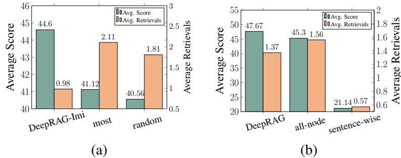

# DeepRAG: Thinking to Retrieval Step by Step for Large Language Models

Xinyan Guan1,2, Jiali Zeng3 , Fandong Meng3 , Chunlei Xin1,2, Yaojie Lu1 , Hongyu Lin1 , Xianpei Han1 , Le Sun 1 , Jie Zhou3

1Chinese Information Processing Laboratory, Institute of Software, Chinese Academy of Sciences 2University of Chinese Academy of Sciences

3Pattern Recognition Center, WeChat AI, Tencent Inc, China

{guanxinyan2022,chunlei2021,hongyu,luyaojie,xianpei,sunle}@iscas.ac.cn

{lemonzeng,fandongmeng,withtomzhou}@tencent.com

## Abstract

Large Language Models (LLMs) have shown remarkable potential in reasoning while they still suffer from severe factual hallucinations due to timeliness, accuracy, and coverage of parametric knowledge. Meanwhile, integrating reasoning with retrieval-augmented generation (RAG) remains challenging due to ineffective task decomposition and redundant retrieval, which can introduce noise and degrade response quality. In this paper, we propose DeepRAG, a framework that models retrievalaugmented reasoning as a Markov Decision Process (MDP), enabling strategic and adaptive retrieval. By iteratively decomposing queries, DeepRAG dynamically determines whether to retrieve external knowledge or rely on parametric reasoning at each step. Experiments show that DeepRAG improves retrieval efficiency while improving answer accuracy by 21.99%, demonstrating its effectiveness in optimizing retrieval-augmented reasoning.

## 1 Introduction

Large Language Models (LLMs) have demonstrated significant potential in reasoning (Plaat et al., 2024). However, limited by the capacity and capabilities of LLM, it still suffers from severe factual hallucination problems due to the timeliness, accuracy, and coverage of parametric knowledge (Zhang et al., 2023; Huang et al., 2023). Retrieval-Augmented Generation (RAG) has been proposed as a promising paradigm to address this issue by integrating relevant information from knowledge bases or search engines, thereby improving the factuality of model response (Zhao et al., 2024).

However, incorporating reasoning with retrievalaugmented generation still presents several challenges. One major issue is that complex queries often require multi-step decomposition to establish a coherent reasoning process (Radhakrishnan et al., 2023). Iterative retrieval has been proposed

Figure 1: Correspondence between human thinking processes and DeepRAG. Specifically, *retrieval narrative* ensures a structured and adaptive retrieval flow, generating subqueries informed by previously retrieved information, and *atomic decisions* dynamically determines whether to retrieve external knowledge or rely solely on the parametric knowledge for each subquery.

as a solution to continuously update retrieval results to address the dynamic information needs that arise during the generation process (Yue et al., 2024). However, LLMs often struggle to generate atomic and precise subqueries, which are critical for more effective retrieval (Wu et al., 2024). From the perspective of RAG, iterative retrieval should ideally generate the next atomic query based on the current question and the available information in an adaptive manner. Moreover, retrieval is not always necessary. Some queries require knowledge, while others rely solely on reasoning within the LLM. Furthermore, LLMs have demonstrated their capability to serve as knowledge bases themselves (Petroni et al., 2019). Unnecessary retrieval, in addition to being redundant, can introduce noise, degrade generation quality, and increase inference latency (Chen et al., 2023; Tan et al., 2024; Bian et al., 2024).

To address this, inspired by the way humans search the Internet based on demand, we propose DeepRAG, a new framework designed to enhance reasoning ability in retrieval-augmented generation by modeling the process as a Markov Decision Process (MDP). The framework introduces two key components: *retrieval narrative* and *atomic decisions*, which together form a strategic and adaptive retrieval framework. As illustrated in Figure 1, *retrieval narrative* ensures a structured and adaptive retrieval flow, generating subqueries informed by previously retrieved information. For each subquery, *atomic decisions* dynamically determines whether to retrieve external knowledge or rely solely on the parametric knowledge of the LLM. To achieve this, we design a binary tree search method that explores the impact of *atomic decisions* on reasoning outcomes. Based on it, we first synthesize data to the LLM to learn *retrieval narrative*, capturing the pattern of "subquery generation – *atomic decision* – intermediate answer" through imitation learning. Subsequently, we employ a chain of calibration approach to refine the model's understanding of its own knowledge boundaries, enabling it to make more accurate *atomic decisions* regarding the necessity of retrieval. By explicitly enhancing the LLM's ability to recognize its own knowledge boundaries, we can train an arbitrary model in an end-to-end manner, enabling it to dynamically determine when retrieval is necessary.

We conduct experiments on five open-domain QA datasets to validate the effectiveness of Deep-RAG, including HotpotQA, 2WikiMultihopQA, and PopQA for multi-hop factual QA, CAG for time-sensitive QA, and WebQuestions for heterogeneous knowledge base QA. Experimental results demonstrate that DeepRAG significantly outperforms existing methods, achieving 21.99% higher answer accuracy while improving retrieval efficiency. Further analysis reveals that DeepRAG exhibits a stronger correlation between its retrieval decisions and parametric knowledge, indicating more effective knowledge boundary calibration.

## 2 Related Work

Adaptive Retrieval-Augmented Generation Existing adaptive RAG approaches can be broadly categorized into three types: classifier-based methods (Cheng et al., 2024; Jeong et al., 2024) requiring additional linear head training for retrieval decisions, confidence-based methods (Jiang et al., 2023; Su et al., 2024; Dhole, 2025) relying heavily on threshold-dependent uncertainty metrics, and LLM-based methods (Asai et al., 2023; Zhang et al., 2024) generating retrieval decisions but often fail to accurately recognize their knowledge boundaries, making it unreliable to delegate retrieval timing decisions to the model. Our method leverages the inherent generative capabilities of LLMs to explore knowledge boundaries in RAG settings. This design maintains the model's native generation abilities while eliminating the need for additional parameters or unreliable uncertainty metrics.

Reasoning in Retrieval-Augmented Generation Recent advances in RAG have increasingly focused on incorporating reasoning capabilities. Self-RAG (Asai et al., 2023) and Auto-RAG (Yu et al., 2024) leverage automatic data synthesis to enhance reasoning within retrieval-augmented frameworks. Search-o1 (Li et al., 2025) incorporates retrieval into inference to construct an agentic system, though its applicability is limited to o1-like large reasoning models. AirRAG (Feng et al., 2025) combines Monte Carlo Tree Search and selfconsistency. In contrast to these approaches that rely heavily on extensive retrieval operations or large reasoning models, DeepRAG provides an end-to-end method, enabling an arbitrary model to think to retrieval step by step on demand.

Knowledge Boundary LLMs struggle to accurately distinguish between what they know and what they don't know (Yin et al., 2023; Kapoor et al., 2024a; Yin et al., 2024). Additional finetuning (Kapoor et al., 2024b) or precise probing (Cheng et al., 2024) is typically required to calibrate the model's cognition. Our approach explores knowledge boundaries in RAG settings.

## 3 Thinking to Retrieval Step by Step

In this section, we introduce our proposed method DeepRAG. At its core, DeepRAG treats the process of question decomposition, atomic decisions, and final answer generation as a Markov Decision Process (MDP). As shown in Figure 2, our framework comprises three key steps: 1) Binary Tree Search, which constructs a binary tree for each subquery related to the given question, exploring paths based on either parametric knowledge or external knowledge base; 2) Imitation Learning, which extracts the reasoning process that arrives at the correct final answer with minimum retrieval cost for imitation learning; 3) Chain of Calibration, which

Figure 2: An overview of DeepRAG, our framework comprises three steps: (1) Binary Tree Search, (2) Imitation Learning, and (3) Chain of Calibration. Given a dataset, we first employ binary tree search to synthesize data for imitation learning, enabling the model to learn retrieval patterns. Subsequently, we use binary tree search to construct preference data for further calibrating the LLM's awareness of its knowledge boundaries.

calibrates the LLM's internal knowledge by calibrating each atomic decision. Specifically, given a set of supervised datasets, we first employ binary tree search to synthesize data for imitation learning, enabling the model to learn effective retrieval patterns. Subsequently, we use binary tree search to construct preference data for further calibrating the LLM's awareness of its knowledge boundaries. In the following subsections, we will describe each component of DeepRAG in detail.

#### 3.1 Overview of the MDP Modeling

We formalize the step by step reasoning process for retrieval-augmented generation as a Markov Decision Process (MDP) defined by the tuple (S, A, P, R), which comprises a set of states S, actions A, transition dynamics P, and a reward function R.

States. At each step t, the state st ∈ S represents the partial solution to the original question. We denote st = - x, (q1, r1), . . . , (qt , rt) , where x is the input question, and (qi , ri) captures the i-th subquery along with the intermediate answer (and any retrieved documents).

Actions. At state st , the model selects an action at+1 = (σt+1, δt+1) ∈ A, which consists of two sub-decisions:

1. *Termination decision*: Given the partial solution st , the model makes a binary decision σt+1 ∈ {continue, terminate} to determine whether to proceed with generating the next subquery qt+1 or finalize the answer o.

2. *Atomic decision*: For each subquery qt+1,

the model decides whether to retrieve external knowledge or rely solely on its parametric knowledge. Formally, this decision is represented as δt+1 ∈ {retrieve, parametric}.

Transitions. After executing the action at+1 = (σt+1, δt+1) in state st , the environment updates the state to st+1.

Specifically, if σt = terminate, the process concludes by generating the final answer o, resulting in the terminal state st+1 = - x, (q1, r1), . . . , (qt , rt), o . Otherwise, it generates the next subquery qt+1.

If δt+1 = retrieve, the model retrieves documents dt+1 and generates an intermediate answer iat+1 for subquery qt+1. Otherwise, it relies on parametric knowledge to generate the intermediate answer. The response rt+1 is set as [dt+1,iat+1] (if retrieved) or iat+1 (if not). The updated state is st+1 = - x, (q1, r1), . . . , (qt+1, rt+1) .

Rewards. The reward function evaluates the state based on answer correctness and retrieval cost, applied only after generating the final answer o. Formally, R st+1 = st + [o] = −C(o) × T(st), where C(o) indicates correctness (1 if correct, ∞ otherwise), and T(st) represents the total retrieval cost in state st .

#### 3.2 Binary Tree Search

In Section 3.1, we model the step-by-step reasoning process as a Markov decision process, where the LLM iteratively decomposes a given question into subqueries, each derived from previously acquired information. The detailed generation instruction is outlined in Appendix A.1, with the answer format presented below.

Building on this formulation, we implement a binary tree search to construct reasoning paths that integrate different retrieval strategies for each subquery. As illustrated in Figure 2, given a question, the model generates the i-th subquery and explores two answering strategies: directly leveraging parametric knowledge (blue node) or retrieving external documents (green node). This approach not only decomposes the question into a sequence of forward-dependent subqueries but also thoroughly examines the influence of retrieval choices on the final answer.

| Answer format |
| --- |

Question: <Question> Follow up: <Subquery1> Let's search the question in Wikipedia. Context: <Paragraph Text> Intermediate answer: <Intremediate Answer1> Follow up: <Subquery2> Intermediate answer: <Intermediate Answer2> ......

So the final answer is: <Answer>

#### 3.3 Imitation Learning

In this section, we present an algorithm that leverages binary trees to identify the optimal reasoning process that leads to the correct final answer while minimizing retrieval costs, corresponding to the highest reward as defined in Section 3.1. Based on the synthesized optimal reasoning data, we fine-tune the model to improve its termination and atomic decisions while enhancing its query decomposition capabilities and generating faithful intermediate answers, thereby enabling a more comprehensive and coherent *retrieval narrative* process.

Synthesizing Data As illustrated in Algorithm 1, we utilize a priority queue to efficiently explore potential reasoning trajectories. This approach allows us to prioritize paths with lower retrieval costs, balancing accuracy and computational efficiency. The algorithm iteratively constructs and evaluates reasoning paths until either discovering a process that generates the correct answer or exhausting all viable options within specified constraints.

Through the synthesis process above, the training dataset obtained contains an adaptive inference process, which can be used to facilitate arbitrary

Algorithm 1 Data Construction for Stage I

| Require: Question x, answer y, language model M, Re |
| --- |
| triever R, max history length T |
| ∗ Ensure: Optimal reasoning process s or null |
| 1: Initialize priority queue PQ ← {([x], 0)} |
| ▷ (trajectory, retrieval count) |
| 2: while PQ is not empty do |
| 3: (h, r) ← PQ.dequeue() |
| ▷ Get trajectory with lowest retrieval count |
| 4: q ← M(h) ▷ Subquery Generation |
| 5: if ShouldAnswer(q) or length(h) > T then |
| 6: o ← M(h, q) ▷ Final answer |
| 7: if IsEqual(o, y) then return h |
| 8: else |

9: a ← M(h, q) ▷ Direct answer 10: PQ.enqueue(([h, (q, a)], r)) 11: d ← R(q) ▷ Retrieve document 12: a ← M(h, q, d) ▷ Retrieved answer

- 13: PQ.enqueue(([h, (q, (d, a))], r + 1))
14: return null

language models in gaining the capacity for adaptive inference-time compute generation.

Training Objective Specifically, we implement a masked loss function for the retrieved documents to prevent the model from learning irrelevant or noisy text that could negatively impact its performance. In this way, we hope the model to enhance the ability to decompose subqueries and retrieve them based on demand. For each instance, the loss function is formulated as follows:

$\mathcal{L}=-\sum_{1\leq i\leq n}\log\left[\Pr(q_{i}|s_{i-1})+\Pr(a_{i}|s_{i-1},q_{i},d_{i})\right]$

di refers to *null* if there is no reieval for ith reasoning step, n refers to the total iteration.

#### 3.4 Chain of Calibration

Building on the Markov process in Section 3.1, we identify four key optimization aspects for Deep-RAG: termination and atomic decisions, query decomposition, and intermediate answer generation. Unlike the others, *atomic decisions* require the model to recognize its own knowledge boundaries to make precise judgments.

We propose a method that dynamically optimizes atomic decisions for each subquery, rather than training LLMs on complete reasoning paths. Our approach consists of two key components: (1) synthesizing preference data to determine when retrieval is necessary, and (2) fine-tuning the LLM with this data using Chain of Calibration training to enhance its ability to make informed atomic decisions based on its internal knowledge boundaries. Synthesizing Preference Data First, we identify an optimal path with minimal retrieval based on Algorithm 1 using the model trained in Stage I. This provides the optimal atomic decision for each subquery, determining whether retrieval is necessary. From this path, we construct preference pairs for each subquery to indicate the preferred retrieval choice. For example, in Figure 2, the optimal path may suggest answering the first subquery using parametric knowledge while requiring document retrieval for the second. Accordingly, we generate preference pairs: one favoring parametric knowledge over retrieval for the first subquery and another favoring retrieval over parametric knowledge for the second. This process enables the LLM to learn when to retrieve external information, thereby improving its ability to maximize the use of parametric knowledge while minimizing unnecessary retrieval.

Chain of Calibration Objective We fine-tune the LLM using a Chain of Calibration objective on our synthesized preference data.

Given the i-th subquery and a state si = [x, q1, r1, · · · , qi−1, ri−1], we have two distince intermediate answer r 1 i = a 1 i and r 2 i = (di , a 2 i ). Based on the process above, we have known which ri is preferred. As a result, the training objective can be formulated as follows:

$${\cal L}=-\log\sigma\left(\beta\log\frac{\pi_{\theta}(y_{w}\mid s_{i},q_{i})}{\pi_{\rm ref}(y_{w}\mid s_{i},q_{i})}-\beta\log\frac{\pi_{\theta}(y_{l}\mid s_{i},q_{i})}{\pi_{\rm ref}(y_{l}\mid s_{i},q_{i})}\right)$$

where σ is the logistic function, the hyperparameter β regulates the penalty imposed for the deviations from the base reference model πref . The terms yw and yl refer to the generated snippets for direct answers and retrieved answers, respectively. Specifically, the snippet "Intermediate Answer:" corresponds to a direct answer, while the snippet "Let's search the question on Wikipedia" corresponds to retrieval-based answers.

## 4 Experiment

#### 4.1 Datasets

We use five open-domain QA datasets for our experiments. We split the datasets used for training our models as the in-distribution dataset, while those not used for training are considered the outof-distribution dataset. The in-distribution datasets include HotpotQA (Yang et al., 2018), and 2Wik-MultihopQA (2WMQA) (Ho et al., 2020), and the

out-of-distribution datasets consist of CAG (Pan et al., 2024), PopQA (Mallen et al., 2022), and WebQuestions (Berant et al., 2013). Specifically, we employ the time-sensitive subset of CAG to evaluate temporal reasoning capabilities. Furthermore, WebQuestions is built upon Freebase to assess model robustness when information may be absent from the knowledge base.

#### 4.2 Baselines

We use the following baselines to evaluate the performance: CoT (Wei et al., 2022) and CoT*, which employ 8-shot examples extracted from the training dataset. The asterisk (*) indicates that the model output was trained using the same data employed for training the DeepRAG. CoT-Retrieve and CoT-Retrieve* augment the eight examples in the context with retrieved relevant documents based on the query. IterDRAG (Yue et al., 2024) refers to decomposing question and answer step by step based on in-context learning. UAR (Cheng et al., 2024) employs a trained classifier to determine when retrieval is necessary. FLARE (Jiang et al., 2023) and DRAGIN (Su et al., 2024) are confidence-based method that decide the timing of retrieval based on token importance and uncertainty. TAARE (Zhang et al., 2024) allows the LLM itself to determine when retrieval is needed. AutoRAG (Yu et al., 2024) uses trained models to iteratively decompose questions and retrieve relevant documents for answering.

#### 4.3 Implementation Details

We construct training datasets using the training subsets of 2 QA datasets: HotpotQA, and 2WMQA. For imitation learning, we randomly sampled 4,000 data from HotpotQA, and 2WMQA respectively. For chain of calibration, we individually sampled 1,000 data points from each of the two datasets. We evaluate our method on the corresponding test sets of these datasets with Exact Match (EM) and F1 score as evaluation metrics.

Following Su et al. (2024), we adopt BM25 as our retrieval model. For the external knowledge corpus, we utilize Wikipedia1 , with each article segmented into 100-token passages. We selected Llama-3-8B-Instruct (Dubey et al., 2024) and Qwen-2.5-7B (Yang et al., 2024) as our base model.

1 https://github.com/facebookresearch/DPR/tree/ main

|  | Methods |  |  | in-distribution |  |  |  |  | out-of-distribution |  |  |  |
| --- | --- | --- | --- | --- | --- | --- | --- | --- | --- | --- | --- | --- |
| Types |  |  | Hotpot QA |  | 2WikiMultihopQA | CAG |  |  | PopQA | Web Question |  | Avg |
|  |  | EM | F1 | EM | F1 | EM | F1 | EM | F1 | EM | F1 |  |
|  |  |  |  |  | Llama-3-8B |  |  |  |  |  |  |  |
| Reasoning | CoT | 27.20 | 37.75 | 28.20 | 34.85 | 7.17 | 10.41 | 21.20 | 25.33 | 25.20 | 40.56 | 25.79 |
|  | CoT-Retrieve | 34.90 | 46.85 | 35.80 | 43.41 | 55.45 | 64.08 | 32.80 | 45.87 | 22.90 | 39.22 | 42.13 |
|  | CoT* | 21.80 | 31.69 | 25.60 | 30.89 | 5.30 | 7.58 | 23.10 | 25.31 | 26.80 | 40.20 | 23.83 |
|  | CoT-Retrieve* | 22.50 | 32.15 | 23.70 | 29.21 | 44.86 | 55.69 | 38.70 | 45.64 | 17.60 | 29.20 | 33.93 |
|  | IterDRAG Auto-RAG | 23.20 25.80 | 30.95 36.09 | 19.60 23.00 | 24.80 30.09 | 38.32 49.22 | 46.18 59.61 | 22.70 27.80 | 34.53 42.02 | 15.90 17.40 | 26.79 32.94 | 28.30 34.40 |
|  | FLARE | 23.80 | 32.88 | 30.30 | 37.45 | 34.89 | 43.45 | 28.80 | 40.61 | 28.80 | 40.61 | 34.16 |
|  | DRAGIN | 27.60 | 38.05 | 29.10 | 35.68 | 4.05 | 7.18 | 22.60 | 28.53 | 21.20 | 38.72 | 25.27 |
| Adaptive | UAR | 29.70 | 40.66 | 34.80 | 42.40 | 52.96 | 61.53 | 33.00 | 45.95 | 22.70 | 39.10 | 40.28 |
|  | TAARE | 30.60 | 41.43 | 35.20 | 42.85 | 52.96 | 61.59 | 33.20 | 46.01 | 23.40 | 39.56 | 40.68 |
| Ours | DeepRAG-Imi | 35.10 | 46.59 | 47.20 | 52.33 | 50.47 | 59.55 | 43.60 | 48.50 | 30.00 | 41.76 | 45.38 |
|  | DeepRAG | 40.70 | 51.54 | 48.10 | 53.25 | 52.96 | 61.92 | 42.50 | 47.80 | 32.70 | 45.24 | 47.67 |
|  |  |  |  |  | Qwen-2.5-7B |  |  |  |  |  |  |  |
| Resaoning | CoT | 18.90 | 27.81 | 23.40 | 28.97 | 3.12 | 5.71 | 15.20 | 19.20 | 18.30 | 34.86 | 19.55 |
|  | CoT-Retreive | 24.90 | 34.78 | 18.60 | 23.44 | 41.43 | 51.47 | 27.30 | 41.20 | 15.10 | 29.84 | 30.81 |
|  | CoT* | 17.60 | 26.15 | 25.10 | 29.62 | 3.12 | 5.62 | 7.90 | 11.06 | 15.60 | 32.45 | 17.42 |
|  | CoT-Retrieve* | 23.40 | 32.29 | 22.40 | 27.51 | 43.30 | 54.51 | 26.60 | 35.46 | 13.80 | 25.60 | 30.49 |
|  | IterDRAG | 13.70 | 26.84 | 9.30 | 20.47 | 21.81 | 39.59 | 18.00 | 31.44 | 12.50 | 26.95 | 22.06 |
| Adaptive | FLARE | 23.40 | 32.06 | 21.80 | 26.51 | 34.89 | 42.62 | 19.00 | 28.24 | 16.10 | 31.89 | 27.65 |
|  | DRAGIN | 16.70 | 24.60 | 12.40 | 16.76 | 3.43 | 5.45 | 12.00 | 15.80 | 17.40 | 32.43 | 15.70 |
|  | UAR | 24.50 | 34.22 | 23.90 | 28.20 | 34.89 | 43.92 | 27.00 | 40.47 | 16.60 | 32.28 | 30.60 |
|  | TAARE | 25.30 | 35.03 | 21.30 | 25.67 | 40.81 | 50.78 | 27.00 | 40.92 | 18.20 | 33.14 | 31.81 |
| Ours | DeepRAG-Imi | 30.40 | 39.44 | 32.00 | 38.32 | 47.98 | 56.99 | 37.50 | 40.72 | 23.90 | 38.62 | 38.59 |
|  | DeepRAG | 32.10 | 41.14 | 40.40 | 44.87 | 51.09 | 59.76 | 40.60 | 43.19 | 24.20 | 38.83 | 41.62 |

Table 1: The overall experimental results of DeepRAG and other baselines on five benchmarks. The best/second best scores in each dataset are bolded/underlined. DeepRAG-Imi (Stage I) and DeepRAG (Stage II) both demonstrate superior performance compared to existing methods across all test scenarios.

#### 4.4 Overall Results

We evaluate DeepRAG on two in-distribution datasets and three out-of-distribution datasets. The results in Table 1 demonstrate DeepRAG's superior performance and robustness across different scenarios.

Our method demonstrates superior performance across most datasets via thinking to retrieval step by step. Our method consistently outperforms existing approaches by enabling step-bystep retrieval reasoning. Compared to reasoningbased and adaptive RAG baselines, DeepRAG achieves improvements across all datasets, demonstrating the effectiveness of the structured *retrieval narrative* and its reliable, on-demand *atomic decisions*. Specifically, the poor performance of Iter-DRAG highlights the necessity of learning both query decomposition and faithful answering. In contrast, confidence-based methods like FLARE struggle to determine the optimal retrieval timing due to their reliance on unstable, predefined metrics. Moreover, we observe that such confidencebased methods suffer from instability, as their performance is highly sensitive to threshold selection. Meanwhile, iterative retrieval methods like Auto-RAG often fall into continuous retrieval loops when no highly relevant information is found. It is worth noting that the CoT-Retrieve method outperforms on CAG. We attribute this to the fact that CAG consists of straightforward, one-hop questions, where direct question-relevant retrieval proves more effective.

Our DeepRAG approach exhibits remarkable generalization capabilities and robustness in time-sensitive and out-of-distribution settings. In the time-sensitive dataset CAG, DeepRAG performs well compared to other adaptive retrieval methods. Furthermore, DeepRAG achieves substantial F1 score improvements of 2.63 and 4.57 on PopQA and WebQuestions respectively, even in scenarios where relevant information may be sparse or missing from the knowledge base.

By learning from self-synthesized data, Deep-RAG effectively explores knowledge boundaries while minimizing hallucination risks. We observe that TAARE often underperforms direct retrieval methods, highlighting the mismatch between its internal knowledge and verbose. Moreover, aggressive fine-tuning approaches like CoT* and CoT-Retrieve* can actually degrade model performance by forcing the model to learn knowledge beyond its natural capabilities. In contrast, our approach carefully preserves model capabilities during fine-tuning by leveraging self-synthesized data, effectively preventing additional hallucination while maintaining performance.

## 5 Analysis

#### 5.1 Retrieval Efficiency

To demonstrate the efficiency of our method, we compare the average number of retrievals on 2Wiki-MultihopQA and WebQuestions. As shown in Table 2, We have following observations: 1) Deep-RAG can achieve higher accuracy with relatively lower retrieval costs, attributed to its dynamic usage of internal knowledge. 2) Confidence-based approaches demonstrate limited robustness across datasets. For instance, both FLARE and DRAGIN methods doesn't trigger retrieval under the default confidence threshold in WQ. 3) Iterative retrievalbased approaches typically require numerous retrieval operations. Therefore, efficient adaptive retrieval methods like DeepRAG become crucial for optimizing resource utilization while maintaining performance.

#### 5.2 Relevance to Parametric Knowledge

In this section, we investigate the relationship between retrieval needs and internal knowledge to demonstrate how effectively *atomic decisions* explores the knowledge boundary. The detail setting are shown in Appendix B.2. We report four metrics. F1 score and Accuracy serve as basic performance measures, while balanced accuracy and Matthews Correlation Coefficient(MCC) (contributors, 2025) are employed to account for the class imbalance between retrieval-required and retrieval-not-required cases.

As shown in Table 3, we find that: 1) Deep-RAG demonstrates superior relevance performance across F1, balanced accuracy, and MCC metrics. This suggests that DeepRAG successfully identifies retrieval necessity by exploring knowledge boundary; 2) While FLARE, DRAGIN, and TAARE exhibit high accuracy scores, their relatively low balanced accuracy and MCC scores suggest they mainly succeed in retrieval-required cases but strug-

| Dataset | Method | EM |  | Avg. Retrievals |  |
| --- | --- | --- | --- | --- | --- |
|  |  |  | All | Correct | Incorrect |
| 2WMQA | FLARE | 30.30 | 0.99 | 1.00 | 0.99 |
|  | DRAGIN | 29.10 | 1.03 | 1.03 | 1.03 |
|  | UAR | 34.80 | 0.81 | 0.68 | 0.89 |
|  | TAARE | 35.20 | 0.93 | 0.93 | 0.97 |
|  | IterDRAG | 19.60 | 2.46 | 2.49 | 2.45 |
|  | Auto-RAG | 23.00 | 6.26 | 4.13 | 1.81 |
|  | DeepRAG-Imi | 47.20 | 1.13 | 0.95 | 1.28 |
|  | DeepRAG | 48.10 | 1.09 | 0.92 | 1.25 |
| WQ | FLARE | 28.80 | 0.00 | 0.00 | 0.00 |
|  | DRAGIN | 21.20 | 0.00 | 0.00 | 0.00 |
|  | UAR | 22.70 | 0.96 | 0.95 | 0.97 |
|  | TAARE | 23.40 | 0.66 | 0.65 | 0.66 |
|  | IterDRAG | 15.90 | 2.25 | 2.16 | 2.27 |
|  | Auto-RAG | 17.40 | 4.52 | 3.03 | 2.35 |
|  | DeepRAG-Imi | 30.00 | 0.43 | 0.13 | 0.56 |
|  | DeepRAG | 32.70 | 0.28 | 0.12 | 0.36 |

Table 2: Retrieval frequency analysis on 2WikiMultihopQA(2WMQA) and WebQuestions(WQ) across different adaptive retrieval methods. "Correct" indicates the average number of retrievals for instances where the model produced correct answers, while "Incorrect" represents the average retrievals for cases with incorrect answers.

| Method | F1 | Acc | Balanced Acc | MCC |
| --- | --- | --- | --- | --- |
| FLARE | 0.000 | 0.718 | 0.500 | 0.000 |
| DRAGIN | 0.007 | 0.709 | 0.495 | -0.045 |
| UAR | 0.481 | 0.756 | 0.648 | 0.341 |
| TAARE | 0.127 | 0.712 | 0.518 | 0.078 |
| Iter-DRAG | 0.000 | 0.718 | 0.500 | 0.000 |
| Auto-RAG | 0.000 | 0.718 | 0.500 | 0.000 |
| DeepRAG-Imi | 0.580 | 0.732 | 0.709 | 0.393 |
| DeepRAG | 0.621 | 0.749 | 0.743 | 0.451 |

Table 3: Analysis of internal knowledge utilization across different adaptive retrieval methods on 2Wiki-MultihopQA.

gle to properly avoid unnecessary retrievals.

#### 5.3 Different Inference Strategy

To gain a deep insight into the effectiveness of *retrieval narartive*, we evaluate DeepRAG's performance under two extreme scenarios: relying solely on internal knowledge and using retrieval in each subquery. As shown in Figure 5, depending solely on internal knowledge yields poor performance, while relying entirely on external knowledge achieves relatively higher accuracy but incurs substantial retrieval costs. In contrast, DeepRAG achieves superior performance by adaptively selecting between internal and external knowledge sources. Specifically, DeepRAG outperforms the retrieve only approach. This may be attributed to the fact that in certain scenarios, retrieval can

hinder model performance due to long context or irrelevant knowledge, making internal knowledge the more reliable choice.

#### 5.4 Question Decomposition Effectiveness

We systematically analyze the effectiveness of question decomposition in *retrieval narrative*. As shown in Figure 3, we present the distribution of subquery counts and retrieval attempts for different questions. Most questions require 3-5 decomposition steps, while retrieval attempts are primarily concentrated within 0-2 rounds. This demonstrates that DeepRAG effectively decomposes questions while minimizing redundant retrieval.

Figure 3: (a) Subquery Statistics. (b) Retrieval Statistics.

Moreover, we analyze the average counts of WH-words, nouns, verbs, and conjunctions in subqueries, as shown in Figure 4. The results indicate that DeepRAG decomposes atomic queries with fewer pronouns and conjunctions.

Figure 4: Average counts of WH-words, nouns, verbs, and conjunctions (and/or) per subquery.

#### 5.5 Ablation Study

In this section, we conducted experiments to validate the effectiveness of DeepRAG's data construction and training process.

Imitation Learning We compare our default strategy of selecting paths with minimal retrieval cost against two alternative approaches: maximum retrieval cost and random path selection. As shown

| Method | ID | CAG | PopQA | WebQuestion |  |
| --- | --- | --- | --- | --- | --- |
|  | F1 | EM | EM | EM | Avg |
| DeepRAG-Imi | 49.46 | 50.47 | 43.60 | 30.00 | 44.60 |
| most | 47.31 | 51.09 | 31.30 | 28.00 | 41.12 |
| random | 44.76 | 51.40 | 34.80 | 27.10 | 40.56 |

Table 4: Experiment results of the ablation study on the Imitation Learning Stage. ID refers to the average score of two in-distribution dataset HotpotQA and 2WikiMultihopQA.

| Method | ID | CAG | PopQA | WebQuestion | Avg |
| --- | --- | --- | --- | --- | --- |
|  | F1 | EM | EM | EM |  |
| DeepRAG | 52.40 | 61.92 | 47.80 | 45.24 | 47.67 |
| all-node | 50.92 | 50.47 | 41.50 | 32.70 | 45.30 |
| sentence-wise | 30.16 | 12.46 | 20.00 | 12.90 | 21.14 |

Table 5: Experiment results of the ablation study on the Chain of Calibration Stage.

in Table 4, DeepRAG-Imi enables the model to learn knowledge boundaries during the imitation learning stage. Notably, CAG performs relatively poorly at this stage due to its time-sensitive nature, which necessitates constant retrieval of up-todate information. Moreover, as illustrated in Figure 6(a), DeepRAG-Imi achieves lower retrieval costs and higher average performance compared to both the maximum-retrieval-cost and random selection methods.

Chain of Calibration We compare our default approach of constructing preferences based on nodes from optimal paths against two alternatives: constructing pairs for all nodes and constructing sentence-level partial order pairs based on retrieval efficiency. As shown in Table 5, DeepRAG demonstrates significant advantages over both variants. Specifically, as illustrated in Figure 6(b), Deep-RAG achieves lower retrieval costs while maintaining higher average performance. In contrast, the sentence-level partial order pairs learned incorrect preferences, resulting in over-reliance on internal knowledge and consequently leading to both low retrieval costs and poor performance.

## 5.6 Performance against Strong Baseline Models

In this section, we compare DeepRAG with recent strong baseline models. Specifically, we select two state-of-the-art open-source models: QwQ-32Bpreview (Team, 2024) and gpt-4o-turbo (OpenAI). As shown in Table 6, by leveraging external knowledge bases through dynamic cognitive decisionmaking, DeepRAG achieves superior average per-

Figure 5: Comparative analysis of retrieval strategies: parametric only or retrieve only.

Figure 6: Average score and retrievals on the ablation study for Imitation Learning and Chain of Calibration.

Figure 7: Case Study: Auto-RAG vs. DeepRAG. DeepRAG achieves success by atomic query decomposition, faithful intermediate answer, and adaptively using internal knowledge.

formance over QwQ and gpt-4o, particularly in time-sensitive QA tasks. Notably, while Deep-RAG does not surpass gpt-4o in some cases, it achieves comparable performance levels. These results demonstrate that DeepRAG not only effectively recognizes its knowledge boundaries but also adapts well to time-sensitive scenarios.

| Models | ID | CAG | PopQA | WQ | Avg |
| --- | --- | --- | --- | --- | --- |
|  | F1 | EM | EM | EM |  |
| QwQ-32B | 31.43 | 3.43 | 10.60 | 15.10 | 18.40 |
| gpt-4o-turbo | 60.6 | 23.36 | 43.50 | 25.35 | 42.68 |
| DeepRAG-qwen | 43.00 | 51.09 | 40.60 | 24.20 | 40.38 |
| DeepRAG-llama | 52.40 | 52.96 | 42.50 | 32.70 | 46.59 |

Table 6: Performance against strong baseline models.

#### 5.7 Case Study

As illustrated in Figure 7, we conduct a case study comparing DeepRAG with Auto-RAG (Yu et al., 2024), a closely related method that utilizes iterative retrieval for retrieval-augmented generation. For each subquery, Auto-RAG retrieves relevant documents and generates a corresponding subanswer. This approach is not only time-consuming but also fails when no relevant documents are retrieved. Although Auto-RAG attempts to address

this issue using its own relevant documents, it falls into endless loops in most cases. In contrast, DeepRAG iteratively generates subqueries and determines whether to use internal knowledge at each iteration. The binary tree search data synthesis method for optimization ensures reliable subquery generation, intermediate answers, and final answers. Even when no related information exists in retrieved documents, the model is directed to provide a final answer based on internal knowledge.

## 6 Conclusion

In this paper, we present DeepRAG, a simple yet effective approach that enhances LLM's awareness of retrieval requirements through self-calibration. Our method decomposes queries into subqueries and uses binary tree search for data synthesis to help models better understand their knowledge boundaries. Experimental results across various QA tasks demonstrate that DeepRAG significantly improves the accuracy and efficiency of retrieval-augmented generation.

## References

Akari Asai, Zeqiu Wu, Yizhong Wang, Avirup Sil, and Hannaneh Hajishirzi. 2023. Self-rag: Learning to retrieve, generate, and critique through self-reflection. *arXiv preprint arXiv:2310.11511*.

- Jonathan Berant, Andrew Chou, Roy Frostig, and Percy Liang. 2013. Semantic parsing on freebase from question-answer pairs. In *Proceedings of the 2013 conference on empirical methods in natural language processing*, pages 1533–1544.
- Ning Bian, Hongyu Lin, Peilin Liu, Yaojie Lu, Chunkang Zhang, Ben He, Xianpei Han, and Le Sun. 2024. Influence of external information on large language models mirrors social cognitive patterns. *IEEE Transactions on Computational Social Systems*.
- Hung-Ting Chen, Fangyuan Xu, Shane Arora, and Eunsol Choi. 2023. Understanding retrieval augmentation for long-form question answering. *arXiv preprint arXiv:2310.12150*.
- Qinyuan Cheng, Xiaonan Li, Shimin Li, Qin Zhu, Zhangyue Yin, Yunfan Shao, Linyang Li, Tianxiang Sun, Hang Yan, and Xipeng Qiu. 2024. Unified active retrieval for retrieval augmented generation. *arXiv preprint arXiv:2406.12534*.
- Wikipedia contributors. 2025. Phi coefficient Wikipedia, the free encyclopedia. https:// en.wikipedia.org/wiki/Phi_coefficient. Accessed: 2025-01-22.
- Kaustubh D. Dhole. 2025. To retrieve or not to retrieve? uncertainty detection for dynamic retrieval augmented generation. *Preprint*, arXiv:2501.09292.
- Abhimanyu Dubey, Abhinav Jauhri, Abhinav Pandey, Abhishek Kadian, Ahmad Al-Dahle, Aiesha Letman, Akhil Mathur, Alan Schelten, Amy Yang, Angela Fan, et al. 2024. The llama 3 herd of models. *arXiv preprint arXiv:2407.21783*.
- Wenfeng Feng, Chuzhan Hao, Yuewei Zhang, Jingyi Song, and Hao Wang. 2025. Airrag: Activating intrinsic reasoning for retrieval augmented generation via tree-based search. *Preprint*, arXiv:2501.10053.
- Xanh Ho, Anh-Khoa Duong Nguyen, Saku Sugawara, and Akiko Aizawa. 2020. Constructing a multihop QA dataset for comprehensive evaluation of reasoning steps. In *Proceedings of the 28th International Conference on Computational Linguistics*, pages 6609–6625, Barcelona, Spain (Online). International Committee on Computational Linguistics.
- Lei Huang, Weijiang Yu, Weitao Ma, Weihong Zhong, Zhangyin Feng, Haotian Wang, Qianglong Chen, Weihua Peng, Xiaocheng Feng, Bing Qin, et al. 2023. A survey on hallucination in large language models: Principles, taxonomy, challenges, and open questions. *ACM Transactions on Information Systems*.
- Soyeong Jeong, Jinheon Baek, Sukmin Cho, Sung Ju Hwang, and Jong C Park. 2024. Adaptive-rag: Learning to adapt retrieval-augmented large language models through question complexity. *arXiv preprint arXiv:2403.14403*.
- Zhengbao Jiang, Frank F. Xu, Luyu Gao, Zhiqing Sun, Qian Liu, Jane Dwivedi-Yu, Yiming Yang, Jamie Callan, and Graham Neubig. 2023. Active retrieval augmented generation.
- Sanyam Kapoor, Nate Gruver, Manley Roberts, Katherine Collins, Arka Pal, Umang Bhatt, Adrian Weller, Samuel Dooley, Micah Goldblum, and Andrew Gordon Wilson. 2024a. Large language models must be taught to know what they don't know. *arXiv preprint arXiv:2406.08391*.
- Sanyam Kapoor, Nate Gruver, Manley Roberts, Arka Pal, Samuel Dooley, Micah Goldblum, and Andrew Wilson. 2024b. Calibration-tuning: Teaching large language models to know what they don't know. In *Proceedings of the 1st Workshop on Uncertainty-Aware NLP (UncertaiNLP 2024)*, pages 1–14, St Julians, Malta. Association for Computational Linguistics.
- Xiaoxi Li, Guanting Dong, Jiajie Jin, Yuyao Zhang, Yujia Zhou, Yutao Zhu, Peitian Zhang, and Zhicheng Dou. 2025. Search-o1: Agentic searchenhanced large reasoning models. *arXiv preprint arXiv:2501.05366*.
- Alex Mallen, Akari Asai, Victor Zhong, Rajarshi Das, Daniel Khashabi, and Hannaneh Hajishirzi. 2022. When not to trust language models: Investigating effectiveness of parametric and non-parametric memories. *arXiv preprint arXiv:2212.10511*.
- OpenAI. Hello gpt-4o. https://openai.com/index/ hello-gpt-4o/. [Online; accessed 22-January-2025].
- Ruotong Pan, Boxi Cao, Hongyu Lin, Xianpei Han, Jia Zheng, Sirui Wang, Xunliang Cai, and Le Sun. 2024. Not all contexts are equal: Teaching llms credibilityaware generation. *arXiv preprint arXiv:2404.06809*.
- Fabio Petroni, Tim Rocktäschel, Sebastian Riedel, Patrick Lewis, Anton Bakhtin, Yuxiang Wu, and Alexander Miller. 2019. Language models as knowledge bases? In *Proceedings of the 2019 Conference on Empirical Methods in Natural Language Processing and the 9th International Joint Conference on Natural Language Processing (EMNLP-IJCNLP)*, pages 2463–2473, Hong Kong, China. Association for Computational Linguistics.
- Aske Plaat, Annie Wong, Suzan Verberne, Joost Broekens, Niki van Stein, and Thomas Back. 2024. Reasoning with large language models, a survey. *arXiv preprint arXiv:2407.11511*.
- Ansh Radhakrishnan, Karina Nguyen, Anna Chen, Carol Chen, Carson Denison, Danny Hernandez, Esin Durmus, Evan Hubinger, Jackson Kernion, Kamile˙ Lukošiut¯ e, et al. 2023. Question decomposition im- ˙ proves the faithfulness of model-generated reasoning. *arXiv preprint arXiv:2307.11768*.
- Weihang Su, Yichen Tang, Qingyao Ai, Zhijing Wu, and Yiqun Liu. 2024. DRAGIN: Dynamic retrieval

augmented generation based on the real-time information needs of large language models. In *Proceedings of the 62nd Annual Meeting of the Association for Computational Linguistics (Volume 1: Long Papers)*, pages 12991–13013, Bangkok, Thailand. Association for Computational Linguistics.

- Hexiang Tan, Fei Sun, Wanli Yang, Yuanzhuo Wang, Qi Cao, and Xueqi Cheng. 2024. Blinded by generated contexts: How language models merge generated and retrieved contexts for open-domain qa? *arXiv preprint arXiv:2401.11911*.
- Qwen Team. 2024. Qwq: Reflect deeply on the boundaries of the unknown.
- Jason Wei, Xuezhi Wang, Dale Schuurmans, Maarten Bosma, Fei Xia, Ed Chi, Quoc V Le, Denny Zhou, et al. 2022. Chain-of-thought prompting elicits reasoning in large language models. *Advances in neural information processing systems*, 35:24824–24837.
- Zhuofeng Wu, He Bai, Aonan Zhang, Jiatao Gu, VG Vydiswaran, Navdeep Jaitly, and Yizhe Zhang. 2024. Divide-or-conquer? which part should you distill your llm? *arXiv preprint arXiv:2402.15000*.
- An Yang, Baosong Yang, Binyuan Hui, Bo Zheng, Bowen Yu, Chang Zhou, Chengpeng Li, Chengyuan Li, Dayiheng Liu, Fei Huang, Guanting Dong, Haoran Wei, Huan Lin, Jialong Tang, Jialin Wang, Jian Yang, Jianhong Tu, Jianwei Zhang, Jianxin Ma, Jin Xu, Jingren Zhou, Jinze Bai, Jinzheng He, Junyang Lin, Kai Dang, Keming Lu, Keqin Chen, Kexin Yang, Mei Li, Mingfeng Xue, Na Ni, Pei Zhang, Peng Wang, Ru Peng, Rui Men, Ruize Gao, Runji Lin, Shijie Wang, Shuai Bai, Sinan Tan, Tianhang Zhu, Tianhao Li, Tianyu Liu, Wenbin Ge, Xiaodong Deng, Xiaohuan Zhou, Xingzhang Ren, Xinyu Zhang, Xipin Wei, Xuancheng Ren, Yang Fan, Yang Yao, Yichang Zhang, Yu Wan, Yunfei Chu, Yuqiong Liu, Zeyu Cui, Zhenru Zhang, and Zhihao Fan. 2024. Qwen2 technical report. *arXiv preprint arXiv:2407.10671*.
- Zhilin Yang, Peng Qi, Saizheng Zhang, Yoshua Bengio, William W Cohen, Ruslan Salakhutdinov, and Christopher D Manning. 2018. Hotpotqa: A dataset for diverse, explainable multi-hop question answering. *arXiv preprint arXiv:1809.09600*.
- Xunjian Yin, Xu Zhang, Jie Ruan, and Xiaojun Wan. 2024. Benchmarking knowledge boundary for large language model: A different perspective on model evaluation. *arXiv preprint arXiv:2402.11493*.
- Zhangyue Yin, Qiushi Sun, Qipeng Guo, Jiawen Wu, Xipeng Qiu, and Xuanjing Huang. 2023. Do large language models know what they don't know? *arXiv preprint arXiv:2305.18153*.
- Tian Yu, Shaolei Zhang, and Yang Feng. 2024. Autorag: Autonomous retrieval-augmented generation for large language models.
- Zhenrui Yue, Honglei Zhuang, Aijun Bai, Kai Hui, Rolf Jagerman, Hansi Zeng, Zhen Qin, Dong Wang, Xuanhui Wang, and Michael Bendersky. 2024. Inference scaling for long-context retrieval augmented generation. *arXiv preprint arXiv:2410.04343*.
- Yue Zhang, Yafu Li, Leyang Cui, Deng Cai, Lemao Liu, Tingchen Fu, Xinting Huang, Enbo Zhao, Yu Zhang, Yulong Chen, Longyue Wang, Anh Tuan Luu, Wei Bi, Freda Shi, and Shuming Shi. 2023. Siren's song in the ai ocean: A survey on hallucination in large language models. *arXiv preprint arXiv:2309.01219*.
- Zihan Zhang, Meng Fang, and Ling Chen. 2024. Retrievalqa: Assessing adaptive retrieval-augmented generation for short-form open-domain question answering. *arXiv preprint arXiv:2402.16457*.
- Penghao Zhao, Hailin Zhang, Qinhan Yu, Zhengren Wang, Yunteng Geng, Fangcheng Fu, Ling Yang, Wentao Zhang, and Bin Cui. 2024. Retrievalaugmented generation for ai-generated content: A survey. *arXiv preprint arXiv:2402.19473*.

## A Templates

#### A.1 DeepRAG Construct Instruction

Instruction: You are a helpful Retrieve-Augmented Generation (RAG) model. Your task is to answer questions by logically decomposing them into clear sub-questions and iteratively addressing each one.

Use "Follow up:" to introduce each sub-question and "Intermediate answer:" to provide answers.

For each sub-question, decide whether you can provide a direct answer or if additional information is required. If additional information is needed, state, "Let's search the question in Wikipedia." and then use the retrieved information to respond comprehensively. If a direct answer is possible, provide it immediately without searching.

## B Detailed Analysis

#### B.1 Retrieval Efficiency

To demonstrate the efficiency of our method, we compare the average number of retrievals on 2Wiki-MultihopQA and WebQuestions. As shown in Table 2, We have following observations:

1) Compared to other adaptive retrieval methods, DeepRAG can achieve higher accuracy with relatively lower retrieval costs. This can be attributed to our dynamic usage of internal knowledge. Additionally, DeepRAG exhibits a positive trend in exploring relevant evidence when faced with insufficient retrieval results, as evidenced by the lower average retrieval numbers in both 2WMQA (0.92 compared to 1.25) and WQ

(0.12 compared to 0.36). 2) Confidence-based approaches demonstrate limited robustness across datasets. For instance, while using identical thresholds, both FLARE and DRAGIN methods show inconsistent behavior: they trigger approximately one retrieval per query in 2WMQA, but fail to reach the retrieval threshold entirely in WQ. This inconsistency highlights the challenge of maintaining reliable performance across different datasets using confidence-based methods. 3) Iterative retrievalbased approaches typically require numerous retrieval operations, resulting in substantial computational costs. Therefore, efficient adaptive retrieval methods like DeepRAG become crucial for optimizing resource utilization while maintaining performance.

## B.2 Relevance to Parametric Knowledge

In this section, we investigate the relationship between retrieval needs and parametric knowledge to demonstrate how effectively our method explores the knowledge boundary.

Ideally, models should initiate retrieval for queries beyond their parametric knowledge while utilizing their existing knowledge for familiar queries. We use CoT results as an indicator of whether the model can answer questions using its parametric knowledge. Subsequently, we analyze whether other adaptive retrieval methods align with this pattern of parametric knowledge utilization. We evaluate the relevance using four metrics. F1 score and Accuracy serve as basic performance measures, while balanced accuracy and Matthews Correlation Coefficient(MCC) are employed to account for the class imbalance between retrieval-required and retrieval-not-required cases. The MCC ranges from -1 to 1, where a value of 1 indicates perfect correlation, 0 represents no correlation (random chance), and -1 signifies an inverse correlation.

As shown in Table 3, we find that 1) Deep-RAG demonstrates superior relevance performance across F1, balanced accuracy, and MCC metrics. This suggests that DeepRAG successfully identifies retrieval necessity by exploring knowledge boundary. 2) While FLARE, DRAGIN, and TAARE exhibit high accuracy scores, their relatively low balanced accuracy and MCC scores suggest they mainly succeed in retrieval-required cases but struggle to properly avoid unnecessary retrievals.

#### B.3 Ablation Study

Table 7 and Table 8 show the detailed results of the ablation study.

|  | HotpotQA | 2WMQA | CAG | PopQA | WebQuestion |  |
| --- | --- | --- | --- | --- | --- | --- |
|  | F1 | F1 | EM | EM | EM | Avg |
| DeepRAG-Imi | 46.59 | 52.33 | 50.47 | 43.60 | 30.00 | 44.60 |
| most | 47.73 | 46.88 | 51.09 | 31.30 | 28.00 | 41.12 |
| random | 46.78 | 42.75 | 51.40 | 34.80 | 27.10 | 40.56 |

Table 7: Detailed Experiment results of the ablation study on the Imitation Learning Stage.

|  | HotpotQA | 2WMQA | CAG | PopQA | WebQuestion |  |
| --- | --- | --- | --- | --- | --- | --- |
|  | F1 | F1 | EM | EM | EM | Avg |
| DeepRAG | 51.54 | 53.25 | 61.92 | 47.80 | 45.24 | 47.67 |
| all-node | 49.99 | 51.85 | 50.47 | 41.50 | 32.70 | 45.30 |
| sentence-wise | 29.03 | 31.28 | 12.46 | 20.00 | 12.90 | 21.14 |

Table 8: Detailed experiment results of the ablation study on the Chain of Calibration Stage.

