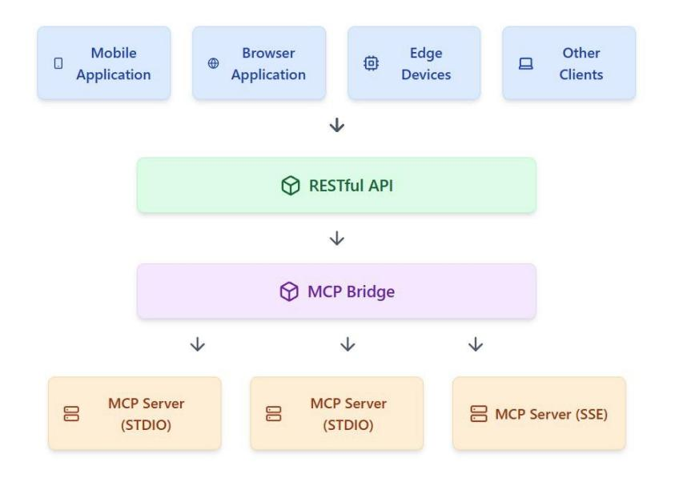
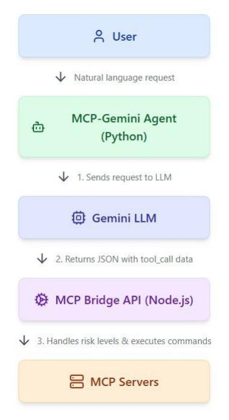

# MCP Bridge: A Lightweight, LLM-Agnostic RESTful Proxy for Model Context Protocol Servers

Arash Ahmadi<sup>1</sup>, Sarah Sharif<sup>1</sup>, Yaser M. Banad<sup>1\*</sup>

<sup>1\*</sup>School of Electrical, and Computer Engineering, University of Oklahoma, Norman, Oklahoma, United States.

\*Corresponding author(s). E-mail(s): bana@ou.edu; Contributing authors: arash.ahmadi-1@ou.edu; s.sh@ou.edu;

#### Abstract

Large Language Models (LLMs) are increasingly augmented with external tools through standardized interfaces like the Model Context Protocol (MCP). However, current MCP implementations face critical limitations: they typically require local process execution through STDIO transports, making them impractical for resource-constrained environments like mobile devices, web browsers, and edge computing. We present MCP Bridge, a lightweight RESTful proxy that connects to multiple MCP servers and exposes their capabilities through a unified API. Unlike existing solutions, MCP Bridge is fully LLM-agnostic, supporting any backend regardless of vendor. The system implements a risk-based execution model with three security levels—standard execution, confirmation workflow, and Docker isolation—while maintaining backward compatibility with standard MCP clients. Complementing this server-side infrastructure is a Python-based MCP-Gemini Agent that facilitates natural language interaction with MCP tools. Evaluation demonstrates that MCP Bridge successfully addresses the constraints of direct MCP connections while providing enhanced security controls and cross-platform compatibility, enabling sophisticated LLM-powered applications in previously inaccessible environments.

Keywords: Model Context Protocol, Large Language Models, RESTful API, Proxy Architecture, Tool Integration, Risk-Based Execution

 $\mathbf{1}$ 

## 1 Introduction

Large Language Models (LLMs) have revolutionized natural language processing. They enable sophisticated conversational agents that can understand and generate human-like text across numerous domains [1]. Despite their impressive capabilities, these models are inherently limited by their training data and lacks access to real-time information, specialized tools, and the ability to perform actions in external systems [2]. To overcome these limitations, there has been a significant push toward augmenting LLMs with external tools and data sources, allowing them to retrieve information, execute computations, and interact with various services [3].

The Model Context Protocol (MCP) represents a significant advancement in this direction, providing a standardized interface for connecting AI assistants to external tools and data sources  $[11]$ . Introduced as an open protocol, MCP aims to establish a universal adapter—a "USB-C port for AI applications"—that enables any compliant model to access any data repository or service through a consistent format. This standardization addresses the fragmentation problem where each new tool integration requires custom development, replacing it with a single, extensible protocol.

However, current MCP implementations face critical limitations that hinder widespread adoption. Many MCP servers rely on STDIO transports that require local process execution, making them impractical for resource-constrained environments such as edge devices, mobile applications, and web browsers. Direct connections to MCP servers from multiple isolated clients also create redundancy and increase resource usage, while the technical complexity of MCP tool formats poses barriers for non-expert users.

In response to these challenges, we present MCP Bridge—a lightweight, fast, and LLM-agnostic proxy that connects to multiple MCP servers and exposes their capabilities through a unified REST API. The architecture is shown in Figure 1 Unlike Anthropic's official MCP SDK, MCP Bridge is designed to be fully independent and compatible with any LLM backend, making it adaptable, modular, and futureproof for diverse deployments. Our system implements optional risk-based execution levels to provide granular security controls—from standard execution to confirmation workflows and Docker isolation—while maintaining backward compatibility with standard MCP clients. The implementation is available as an open-source project at https://github.com/INQUIRELAB/mcp-bridge-api.

The remainder of this paper is organized as follows: Section 2 reviews related work in tool-augmented language models and standardized integration approaches; Section 3 describes the system architecture and implementation of MCP Bridge; Section 4 discusses implications and limitations; and Section 5 concludes with a summary of contributions and directions for future work.

### 2 Related Work

#### 2.1 Tool Use and Retrieval-Augmented Language Models

Large language models (LLMs) have increasingly been augmented with external data sources and tools to overcome their inherent knowledge and capability limitations

### $\overline{2}$



Fig. 1 Architecture of the MCP Bridge API system showing four layers: client applications (mobile, browser, edge devices, and others) at the top, connecting through a RESTful API to the MCP Bridge proxy, which interfaces with multiple MCP servers (STDIO and SSE) at the bottom. The system enables resource constrained environments to access MCP functionality through a unified interface with configurable security levels.

 $[1, 2]$ . One prominent approach is retrieval-augmented generation (RAG), which integrates a document retriever with the model. Lewis et al. [3] introduced RAG as a general framework combining a parametric neural generator with non-parametric memory of retrieved documents, demonstrating improved performance on knowledgeintensive tasks. By linking to live knowledge sources, retrieval-augmented models can dynamically update their context and provenance, addressing issues like stale knowledge and hallucinations more effectively than static LLMs [3].

Another research direction focuses on enabling LLMs to invoke external tools or APIs. Yao et al.'s ReAct framework [4] interleaves logical reasoning traces with action commands, allowing models to make step-by-step decisions about when to continue thinking or call a tool. Schick et al. extended this concept with Toolformer [5], showing that language models can be self-taught to use tools through training on curated corpora with inserted API calls. HuggingGPT [6] demonstrated model orchestration by using a powerful LLM as a controller that routes user requests to specialized AI models available.

The integration of tools with LLMs has been further advanced through frameworks like Visual ChatGPT [7], which connects LLMs with visual foundation models, and GPT-4Tools [8], which employs self-instruction to teach models new tool-use skills. Lu et al. developed Chameleon [9], a plug-and-play reasoning framework that augments LLMs with modular tools and uses an LLM-based planner to coordinate tool composition. Gorilla [10] addresses real-world API invocation by fine-tuning LLaMA to output exact API calls from a large catalog of machine learning APIs.

#### 2.2 Standardization and LLM-Agnostic Integration

As the ecosystem of LLM-accessible tools expands, integration scalability has emerged as a key challenge—specifically, how to connect any model to any tool with minimal custom code. Anthropic's Model Context Protocol (MCP) [11] represents a significant standardization effort, introduced as an open standard for connecting AI assistants to software and data. MCP provides a unified client-server architecture where tools and data sources are wrapped as MCP servers that expose specific functions through a consistent interface.

In parallel to protocol standardization, researchers have explored RESTful API proxies as bridges between LLMs and existing web services. RestGPT by Song et al. [12] treats REST APIs as tools that an LLM can learn to use by providing the model with OpenAPI specifications and implementing a coarse-to-fine planning approach. It introduces a dedicated API executor that handles HTTP requests and response parsing, enabling a single framework to access hundreds of different APIs through a uniform method.

Beyond research prototypes, practical frameworks like LangChain and GPT-Index provide unified APIs to access multiple LLM backends and incorporate external tools, reflecting the need for abstraction layers. However, these solutions are largely engineering-focused, whereas academic efforts like MCP aim to establish formal standards that encourage compatibility across diverse systems and vendors.

The MCP Bridge proposed in this work follows this standardization philosophy by acting as a RESTful adapter between MCP servers and client applications. By building on prior ideas of tool augmentation and standard interfaces, MCP Bridge delivers a practical, modular integration solution that remains agnostic to the underlying model or environment. This approach aligns with the broader movement toward making advanced AI functionalities more accessible, interoperable, and future-proof for realworld applications.

## 3 System Design and Implementation

This section describes the design and implementation of MCP Bridge, a lightweight, fast, and LLM-agnostic proxy for Model Context Protocol (MCP) servers. We detail the system architecture, API design, server management, security model, and client integration components.

### 3.1 System Architecture and Technology Stack

MCP Bridge follows a layered architecture that decouples client applications from the underlying MCP server processes. Figure 1 illustrates this design, where client applications communicate with the proxy via a standardized REST API, and the proxy manages connections to multiple MCP servers.

The system is built on Node.js  $(18+)$  and uses the following core components:

- Express.js: Provides the HTTP server and routing capabilities
- Child Process API: Manages spawned MCP server processes

#### $\overline{4}$

- Server-Sent Events (SSE): Enables real-time communication between some MCP servers and the proxy
- Docker SDK: Facilitates containerized execution for high-risk operations

This technology stack was chosen for its minimal footprint, cross-platform compatibility, and non-blocking I/O capabilities—critical requirements for a proxy that must handle multiple concurrent connections with low latency. The implementation uses asynchronous programming patterns throughout to prevent blocking operations from degrading performance.

### 3.2 RESTful API and Endpoints

MCP Bridge exposes a comprehensive REST API that standardizes access to MCP server functionality. The API is organized into general endpoints for server management and server-specific endpoints for tool execution and resource access.

Table 1 summarizes the primary API endpoints provided by MCP Bridge.

| Endpoint                                                                                                                                                                                   | Method                                                                                 | Description                                                                                                                                                                                                                                                    |
|--------------------------------------------------------------------------------------------------------------------------------------------------------------------------------------------|----------------------------------------------------------------------------------------|----------------------------------------------------------------------------------------------------------------------------------------------------------------------------------------------------------------------------------------------------------------|
| /servers<br>/servers<br>/servers/ $\{$ serverId $\}$<br>/health<br>/confirmations/ $\{id\}$<br>/servers/fid }/tools<br>/servers/{id}/tools/{toolName}<br>/servers/ <i>f</i> id }/resources | <b>GET</b><br><b>POST</b><br><b>DELETE</b><br>GET<br><b>POST</b><br>GET<br>POST<br>GET | List all connected MCP servers<br>Start a new MCP server<br>Stop and remove a server<br>Get health status of MCP Bridge<br>Confirm execution of a medium-risk request<br>List all tools for a specific server<br>Execute a specific tool<br>List all resources |
| /servers/ <i>{id}/prompts</i>                                                                                                                                                              | $_{\rm GET}$                                                                           | List all prompts                                                                                                                                                                                                                                               |

Table 1 MCP Bridge API Endpoints

The API design follows REST principles with JSON as the primary data exchange format. Each endpoint returns appropriate HTTP status codes and standardized error responses. For example, when executing a tool via POST /servers/ {d *y*tools/ {oolName }, the request body contains the tool's input parameters, and the response includes the execution result or a confirmation request based on the tool's risk level.

The request processing pipeline (Algorithm 1) shows how MCP Bridge handles tool execution requests, including validation, risk assessment, and appropriate execution pathways. This unified API layer provides consistent access patterns regardless of the underlying MCP server implementation.

### 3.3 Server Management and Connection Handling

MCP Bridge dynamically manages connections to MCP servers, supporting both standard STDIO-based servers and newer Server-Sent Events (SSE) implementations.

**Algorithm 1 API Request Processing Pipeline** 1: **Input:** HTTP request  $req$  with server ID  $sid$ , tool name  $tool$ , and parameters params 2: Output: HTTP response res with result or confirmation request 3: function ProcessToolRequest(req, res)  $sid$  req.params.serverId  $4:$  $\texttt{tool} \leftarrow \texttt{req}.\textit{params}.\texttt{toolName}$  $\overline{5}$  $params \leftarrow req.body$  $6:$ if not ServerExists(sid) then  $7:$ return Error(res, 404, "Server not found")  $8:$ end if  $9:$  $server \leftarrow GetServer(sid)$  $10:$ if not  $Too$ IExists(server, tool) then  $11:$ return Error(res, 404, "Tool not found")  $12:$ end if  $13:$  $riskLevel \leftarrow GetToolRiskLevel(server, tool)$  $14.$ if  $riskLevel = 1$  then  $15:$  $result \leftarrow ExecutiveTool(server, tool,params)$  $16<sup>1</sup>$ return Success(res, result)  $17<sup>1</sup>$ else if  $riskLevel = 2$  then  $18:$ confirmationId<- GenerateConfirmationId  $19:$ StoreConfirmationRequest(confirmationId, server, tool, params)  $20:$ return RequireConfirmation(res, confirmationId)  $21$ else if  $riskLevel = 3$  then  $22:$  $result \leftarrow ExecutiveToollnDocker(server, tool,params)$  $23:$ return Success(res, result)  $24.$ end if  $25:$ 26: end function

The server management subsystem handles server lifecycle (startup, monitoring, and teardown) and efficiently routes requests to the appropriate server instance.

As shown in Algorithm 2, server connections are established by spawning child processes or connecting to existing MCP servers via their specified transport. The system automatically discovers each server's capabilities (available tools, resources, and prompts) upon connection, making them immediately available through the REST API.

The connection manager employs several strategies to maintain robust connections:

- Heartbeat monitoring: Periodically checks server health
- **Automatic reconnection:** Attempts to re-establish lost connections
- Connection pooling: Optimizes resource usage for high-demand servers
- Request queueing: Manages concurrent requests to prevent overloading servers

These mechanisms ensure that client applications experience minimal disruption even when underlying MCP servers encounter issues or need to be restarted.

```
Algorithm 2 MCP Server Connection Management
 1: Input: Server configuration config with command, arguments, and environment
    variables
 2: Output: Server connection object or error
 3: function StartMcpServer(config)
       \texttt{serverId} \leftarrow \text{GenerateUUID}4:process \leftarrow null\varsigma.
                                                      Attempt to start MCP server
       if config.command exists then
 6:process \leftarrow SpawnProcess(config.command, config.args, config.env)7:else
 8:return Error: "Invalid server configuration"
 Qend if
10:11:connected— WaitForConnection(\boldsymbol{process}, timeout = 5000)
       if not connected then
12:KillProcess(process)
13:return Error: "Failed to connect to MCP server"
14:end if
15:serverConn- {id:serverId, process: process, tools: [], resources: []
16<sup>1</sup>DiscoverServerCapabilities(serverConn)
17:RegisterServer(serverId, serverConn)
18:return serverConn
19:\triangleright Error handling
20:if an error occurs then
          if process = null then
21:KillProcess(process)
22.23:end if
          return Error: error.message
24:end if
25.26: end function
```

# 3.4 Security Model and Risk-Based Execution

MCP Bridge implements a comprehensive security model centered around riskbased execution levels. This approach provides granular control over tool invocation, particularly for operations that could potentially modify data or access sensitive resources

The risk-based execution model defines three levels:

- 1. Low Risk (Level 1): Standard execution without additional checks, suitable for read-only operations
- 2. Medium Risk (Level 2): Requires explicit confirmation before execution, appropriate for data-modifying operations
- 3. High Risk (Level 3): Executed within an isolated Docker container, providing environmental isolation for maximum security

The workflow for medium-risk operations is particularly important (see Algorithm 3), as it implements a two-phase execution pattern that requires explicit confirmation before proceeding.

| <b>Algorithm 3</b> Medium-Risk Confirmation Workflow                                        |  |  |
|---------------------------------------------------------------------------------------------|--|--|
| 1: Input: Confirmation ID confirmationId, confirmation token token                          |  |  |
| 2: <b>Output:</b> Execution result or error                                                 |  |  |
| 3: function ProcessConfirmation(confirmationId, token)                                      |  |  |
| $pendingReq \leftarrow GetPendingRequest(confirmational)$<br>4:                             |  |  |
| if pending Req $=$ null then<br>5:                                                          |  |  |
| <b>return</b> Error: "Invalid confirmation ID or expired request"<br>6:                     |  |  |
| end if<br>7:                                                                                |  |  |
| if pending Req. to $ken = token$ then<br>8:                                                 |  |  |
| <b>return</b> Error: "Invalid confirmation token"<br>9:                                     |  |  |
| end if<br>10:                                                                               |  |  |
| <b>if</b> Is Expired ( <i>pending Req</i> ) then<br>11:                                     |  |  |
| RemovePendingRequest(confirmationId)<br>12:                                                 |  |  |
| return Error: "Confirmation expired"<br>13:                                                 |  |  |
| end if<br>14:                                                                               |  |  |
| $server \leftarrow GetServer(pendingReq.serverId)$<br>15:                                   |  |  |
| $result \leftarrow ExecutiveTool(server, pendingReq.tool, pendingReq.path, para ms)$<br>16: |  |  |
| RemovePendingRequest(confirmationId)<br>17:                                                 |  |  |
| return result<br>18:                                                                        |  |  |
| 19: <b>end function</b>                                                                     |  |  |

For high-risk operations (Level 3), MCP Bridge leverages Docker containers to provide strong isolation. Each container is configured with specific resource limits, network controls, and volume mounts as defined in the server configuration. This containerization ensures that even if a tool behaves unexpectedly, its impact is contained within the isolated environment.

This multi-tiered approach to security allows system administrators to configure appropriate risk levels based on their security requirements while maintaining compatibility with standard MCP clients that expect direct execution.

### 3.5 Client Integration (MCP-Gemini Agent)

Complementing the server-side proxy is the MCP-Gemini Agent, a Python client that integrates Google's Gemini API with MCP Bridge. This agent provides an intelligent natural language interface to the MCP tool ecosystem, allowing users to interact with tools through conversational prompts rather than direct API calls. Figure 2 shows the structure of the LLM integration.

The MCP-Gemini Agent implements several key features:

• Multi-step reasoning: Supports complex operations by sequencing tool calls



Fig. 2 This figure illustrates the integration between a large language model (Gemini) and the Model Context Protocol (MCP) Bridge. The architecture shows a vertical flow from the user through the MCP Gemini Agent (Python), to the Gemini LLM, then to the MCP Bridge API (Node.js), and finally to the MCP Servers. The diagram highlights the system's key data flows: natural language inputs from users, structured tool calls from the LLM, and request execution with risk-level handling (low, medium, high). The system supports multi-step reasoning by cycling results back to the LLM to determine subsequent actions.

- Security confirmation handling: Seamlessly manages the confirmation workflow for medium-risk operations
- Flexible JSON display: Configurable verbosity for tool outputs
- Automatic tool discovery: Detects and utilizes all available tools from connected servers

The agent's architecture follows a conversational loop pattern (see Algorithm 4), where user inputs are processed by the Gemini LLM to generate appropriate tool calls to MCP Bridge.

The MCP-Gemini Agent demonstrates how MCP Bridge can be integrated with LLMs to create powerful, natural language interfaces to arbitrary tools. Unlike approaches that require fine-tuning or specialized training for tool use, this architecture leverages the LLM's existing capabilities for planning and decision-making while delegating tool execution to the specialized MCP servers through the proxy.

The agent implementation is modular and configurable, supporting various command-line options for customizing behavior:

usage: llm\_test.py [-h] [--hide-json] [--json-width JSON\_WIDTH]

| <b>Algorithm 4 MCP-Gemini Agent Conversation Loop</b>                                            |
|--------------------------------------------------------------------------------------------------|
| 1: Input: User query query, MCP Bridge URL mcpUrl                                                |
| 2: <b>Output:</b> Agent response with tool execution results 3:                                  |
| function ProcessUserQuery(query, mcpUrl)                                                         |
| $\text{toollist} \leftarrow \text{FetchAvailableTools}(\text{mcpUr})$<br>4:                      |
| $prompt \leftarrow BuildToolAwareProperty, toolList)$<br>5:                                      |
| $llm$ Response $\leftarrow$ InvokeGeminiLLM(prompt)<br>6:                                        |
| $tools \leftarrow ExtractTools(llmResponse)$<br>7:                                               |
| $results \leftarrow empty$ list<br>8:                                                            |
| for each tool in tools do<br>9:                                                                  |
| $result \leftarrow ExecutorTopTool(mcplr, tool.serverId, tool.name, tool.params)$<br>10:         |
| if result.requiresConfirmation then<br>11:                                                       |
| $confirmation \leftarrow \text{PromptUserForConfiguration} (result.configimationDetails)$<br>12: |
| if confirmation.confirmed then<br>13:                                                            |
| $result \leftarrow \text{ConfirmToolExecution}(mcpUr)$ , result.confirmationId)<br>14:           |
| else<br>15:                                                                                      |
| {status : "cancelled", message<br>result<br>16:                                                  |
| "Usercancelledoperation";                                                                        |
| end if<br>17:                                                                                    |
| end if<br>18:                                                                                    |
| Append result toresults<br>19:                                                                   |
| end for<br>20:                                                                                   |
| $followupProperty \leftarrow BuildResultProperty, tools, results)$<br>21:                        |
| $finalResponse \leftarrow InvokeGeminiLLM(followupPrompt)$<br>22:                                |
| return finalResponse<br>23:                                                                      |
| 24: end function                                                                                 |

#### [--mcp-url MCP\_URL] [--mcp-port MCP\_PORT]

MCP-Gemini Agent with configurable settings

| options: |
|----------|
|          |

| $-h$ , $-help$          | show this help message and exit                 |  |  |
|-------------------------|-------------------------------------------------|--|--|
| --hide-json             | Hide JSON results from tool executions          |  |  |
| --json-width JSON WIDTH |                                                 |  |  |
|                         | Maximum width for JSON output (default: 100)    |  |  |
| --mcp-url MCP_URL       | MCP Bridge URL (default: http://localhost:3000) |  |  |
| --mcp-port MCP PORT     | Override port in MCP Bridge URL                 |  |  |

Together, MCP Bridge and the MCP-Gemini Agent form a comprehensive ecosystem for integrating LLMs with external tools and data sources. This approach achieves the core objective of providing a lightweight, LLM-agnostic proxy that enables any client on any platform to leverage MCP functionality without process execution constraints.

# **4 Future Work**

Our work on MCP Bridge establishes a foundation for LLM-agnostic tool integration, but several avenues for enhancement and expansion remain. The current implementation could benefit from performance optimizations to further reduce latency between client applications and MCP servers. Specifically, implementing connection pooling for high-demand servers and asynchronous request batching could significantly improve throughput under heavy load conditions. Additionally, developing a standardized caching mechanism for idempotent tool calls would reduce redundant operations and improve response times for frequently accessed resources.

The security model presents rich opportunities for refinement. While the current risk-based approach provides granular control, it could be extended with fine-grained access control lists that restrict specific tools to particular user roles or applications. Furthermore, the containerization mechanism for high-risk operations could evolve to support specialized runtime environments with domain-specific dependencies, enabling more complex tool execution without compromising isolation. Integration with identity providers and support for industry-standard authentication protocols would also enhance enterprise adoption.

From a research perspective, MCP Bridge opens several directions for investigation. The relationship between LLM reasoning and tool invocation patterns could be analyzed to develop intelligent request scheduling algorithms that prioritize operations based on their context within larger reasoning chains. Another promising direction is the development of automated translation layers between different tool formats, potentially enabling MCP Bridge to proxy for non-MCP tool servers by converting between incompatible protocols. This would create a universal tool access layer for LLMs regardless of the underlying implementation details.

Finally, exploring federated deployment architectures where multiple MCP Bridge instances collaborate to serve geographically distributed clients could improve resilience and reduce latency. Such a distributed approach would require solving complex problems of state synchronization and request routing but would yield significant benefits for global-scale AI applications. These enhancements and research directions represent the natural evolution of the MCP Bridge architecture toward an increasingly capable and robust integration layer for LLM-powered tools.

# 5 Conclusion

This paper introduced MCP Bridge, a lightweight, LLM-agnostic proxy that addresses the limitations of direct connections to Model Context Protocol servers. By implementing a RESTful API layer between client applications and MCP servers, our solution enables resource-constrained environments such as mobile devices, web browsers, and edge computing platforms to leverage MCP functionality without process execution constraints. The proxy architecture efficiently manages multiple server connections, presenting a unified interface to clients while handling the complexities of different transport mechanisms.

A key contribution of MCP Bridge is its risk-based execution model, which provides granular security controls through three distinct levels: standard execution for

low-risk operations, confirmation workflows for medium-risk actions, and Docker container isolation for high-risk processes. This approach balances security requirements with operational flexibility, allowing system administrators to configure appropriate safeguards while maintaining compatibility with standard MCP clients. The complementary MCP-Gemini Agent demonstrates how natural language interfaces can be built atop MCP Bridge, enabling conversational interaction with tools through an intelligent LLM-powered interface.

The significance of this work extends beyond its immediate technical implementation. By decoupling client applications from the underlying MCP server processes, MCP Bridge contributes to the standardization and interoperability goals that originally motivated the Model Context Protocol. It enables a broader ecosystem of AIpowered applications to leverage specialized tools without vendor lock-in or platform constraints. The future of AI assistants lies in their ability to seamlessly integrate with the software and data where knowledge resides, and MCP Bridge represents an important step toward making such integration universally accessible, secure, and adaptable to the diverse requirements of modern computing environments.

# **Declarations**

**Funding:** This research received no specific grant from any funding agency in the public, commercial, or not-for-profit sectors.

**Clinical Trial Number:** Not applicable.

**Consent to Publish:** Not applicable.

**Data Availability:** The complete MCP Bridge implementation is available as an open-source project at https://github.com/INQUIRELAB/mcp-bridge-api.

Ethics and Consent to Participate: Not applicable.

**Competing Interests:** The authors declare that they have no competing interests.

### **References**

- [1] G. Mialon, R. Dess't, M. Lomeli, C. Nalmpantis, R. Pasunuru, I. Raileanu, B. Rozière, T. Schick, J. Dwivedi-Yu, A. Celikyilmaz, et al., "Augmented language models: a survey," arXiv preprint arXiv:2302.07842 (2023)
- [2] Y. Qin, S. Jiang, Q. Liu, S. Wang, Y. Wen, F. Huang, Z. Zhao, H. Lin, Z. Ding, S. Fu, et al., "Tool learning with foundation models," arXiv preprint arXiv:2304.08354 (2023)
- [3] P. Lewis, E. Perez, A. Piktus, F. Petroni, V. Karpukhin, N. Goyal, H. Küttler, M. Lewis, W. Yih, T. Rocktäschel, et al., "Retrieval-augmented generation for knowledge-intensive NLP tasks," Advances in Neural Information Processing Systems **33**, 9459–9474 (2020)
- [4] S. Yao, J. Zhao, D. Yu, N. Du, I. Shafran, K. Narasimhan, Y. Cao, "ReAct: Synergizing reasoning and acting in language models," in Proc. International Conf. on Learning Representations (ICLR) (2023)

- [5] T. Schick, J. Dwivedi-Yu, R. Dess'i, R. Raileanu, M. Lomeli, L. Zettlemoyer, N. Cancedda, T. Scialom, "Toolformer: Language models can teach themselves to use tools," arXiv preprint arXiv:2302.04761 (2023)
- [6] Y. Shen, Y. Yang, S. Zhang, E. Qin, Y. Li, R. Yuan, J. Chen, Y. Zhu, M. Ge, X. Li, Y. Chen, "HuggingGPT: Solving AI tasks with ChatGPT and its friends in HuggingFace," arXiv preprint arXiv:2303.17580(2023)
- [7] C. Wu, X. Zhang, H. Zhang, L. Xie, J. Xing, X. Xu, X. Ge, Y. Zhang, J. Lin, B. Cui, "Visual ChatGPT: Talking, drawing and editing with visual foundation models," arXiv preprint arXiv:2303.04671 (2023)
- [8] R. Yang, Z. Lin, L. Zhang, X. Gao, D. Zhou, N. Bao, J. Zhou, "GPT4Tools: Teaching large language models to use tools via self-instruction," arXiv preprint arXiv:2305.18752 (2023)
- [9] P. Lu, S. Mishra, T. Yu, L. Xia, D. Zhang, S. Chang, T. Zhuang, H. Wang, K. Narasimhan, D. Chen, Y. Su, D. Roth, "Chameleon: Plug-and-play compositional reasoning with large language models," arXiv preprint arXiv:2304.09842 (2023)
- [10] S. G. Patil, X. Wang, L. Li, W. Li, K. Achary, S. Parameswaran, Z. Wang, F. J. Gonzalez, A. Starr, S. Ahmad, "Gorilla: Large language model connected with massive APIs," arXiv preprint arXiv:2305.15334 (2023)
- [11] Anthropic, "Model Context Protocol (MCP) Open standard for integrating AI tools," ModelContextProtocol.io (2024)
- [12] Y. Song, H. Wang, Y. Hu, T. Xu, P. Wu, M. Li, X. Zhao, R. Huang, W. Feng, D. Zhao, "RestGPT: Connecting large language models with real-world RESTful APIs," arXiv preprint arXiv:2306.06624 (2023)