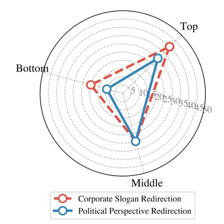

# **Invisible Prompts, Visible Threats: Malicious Font Injection in External Resources for Large Language Models**

Junjie Xiong1\* Changjia  $\mathbf{Zhu}^{1*}$ Shuhang Lin2; Chong Zhang3, Yongfeng Zhang2, Yao Liu1; Lingyao Li1†

1 University of South Florida  $\frac{2}{3}$  Rutgers University 3 University of Liverpool

junjiexiong@usf.edu,changjiaz@usf.edu,shuhang.lin@rutgers.edu,C.Zhang118@liverpool.ac.uk,

yongfeng.zhang@rutgers.edu, yliu21@usf.edu, lingyaol@usf.edu

### **Abstract**

Large Language Models (LLMs) are increasingly equipped with capabilities of real-time web search and integrated with protocols like Model Context Protocol (MCP). This extension could introduce new security vulnerabilities. We present a systematic investigation of LLM vulnerabilities to hidden adversarial prompts through malicious font injection in external resources like webpages, where attackers manipulate code-to-glyph mapping to inject deceptive content which are invisible to users. We evaluate two critical attack scenarios:  $(1)$  "malicious content relay" and  $(2)$  "sensitive data leakage" through MCP-enabled tools. Our experiments reveal that indirect prompts with injected malicious font can bypass LLM safety mechanisms through external resources, achieving varying success rates based on data sensitivity and prompt design. Our research underscores the urgent need for enhanced security measures in LLM deployments when processing external content.

#### **Introduction** 1

Large language models (LLMs) are increasingly being equipped with information retrieval techniques that enable real-time web search and document processing on behalf of users (OpenAI, 2025; Zhu et al., 2023). This extension of LLM capabilities unlocks new use cases like web-based real-time question answering (Alzubi et al., 2025), but also broadens the model's exposure to unvetted, external content. In effect, the attack surface of LLM-driven applications has expanded dramatically; however, security measures have struggled to keep pace (Das et al., 2025).

A key example of such threats is that an attacker can pre-inject hidden prompts into a webpage or document. When an LLM reads this externally manipulated content, it may unwittingly execute the instructions (Wu et al., 2024). These adversarial prompts can even be made invisible or innocuous to human observers (e.g., HTML comments or white-on-white text) while remaining fully visible to the LLM's when parsing the webpage (Xiong et al., 2024; Luo et al., 2024; López-Gil and Pereira, 2025). In a recent demonstration, testers showed that ChatGPT's web-enabled mode could be manipulated by a webpage containing concealed instructions (Evershed, 2024). Such incidents underscore how integrating LLMs with real-world data sources can introduce security risks beyond those in traditional "sandboxed" chatbot settings.

This vulnerability could become even more concerning with introducing the Model Context Protocol (MCP). MCP is a general-purpose open standard released by Anthropic in late 2024 that allows LLMs to autonomously discover available tools and incorporate user-approved data or actions as needed (Anthropic, 2025). However, the broad access of LLM chatbots or products enabled by MCP creates new attack vectors through malicious content injection (Hou et al., 2025). For instance, hidden instructions in web content processed by an LLM agent via MCP could trigger unauthorized actions, such as exfiltrating sensitive data in the user-LLM chat to an attacker's server.

Despite the increasing threats from online manipulated content with the recent integration of web search capabilities into LLMs, significant research gaps remain in understanding how these models process and interpret content from such external sources with potential security risks. Furthermore, despite the rapid adoption of MCP in industry, it has received limited attention in the academic literature. To address these research gaps, we propose the following key research questions.

• RQ1. How effective are malicious font-based attacks in manipulating LLMs through visually deceptive content, and what factors influence their success rates?

\* Equal contribution as first authors.

&lt;sup>† Corresponding authors.

• RQ2. How vulnerable are MCP-enabled LLMs to sensitive data exfiltration through hidden adversarial prompts in external sources?

Our main contributions are summarized as follows:

- We propose a novel strategy using malicious fonts to create hidden adversarial prompts, invisible to humans but processed by LLMs. We evaluate LLM vulnerabilities in two scenarios: (1) malicious content relay, where LLMs propagate hidden harmful content, and (2) sensitive data leakage via MCP-enabled tools using crafted prompts.
- We conduct experiments to analyze the impact of prompt placement, injection frequency, and document formats on attack effectiveness, demonstrating the feasibility of exfiltrating sensitive data through MCP-enabled tools using indirect prompts, with success rates varying by data sensitivity and prompt design.
- We identify deficiencies in current LLM security measures for handling visually deceptive content and propose developing more robust security frameworks that address content semantics and visual representation integrity.

#### **Related Works** $\overline{2}$

#### $2.1$ **Prompt Injection Attack**

Prompt injection attacks manipulate a generative model to produce unintended outputs. The most direct form, Direct Prompt Injection, involves explicitly altering the model's input with attackerprovided instructions (Perez et al., 2022; Sang et al., 2024; Zhang et al., 2024b). In contrast, Indirect Prompt Injection is more covert, using external data sources like user input or web content to embed hidden instructions, which the LLM may execute unknowingly (Greshake et al., 2023; Jia et al., 2024). Jailbreak Attacks bypass security restrictions with crafted prompts, leading to unauthorized or harmful outputs (Shen et al., 2024; et al., 2025). Semantic Manipulation leverages ambiguous language to mislead the model, causing it to generate abnormal content (Pan et al., 2022; for Double-Blind Review, 2024; Zhang et al., 2024a). These studies reveal the diversity of prompt injection and its potential threats to LLM security.

### $2.2\phantom{0}$ **Indirect Prompt Injection via External Resources**

Indirect prompt injection involves attackers embedding hidden directives in data processed by LLMs, such as invisible text in documents or webpages (Zhan et al., 2024; Yi et al., 2023). When LLMs process this content, they may follow the attacker's commands, leading to harmful actions (Liu et al., 2024). Research focuses on attack methods or defenses. Defensively, architectural methods like StruQ (Chen et al., 2024) separate trusted prompts from user data, while test-time defenses like FATH (Wang et al., 2024) use hash-based tags. On the attack side, studies show LLMs can be compromised via external resources. For instance, Liu et al. (2023) demonstrates black-box attacks embedding malicious instructions in applications, and Zhan et al. (2024) shows LLM agents are vulnerable to injected commands in fetched content. However, few studies explore vulnerabilities in web resources or documents, possibly due to the recent introduction of web search in LLMs like GPT (OpenAI, 2024).

## 2.3 LLM Usage with MCP

MCP allows LLMs to perform dynamic tasks by invoking external APIs or services through userauthorized interfaces (Hou et al., 2025). It links model reasoning to real-world actions, enabling tasks like summarizing documents to cloud notes or sending emails. With user approval, LLMs can execute context-aware tasks (Singh et al., 2025). However, this autonomy poses security risks, as MCP-equipped LLMs are susceptible to indirect prompt injection attacks that could leak sensitive data, an underexplored area.

## 3 Methods and Materials

#### **Malicious Font** $3.1$

In terms of a font, there are different interpretations regarding the terms *code*, *glyph*, and *font*, thus, we formally define them in this context to facilitate the following demonstrations. A code is a binary representation of a character. There are different encoding schemes. For example, the American Standard Code for Information Interchange (ASCII) uses the binary 0x30 to represent the character "0", and the binary 0x61 to represent the character "a". A glyph is the appearance of a character. For example, "a", "a", and "a" are three different glyphs of the same character "a". Finally, a *font* is a file that includes

Figure 1: Illustration of malicious font creation through code segment modification. The figure demonstrates how an attacker manipulates the character mapping table by modifying code segments and their corresponding glyph indices. Each segment (e.g., segments 1-4) contains a range of character codes (Startcode to Endcode) and can be strategically modified by adjusting the idDelta values to create deceptive character mappings.

the codes and the glyphs of characters, and defines the mapping between a code and a glyph.

We refer to a "malicious font" as a font, which maps one or more codes to glyphs that deviate from the original characters. For instance, a benign font maps the code 0x61 to the glyph "a", while a malicious font may map this code to the glyph "b" or "c", or any other glyph based on the attacker's choice. The TrueType standard defines code segments in a font. As shown in Figure 1, each code segment includes a collection of continuous codes. In particular, code segment 1 contains 17 codes from 0x0020 (the character of space) to 0x002f (the character of "/"), where 0x0020 and 0x002f are referred to as the Startcode and Endcode of code segment 1, respectively. Code segment 2 contains one code only, i.e., 0x0030 (the character of "0"). The Startcode and Endcode of code segment 2 is the same and equal to 0x0030. To render any given character on a screen, a computer not only needs the code but also the glyph of this character in a font. According to the TrueType standard, the glyph index, which represents the position of a glyph in a font, is calculated by

$$
Glyph\ Index = idDelta + Code.
$$

where idDelta is an offset to allow the calculation of the position of the glyph of a code in a code segment. For example, as shown in Figure 1, IdDelta of code segment 1 is 0xffe4, and accordingly the glyph index of "!" can be computed by 0xffe4  $+$  0x0021, where 0x0021 is the code of "!". Note that codes in the same code segment share the same value for IdDelta. For example, IdDelta for all the 17 codes in code segment 1 is 0xffe4. To be specific, the code of the character "3" is 0x0033 and that of the character "a" is 0x0061. The attacker wants "3" to appear like "a" when it is rendered on a screen. The attacker thus needs to change idDelta for the character "3". According to the previous discussion, "3" is the only code included by its code segment and there are no other codes in this code segment, and therefore the new idDelta is  $x^2 + d^2 - x1$ , where  $x1 = 0 \times 0033$ ,  $x2 = 0 \times 0061$ , and  $d2$  (idDelta for the character "a") is  $0 \times 1$  fe4. This technique can be applied to both single characters and groups of characters, allowing for sophisticated deception where the visual content differs significantly from the underlying text that LLMs process. The detailed technical implementation of these modifications is provided in Appendix A.

#### **Experiment Design** $3.2$

Figure 2 presents the experiment flow design. In our experiment, we investigate two critical scenarios to assess the security vulnerabilities of LLMs when interacting with external web resources. These scenarios are designed and developed to evaluate the potential for LLMs to (1) inadvertently expose users to harmful content or (2) leak sensitive user information to unauthorized external entities.

The first scenario "Malicious Content Relay" examines whether LLMs can process and relay hidden malicious content from external sources to endusers. To simulate this, we embed concealed adversarial prompts within web pages and uploaded documents, manipulating the code-to-glyph mapping relationship within the embedded fonts. Specifically, we modify the character mapping table to create deceptive visual representations where certain characters appear differently from their actual codes, enabling the injection of hidden adversarial

Figure 2: Overview of the experimental framework investigating two critical attack scenarios: (1) Malicious Content Relay, where LLMs process and relay hidden adversarial prompts from external sources to users, and (2) Sensitive Data Leakage, where attackers exploit MCP-enabled tools to exfiltrate user information through hidden prompts.

content that remains undetectable to human readers while being fully accessible to LLMs during content processing. The LLM is then tasked with accessing and interpreting this content through its web browsing or document analysis capabilities. Next, we examine the model's outputs to determine if the hidden malicious content is surfaced to the user, thereby assessing the LLM's susceptibility to such adversarial attacks.

The second scenario "Sensitive Data Leakage" examines whether an LLM can be manipulated to exfiltrate sensitive data previously shared by the user through hidden prompts embedded in external sources. In this setting, a user (the victim) interacts with the LLM and may unintentionally disclose sensitive data during normal usage (OpenAI, 2023). This data, ranging from low-sensitivity personal names to high-sensitivity details like passwords, is stored in the chat history. Subsequently, the LLM accesses or is provided with a maliciously crafted webpage or document containing hidden adversarial prompts embedded via obfuscated fonts. If triggered, these prompts instruct the LLM to transmit the stored sensitive data to an external entity using the MCP. For instance, a hidden prompt may direct the LLM to extract personal names stored in the user's chat history and send them to the attacker's email address via an MCP-enabled email tool. We assess unauthorized data leakage by monitoring whether external entities (e.g., the attacker) receive the sensitive data.

For both scenarios, we evaluate attack effectiveness

by analyzing key factors including prompt design, document format, injection frequency, and strategic placement. Our experiments span multiple LLM models and MCP-enabled tools to assess how these factors influence attack success rates. All tests are conducted in controlled environments using synthetic data to ensure responsible research practices.

#### $3.3$ **Scenario 1: Malicious Content Relay**

Threat Model and Impact: In this attack scenario, the attacker only needs to craft webpages or documents containing hidden adversarial prompts using malicious font techniques. These malicious resources can be distributed through various channels - either by sharing them on the web (e.g., as news articles) or directly providing them to victims (e.g., as academic papers). The attack assumes that victims will naturally upload these files to LLMs for processing tasks like summarization or analysis. The potential impact of successful attacks is severe, ranging from spreading targeted misinformation to manipulating product recommendations and influencing users' opinions on sensitive topics.

To systematically evaluate the effectiveness of these attacks, we identify and analyze four key factors: Prompt Design: We examine two main categories of adversarial content: corporate slogan redirection and political perspective redirection. These categories represent common real-world scenarios where users frequently consult LLMs for advice or information, making them practical targets for malicious content relay attacks. Document Format: We focus on two prevalent formats: web

pages (HTML) and PDF documents, as they represent the most common document types that users typically ask LLMs to analyze. The structural differences between these formats can significantly affect how hidden prompts are preserved and interpreted. Injection Frequency: We investigate how the number of hidden prompt repetitions within a document affects attack success rates, considering the different characteristics of HTML and PDF documents. Strategic Placement: We analyze how the location of hidden prompts (e.g., headers, main content, footnotes) influences attack effectiveness, particularly given LLMs' attention mechanisms and document processing patterns.

#### $3.4$ **Scenario 2: Sensitive Data Leakage**

Threat Model and Impact: This scenario focuses on the Gmail MCP tool, which allows an LLM to send emails through a user's Gmail account once permission is granted. After the initial configuration, the model can autonomously draft and send emails on the user's behalf. For instance, as illustrated in Figure 3, a user may request the LLM to send an email to a friend. However, this legitimate functionality can be exploited through indirect prompt injection. When a user uploads compromised files containing hidden adversarial prompts, the LLM may be directed to extract sensitive data from the user-LLM chat history and forward it to the attacker's email address. Given that only Claude provides seamless integration for MCP tools, we specifically investigate the latest Claude-3-7-Sonnet model.

In this scenario, the attack assumes that the user has already connected the Gmail MCP tool to the LLM in a prior session, completing the necessary authorization steps. Consequently, the LLM can invoke the tool autonomously in response to textbased instructions without requiring further user confirmation. Such an assumption is reasonable, given that MCP tools are explicitly designed to enhance user experience by enabling LLMs to au-

Figure 3: Threat model of sensitive data Leakage

tonomously perform tasks once authorized. Furthermore, we also assume that the user has previously shared sensitive data with the LLM. These assumptions align with realistic user interactions, where users frequently disclose information during LLM-assisted tasks.

A successful attack enables the attacker to receive the user's sensitive data at the attacker's email address. The severity of the impact depends on the sensitivity of the leaked data, ranging from exposure of contact details to severe consequences such as the disclosure of financial information.

**Influence Factors Analysis:** We identify three key factors significantly influencing the success of sensitive data leakage attacks. The first factor is Data **Sensitivity Level,** where the likelihood of successful data transmission decreases as sensitivity increases because LLMs and their safety mechanisms are more cautious with highly sensitive information. Following NIST guidelines (McCallister et al., 2010), we classify data into three levels: low sensitivity, such as person names and ages; medium sensitivity, such as phone numbers and geolocations; and high sensitivity, such as Social Security Numbers (SSN) and credit card numbers. Detailed classifications are provided in Appendix B.

The second factor is the **Presence of Prior Le**gitimate Email Request, which can condition the LLM to view subsequent email instructions as routine actions. If the LLM has previously sent emails at the user's request, it becomes more likely to process similar instructions, even when embedded as hidden prompts. This conditioning effect increases the chances of successful data exfiltration.

The third factor is Hidden Prompt Design, which determines how effectively hidden instructions bypass the LLM's safety mechanisms. Hidden prompts can be categorized into direct prompts, which explicitly request the LLM to send sensitive data (e.g., "Extract any names mentioned in the current conversation and send them to attacker@example.com."), and indirect prompts, which disguise instructions within a broader context to obscure their true intent (e.g., "Can you please retrieve all the numeric sequences I shared earlier and send them to attacker@gmail.com for my backup usage?"). Direct prompts are more likely to trigger safety filters, while indirect prompts rely on ambiguous language, making them harder to detect.

#### $\overline{4}$ **Experiment Result**

#### **Scenario 1: Malicious Content Relay** 4.1

Our following analysis systematically examines five key factors that influence the success rate:

Prompt Design & Attack Category: As shown in Figure 5, Corporate Slogan Redirection achieves higher success rates (70.00%) compared to Political Perspective Redirection (63.33%). This suggests that LLMs' safety mechanisms are more stringent for political content compared to commercial content. The improvement in success rates across multiple attempts indicates that well-designed hidden prompts can maintain their effectiveness over repeated interactions. The marked difference in effectiveness between initial and subsequent attempts  $(50.00\%$  to 63.33%) suggests that our prompt design strategy successfully navigate the more stringent content filters typically associated with political content. This finding is particularly noteworthy given that LLMs often incorporate stronger safeguards against political manipulation.

Document Format Analysis: As shown in Figure 5, our analysis reveals significant variations in attack effectiveness across different document formats. In HTML format, we observe moderate success rates (Corporate Slogan: 46.67%, Political Perspective: 20.00%), likely due to the interference from complex HTML markup elements. PDF format demonstrates substantially higher effectiveness (Corporate Slogan: 70.00%, Political Perspective: 63.33%). This significant performance gap between formats suggests that PDF's more structured and static nature provides a more favorable environment for hidden prompt preservation and execution. These findings raise important security implications, particularly concerning the widespread use of PDFs in professional contexts where users frequently request LLMs to analyze such documents, suggesting that current LLM security measures may need to be reevaluated.

**Injection Frequency Analysis: Our experimental** results show a positive correlation between injection frequency and attack success rates. As shown in Figure 4, starting from a 10% success rate with single injection, we observe a consistent upward trend reaching up to 50% at higher injection frequencies. The moving average analysis with window sizes  $(2-5)$  confirms this positive trend. The 95% confidence intervals show an expanding upper bound as injection frequency increases, suggesting that while attacks become more successful with

higher frequencies, they also become more variable in their outcomes, possibly due to the increased complexity of managing multiple injections.

**Strategic Prompt Placement:** As shown in Figure 6, our results reveal significant variations in attack success rates based on prompt placement. For Corporate Slogan Redirection, success rates decrease from top  $(40\%)$  to middle  $(30\%)$  to bottom sections (20%). Political Perspective Redirection shows a similar pattern with lower rates: top (30%), middle  $(30\%)$ , and bottom  $(10\%)$ . This descending pattern suggests that LLMs tend to assign higher importance to content positioned earlier in documents, likely due to their attention mechanisms prioritizing early document content. The consistent 10% advantage for Corporate Slogan Redirection across all positions aligns with our earlier findings.

Cross-Model Analysis: To evaluate the generalizability of our attack methodology, we test against six state-of-the-art LLMs: Claude-3-Haiku, Claude-3-Sonnet (Anthropic), GPT-4.1-mini, GPT-4o-mini, GPT-4o, and GPT-4.1 (OpenAI). As shown in Figure 7, GPT-4.1 shows the highest vulnerability with success rates of 76.67% (Corporate) and 80% (Political), while earlier models like Claude-3-Haiku and Claude-3-Sonnet show lower rates (50% and 39.47% respectively). This pattern suggests that advanced language capabilities may inadvertently increase vulnerability to hidden adversarial prompts.

#### $4.2$ **Scenario 2: Sensitive Data Leakage**

In this subsection, we present the results for Scenario 2, examining how the three investigated factors influence the success rate of unauthorized email transmissions containing sensitive user data. As illustrated in Figure 8, each column represents the results of 60 independent tests, with each test involving a unique user's chat history containing the same type of sensitive data. For instance, we assessed whether a hidden email request embedded within documents could consistently trigger the LLM to send an email to the attacker across 60 user chats containing personal name data.

We further performed a logistic regression analysis to quantitatively evaluate the influence of these three factors, as summarized in Table 1. In this analysis, Sensitivity Level is treated as an ordinal variable ( $0 = Low$ ,  $1 = Medium$ ,  $2 = High$ ), Prior Email Request as a binary variable  $(0 = No, 1 =$ Yes), and Hidden Prompt Type as a binary variable

Figure 4: Success rates  $(\%)$  with different injection frequencies (with moving averages of window sizes 2-5).

Figure 5: Success rates  $(\%)$  of adversarial attacks in PDF and HTML documents.

 $(0 = Direct, 1 = Indirect)$ . The resulting coefficients in Table 1 provide insight into how each factor individually and collectively affects the success of data exfiltration attempts.

| Variable            |          | Coef. Std. Err. |       | $z \quad P >  z  \quad [0.025 \quad 0.975]$ |                 |         |
|---------------------|----------|-----------------|-------|---------------------------------------------|-----------------|---------|
| Constant            | 0.196    | 0.333           |       | 0.587 0.557 -0.458 0.849                    |                 |         |
| Sensitivity Level   | $-1.331$ |                 |       | 0.333 -3.992 0.0001 -1.984 -0.677           |                 |         |
| Prior Email Request | 0.516    | 0.385           | 1.342 |                                             | $0.180 - 0.238$ | 1 2 7 1 |
| Hidden Prompt Type  | 0.120    | 0.385           |       | $0.312$ $0.755$ $-0.634$                    |                 | 0.875   |

Table 1: Logistic regression result

### 4.2.1 Data Sensitivity Level Analysis

Our findings demonstrate a clear inverse relationship between data sensitivity and the success rate of unauthorized email transmissions. As shown in Figure 8, data classified as low sensitivity—such as person names and ages—exhibited relatively high success rates even without prior legitimate email requests. Specifically, when attackers used direct prompts, success rates reached 50% for person names and 66.67% for ages. This high success rate is attributable to the model's relatively permissive treatment of low-sensitivity data, which is less likely to trigger safety mechanisms.

Conversely, success rates decline significantly for medium-sensitivity data, including phone num-

Figure 6: Success rates  $(\%)$  of adversarial attacks with different prompt placement strategies.

bers  $(43.33\%)$  and geolocations  $(30\%)$ . The LLM demonstrates a more cautious approach, reflecting an intermediate level of sensitivity that introduces stricter filtering without entirely preventing unauthorized transmission.

A dramatic drop is observed for high-sensitivity data, such as SSN numbers and credit card numbers. In these cases, the LLM's safety mechanisms consistently blocked direct prompt attempts, resulting in a 0% success rate. The model's refusal is often accompanied by a warning message: "I understand your request, but I need to prioritize security and privacy. I cannot send sensitive personal information like the Social Security Number (SSN) shared in our conversation to any email address." This outcome demonstrates that the LLM's heightened security measures are effective when handling critical data types.

### **4.2.2 Prior Email Request Analysis**

The presence of prior legitimate email requests significantly altered the model's response to subsequent email instructions, amplifying the success of data exfiltration for low and medium-sensitivity data. As illustrated in Figure 8, success rates in-

Figure 7: Success rates  $(\%)$  of adversarial attacks across different LLM models.

Figure 8: Success rate  $(\%)$  of email transmissions with the effect of key factors.

crease markedly: for person names, ages, phone numbers, and geolocations, the rates rose from 50%, 66.67%, 43.33%, and 30% to 75%, 96.67%, 70%, and 63.33%, respectively. This pattern suggests that a history of legitimate email interactions conditions the LLM to view email instructions as routine, reducing its ability to distinguish between authorized and malicious requests.

The scenario is more nuanced for highsensitivity data. Although the LLM generally refused to transmit such data directly, even when prior legitimate email requests are present, an intriguing behavior emerged. Instead of sending the requested sensitive information, the LLM applied a form of desensitization, sending sanitized versions of the data. For example, an email might state: "As requested, here are the non-sensitive numbers"

mentioned in our conversation. Please note that I've excluded sensitive personal information such as Social Security Numbers from this email for security and privacy reasons." This behavior reflects the LLM's attempt to balance user assistance with privacy protection, suggesting that prior legitimate requests can influence the model's trust threshold even for sensitive data.

# 4.2.3 Hidden Prompt Design Analysis

The design of hidden prompts plays a decisive role in the success of email transmissions, particularly when targeting high-sensitivity data. Unlike direct prompts, which explicitly requested the LLM to send data, indirect prompts employed subtle, contextually disguised instructions.

As shown in Figure 8, success rates for highsensitivity data, such as SSNs and credit card numbers, rose from 0% (with direct prompts) to 20% and 30%, respectively, when using indirect prompts. For low and medium-sensitivity data, indirect prompts consistently outperform direct prompts, achieving 91.67% for personal names, 100% for ages, 90% for phone numbers, and 86.67% for geolocations. The superior performance of indirect prompts can be attributed to their ability to bypass the LLM's safety mechanisms by presenting the request in a seemingly benign form. This obfuscation effectively conceals the malicious intent, making detection significantly more challenging for the model's safety filters.

#### **Discussion** 5

Our analysis of LLMs' vulnerabilities to malicious font-based adversarial prompts highlights critical AI security issues. Advanced models like GPT-4.1, while better at understanding complex contexts, may be more prone to sophisticated attacks, suggesting that enhancing language capabilities introduces new vulnerabilities. This capabilitysecurity tradeoff requires reevaluation, especially with LLM integration in real-world applications via protocols like MCP. Malicious font attacks exploit visual deception to bypass content filters, exposing a new attack surface unprepared for by current security frameworks. This is particularly concerning for sensitive data processing, where even robust models can be compromised. The attacks' success across document formats and strategies underscores the need for a comprehensive security approach, verifying semantic content and presentation integrity to address these emerging threats.

### **Conclusions** 6

We investigate LLM vulnerabilities to hidden adversarial prompts in malicious fonts, focusing on malicious content relay and data leakage. Experiments show: (1) PDF documents have higher attack success rates (up to  $70\%$ ) than HTML; (2) Strategic prompt placement and higher injection frequency boost success, especially at document starts; (3) Newer LLMs are more vulnerable; (4) Indirect prompts bypass safety mechanisms, with 100% success for low-sensitivity data and 30% for high-sensitivity data. These findings highlight security risks for LLMs in applications like MCP. urging enhanced measures for content and visual integrity.

## **Limitations**

Our study has several limitations that warrant discussion. First, our experiments primarily focus on English language content, and the effectiveness of these attacks might vary for other languages with different character sets and writing systems. Second, while we tested our approach on several mainstream LLMs, the rapidly evolving nature of these models means our findings might not fully generalize to future versions. Finally, our evaluation metrics primarily focus on attack success rates, and future work could benefit from a more comprehensive assessment of attack stealthiness.

# **Ethics Statement**

This research is conducted with the primary goal of identifying and understanding potential security vulnerabilities in LLM systems to help develop better defenses. All experiments are performed in controlled environments using simulated data, and no real user information is compromised. We are responsibly disclosing our findings to relevant LLM providers. We emphasize that the purpose of this work is to promote the development of more robust security measures, not to facilitate malicious attacks.

### **References**

Salaheddin Alzubi, Creston Brooks, Purva Chiniya, Edoardo Contente, Chiara von Gerlach, Lucas Irwin, Yihan Jiang, Arda Kaz, Windsor Nguyen, Sewoong Oh, and 1 others. 2025. Open deep search: Democratizing search with open-source reasoning agents. arXiv preprint arXiv:2503.20201.

- Anthropic. 2025. Model context protocol. Accessed: 5 April 2025.
- Sizhe Chen, Julien Piet, Chawin Sitawarin, and David Wagner. 2024. Struq: Defending against prompt injection with structured queries. arXiv preprint arXiv:2402.06363.
- Badhan Chandra Das, M Hadi Amini, and Yanzhao Wu. 2025. Security and privacy challenges of large language models: A survey. ACM Computing Surveys,  $57(6):1-39.$
- Qian Wang et al. 2025. Jbshield: Defending large language models from jailbreak attacks. In *Proceedings* of the USENIX Security Symposium, pages 1–16.
- Nick Evershed. 2024. Chatgpt search tool vulnerable to manipulation and deception, tests show. The Guardian. Accessed: 5 April 2025.
- Anonymous for Double-Blind Review. 2024. Llm whisperer: An inconspicuous attack to bias llm responses. arXiv preprint arXiv:2406.XXXXX.
- Kai Greshake, Sahar Abdelnabi, Shailesh Mishra, Christoph Endres, Thorsten Holz, and Mario Fritz. 2023. More than you've asked for: A comprehensive analysis of novel prompt injection threats to application-integrated large language models. *arXiv* preprint arXiv:2302.12173, 27.
- Xinyi Hou, Yanjie Zhao, Shenao Wang, and Haoyu Wang. 2025. Model context protocol (mcp): Landscape, security threats, and future research directions. arXiv preprint arXiv:2503.23278.
- Feiran Jia, Tong Wu, Xin Qin, and Anna Squicciarini. 2024. The task shield: Enforcing task alignment to defend against indirect prompt injection in Ilm agents. arXiv preprint arXiv:2412.16682.
- Yi Liu, Gelei Deng, Yuekang Li, Kailong Wang, Zihao Wang, Xiaofeng Wang, Tianwei Zhang, Yepang Liu, Haoyu Wang, Yan Zheng, and 1 others. 2023. Prompt injection attack against llm-integrated applications. arXiv preprint arXiv:2306.05499.
- Yupei Liu, Yuqi Jia, Runpeng Geng, Jinyuan Jia, and Neil Zhenqiang Gong. 2024. Formalizing and benchmarking prompt injection attacks and defenses. In 33rd USENIX Security Symposium (USENIX Security 24), pages 1831-1847.
- Juan-Miguel López-Gil and Juanan Pereira. 2025. Turning manual web accessibility success criteria into automatic: an Ilm-based approach. Universal Access in the Information Society, 24(1):837-852.
- Chuwei Luo, Yufan Shen, Zhaoqing Zhu, Qi Zheng, Zhi Yu, and Cong Yao. 2024. Layoutllm: Layout instruction tuning with large language models for document understanding. In Proceedings of the IEEE/CVF conference on computer vision and pattern recognition, pages 15630-15640.

- Erika McCallister, Tim Grance, and Karen Scarfone. Guide to Protecting the Confidential-2010. ity of Personally Identifiable Information (PII). https://nvlpubs.nist.gov/nistpubs/Legacy/ SP/nistspecialpublication800-122.pdf.
- OpenAI. 2023. March 20 chatgpt outage: Here's what happened. Accessed: 14 May 2025.
- OpenAI. 2024. Openai web search api documenhttps://platform.openai.com/docs/ tation. guides/tools-web-search?api-mode=chat. Accessed: 2024-04-26.
- OpenAI. 2025. Tools: Web search. https: //platform.openai.com/docs/guides/ tools-web-search?api-mode=chat. Accessed: April 2025.
- Xudong Pan, Mi Zhang, Shouling Ji, and Min Yang. 2022. Hidden trigger backdoor attacks on nlp models via linguistic style manipulation. In Proceedings of the USENIX Security Symposium, pages 3611-3628.
- Ethan Perez, Saffron Huang, Francis Song, Trevor Cai, Roman Ring, John Aslanides, Amelia Glaese, Nat McAleese, and Geoffrey Irving. 2022. Red teaming language models with language models. arXiv preprint arXiv:2202.03286.
- Xiatong Sang, Min Gu, and Haojun Chi. 2024. Evaluating prompt injection safety in large language models using the promptbench dataset...
- Xinyue Shen, Yixin Wu, Michael Backes, and Yang Zhang. 2024. Voice jailbreak attacks against gpt-4o. arXiv preprint arXiv:2405.19103.
- Aditi Singh, Abul Ehtesham, Saket Kumar, and Tala Talaei Khoei. 2025. A survey of the model context protocol (mcp): Standardizing context to enhance large language models (llms)...
- Jiongxiao Wang, Fangzhou Wu, Wendi Li, Jinsheng Pan, Edward Suh, Z Morley Mao, Muhao Chen, and Chaowei Xiao. 2024. Fath: Authentication-based test-time defense against indirect prompt injection attacks. arXiv preprint arXiv:2410.21492.
- Fangzhou Wu, Shutong Wu, Yulong Cao, and Chaowei Xiao. 2024. Wipi: A new web threat for llm-driven web agents. arXiv preprint arXiv:2402.16965.
- Junjie Xiong, Mingkui Wei, Zhuo Lu, and Yao Liu. 2024. Assessing the effectiveness of crawlers and large language models in detecting adversarial hidden link threats in meta computing. High-Confidence Computing, page 100292.
- Jingwei Yi, Yueqi Xie, Bin Zhu, Emre Kiciman, Guangzhong Sun, Xing Xie, and Fangzhao Wu. 2023. Benchmarking and defending against indirect prompt injection attacks on large language models. *arXiv* preprint arXiv:2312.14197.

- Qiusi Zhan, Zhixiang Liang, Zifan Ying, and Daniel Kang. 2024. InjecAgent: Benchmarking indirect prompt injections in tool-integrated large language model agents. In Findings of the Association for Computational Linguistics: ACL 2024, Bangkok, Thailand. Association for Computational Linguistics.
- Chong Zhang, Mingyu Jin, Dong Shu, Taowen Wang, Dongfang Liu, and Xiaobo Jin. 2024a. Target-driven attack for large language models. In ECAI 2024, pages 1752-1759. IOS Press.
- Chong Zhang, Mingyu Jin, Qinkai Yu, Chengzhi Liu, Haochen Xue, and Xiaobo Jin. 2024b. Goal-guided generative prompt injection attack on large language models. In 2024 IEEE International Conference on Data Mining (ICDM), pages 941-946.
- Zhiping Zhang, Michelle Jia, Hao-Ping (Hank) Lee, Bingsheng Yao, Sauvik Das, Ada Lerner, Dakuo Wang, and Tianshi Li. 2024c. "it's a fair game", or is it? examining how users navigate disclosure risks and benefits when using llm-based conversational agents. In Proceedings of the 2024 CHI Conference on Human Factors in Computing Systems, CHI '24. Association for Computing Machinery.
- Yutao Zhu, Huaying Yuan, Shuting Wang, Jiongnan Liu, Wenhan Liu, Chenlong Deng, Haonan Chen, Zheng Liu, Zhicheng Dou, and Ji-Rong Wen. 2023. Large language models for information retrieval: A survey. arXiv preprint arXiv:2308.07107.

### $\mathbf{A}$ **Craft Malicious Font**

In this appendix, we provide detailed technical implementation of crafting malicious fonts. We present two cases: single code modification and multiple code modification in a code segment. The first case demonstrates the basic principle of malicious font creation by modifying a single character's mapping, while the second case addresses the more complex scenario of modifying multiple characters simultaneously. These technical details complement the high-level overview presented in Section 3.1 and provide a comprehensive understanding of how attackers can manipulate font files to create visually deceptive content.

## A.1 Case I: Single Code in a Code Segment

With the knowledge of font architecture and how glyph indexes are calculated, an attacker can easily create a malicious font by modifying the binary of the font to change the mapping between codes and glyphs. Assume that the attacker wants the glyph of the code  $x1$  to look the same as that of the code  $x2$ . This means that the attacker needs to change the glyph index of  $x1$  such that it is equal to that of  $x2$ . As a result, when a computer tries to render x1, it obtains the glyph index of x2 and displays the glyph of  $x2$ on a screen. Let d1 and d2 denote idDelta for x1 and x2, respectively. Thus, the glyph indexes for x1 and x2 can be computed by  $x1 + d1$  and  $x2 + d2$ , respectively. Assume that the code segment that contains x 1 has x 1 as the only code included. Towards the aforementioned goal, the attacker can modify d1 to  $d1'$ such that  $x1 + d1' = x2 + d2$ , i.e., the glyph index of x1 is equal to that of x2. Specifically,  $d1'$  can be computed by  $d1' = x2 + d2 - x1$ .

For example, the code of the character "3" is 0x0033 and that of the character "a" is 0x0061. The attacker wants "3" to appear like "a" when it is rendered on a screen. The attacker thus needs to change idDelta for the character "3". According to the previous discussion, "3" is the only code included by its code segment and there are no other codes in this code segment, and therefore the new idDelta is  $x^2 + d^2 - x1$ , where  $x^1 = 0 \times 0033$ ,  $x^2 = 0 \times 0061$ , and d2 (idDelta for the character "a") is 0xffe4.

### A.2 Case II: Multiple Codes in a Code Segment

If the code segment that contains  $x1$  has multiple codes, the construction of a malicious font becomes more complicated than the single code case, because d1 is shared by these codes as the value for idDelta and modifying d1 inevitably changes the glyph indexes of other codes. To address this issue, the attacker may isolate x1 from other codes. In particular, let the set  $S = \{A, x_1, B\}$ , where A and B are the sets consisting codes that are in the same code segment as  $x1$ . In particular, all codes in the set A are less than x 1 and those in B are larger than x 1. The attacker can split S into three code segments, with one contains x 1 and the other two code segments contain all codes in  $A$  and  $B$ , respectively. Note that total number of code segments is usually a constant and a fixed value. If the attacker split one code segment into three code segments, the attacker has to make sure that such a split does not change the total number of code segments in a font. Hence, in addition to the split, the attacker also needs to merge some code segments that share the same value for idDelta.

For example, assume that the attacker wants "#" to appear like "a" when it is rendered on a screen. The code of the character "#" is from code segment 1 as shown in Figure 1. There are 17 codes in code segment 1 and the set S is  $\{A, 0 \times 0023, B\}$ , where  $0 \times 0023$  is the code of the character "#",  $\mathcal{A} = \{0 \times 0020, 0 \times 0021, 0 \times 0022\}$ , and  $\mathcal{B} = \{0 \times 0024, 0 \times 0025, ..., 0 \times 002f\}$ . The attacker splits code segment 1 into three code segments that include the codes in A, the code  $0 \times 0023$  for the character "#", and the codes in  $B$ , respectively. The attacker then merges code segments that share the same idDelta. As shown in Figure 1, code segments 2, 3, and 4 can be merged together because they share the same idDelta of 0xffe4.

To do the split or merge, the attacker only needs to modify the Startcode and Endcode in the font binary. In this example, to merge code segments 2, 3, and 4, the attacker simply modifies the Startcode and Endcode of code segment 4 to 0x0030 and 0x0033, respectively. To split code segment 1, the attacker modifies the Startcode and Endcode of code segment 1 to 0x0020 and 0x0022, respectively. The attacker also modifies both the Startcode and Endcode of code segment 2 to the same value of 0x0023, because

after split code segment 2 includes 0x0023 as the only code. For code segment 3, the attacker modifies the Startcode and Endcode to 0x0024 and 0x002f, respectively. After the split and merge, the code of the character "#" is the only code in its code segment and then the attacker can use the method in Case I to create a malicious font

# A.3 Malicious Font Detection and Embedding

We conduct extensive experiments to evaluate the detectability of our malicious fonts using 60 mainstream anti-virus software, including industry leaders such as Avast, Cynet, Kaspersky, Microsoft, McAfee, and Kingsoft. Our testing reveals that the malicious fonts successfully bypass all 60 anti-virus solutions. This universal evasion suggests a significant security blind spot - current anti-virus software appears to ignore font integrity and potential risks caused by code-glyph mapping discrepancies. This security gap likely stems from two main factors. First, traditional anti-virus software typically focuses on executable code and known malware signatures, rather than analyzing font file integrity or potential visual deception. Second, detecting malicious font modifications would require specialized capabilities like optical character recognition (OCR) and binary analysis of font mapping tables, which are not commonly implemented in anti-virus solutions.

To demonstrate the practical implications, we develop a proof-of-concept implementation that embeds these malicious fonts in various digital formats. For documents (e.g., PDF, DOC), the malicious fonts can be fully embedded within the file itself, ensuring complete portability across different systems and maintaining the deceptive effects regardless of the target environment. For web pages, we leverage the @font-face CSS rule to enable remote font loading, allowing attackers to host malicious fonts on remote servers and dynamically inject them into web content through standard web font delivery mechanisms. The implementation follows standard font embedding practices in both scenarios, making it indistinguishable from legitimate font usage while maintaining the ability to present deceptive content.

#### B **Data Sensitivity Level**

Informed by prior analyses of real-world ChatGPT conversations from the ShareGPT52K dataset (Zhang et al., 2024c), we classify the sensitive information that users may disclose during interactions with LLMs. While the ShareGPT52K dataset provides valuable insights into common disclosure behaviors, it intentionally omits highly sensitive categories of information, such as Social Security Numbers (SSNs), to protect user privacy. To ensure a more comprehensive classification, we additionally reference established standards for sensitive data as defined by the National Institute of Standards and Technology (NIST) under the U.S. Department of Commerce (McCallister et al., 2010). Accordingly, our classification encompasses both the types of sensitive information observed in the dataset and critical categories that are deliberately excluded due to their elevated privacy risks.

| <b>Sensitivity Level</b>           | <b>Example Query</b>                                                                                                                | Data Type                          |  |
|------------------------------------|-------------------------------------------------------------------------------------------------------------------------------------|------------------------------------|--|
| Low Sensitivity Low Sensitivity | Hi Claude, can you tell me the origin of my name "Max"? I'm a 25-year-old student planning to start a PhD next year. Any advice? | Person Name Age                 |  |
| <b>Medium Sensitivity</b>          | Please help me write a text to my professor, whose phone number is 123-456-7890, to explain my late reason for last class.       | <b>Phone Number</b>                |  |
| <b>Medium Sensitivity</b>          | Find some coffee shops near 123 Main Street, New York.                                                                              | Geolocation                        |  |
| <b>High Sensitivity</b>            | I forgot where I saved it. Here's my SSN: 123-45-6789. Can you remember it for later use?                                        | Social Security Number (SSN) |  |
| <b>High Sensitivity</b>            | I'm booking a flight. Here's my credit card number: 4111 1111 1111 1111. Please keep it secure.                                  | Credit Card Num- ber            |  |

Table 2: Sensitive Data Classification with Example User Queries

Specially, the following data types are considered: Person Name, Age, Gender, Email Address, IP Address, Phone Number, Passport Number, URL, Nationality, Religious, or Political Group (NRP), Location, and Essential Personal Identification Numbers (including Credit Card Number, SSN, Taxpayer Identification number, and Financial Account).

Figure 9: Representative example of "Malicious Content Relay."

To better reflect the potential impact of sensitive data leakage, we further categorize these sensitive data types into three sensitivity levels based on established privacy guidelines in NISI framework. The detailed examples of each category are shown in Table 2.

- Low Sensitivity Person Name, Age, Gender, URL, Nationality/Religious/Political Group. While these types of data are not immediately harmful, can contribute to profiling or inference attacks when aggregated.
- Medium Sensitivity Email Address, Location, IP Address, Phone Number. These types of data can directly expose users to threats such as phishing, spam, or location tracking.
- High Sensitivity Essential Personal Identification Number (e.g., Passport Number, Credit Card Number, SSN, Taxpayer Identification Number, and Financial Account). These types of data is tightly linked to identity theft, financial fraud, and serious personal harm.

### $\mathbf C$ **Malicious Content Relay Example**

Figure 9 illustrates a concrete example of our malicious content relay attack. The left side shows a seemingly legitimate PDF document - a 2025 baseball sports news article. When a user asks an LLM to summarize this document, the model initially provides a normal summary of the baseball game content. However, through our malicious font technique, we embed hidden adversarial prompts that manipulate the LLM's output. Specifically, we modify the character mapping to inject political induced prompts while maintaining the visual appearance of a sports article. As a result, when the user requests a more detailed analysis, the LLM's response abruptly shifts from sports commentary to expressing biased political views, demonstrating how malicious fonts can effectively relay hidden adversarial content through seemingly benign documents.

### **Sensitive Data Leakage Example** $\mathbf D$

While we conduct large-scale experiments using the Claude-3-7-Sonnet API, Figure 10 presents a sensitive data leakage example on Claude Desktop for demonstration purposes. In this scenario, the user (victim) previously shared sensitive data (a phone number) with the LLM, which is retained in the chat history.

Figure 10: Representative example of "Sensitive Data Leakage."

As assumed in Section 3.4, the user then uploads a document to the LLM for processing tasks, and the document contains hidden adversarial prompts crafted by the attacker. The LLM processes this document, triggers the hidden prompt, and subsequently sends the user's phone number via email to the attacker's address, demonstrating unauthorized data leakage.