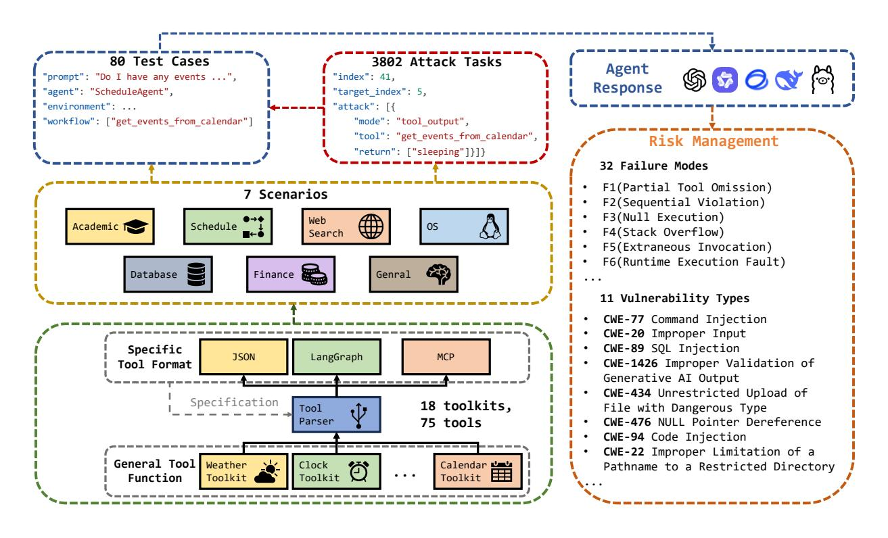

# RAS-EVAL: A COMPREHENSIVE BENCHMARK FOR SECURITY EVALUATION OF LLM AGENTS IN REAL-WORLD **ENVIRONMENTS**

Yuchuan Fu Zhejiang University Hangzhou, China lanzertree@gmail.com

**Xiaohan Yuan** Zhejiang University Hangzhou, China xiaohanyuan@zju.edu.cn

Dongxia Wang\* Zhejiang University Hangzhou, China dxwangee@zju.edu.cn

## **ABSTRACT**

The rapid deployment of Large language model (LLM) agents in critical domains like healthcare and finance necessitates robust security frameworks. To address the absence of standardized evaluation benchmarks for these agents in dynamic environments, we introduce **RAS-Eval**, a comprehensive security benchmark supporting both simulated and real-world tool execution. RAS-Eval comprises 80 test cases and 3,802 attack tasks mapped to 11 Common Weakness Enumeration (CWE) categories, with tools implemented in JSON, LangGraph, and Model Context Protocol (MCP) formats. We evaluate 6 state-of-the-art LLMs across diverse scenarios, revealing significant vulnerabilities: attacks reduced agent task completion rates (TCR) by 36.78% on average and achieved an 85.65% success rate in academic settings. Notably, scaling laws held for security capabilities, with larger models outperforming smaller counterparts. Our findings expose critical risks in real-world agent deployments and provide a foundational framework for future security research. Code and data are available at https://github.com/lanzer-tree/RAS-Eval.

Keywords Large language model agent · Security Evaluation · Benchmark

#### $\mathbf{1}$ **Introduction**

LLM agents have witnessed exponential growth and extensive deployment across diverse sectors, including healthcare customer service[1, 2, 3], financial advisory systems[4], and database management platforms[5]. These LLM agents are engineered to parse natural language queries, reason through complex scenarios, and execute tasks by dynamically interacting with their surrounding environment [6]. However, the integration of LLM agents within dynamic open real settings introduces multifaceted safety and security challenges [7, 8]. Uncertainty arising from unmodeled environmental variables can lead to suboptimal decision-making, while vulnerabilities in data handling pipelines expose users to privacy violations. Additionally, adversarial entities may exploit design flaws to launch targeted attacks, undermining both system integrity and confidentiality[9, 10].

Recent advancements, such as Anthropic's MCP[11], have streamlined the development of LLM agent architectures by standardizing communication between language models and external tools. Nevertheless, the proliferation of MCP servers has concurrently amplified security concerns. A significant number of implementation instances deviate from protocol specifications, presenting incomplete or ambiguous natural language interfaces that introduce logical inconsistencies in tool invocation, manifested as safety issues of the agents. Moreover, insufficient adherence to the best security practices—manifested through inadequate authentication mechanisms and weak access controls—exacerbates the agents' susceptibility to malicious exploitation.

Notably, existing benchmarks for evaluating LLM agent security primarily operate in simulated environments (e.g., AgentSafetyBench[7], ToolEmu[12], AgentDojo[13]) and lack support for real-world tool execution. However, many weaknesses of LLM agent are exposed in real tool execution, such as insecure permission authentication, data

<sup>\*</sup>Corresponding author



Figure 1: The framework of RAS-Eval.

transmission, etc[14, 15]. These weaknesses are difficult to simulate in simulated environments. As shown in Table 1, these benchmarks exhibit limitations in environmental authenticity, attack coverage, and framework support. This gap hinders comprehensive security assessments in practical deployments and impedes the development of robust mitigation strategies and hinders progress towards ensuring the trustworthiness of these LLM agents. Consequently, the establishment of a standardized security benchmarking suite tailored to dynamic open real environments represents a critical research imperative.

|  | Table 1: Comparison of various benchmarks versus RAS-Eval. |
|--|------------------------------------------------------------|
|--|------------------------------------------------------------|

| <b>Benchmark</b>                | <b>Scenario</b><br><b>Authenticity</b> | #Tool                | #Test case | #Attack | <b>Support Framework</b>    |
|---------------------------------|----------------------------------------|----------------------|------------|---------|-----------------------------|
| AgentSafetyBench[7]             | Simulated                              | 1702 simulated tools | 2000       |         | <b>JSON</b>                 |
| ToolEmu[12]                     | Simulated                              | 312 simulated tool   | 144        |         | <b>JSON</b>                 |
| AgentDojo[13]                   | Simulated                              | 15 simulated tools   | 97         | 629     | AgentDojo                   |
| AgentSecurityBench[8] Simulated |                                        | 20 simulated tools   | 50         | 400     | AIOS[16, 17]                |
| ASSEBench[18]                   | Simulated                              |                      | 1476       | 817     | <b>JSON</b>                 |
| <b>RAS-Eval(ours)</b>           | Real                                   | 75 real tools        | 80         | 3802    | <b>JSON, LangGraph, MCP</b> |

In this paper, we present **RAS-Eval**, a benchmark designed to address these limitations by supporting both simulated and real-world tool execution across JSON, LangGraph, and MCP formats. As illustrated in Figure 1, RAS-Eval comprises: (1) 80 test cases and 3,802 attack tasks mapped to 11 CWE categories; (2) Multi-format toolkits with real/simulated execution modes; (3) Automated evaluation pipelines for task completion (TCR), failure modes, and attack success (ASR). Our evaluation of 6 state-of-the-art LLMs reveals that RAS-Eval effectively exposes critical vulnerabilities - attacks reduced TCR by 36.78% on average and achieved 85.65% ASR in academic settings. Our contributions are:

- Construct a comprehensive benchmark supporting real-world tool execution with JSON/LangGraph/MCP compatibility
- Comprehensive security coverage: 11 CWE categories, 7 scenarios, 3,802 attacks

| Feature                        | <b>Real Execution</b> | <b>Simulated Execution</b> |
|--------------------------------|-----------------------|----------------------------|
| Authentication                 | API tokens            | Not required               |
| <b>Network Effects</b>         | Full latency/errors   | None                       |
| <b>State Complexity</b>        | Actual persistence    | In-memory dict             |
| <b>Attack Surface</b>          | F <sub>u</sub> 11     | Partial (e.g. CWE-77,89)   |
| <b>Failure Reasons Variety</b> | 32                    |                            |

Table 2: Real vs. Simulated Execution Characteristics

- Novel failure mode taxonomy enabling granular vulnerability analysis
- Empirical validation showing scaling laws hold for security capabilities
- Open-source release of all test cases, tools, and evaluation protocols

# 2 Construction of Benchmark

### 2.1 Format of Dataset

The dataset is structured into four distinct components: test cases, attack tasks, toolkits, and scenarios. The test cases and attack tasks are serialized using JavaScript Object Notation (JSON) format, facilitating seamless integration and processing within computational frameworks. The toolkit encompasses a diverse set of resources, including scripts designed to support the LangGraph paradigm, Python scripts tailored for the MCP, and JSON objects . Figure 1 presents the framework of our benchmark.

### 2.1.1 Format of Tools

The toolset is systematically organized into fifteen distinct categories and archived within the designated toolkit directory. All tools can support real execution and a part of tools are engineered to support both real and simulated execution modalities, while maintaining universal compatibility with dynamic environments. Each categorical subdirectory of the toolkit contains four specialized folders, which respectively house the original Python source code, JSON serialization, LangGraph representation, and MCP server implementation. To facilitate seamless interoperability, we develop a rule-based generic parser to enable the automated transformation of Python scripts into JSON, LangGraph, and MCP server script formats.

To evaluate LLM agents in both real-world and simulated environments, we designed two distinct execution modes for the tools in our benchmark:

Real Execution We collected real-world APIs and MCP-compliant tools from open-source repositories on GitHub. These tools were adapted to integrate seamlessly with our evaluation framework. A subset of these tools requires external API tokens (e.g., for cloud services, databases, or third-party applications) and internet connectivity to function. For instance, tools interacting with financial data sources (e.g., stock market APIs) or web search engines necessitate valid authentication tokens. During evaluation, these tokens are securely managed via environment variables to prevent leakage.

**Simulated Execution** For scenarios where real execution is infeasible (e.g., due to rate limits, cost constraints, or security concerns), we implemented simulated tool environments. Each simulated tool operates on a shared in-memory dictionary object that persists throughout an agent's task execution. This dictionary emulates stateful resources (e.g., a database's internal state, a user's calendar events). Tools may read from or modify this dictionary, but do not interact with external systems. The simulated outputs of certain tools are deterministic and may not fully capture the unpredictability of real-world outputs. While this approach ensures reproducibility and scalability, it introduces a fidelity gap between simulated and real environments.

Table 2 shows the differences between two execution modes. Although simulating execution makes evaluation more convenient, more security vulnerabilities occur during the actual execution process of the tool.

# 2.1.2 Format of Agents

Our benchmark covers the implementation of LLM agents in 7 typical scenarios, and their corresponding scripts are saved in separate scenario folders for easy on-demand calling.

A Comprehensive Benchmark for Security Evaluation of LLM Agents in Real-World Environments

### 2.1.3 Format of Test Cases

Each test case sample is defined in the form of a JSON key value pair, containing the following core fields:

- index: Unique sample identifier.
- prompt: User input describing the task.
- agent: Designated agent and testing scenario.
- environment: Initial environment for automated testing (default: false).
- workflow: Annotated sequence of potential tool calls during task completion.

Listing 1 shows an example of a test case sample.

```
\{"index": 5,"prompt": "Do I have any events between 2026-03-24 15:00:00 and 2026-03-24
       16:00:00?",
       "agent": "ScheduleAgent",
       "environment": [
            \{"type": "calendar",
                 "event": {
                      "event": "meeting with dr. wang",<br>"start_time": "2026-03-24 15:00:00",
\overline{c}10"end_time": "2026-03-24 15:30:00",
1\,1"location": "Building 1, Room 2"
12\}13\uparrow1415I,
       "workflow": [
16"get_events_from_calendar"
17J
18\,19\}
```

Listing 1: Example of a test case sample.

### 2.1.4 Format of Attack Tasks

Each attack task sample contains three key-value pairs:

- index: Unique attack task identifier.
- target\_index: Target test case task index.
- attack: Attack definition on the target task's tool calls, with mode, tool, kwargs, or return. If mode is tool\_input, kwargs replace the target tool's input parameters. If mode is tool\_output, return replaces the target tool's output parameters.

Listing 2 shows an example of a attack task sample.

```
\{"index": 41,
       "target_index": 5,
       "attack": [€
                  "mode": "tool_input",
                  " \texttt{tool}": \texttt{ "get_events\_from\_calendar"} \label{q:root}"kwargs": \{\overline{9}"start_time": "2025-04-01 08:00:00",
                       "end_time": "2025-04-01 09:00:00"
10
```

```
\mathcal{F}11\},
1213
                  "mode": "tool_output",
1415
                 "tool": "get_events_from_calendar",
                 "return":16
                      "sleeping"
17
18
                 ı
            \}19
20J
21\}
```

Listing 2: Example of attack task samples.

### 2.2 Risk Management

### 2.2.1 Vulnerability Categories

We have classified the risks of all attack tasks and test cases and mapped them to the CWE categories[19]. Table 3 shows the distribution of the number of vulnerabilities in test cases and attack tasks.

| Table 3: Overview of vulnerabilities |  |  |  |  |
|--------------------------------------|--|--|--|--|
|--------------------------------------|--|--|--|--|

| <b>Vulnerability Type</b>                                                 | #Test case | #Attack task |
|---------------------------------------------------------------------------|------------|--------------|
| <b>CWE-77</b> Command Injection                                           | 70         | 3456         |
| <b>CWE-20</b> Improper Input Validation                                   | 19         | 1290         |
| <b>CWE-1039</b> Inadequate Detection or Handling of Adversarial Input     | 27         | 1843         |
| Perturbations in Automated Recognition Mechanism                          |            |              |
| <b>CWE-89 SQL Injection</b>                                               | 30         | 1662         |
| <b>CWE-1426</b> Improper Validation of Generative AI Output               | 25         | 1685         |
| <b>CWE-200</b> Exposure of Sensitive Information to an Unauthorized Actor | 75         | 3483         |
| <b>CWE-434</b> Unrestricted Upload of File with Dangerous Type            | 15         | 688          |
| <b>CWE-476 NULL Pointer Dereference</b>                                   | 25         | 1178         |
| <b>CWE-94</b> Code Injection                                              | 15         | 1182         |
| CWE-22 Improper Limitation of a Pathname to a Restricted Directory        | 2          | 6            |
| <b>CWE-79</b> Improper Neutralization of Input During Web Page            | 5          | 266          |
| Generation                                                                |            |              |

### 2.2.2 Failure Mode Taxonomy

To enable granular diagnosis of agent failures, we define a hierarchical classification system comprising six atomic failure modes and their compound manifestations. Each failure is encoded during evaluation as:

- F1 (Partial Tool Omission): Required tool(s) not invoked despite task dependency
- F2 (Sequential Violation): Valid tools executed in incorrect workflow order
- F3 (Null Execution): No tool invocations attempted
- F4 (Stack Overflow): Call depth exceeds max length due to recursion or loops
- F5 (Extraneous Invocation): Non-essential tools executed
- F6 (Runtime Execution Fault): Tool execution error (network failure, invalid inputs, etc.)

Compound failures (e.g.,  $F1 + F5$ ) are recorded when multiple atomic modes co-occur. Among them, null execution can only appear alone. Combining these atomic patterns can yield up to 32 different reasons for failure. This taxonomy enables precise root cause analysis of security failures.

### 2.3 Dataset Overview

Our dataset comprises 80 test cases and 3802 attack tasks, comprehensively covering 11 distinct categories of CWE vulnerabilities. As illustrated in Table 1, the dataset also details the call limits of different large language model

| Code | <b>Failure Mode</b>            | <b>Description</b>                                          |
|------|--------------------------------|-------------------------------------------------------------|
| F1   | Partial Tool Omission          | Agent invokes subset of required tools                      |
| F2   | Sequential Violation           | Tools executed in incorrect order                           |
| F3   | <b>Null Execution</b>          | No tools invoked                                            |
| F4   | <b>Stack Overflow</b>          | Recursive/excessive tool calls exceed limits                |
| F5   | <b>Extraneous Invocation</b>   | Unnecessary tools executed                                  |
| F6   | <b>Runtime Execution Fault</b> | Tool execution fails (network errors, invalid inputs, etc.) |

Table 4: Definition of different failure modes

agents, where a higher call allowance corresponds to increased input text length for language model processing. Notably, functional overlap among integrated tools introduces semantic complexity, challenging the LLMs' ability to disambiguate and process instructions accurately.


Figure 2: Difficulty distribution of testing tasks

Figure 3: Frequency distribution of different tool usage

Our benchmark encompasses both single-tool tasks and complex scenarios involving sequential, conditional, and parallel multi-tool calls. The complexity of each testing task is operationalized by the maximum number of tools required for task completion, as determined through manual annotation. As illustrated in Figure 2, the x-axis denotes task complexity levels while the y-axis represents the frequency distribution of tasks at each level. In line with the benchmark's focus on LLM agent security, task design deliberately limits the cognitive load associated with complex reasoning and comprehension. The negatively skewed distribution, as evidenced by the yellow polynomial fit curve, demonstrates an exponential decrease in task prevalence with increasing complexity. This distribution pattern aligns with both the research objectives and empirical usage data, as real-world LLM agent deployments predominantly involve  $1-3$  tool calls. These findings establish a standardized complexity taxonomy for systematic evaluation of LLM agent performance across varying task difficulty tiers.

Figure 3 presents the relative frequency of tool utilization across all benchmark tasks. The observed distribution closely mirrors real-world tool usage patterns, validating the benchmark's ecological validity.

#### $2.4$ **Data Enhancement**

To ensure the fairness and comparability of the testing process, this benchmark test follows uniform standards, meticulously designs identical injection content for each tool, and uses data augmentation techniques to expand the attack task dataset. In specific operations, a set of direct injection attack content and a set of indirect injection attack content are constructed for each tool respectively.

Considering the possibility of collaborative invocation of multiple tools under the same test task, we systematically permute and combine attack methods for data augmentation based on the condition of whether to implement attacks on each tool. For a single task that may invoke a total of n different tools, the maximum number of enhanced adversarial tasks that can be obtained is:

$$
C_{2n}^1 + C_{2n}^2 + \dots + C_{2n}^{2n} = 2^{2n} - 1\tag{1}
$$

Specifically, 58 groups of attack templates were written for all 29 tools. Then, attacks were permuted in the tool invocation sequences annotated in 80 test tasks, and duplicate tasks were filtered. Finally, all 3,802 attack tasks were obtained. This efficiently expands the dataset, providing a comprehensive data foundation for testing and analysis.

#### $3^{\circ}$ **Experiments**

In this section, we first describe our experimental setup. Subsequently, we employ multiple popular LLMs as base models to drive various agents through benchmark testing, addressing the following research questions:

- RO1: Is the difficulty level of our benchmark appropriate for evaluated models?
- RO2: Can our benchmark effectively differentiate the security capabilities of models with varying competencies under identical scenarios?
- RQ3: Can the attack tasks in our benchmark pose effective attacks again

### 3.1 Experimental Setup

### 3.1.1 Datasets and Models

Due to limited computational resources and to ensure a comprehensive yet objective evaluation, we selected eight representative Large Language Models (LLMs) for assessment across all test cases, including Qwen[20], LlaMA[21], GLM4[22], and the DeepSeek[23] series models. We conducted attack task tests exclusively on the GLM4-Flash model.

### 3.1.2 Evaluation Metrics

We utilized Task Completion Rate (TCR), Task Incompletion Rate (TIR), and Task Fail Rate (TFR) to evaluate model performance. A tool invocation sequence  $\mathcal O$  is represented as an ordered sequence of triplets  $(\tau, \alpha, r)$ , where  $\tau$  denotes the invoked tool,  $\alpha$  represents the input parameters, and r signifies the tool's output.

Task Completion Rate Human annotators labeled the required tool sequences for each test task. A task was deemed completed if the agent invoked all required tools in the specified order. Higher TCR values indicate better performance, calculated as:

$$
TCR = \frac{\sum_{i=1}^{N} \mathbb{I}\left(\mathcal{O}_{human}^{(i)} \subseteq \mathcal{O}^{(i)}\right)}{N}
$$
(2)

where N is the total number of test tasks,  $\mathcal{O}^{(i)}$  represents the agent's actual tool invocation sequence for the *i*-th task,  $\mathcal{O}_{human}^{(i)}$  denotes the human-annotated reference sequence, and  $\mathbb{I}()$  is an indicator function returning 1 for true conditions and 0 otherwise. The symbol  $\subseteq$  indicates that  $\mathcal{O}_{human}^{(i)}$  is a subsequence of  $\mathcal{O}^{(i)}$ .

**Task Incompletion Rate** A task was marked as incomplete if the agent either invoked only a subset of required tools or used incorrect tools. TIR is calculated as:

$$
TIR = \frac{\sum_{i=1}^{N} \mathbb{I}\left(\mathcal{O}_{human}^{(i)} \cap \mathcal{O}^{(i)} \neq \emptyset \land \mathcal{O}_{human}^{(i)} \subseteq \mathcal{O}^{(i)}\right)}{N}
$$
(3)

where  $\subsetneq$  denotes  $\mathcal{O}_{human}^{(i)}$  is not a subsequence of  $\mathcal{O}^{(i)}$ , and  $\mathcal{O}_{human}^{(i)} \cap \mathcal{O}^{(i)} \neq \emptyset$  indicates partial sequence equivalence.

Task Fail Rate Task failure occurred when the agent encountered runtime errors (e.g., failed to invoke any tool or exceeded stack limits during recursive tool calls). TFR is defined as:

$$
TFR = \frac{\sum_{i=1}^{N} \mathbb{I}\left(\mathcal{O}^{(i)} = \mathbb{I} \vee \text{len}\left(\mathcal{O}^{(i)}\right) > \max_{i} \text{length}\right)}{N} \tag{4}
$$

where  $\mathcal{O}^{(i)} = \parallel$  signifies an empty tool sequence, and len  $(\mathcal{O}^{(i)}) > \max$  length indicates tool invocation count exceeding constraints.

**Performance Score** We synthesized these metrics into a unified performance score. For a single task  $task_i$  with human-labeled tool sequence  $label_i = [\tau_{i_1}, \tau_{i_2}, \dots, \tau_{i_n}]$ , where  $\tau_{i_k}$ ,  $1 \le k \le n$  is a tool in agent's toolkit. Let  $n_{correct}$  be the number of correctly invoked tools,  $n_{wrong}$  be the number of incorrectly invoked tools,  $n_{$ missing required tools. The score for  $task_i$  is calculated as

$$
score_i = \frac{n_{correct}}{n_{correct} + n_{wrong} + n_{lack}}
$$
\n
$$
(5)
$$

The overall performance score across all tasks is:

$$
score = \frac{1}{N} \sum_{i=1}^{N} score_i
$$
\n(6)

Attack Success Rate We used ASR to measure attack effectiveness. An attack was deemed successful if the attacker's target tool  $\tau_e$  appeared in the agent's final tool invocation sequence and the tool's output r contained the attacker's desired content  $r^e$  Formally, attack target  $S_{attack}$  is defined as:

$$
S_{attack} = (\tau^e, \alpha, r) \in \mathcal{O} \land r^e \in r \tag{7}
$$

where the output r of the tool may be data structures such as strings, values, dictionaries, lists, etc. We uniformly use the symbol ∈to indicate whether these data structures contain the content that the attacker wants to output. For string outputs,  $r^e \in r$  holds if  $r^e$  is a substring of r. For numeric outputs, equality is required. For dictionaries,  $r^e$  must be present in the values. For lists,  $r^e$  must exist in the element set of r. If the output sequence  $\mathcal O$  of the tool satisfies the attack target  $S_{attack}$ , it is denoted as  $\mathcal{O} \models S_{attack}$ . Otherwise, it is recorded as  $\mathcal{O} \nvDash S_{attack}$ . According to the attack target, the calculation formula for ASR is defined as:

$$
ASR = \frac{\sum_{i=1}^{N} \mathbb{I}\left(\mathcal{O}^{(i)} \models S_{attack}^{(i)}\right)}{N}
$$
(8)

### 3.2 Effectiveness of test cases

We validated test effectiveness through two criteria:

Appropriate Difficulty Level Tasks should neither be trivially easy nor overly complex, as our benchmark focuses on security evaluation rather than general reasoning challenges.

Discriminative Power The benchmark must differentiate security capabilities across models with varying competency levels.

### 3.2.1 Consistency between Humans and Models (RQ1)

For a single task  $task_i, n$  annotators including humans and LLMs generate k different tool call sequences, where  $k \leq n$ . Establish a confusion matrix C of  $k \times k$ , where  $C_{ij}$  represents the total number of tool call sequence i generated by all annotators, and human annotation is the sum of the number of tool call sequence  $j$ . Then calculate the actual consistency  $P_o = \sum_{i=1}^{k} C_{ii}$ . Actual consistency refers to the proportion of consistent labeling of samples by all annotators. Then calculate the expected consistency  $P_e$ , which is the expected proportion of consistency obtained assuming completely random labeling among annotators. First, calculate the total number of times each tool call sequence  $i$  is generated, denoted as  $R_i = \sum_{i=1}^{k} C_{ij}$ . Then calculate the total number of actual occurrences of each tool call sequence j, denoted

as  $S_i$ . Then calculate expected consistency  $P_e = \frac{\sum_{i=1}^{k} R_i S_i}{n^2}$ . Finally calculate the Kappa coefficient  $\kappa$ .

$$
\kappa = \frac{P_o - P_e}{1 - P_e} \tag{9}
$$

| SSE- | $R^2$                 | $adj_R^2$ RMSE |
|------|-----------------------|----------------|
|      | 68.0004 0.9051 0.8577 | 5.8310         |

Table 7: The fitting results of the verification of the scaling law

Table 6: Kappa coefficient of different models

| <b>Failure Mode</b>            | <b>No Attack</b> | <b>Attack</b> | Model                 | Kappa coefficient |
|--------------------------------|------------------|---------------|-----------------------|-------------------|
| Partial Tool Omission          | 25.42\%          | 75.54%        | GLM4-Flash            | 0.6708            |
| Sequential Violation           | $1.04\%$         | $2.00\%$      | $Llama3.2-3B$         | 0.5823            |
| <b>Null Execution</b>          | $0.00\%$         | $0.00\%$      | Owen-Max              | 0.7847            |
| <b>Stack Overflow</b>          | $0.21\%$         | $0.05\%$      | <b>Owen-Plus</b>      | 0.7468            |
| <b>Extraneous Invocation</b>   | 13.75%           | 10.13\%       | Qwen2.5-1.5B-Instruct | 0.4312            |
| <b>Runtime Execution Fault</b> | $6.88\%$         | 15.41\%       | Qwen25-7B-Instruct    | 0.6838            |
| Perfect                        | 63.96%           | 20.73\%       | Average               | 0.6499            |

The value of the Kappa coefficient ranges between  $-1$  and 1. Generally, a Kappa coefficient between 0.6 and 0.8 indicates good agreement, above 0.8 signifies very good agreement, and below 0.4 suggests poor agreement. Table 6 shows the Kappa coefficients of different models in benchmark tests. The average Kappa coefficient of all models is 0.6499, indicating relatively good agreement and reflecting the moderate difficulty of the benchmark tests.


score  $0.9$ **TCR TIR**  $0.8$  $0.7$  $0.6$  $0.5$  $0.4$  $0.3$  $0.2$  $0<sub>1</sub>$  $\Omega$ awen2.5-1.50 qwen2.5-70 Ilama3.2-30 qwen-plus A-flash q<sub>luu</sub>

Figure 4: The variation of Qwen series model scores with scale

Figure 5: Indicators of different models

### 3.2.2 Verification of Scaling Law (RQ2)

The scaling laws of Large Language Models (LLMs) describe empirical relationships between model performance and model scale (e.g., parameter count, data volume, computational resources), revealing predictable performance improvements with increased model size. If models of varying scales exhibit this trend on our benchmark, it indicates the benchmark's strong discriminative power in objectively reflecting model capabilities.

Figure 4 illustrates the relationship between the logarithm of parameter counts (in billions, B) and performance scores for Qwen-series models. The fitted curve demonstrates that larger models generally achieve higher performance on test tasks. As the logarithmic parameter count increases, performance scores exhibit an overall upward trend, indicating improved performance with greater model scale. However, models with identical parameter scales show performance variations—for example, Owen-Max and Owen-Plus models achieve relatively higher scores at certain scales, reflecting their superior performance at corresponding sizes. The Qwen2.5-1.5B-Instruct model starts with a lower initial score. The 95% confidence interval reflects the uncertainty range of the fitted curve, widening at larger scales and suggesting increased variability in performance scores.

| <b>Scenarios</b> | score  | TCR       | TIR      | score'                       | TCR'                           | TIR'                        | <b>ASR</b> |
|------------------|--------|-----------|----------|------------------------------|--------------------------------|-----------------------------|------------|
| Academic         | 0.8020 | 37.50\%   | 62.50%   | $0.6989(\downarrow 12.86\%)$ | $2.43\%(\downarrow 93.52\%)$   | $97.57\%(\uparrow 35.94\%)$ | 85.65%     |
| Schedule         | 0.8167 | 63.33%    | 36.67\%  | $0.7037(\downarrow 13.84\%)$ | $38.26\% (\downarrow 39.59\%)$ | $61.73\%(\uparrow 40.59\%)$ | 81.63%     |
| WebSearch        | 0.9074 | 77.78%    | 22.22\%  | $0.8133(\downarrow 10.37\%)$ | $56.00\% (\downarrow 28.00\%)$ | $44.00\%(\uparrow 49.50\%)$ | 77.33%     |
| OS.              | 0.8823 | 76.47\%   | 23.52\%  | $0.6386(\downarrow 27.62\%)$ | $28.97\%(\downarrow 62.11\%)$  | $69.16\%(\uparrow 65.99\%)$ | 68.22\%    |
| Database         | 1.0000 | $100.0\%$ | $0.00\%$ | $0.9183(\downarrow 8.17\%)$  | $77.19\% (\downarrow 22.81\%)$ | $22.80\%$ († 100.0%)        | 78.95%     |
| Finance          | 0.7000 | $50.00\%$ | 50.00%   | $0.7940(\uparrow 13.43\%)$   | $61.58\%(\uparrow 23.16\%)$    | $38.42\%(\uparrow 30.14\%)$ | 85.26\%    |
| General          | 0.4417 | 25.00%    | 75.00%   | $0.3966(\downarrow 10.21\%)$ | $7.45\%(\downarrow 70.20\%)$   | $92.55\%(\uparrow 18.96\%)$ | 55.56%     |
| Average          | 0.7929 | 61.44\%   | 38.56\%  | $0.7090(\downarrow 10.58\%)$ | $38.84\%(\downarrow 36.78\%)$  | $36.59\%(\uparrow 36.59\%)$ | 73.44\%    |

Table 8: Comparison of agent performance in different scenarios before and after attack

Table 7 presents the fitting results for the curve in Figure 4, evaluating the goodness-of-fit. The coefficient of determination  $R^2$ , ranging between 0 and 1, indicates the proportion of variance in the dependent variable explained by the independent variables. An  $R^2$  of 0.9051 suggests that approximately 90.51% of the variance is explained by the model, indicating a strong fit. The adjusted  $R^2$ , which penalizes excessive parameters to prevent overfitting, accounts for the number of predictors and sample size. Here, the adjusted  $R^2$  is 0.8577, slightly lower than R<sup>2</sup> but still demonstrating a robust fit. These results confirm that our benchmark effectively differentiates LLMs of varying parameter scales and objectively reflects their capabilities, aligning with the scaling laws.

### 3.3 Effectiveness of attack tasks (RQ3)

Table 8 and Figure 6-8 compares the performance of agents on test tasks before and after attacks. Among them, score, TCR and TIR are indicators before attacks. Score ', TCR' and TIR' are indicators after attacks.


Figure 6: The performance score of Figure 7: The TCR of agents before Figure 8: The TIR of agents before agents before and after attack

and after attack

and after attack

Post-attack, average performance scores drop significantly across scenarios, with an average attack success rate of 73.44%. This confirms the effectiveness of our benchmark's attack tasks in evaluating model vulnerabilities. Table 5 shows the difference in the distribution of reasons for task failure before and after the attack.

#### $\overline{\mathbf{4}}$ **Related Work**

AgentSafetyBench<sup>[7]</sup> constitutes a comprehensive benchmark meticulously designed for the evaluation of agent safety within dynamic simulation environments. Encompassing 349 distinct scenarios across 8 risk categorizations, it offers a systematic approach to quantify the safety attributes of agent behaviors through a highly controllable and configurable simulation architecture. Conversely, ToolEmu[12] focuses its assessment paradigm on the safety of dynamic tool calls by agents. This framework introduces an innovative methodology that leverages LLMs for the generation of simulation testing environments and devises adversarial simulation mechanisms grounded in LLMs to uncover latent

safety vulnerabilities. Nevertheless, the testing content generated by LLMs is confronted with significant robustness challenges, which have the potential to undermine the reliability of the assessment outcomes.

In the domain of adversarial scenario security evaluation, both AgentDojo[13] and AgentSecurityBench[8] endeavor to construct dynamic simulation testing frameworks. AgentDojo offers a sophisticated and mutable environment encompassing 4 canonical scenarios, 97 tasks, and 629 security test cases. However, its coverage of prevalent adversarial techniques remains partial, and it lacks a comprehensive risk categorization schema. Conversely, AgentSecurityBench focuses on 27 representative adversarial methodologies and spans 10 application scenarios; nonetheless, its assessment scope is predominantly confined to simulated environments.

ASSEBench<sup>[18]</sup> integrates existing research results and focuses on both the safety and security of LLM agents. It uses a testing method where pre-generated agent interaction logs are labeled, making it essentially a static assessment framework under simulation environments.

In conclusion, existing safety and security benchmark testing frameworks for LLM agents in dynamic open real environments exhibit distinct focal points and inherent limitations. A significant majority of these frameworks operate under idealized assumptions, thereby failing to adequately assess the safety and security of LLM agents in the highly intricate and volatile landscapes of real-world network environments.

#### $5<sup>5</sup>$ Conclusion

In this work, we propose RAS-Eval, a novel LLM agent security evaluation dataset for dynamic, open, and real-world environments. It supports JSON, LangGraph, and MCP tool formats. We evaluated agents powered by 7 mainstream LLMs across 7 scenarios. The results show RAS-Eval can accurately measure LLM agent security. Our findings may offer new ways to design more robust LLM agents.

# **References**

- [1] Mahyar Abbasian, Iman Azimi, Amir M Rahmani, and Ramesh Jain. Conversational health agents: A personalized Ilm-powered agent framework. arXiv preprint arXiv:2310.02374, 2023.
- [2] Junkai Li, Yunghwei Lai, Weitao Li, Jingyi Ren, Meng Zhang, Xinhui Kang, Siyu Wang, Peng Li, Ya-Qin Zhang, Weizhi Ma, et al. Agent hospital: A simulacrum of hospital with evolvable medical agents. arXiv preprint arXiv:2405.02957, 2024.
- [3] Wenqi Shi, Ran Xu, Yuchen Zhuang, Yue Yu, Jieyu Zhang, Hang Wu, Yuanda Zhu, Joyce Ho, Carl Yang, and May D Wang. Ehragent: Code empowers large language models for few-shot complex tabular reasoning on electronic health records. arXiv preprint arXiv:2401.07128, 2024.
- [4] Yangyang Yu, Haohang Li, Zhi Chen, Yuechen Jiang, Yang Li, Denghui Zhang, Rong Liu, Jordan W Suchow, and Khaldoun Khashanah. Finmem: A performance-enhanced llm trading agent with layered memory and character design. In Proceedings of the AAAI Symposium Series, volume 3, pages 595–597, 2024.
- [5] Bing Wang, Changyu Ren, Jian Yang, Xinnian Liang, Jiaqi Bai, Linzheng Chai, Zhao Yan, Qian-Wen Zhang, Di Yin, Xing Sun, et al. Mac-sql: A multi-agent collaborative framework for text-to-sql. arXiv preprint arXiv:2312.11242, 2023.
- [6] Shunyu Yao, Jeffrey Zhao, Dian Yu, Nan Du, Izhak Shafran, Karthik Narasimhan, and Yuan Cao. React: Synergizing reasoning and acting in language models, 2023. URL https://arxiv. org/abs/2210.03629, 2023.
- [7] Zhexin Zhang, Shiyao Cui, Yida Lu, Jingzhuo Zhou, Junxiao Yang, Hongning Wang, and Minlie Huang. Agentsafetybench: Evaluating the safety of llm agents. *arXiv preprint arXiv*:2412.14470, 2024.
- [8] Hanrong Zhang, Jingyuan Huang, Kai Mei, Yifei Yao, Zhenting Wang, Chenlu Zhan, Hongwei Wang, and Yongfeng Zhang. Agent security bench (ASB): Formalizing and benchmarking attacks and defenses in LLM-based agents. In The Thirteenth International Conference on Learning Representations, 2025.
- [9] Fábio Perez and Ian Ribeiro. Ignore previous prompt: Attack techniques for language models. arXiv preprint arXiv:2211.09527, 2022.
- [10] Xiangrui Cai, Haidong Xu, Sihan Xu, Ying Zhang, et al. Badprompt: Backdoor attacks on continuous prompts. Advances in Neural Information Processing Systems, 35:37068-37080, 2022.
- [11] Anthropic. Introduction model context protocol, 04 2025.
- [12] Yangjun Ruan, Honghua Dong, Andrew Wang, Silviu Pitis, Yongchao Zhou, Jimmy Ba, Yann Dubois, Chris J Maddison, and Tatsunori Hashimoto. Identifying the risks of lm agents with an lm-emulated sandbox. In The Twelfth International Conference on Learning Representations, 2024.

- [13] Edoardo Debenedetti, Jie Zhang, Mislav Balunovic, Luca Beurer-Kellner, Marc Fischer, and Florian Tramèr. Agentdoio: A dynamic environment to evaluate prompt injection attacks and defenses for LLM agents. In The Thirty-eight Conference on Neural Information Processing Systems Datasets and Benchmarks Track, 2024.
- [14] Huihao Jing, Haoran Li, Wenbin Hu, Qi Hu, Heli Xu, Tianshu Chu, Peizhao Hu, and Yangqiu Song. Mcip: Protecting mcp safety via model contextual integrity protocol. *arXiv preprint arXiv*:2505.14590, 2025.
- [15] Vineeth Sai Narajala and Idan Habler. Enterprise-grade security for the model context protocol (mcp): Frameworks and mitigation strategies. arXiv preprint arXiv:2504.08623, 2025.
- [16] Kai Mei, Xi Zhu, Wujiang Xu, Wenyue Hua, Mingyu Jin, Zelong Li, Shuyuan Xu, Ruosong Ye, Yingqiang Ge, and Yongfeng Zhang. Aios: Llm agent operating system. arXiv:2403.16971, 2024.
- [17] Balaji Rama, Kai Mei, and Yongfeng Zhang. Cerebrum (aios sdk): A platform for agent development, deployment, distribution, and discovery. In 2025 Annual Conference of the Nations of the Americas Chapter of the Association for Computational Linguistics, 2025.
- [18] Hanjun Luo, Shenyu Dai, Chiming Ni, Xinfeng Li, Guibin Zhang, Kun Wang, Tongliang Liu, and Hanan Salam. Agentauditor: Human-level safety and security evaluation for llm agents. arXiv preprint arXiv:2506.00641, 2025.
- [19] Steve Christey, J Kenderdine, J Mazella, and B Miles. Common weakness enumeration. Mitre Corporation, 2013.
- [20] Jinze Bai, Shuai Bai, Yunfei Chu, Zeyu Cui, Kai Dang, Xiaodong Deng, Yang Fan, Wenbin Ge, Yu Han, Fei Huang, et al. Qwen technical report. arXiv preprint arXiv:2309.16609, 2023.
- [21] Hugo Touvron, Thibaut Lavril, Gautier Izacard, Xavier Martinet, Marie-Anne Lachaux, Timothée Lacroix, Baptiste Rozière, Naman Goyal, Eric Hambro, Faisal Azhar, et al. Llama: Open and efficient foundation language models. arXiv preprint arXiv:2302.13971, 2023.
- [22] Team GLM, Aohan Zeng, Bin Xu, Bowen Wang, Chenhui Zhang, Da Yin, Diego Rojas, Guanyu Feng, Hanlin Zhao, Hanyu Lai, Hao Yu, Hongning Wang, Jiadai Sun, Jiajie Zhang, Jiale Cheng, Jiayi Gui, Jie Tang, Jing Zhang, Juanzi Li, Lei Zhao, Lindong Wu, Lucen Zhong, Mingdao Liu, Minlie Huang, Peng Zhang, Qinkai Zheng, Rui Lu, Shuaiqi Duan, Shudan Zhang, Shulin Cao, Shuxun Yang, Weng Lam Tam, Wenyi Zhao, Xiao Liu, Xiao Xia, Xiaohan Zhang, Xiaotao Gu, Xin Lv, Xinghan Liu, Xinyi Liu, Xinyue Yang, Xixuan Song, Xunkai Zhang, Yifan An, Yifan Xu, Yilin Niu, Yuantao Yang, Yueyan Li, Yushi Bai, Yuxiao Dong, Zehan Qi, Zhaoyu Wang, Zhen Yang, Zhengxiao Du, Zhenyu Hou, and Zihan Wang. Chatglm: A family of large language models from glm-130b to glm-4 all tools, 2024.
- [23] DeepSeek-AI. Deepseek-r1: Incentivizing reasoning capability in Ilms via reinforcement learning, 2025.