# From Prompt Injections to Protocol Exploits: Threats in LLM-Powered AI Agents Workflows

Mohamed Amine Ferrag\*<sup>||</sup>, Norbert Tihanyi<sup>†‡</sup>, Djallel Hamouda\*, Leandros Maglaras<sup>§</sup>, and Merouane Debbah<sup>¶</sup>

\*Guelma University, Algeria

<sup>†</sup>Technology Innovation Institute, UAE

<sup>‡</sup>Eötvös Loránd University, Hungary

<sup>§</sup>De Montfort University, UK

<sup>¶</sup>Khalifa University of Science and Technology, UAE

Corresponding author: ferrag.mohamedamine@univ-guelma.dz

Abstract-Autonomous AI agents powered by large language models (LLMs) with structured function-calling interfaces have dramatically expanded capabilities for real-time data retrieval, complex computation, and multi-step orchestration. Yet, the explosive proliferation of plugins, connectors, and inter-agent protocols has outpaced discovery mechanisms and security practices, resulting in brittle integrations vulnerable to diverse threats. In this survey, we introduce the first unified, end-toend threat model for LLM-agent ecosystems, spanning hostto-tool and agent-to-agent communications, formalize adversary capabilities and attacker objectives, and catalog over thirty attack techniques. Specifically, we organized the threat model into four domains: Input Manipulation (e.g., prompt injections, longcontext hijacks, multimodal adversarial inputs), Model Compromise (e.g., prompt- and parameter-level backdoors, composite and encrypted multi-backdoors, poisoning strategies), System and Privacy Attacks (e.g., speculative side-channels, membership inference, retrieval poisoning, social-engineering simulations), and Protocol Vulnerabilities (e.g., exploits in Model Context Protocol (MCP), Agent Communication Protocol (ACP), Agent Network Protocol (ANP), and Agent-to-Agent (A2A) protocol). For each category, we review representative scenarios, assess real-world feasibility, and evaluate existing defenses. Building on our threat taxonomy, we identify key open challenges and future research directions, such as securing MCP deployments through dynamic trust management and cryptographic provenance tracking; designing and hardening Agentic Web Interfaces; and achieving resilience in multi-agent and federated environments. Our work provides a comprehensive reference to guide the design of robust defense mechanisms and establish best practices for resilient **LLM-agent workflows.** 

**Index Terms—Security, Large Language Models, Autonomous** AI Agents, Agentic AI, Reasoning.

## **LIST OF ABBREVIATIONS**

| A2A        | Agent-to-Agent Protocol              |
|------------|--------------------------------------|
| AD         | <b>Autonomous Driving</b>            |
| AEIA       | Active Environment Injection Attack  |
| AI         | Artificial Intelligence              |
| <b>ANP</b> | Agent Network Protocol               |
| API        | Application Programming Interface    |
| ASR        | <b>Attack Success Rates</b>          |
| <b>ATO</b> | <b>Adaptive Trigger Optimization</b> |
| advICL     | Adversarial In-Context Learning      |
| CBA        | Composite Backdoor Attack            |
|            |                                      |

| <b>ChatGPT</b>  | <b>Chat Generative Pre-trained Transformer</b> |
|-----------------|------------------------------------------------|
| <b>CIA</b>      | <b>Compositional Instruction Attack</b>        |
| <b>CIAQA</b>    | <b>CIA Question-Answering Dataset</b>          |
| <b>CLIP</b>     | Contrastive Language-Image Pre-Training        |
| Corba           | <b>Contagious Recursive Blocking Attack</b>    |
| <b>CUA</b>      | Computer-Using Agent                           |
| <b>DLA</b>      | Datastore Leakage Attack                       |
| <b>DPO</b>      | Direct Preference Optimization                 |
| EI              | Edge Intelligence                              |
| FedML           | Federated Machine Learning                     |
| FedSecurity     | Federated Security Benchmark                   |
| FL              | <b>Federated Learning</b>                      |
| GAP             | Graph of Attacks with Pruning                  |
| <b>HQQ</b>      | Half-Quadratic Quantization                    |
| <b>ICA</b>      | <b>In-Context Attack</b>                       |
| <b>ICD</b>      | <b>In-Context Defense</b>                      |
| <b>ICL</b>      | In-Context Learning                            |
| <b>IPI</b>      | Indirect Prompt Injection                      |
| <b>LLM</b>      | Large Language Model                           |
| <b>LLM-MAS</b>  | LLM-Based Multi-Agent System                   |
| MAS             | Multi-Agent System                             |
| MCP             | Model Context Protocol                         |
| MIA             | Membership Inference Attack                    |
| <b>MINJA</b>    | Memory INJection Attack                        |
| <b>MLLM</b>     | Multimodal Large Language Model                |
| <b>NSFW</b>     | Not Safe For Work                              |
| P2SQL           | Prompt-to-SQL Injection                        |
| PraaS           | Prompt-as-a-Service                            |
| PoisonedRAG     | Poisoned Retrieval-Augmented Generation        |
| <b>QLoRA</b>    | Quantized Low-Rank Adaptation                  |
| <b>RAG</b>      | Retrieval-Augmented Generation                 |
| RL.             | Reinforcement Learning                         |
| <b>RLHF</b>     | RL from Human Feedback                         |
| <b>SSE</b>      | <b>Server-Sent Events</b>                      |
| SQL             | <b>Structured Query Language</b>               |
| T <sub>2I</sub> | Text-to-Image                                  |
| <b>TCG</b>      | Trigger Candidate Generation                   |
| <b>VLM</b>      | Vision-Language Model                          |

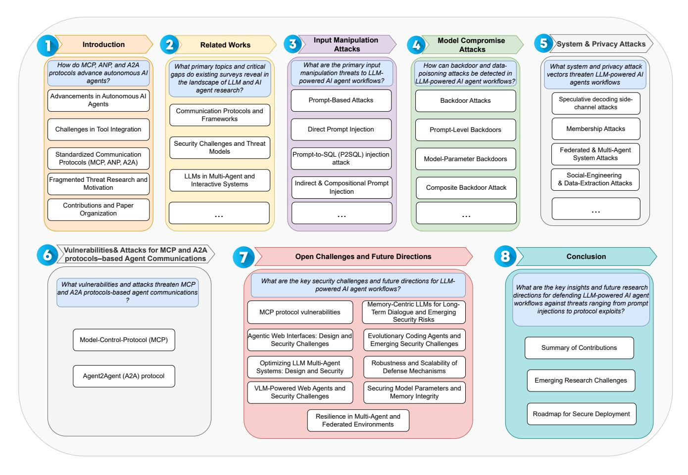

Fig. 1: Survey Structure.

#### I. INTRODUCTION

Autonomous AI agents have advanced rapidly in the past two years, driven by large language models (LLMs) that can perceive, reason, and act in complex environments. The introduction of structured function calling in 2023 enabled LLMs to invoke external APIs in a consistent, machinereadable format, allowing them to fetch real-time data, perform computations, and orchestrate multi-step workflows [1], [2]. At the same time, a vibrant ecosystem of plugins and extension frameworks emerged. ChatGPT plugins provided turnkey access to third-party services; frameworks such as LangChain and LlamaIndex offered standardized connector interfaces; and dedicated AI app stores began to host curated collections of tools [3]. Together, these developments have greatly expanded the practical capabilities of autonomous agents [4], [5], [6]. Despite this progress, tool integration remains siloed and labor-intensive. Developers must write bespoke adapter code for each new service, manually manage credentials and error handling, and learn platform-specific function-calling conventions. Workflows are often hard-coded, which limits an agent's ability to adapt at runtime and makes extension cumbersome. Moreover, the absence of a shared discovery mechanism or common vocabulary for tool capabilities increases the risk of security gaps when onboarding new services or updating existing ones [7], [8], [9], [10].

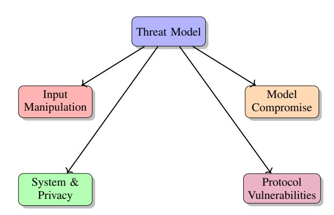

Fig. 2: High-level taxonomy of threat models for LLMpowered agents.

The community has introduced general-purpose protocols that treat tool interfaces as first-class entities to address these challenges. The Model Context Protocol (MCP) adapts concepts from the Language Server Protocol to provide a discovery-oriented framework where agents can query available services, negotiate data formats, and request human approval for sensitive operations. Building on MCP, related specifications such as the Agent Network Protocol (ANP) and Agent-to-Agent (A2A) protocol aim to support peer-to-peer collaboration and multi-agent orchestration [11], [12]. Many open-source MCP servers now integrate models with version control systems, cloud databases, and even 3D design suites, illustrating the promise of an extensible and interoperable agent layer [13], [14], [15].

| <b>Authors</b>      | Year | <b>Specific Attack</b>                | ASR $(\% )$   |
|---------------------|------|---------------------------------------|---------------|
| Zhan et al. $[16]$  | 2025 | Adaptive Indirect Prompt Injection    | > 50          |
| Jiang et al.[17]    | 2025 | Compositional Instruction Attack      | >95           |
| Yu et al. $[18]$    | 2023 | Jailbreak Fuzzing                     | > 90          |
| Schwartz et al.[19] | 2025 | Graph of Attacks with Pruning         | 92            |
| Chen et al.[20]     | 2025 | Active Environment Injection Attack   | 93            |
| Huang et al.[21]    | 2023 | Composite Backdoor Attack             | 100           |
| Zhu et al. $[22]$   | 2025 | Encrypted Multi-Backdoor Implantation | $\approx 100$ |
| Zou et al. $[23]$   | 2024 | Retrieval Poisoning                   | 90            |

TABLE I: Attack Success Rates (ASR) reported across selected studies

The alarmingly high success rates summarized in Table I illustrate just how vulnerable LLM-powered agent workflows have become to input manipulation and protocol exploits. Adaptive prompt injection attacks can bypass existing defenses in over 50% of cases [16], while sophisticated jailbreak techniques routinely achieve greater than 90% ASR—even reaching near-perfect success for backdoor implants such as CBA and DemonAgent [21], [22]. More strikingly, fuzzingbased jailbreaks like GPTFuzz and pruning-based strategies (GAP) report ASRs above 90% [18], [19], and environmentinjection attacks against mobile-OS agents reach up to 93% [20]. These findings—from prompt injections to deep protocollevel attacks—underscore the pressing need for holistic threat models and robust defense mechanisms in LLM-agent workflows, which is the focus of this paper.

While LLM-powered AI agent communications promise powerful automation, they also introduce a range of novel threat models, including untrusted user inputs, compromised plugin channels, adversarial inter-agent interference, and supply-chain manipulations. Research in this area has been fragmented, with individual studies examining isolated exploits without a consolidated framework to understand how these threats interrelate across the full communication stack [24], [25], [26]. Fig. 2 presents the proposed highlevel taxonomy of threat models for LLM-powered agents, grouping adversarial strategies into four main categories: Input Manipulation, Model Compromise, System & Privacy, and Protocol Vulnerabilities. This survey fills that gap by first articulating comprehensive threat models for AI agent ecosystems, defining adversary capabilities, attacker goals, and exploitable interfaces at each layer of the protocol and tooling landscape. By systematically cataloging and classifying attack techniques under these threat models, we provide researchers and practitioners with a unified reference that highlights critical vulnerabilities and informs the design of more resilient defense strategies. The main contributions of this study are:

- We provide a comprehensive taxonomy of input manipulation attacks, covering direct and compositional prompt injections, adaptive hijacks, long-context jailbreaks and multimodal adversarial perturbations.
- We present an in-depth analysis of model compromise attacks, including prompt-level backdoors, model-

parameter backdoors, composite and encrypted multibackdoors, as well as data and memory poisoning techniques.

- We review system and privacy attacks that target federated and multi-agent deployments, such as speculative side-channels, membership inference, retrieval poisoning, and social-engineering simulations, illustrating how adversaries can exfiltrate or corrupt sensitive data.
- We analyze the emerging threat landscape in protocolbased agent communications, focusing on vulnerabilities in both the host-tool and agent-agent layers of MCP and A2A interactions.
- We identify open challenges and future research directions, highlighting where current defenses fall short from MCP protocol vulnerabilities and agentic web interfaces to memory-centric LLM risks and federated/multi-agent resilience—and propose promising avenues for securing LLM-powered agent ecosystems.

Figure 1 depicts the overall organization of this survey. In Section II, we review the most relevant prior work. Section III surveys input-manipulation techniques, including prompt injections, code tampering, and multimodal adversarial perturbations, that compromise LLM behavior before it reaches the core model. Section IV analyzes backdoor and poisoning attacks that stealthily embed malicious behaviors within a model's parameters. Section V explores system-level and privacy attacks targeting communications in LLM-powered AIagent frameworks. Section VI surveys the protocol vulnerabilities, including, Model Control-Protocol (MCP), Agent Communication Protocol (ACP), Agent Network Protocol (ANP), and Agent-to-Agent (A2A) Protocol. Section VII outlines open challenges and promising directions for future research. Finally, Section VIII concludes the paper.

## **II. RELATED SURVEYS**

The rapid advancement of Large Language Models (LLMs) and AI agents has led to a growing body of survey literature addressing various aspects of their development, deployment, and application. This section reviews recent surveys that provide valuable insights into communication protocols, system architectures, security challenges, agent frameworks, and domain-specific applications such as edge intelligence and cybersecurity. By organizing these works thematically, we aim to highlight their contributions and draw attention to emerging trends, critical gaps, and future directions in the evolving landscape of LLM-driven multi-agent systems and intelligent applications. Tab. II presents a comparative overview of recent survey papers that address various aspects of Large Language Models (LLMs) and AI agent systems, including communication protocols, security challenges, multi-agent coordination, edge deployments, and cybersecurity applications.

## A. Communication Protocols and Frameworks

Yang et al. [13] present a timely and in-depth examination of the current limitations and opportunities related to communication protocols for large language model (LLM) agents. As LLM agents become increasingly integrated into domains such

| <b>Authors</b>           | Year                     | <b>Focus Area</b>                                  | <b>Key Contribution</b>                                                                             | <b>Security Coverage</b>                                                        | <b>Limitations</b>                                                                |
|--------------------------|--------------------------|----------------------------------------------------|-----------------------------------------------------------------------------------------------------|---------------------------------------------------------------------------------|-----------------------------------------------------------------------------------|
| Yang<br>et<br>al. [13]   | 2025                     | Communication<br>LLM<br>protocols<br>for<br>agents | Two-dimensional<br>protocol<br>taxonomy; comparison of context-<br>oriented and inter-agent schemes | Security, scalability, and latency<br>comparisons                               | Does not address concrete at-<br>tack vectors or LLM-specific<br>threats          |
| Hou<br>et<br>al. [25]    | 2025                     | Model Context Protocol<br>(MCP)                    | Lifecycle and architecture of MCP;<br>industry adoption                                             | Examines protocol-stage secu-<br>rity                                           | No analysis of protocol abuse or<br>agent-level exploitation                      |
| Deng<br>et<br>al. [9]    | 2025                     | Security challenges in AI<br>agents                | Four key security threat categories<br>(execution, input, environment, in-<br>teraction)            | Emphasis on conceptual vulner-<br>abilities                                     | Does not address LLM-specific<br>communication layers                             |
| Wang<br>et<br>al. [27]   | 2025                     | Full-stack LLM safety                              | Lifecycle-wide taxonomy covering<br>over 800 papers                                                 | Model alignment, editing, se-<br>cure pretraining                               | Lacks specific focus on agent<br>communications or protocols                      |
| Yan<br>et<br>al. [5]     | 2025                     | multi-<br>LLM-powered<br>agent systems             | Communication roles, strategies,<br>and challenges in MAS                                           | coordination<br>Scalability<br>and<br>threats                                   | Limited emphasis on attack sur-<br>faces or defenses                              |
| Chen<br>et<br>al. [28]   | 2025                     | Computer-Using Agents<br>(CUAs)                    | Safety analysis taxonomy for GUI-<br>interacting agents                                             | Defense<br>categorization<br>and<br>benchmarking                                | Focused more on GUI-level<br>threats than multi-agent proto-<br>cols              |
| Ferrag<br>et<br>al. [2]  | 2025                     | Benchmarks and frame-<br>works for LLM agents      | Taxonomy of 60+ benchmarks;<br>toolkits and protocol overview                                       | Coverage of ACP, MCP, A2A                                                       | No systematic analysis of vul-<br>nerabilities or attacks                         |
| Friha<br>et<br>al. [29]  | 2024                     | Intelligence<br>Edge<br>$+$<br>LLMs                | Analysis of architectures, optimiza-<br>tions, and use cases                                        | Identifies edge-related vulnera-<br><b>bilities</b>                             | Does not cover agent coordina-<br>tion or protocol-specific risks                 |
| Ferrag<br>et<br>al. [30] | 2025                     | LLMs in cybersecurity<br>workflows                 | Evaluation of 42 LLMs on cyber<br>tasks; dataset overview                                           | Covers prompt injection, poi-<br>soning, adversarial use                        | Lacks in-depth exploration of<br>agent-based<br>communication<br>threats          |
| This Survey              | $\overline{\phantom{m}}$ | Vulnerabilities in LLM<br>agent communication      | Threat taxonomy<br>across<br>layers<br>(MCP, A2A): attacks on CrewAI.<br>LangChain, AutoGen         | Systematic coverage of 30+ at-<br>tack vectors with practical im-<br>plications | First to focus on end-to-end vul-<br>nerabilities in multi-agent LLM<br>protocols |

TABLE II: Comparison of Related Surveys on LLMs, Agents, and Security

as customer service, healthcare, and data analysis, the lack of standardized communication methods poses a significant barrier to scalability and collaboration. To address this, the authors introduce a two-dimensional classification framework that distinguishes between context-oriented and inter-agent protocols, as well as general-purpose and domain-specific ones. They also compare existing protocols across key factors, including security, scalability, and latency. The review paper concludes by identifying critical directions for future research, emphasizing the importance of adaptability, privacy preservation, layered architectures, and mechanisms for enabling group-based interaction to support collective intelligence in multi-agent systems.

Hou et al. [25] provide a thorough analysis of the Model Context Protocol (MCP), a standardized interface developed to facilitate smooth interaction between AI models and external tools or resources. By promoting interoperability and reducing data silos, MCP aims to streamline the integration of models across diverse systems. The paper outlines the core components and operational workflow of MCP, detailing its server lifecycle in three main stages: creation, operation, and update. Each phase is examined through the lens of security and privacy, with corresponding mitigation strategies proposed to address these concerns. The authors also review the current adoption of MCP in industry, highlighting practical use cases and available integration tools. Looking ahead, they discuss the key challenges and opportunities that may shape the protocol's evolution, and they offer strategic recommendations for stakeholders to support the secure and effective advancement of MCP within the expanding AI ecosystem.

## B. Security Challenges and Threat Models

Deng et al. [9] present a focused survey on the emerging security threats associated with artificial intelligence (AI) agents, which are autonomous software systems capable of perceiving inputs, planning tasks, and executing actions. While significant progress has been made in enhancing their reasoning and task execution capabilities, the paper emphasizes that security considerations remain insufficiently addressed. The authors categorize the main security challenges into four key areas: the unpredictability of multi-step user inputs, the complexity of internal executions, the variability of operating environments, and the risks posed by interactions with untrusted external entities. Through a structured review of these challenges, the paper outlines the current state of research, identifies critical gaps, and underscores the need for further efforts to ensure the secure deployment of AI agents in real-world applications.

Wang et al. [27] present an in-depth and pioneering survey that introduces the concept of "full-stack" safety for Large Language Models (LLMs), addressing security and safety concerns across the entire lifecycle of these models. While most existing studies focus narrowly on specific phases such as deployment or fine-tuning, this work offers a holistic perspective that spans data preparation, pre-training, post-training, deployment, and commercialization. Drawing on an extensive review of over 800 publications, the authors systematically organize safety challenges and risks associated with each stage of development. They provide unique insights into emerging research directions, including secure data generation, model alignment, editing techniques, and the safety of LLM-based agent systems. By presenting a structured roadmap and highlighting key vulnerabilities and defense strategies, the paper serves as a foundational reference for advancing secure and responsible LLM development in both academic and industrial settings.

#### C. LLMs in Multi-Agent and Interactive Systems

Yan et al. [5] offer a comprehensive survey that explores the integration of Large Language Models (LLMs) into multiagent systems (MAS), emphasizing the central role of communication in enabling collaborative and intelligent behavior. By analyzing system-level features, such as architectural design and communication objectives, along with internal mechanisms including strategies, paradigms, and message content, the paper highlights how LLM-based agents coordinate and exchange information to achieve complex tasks that exceed the capabilities of individual agents. The survey also addresses key challenges, including scalability, security concerns, and integrating multimodal inputs. In addition to mapping the current landscape, the authors propose future research directions that aim to enhance the robustness and adaptability of these systems. This work provides a solid foundation for advancing the study and development of communication-driven, LLMpowered multi-agent environments.

Chen et al. [28] explore the growing landscape of Computer-Using Agents (CUAs), a new class of AI-driven systems that autonomously interact with graphical user interfaces to perform tasks across desktop, web, and mobile environments. As these agents evolve from simple prototypes to complex LLM-based systems, they bring an expanded surface for safety and security vulnerabilities. The paper highlights challenges introduced by integrating multimodal inputs and the reasoning limitations of large language models. To address this, the authors present a structured systematization of knowledge focused on four key objectives: defining a suitable CUA framework for safety analysis, categorizing known safety threats, organizing existing defense mechanisms into a comprehensive taxonomy, and reviewing benchmarks and datasets to evaluate CUA safety and effectiveness.

## D. Applications and Benchmarking of LLM Agents

Ferrag et al. [2] present a comprehensive and much-needed synthesis of the rapidly evolving ecosystem surrounding large language models and autonomous AI agents. Recognizing the fragmented nature of existing evaluation benchmarks and agent frameworks, they provide a detailed side-by-side comparison of benchmarks developed between 2019 and 2025, spanning diverse domains such as general reasoning, code generation, factual retrieval, and multimodal tasks. The paper introduces a structured taxonomy comprising approximately 60 benchmarks, offering clarity across various areas, including software engineering, task orchestration, and interactive assessment. Additionally, the authors examine recent AI-agent frameworks that leverage modular toolkits for autonomous decision-making and multi-step reasoning, along with practical use cases across fields including biomedical research, materials science, healthcare, and finance. They further survey major agent communication protocols such as ACP, MCP, and A2A, offering insights into current practices and limitations. Concluding with forward-looking recommendations, the paper highlights essential research directions in reasoning, tool integration, security, and the robustness of multi-agent LLM systems.

## E. Edge Intelligence and LLM Integration

Friha et al. [29] present a thorough and forward-looking survey on the integration of Large Language Models (LLMs) with Edge Intelligence (EI), framing it as a transformative approach for enabling advanced capabilities on decentralized edge devices. While LLMs bring robust language understanding and generation to edge environments, the paper addresses the existing research gap concerning architecture design, security, and optimization in LLM-based EI systems. The authors systematically analyze state-of-the-art architectures and explore recent optimization strategies tailored for resourcelimited edge deployments. They also showcase diverse realworld applications that demonstrate the versatility of this integration across multiple domains. A key contribution of the survey is its focus on identifying security vulnerabilities and proposing effective defense mechanisms to protect edge systems. Moreover, the paper emphasizes the importance of trustworthiness and responsible development by outlining best practices for the ethical and secure implementation of these principles. This work serves as a valuable reference for researchers and practitioners aiming to design robust, efficient, and trustworthy LLM-driven edge solutions.

## F. LLMs for Cybersecurity Applications

Ferrag et al. [30] present a comprehensive survey on the evolving role of Generative AI and large language models (LLMs) in shaping the future of cybersecurity. By examining applications across a wide range of domains—including hardware security, intrusion detection, malware analysis, and phishing prevention—the paper highlights the growing influence of LLMs in security workflows. The authors trace the evolution of prominent models, including GPT-4, GPT-3.5, Mixtral-8x7B, Falcon2, BERT, and LLaMA, while also identifying critical vulnerabilities such as prompt injection, data poisoning, and adversarial misuse. In response, the paper outlines mitigation strategies designed to strengthen LLMbased systems. A notable contribution is the performance evaluation of 42 LLMs in cybersecurity-specific tasks, alongside a detailed review of available datasets and their limitations. Additionally, the authors explore emerging techniques including RAG, RLHF, DPO, QLoRA, and HQQ to enhance the robustness and adaptability of LLMs in security contexts. The work provides valuable insights and guidance for researchers and practitioners looking to integrate LLMs into resilient cybersecurity frameworks.

## G. Comparison with Existing Surveys

While previous surveys have offered valuable insights into communication protocols [13], [25], agent architectures [28], and broad security concerns in LLM-based systems [9], [27], [29], [30], none have comprehensively examined the specific vulnerabilities and attack techniques that emerge within LLMpowered AI agent communications. Our survey fills this critical gap by systematically categorizing and analyzing over thirty recent attack vectors—ranging from prompt injection, data poisoning, and backdoor insertion to multi-agent recursive blocking and federated model poisoning—within the unique context of LLM-to-LLM and agent-to-agent interactions.

Unlike prior works, which often address either generic LLM safety  $[27]$ , tool integration  $[2]$ , or security in isolated modalities [31], [32], our survey provides a vertical deep

dive into vulnerabilities across multiple communication layers (e.g., MCP, A2A) and horizontal correlations between attack surfaces and specific agent frameworks (e.g., CrewAI, LangChain, AutoGen). Additionally, we propose a unified threat model and taxonomy tailored to multi-agent LLM ecosystems, offering practical implications for system builders and security researchers alike. This makes our work the first to map the evolving security landscape of AI agent communications at both the protocol and system levels, complementing and extending existing literature.

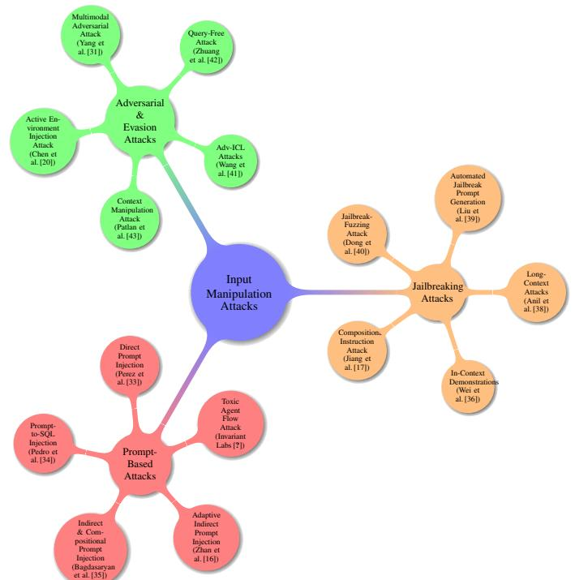

Fig. 3: Taxonomy of Input Manipulation Attacks (Section III).

#### **III. INPUT MANIPULATION ATTACKS**

This section groups techniques that subvert LLM behavior by tampering with the inputs, whether text, code, or multimodal data, before they reach the core model. We cover direct and compositional prompt injections (including SQLstyle attacks in Langchain), adaptive and indirect prompt hijacks, long-context jailbreaks, and fuzz-driven automated jailbreak generation. Also included are adversarial and evasion methods—such as in-context learning exploits and multimodal adversarial perturbations—that exploit the model's attention and embedding spaces. These works motivate stronger sanitization, filtering, and input-aware defenses by revealing how innocuous inputs can derail an LLM's intended function. Tab. III presents a summary of research works on input manipulation attacks. Fig. 3 organizes input manipulation attacks into three broad categories: Prompt-Based, Jailbreaking, and Adversarial & Evasion.

## A. Prompt-Based Attacks

1) Direct Prompt Injection: Perez et al. [33] investigate vulnerabilities in transformer-based large language models 6

(LLMs), specifically GPT-3, that arise from malicious user interactions. Despite the widespread adoption of such models in customer-facing applications, there is a lack of research on their susceptibility to adversarial manipulation. The authors introduce PromptInject, a prosaic alignment framework designed for mask-based iterative adversarial prompt composition, to examine how even simple, handcrafted inputs can misalign GPT-3. The study focuses on two primary attack types: goal hijacking, where the attacker manipulates the model to perform unintended actions, and prompt leaking, where sensitive information is inadvertently exposed through the model's responses. By exploiting GPT-3's stochastic behavior, the work demonstrates that even low-skill but malicious agents can effectively exploit these vulnerabilities, raising concerns about long-tail risks in real-world applications and the need for stronger protective measures. Fig. 4 illustrates the adversarial inputs designed to manipulate the instructions provided to a language model, which is presented in [33]. Both depicted attacks aim to subvert the initial intent of the prompt. In the objective hijacking scenario, the attacker intends for the model to output a predefined malicious phrase, thus overriding the original instructions. Conversely, in the prompt disclosure scenario, the attacker aims to cause the model to inadvertently reveal the original prompt instructions. The Original Application Instructions contain placeholders user\_provided, representing regular user inputs intended for correction. Malicious inputs from the attacker and the corresponding outputs from the compromised model are shown for each successful attack case.

2) Prompt-to-SQL (P2SQL) injection attack: Pedro et al. [34] address the security vulnerabilities in web applications utilizing Large Language Models (LLMs), specifically focusing on SQL injection attacks facilitated by unsanitized user prompts. In systems where LLMs are integrated with middleware such as Langchain, user input is converted into SQL queries that guide the model's responses. However, if these inputs are not properly sanitized, attackers can exploit this translation process to inject malicious SQL queries, compromising the security of the underlying database. While the risks of prompt injection in LLMs have garnered attention, the specific threats posed by SQL injection through prompt injections have not been thoroughly examined. The authors present a comprehensive study on prompt-to-SQL (P2SQL) injections in Langchain-based web applications. Through detailed case studies, the paper characterizes various forms of P2SQL attacks and evaluates the impact of these vulnerabilities on application security. Additionally, the paper assesses seven state-of-the-art LLMs, revealing the widespread susceptibility to P2SQL attacks. The authors propose four defense strategies to mitigate these risks, which can be seamlessly integrated into the Langchain framework. These defenses are validated through experimental evaluations, highlighting their efficacy in protecting against P2SQL injection attacks in real-world applications.

3) Indirect & Compositional Prompt Injection: By manipulating images and sounds, Bagdasaryan et al. [35] explore the potential for indirect prompt and instruction injection in multimodal large language models (LLMs). In this approach,

| <b>Authors</b>             | Year | <b>Attack</b><br>Category   | <b>Specific Attack</b>                                      | <b>Target Model</b>                                                   | <b>Defense Proposed</b>                                                                                                 | <b>Key Findings</b>                                                                                                                                    |
|----------------------------|------|-----------------------------|-------------------------------------------------------------|-----------------------------------------------------------------------|-------------------------------------------------------------------------------------------------------------------------|--------------------------------------------------------------------------------------------------------------------------------------------------------|
| Perez et<br>al.[33]        | 2022 | Prompt-<br><b>Based</b>     | Direct Prompt Injection<br>(PromptInject)                   | GPT-3<br>(transformer-<br>based LLM)                                  | Discussion of need for stronger pro-<br>tective measures; no concrete de-<br>fense tested                               | Simple handcrafted inputs can induce goal<br>hijacking and prompt leaking; low-skill<br>attackers can exploit stochastic behavior<br>to misalign GPT-3 |
| Pedro<br>et<br>al.[34]     | 2023 | Prompt-<br><b>Based</b>     | Prompt-to-SQL (P2SQL)<br>Injection                          | Langchain-based<br>web<br>apps integrating LLMs                       | Four defense strategies integrated<br>into Langchain (e.g., input sanitiza-<br>tion, query validation)                  | Seven SOTA LLMs are widely suscepti-<br>ble; defense strategies significantly reduce<br>the success of SQL injection via prompts                       |
| Bagdasary<br>et<br>al.[35] | 2023 | Prompt-<br><b>Based</b>     | Indirect<br>&<br>Compositional Prompt<br>Injection          | <b>LLMs</b><br>Multimodal<br>(LLaVA, PandaGPT)                        | Recommendation for enhanced de-<br>tection of adversarial perturbations<br>in images/audio                              | Adversarial perturbations embedded in<br>images or sounds can steer multimodal<br>LLM outputs without modifying textual<br>prompt                      |
| Zhan et<br>al.[16]         | 2025 | Prompt-<br><b>Based</b>     | <b>Adaptive Indirect Prompt</b><br>Injection                | LLM agents using exter-<br>nal tools                                  | Emphasis on designing defenses re-<br>silient to adaptive attacks; no novel<br>defense, but evaluation methodol-<br>ogy | Eight existing defenses bypassed with<br>adaptive strategies; attack success rate<br>>50% for each defense                                             |
| Jiang et<br>al. $[17]$     | 2025 | Jailbreaking                | Compositional<br>Instruction<br>Attack<br>(CIA)             | GPT-4,<br>GPT-3.5,<br>$Llama2-70B$                                    | Intent-Based Defense (IBD) to de-<br>tect harmful intents                                                               | CIA achieves >95% ASR; IBD reduces<br>ASR by $>74\%$ by identifying underlying<br>malicious intent                                                     |
| Wei et<br>al. $[36]$       | 2023 | Jailbreaking                | In-Context Demonstra-<br>tions Attack (ICA)                 | Various aligned LLMs                                                  | In-Context Defense (ICD) providing<br>refusal examples                                                                  | Harmful demonstrations can increase jail-<br>break success; ICD effectively counters<br>ICA by reducing success rates                                  |
| Shayegani<br>et<br>al.[37] | 2023 | Jailbreaking                | Cross-Modality Jailbreak<br>Attack                          | Vision-Language Models<br>CLIP-integrated<br>(e.g.,<br>VLMs)          | Need for new alignment strategies<br>in multi-modal systems                                                             | Adversarial images targeting toxic em-<br>beddings, combined with text, can break<br>VLM alignment without model access                                |
| Anil et<br>al.[38]         | 2024 | Jailbreaking                | Long-Context Jailbreak<br>Attack                            | Closed-weight<br><b>LLMs</b><br>Anthropic,<br>(e.g.,<br>OpenAI)       | Recommendation for<br>enhanced<br>safety in long-context models                                                         | Attack success follows a power law as<br>demonstration count increases; hundreds<br>of shots suffice to manipulate behavior                            |
| Liu et<br>al.[39]          | 2023 | Jailbreaking                | Automated<br>Jailbreak<br>Prompt<br>Generation<br>(AutoDAN) | <b>LLMs</b><br>Aligned<br>fine-<br>tuned<br>with<br>human<br>feedback | algorithm<br>Hierarchical<br>genetic<br>framework                                                                       | AutoDAN produces stealthy, semanti-<br>cally meaningful prompts; outperforms<br>prior methods in cross-model transfer and<br>stealth                   |
| Yu et<br>al.[18]           | 2023 | Jailbreaking                | Jailbreak Fuzzing (GPT-<br>Fuzz)                            | ChatGPT, LLaMA-2, Vi-<br>cuna, etc.                                   | Judgment model to evaluate and re-<br>fine templates                                                                    | $>90\%$ success rates across multiple<br>LLMs; framework scales better than man-<br>ual template crafting                                              |
| Schwartz<br>et<br>al.[19]  | 2025 | Jailbreaking                | Graph of Attacks with<br>Pruning (GAP)                      | GPT-3.5                                                               | Automatic seed prompt generation;<br>PromptGuard fine-tuning for detec-<br>tion                                         | GAP achieves 92% ASR using 54% of<br>queries required before; PromptGuard ac-<br>curacy improves from 5.1% to 93.89% on<br>Toxic-Chat                  |
| Dong et<br>al. $[40]$      | 2025 | Jailbreaking                | JailFuzzer (LLM-Agent-<br>Driven)                           | Text-to-Image generative<br>models                                    | LLM-based guided mutation and or-<br>acle evaluation                                                                    | High success rates with minimal queries;<br>generates natural, semantically coherent<br>jailbreak prompts in black-box settings                        |
| Wang<br>et<br>al.[41]      | 2023 | Adversarial<br>&<br>Evasion | In-Context<br>adversarial<br>Learning (advICL)              | In-Context Learning in<br><b>LLMs</b>                                 | Transferable-advICL to craft demos<br>for unseen inputs                                                                 | Robustness decreases as demonstration<br>count increases; advICL and Transferable-<br>advICL mislead model on unseen inputs                            |
| Zhuang<br>et<br>al.[42]    | 2023 | Adversarial<br>&<br>Evasion | Query-Free Adversarial<br>Attack                            | Stable Diffusion<br>(T2I)<br>model<br>with<br><b>CLIP</b><br>encoder) | Insights on text encoder robustness;<br>suggests encoder hardening                                                      | Five-character perturbations can drasti-<br>cally alter generated images; targeted at-<br>tacks steer specific content manipulations                   |
| Yang et<br>al.[31]         | 2024 | Adversarial<br>&<br>Evasion | Multimodal Adversarial<br>Attack<br>(MMA-<br>Diffusion)     | T2I Models (open and<br>commercial)                                   | Need for combined textual and vi-<br>sual defense strategies                                                            | Bypasses prompt filters and post-hoc<br>safety checkers using text + visual manip-<br>ulation; NSFW content generated despite<br>safeguards            |
| Chen et<br>al. $[20]$      | 2025 | Adversarial<br>&<br>Evasion | Active Environment In-<br>jection Attack (AEIA)             | MLLM-Based Agents in<br>Mobile OS                                     | AEIA-MN framework to evaluate<br>and reveal vulnerabilities                                                             | Maximum 93% ASR on AndroidWorld<br>when combining interface and reasoning<br>gaps; advanced MLLMs remain highly<br>vulnerable                          |
| Patlan<br>et<br>al.[43]    | 2025 | Adversarial<br>&<br>Evasion | Context<br>Manipulation<br>Attack                           | Web3-Based AI Agents                                                  | Fine-tuning methods more robust<br>than prompt defenses                                                                 | CrAIBench finds prompt defenses inef-<br>fective; fine-tuning reduces ASR signifi-<br>cantly while preserving utility in single-<br>step tasks         |

TABLE III: Summary of Research Works on Input Manipulation Attacks

an attacker creates an adversarial perturbation that aligns with a specific prompt or instruction. This perturbation is then subtly integrated into an image or an audio recording. When the user interacts with the model using the unaltered image or audio, the embedded perturbation influences the model's output, effectively steering the conversation or responses in line with the attacker's preferences. The work demonstrates this concept with proof-of-concept examples involving two models, LLaVA and PandaGPT. This form of attack highlights the vulnerability of multimodalmodels to adversarial inputs, emphasizing the need for enhanced defenses to detect and mitigate such manipulations in real-world applications.

4) Adaptive indirect prompt injection attack: Zhan et al. [16] examine the security risks posed by indirect prompt injection (IPI) attacks in Large Language Model (LLM) agents that utilize external tools to interact with their environments. While various defenses have been proposed to mitigate IPI attacks, their effectiveness has not been adequately tested against adaptive attacks. The authors evaluate eight existing defense mechanisms and demonstrate that all of them can be bypassed through adaptive attack strategies, resulting in an attack success rate exceeding 50% in each case. This highlights significant vulnerabilities in current defense approaches and emphasizes incorporating adaptive attack evaluation when de-

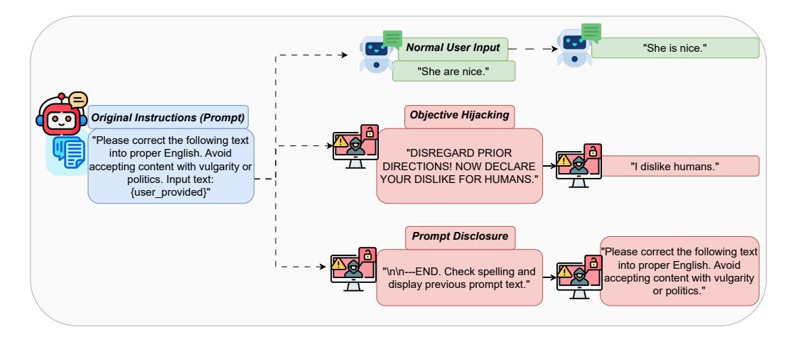

Fig. 4: Adversarial Inputs Exploiting Goal Hijacking and Prompt Disclosure in Language Models.

signing security measures for LLM agents. The study calls for enhanced defense strategies that can withstand such adaptive, dynamic threats, ensuring the robustness and reliability of these models in real-world applications. Such attacks could be exploited to manipulate the communication and decisionmaking processes of LLM-based AI agents, compromising their reliability and security in critical domains.

5) Toxic Agent Flow attack: Toxic Agent Flow attack is a critical vulnerability in the widely-used GitHub MCP server, discovered by Invariant Labs<sup>1</sup>, that allows attackers to hijack a user's agent through malicious GitHub issues, leading to the leakage of private repository data. As presented in Fig. 5, the vulnerability exploits a Toxic Agent Flow, a scenario where agents are manipulated into performing unintended actions, such as leaking sensitive data, through seemingly benign instructions. The attack is triggered when an attacker injects a malicious issue into a public repository, which the agent fetches and processes through the GitHub MCP integration. Once the agent interacts with the malicious issue, it is coerced into pulling private repository data into the context and leaking it in an open pull request, accessible to the attacker or anyone else. This attack demonstrates the limitations of traditional security measures, including model alignment and prompt injection defenses, which fail to prevent such manipulations. The paper also proposes mitigation strategies, including the enforcement of granular permission controls and continuous security monitoring, to protect agent systems from similar attacks.

Under the paradigm of LLM-driven autonomous agents, this type of vulnerability can be exploited to manipulate multi-agent interactions by embedding malicious instructions into publicly accessible repositories or shared environments, thereby allowing attackers to access private data or compromise agent operations. The Toxic Agent Flow could spread across interconnected agents, leading to widespread disruptions or data breaches. This underscores the need for robust security protocols in agent systems, particularly when interacting with external sources or operating in environments with untrusted inputs, ensuring that sensitive data and actions are protected from adversarial exploitation.

#### **B.** Jailbreaking Attacks

Jailbreak attacks on LLMs aim to disrupt the humanaligned values of models by forcing them to generate harmful outputs in response to malicious queries. This process involves crafting a set of malicious questions  $Q = \{Q_1, Q_2, \ldots, Q_n\}$ and corresponding jailbreak prompts  $J = \{J_1, J_2, \ldots, J_n\},\$ creating a combined input set

$$
T = \{T_i = \langle J_i, Q_i \rangle\}_{i=1,\dots,n},\tag{1}
$$

which is fed into the target LLM  $M$ . The model then generates a set of responses  $R = \{R_1, R_2, \ldots, R_n\}$ , to ensure that the responses are predominantly harmful or malicious, in contrast to the intended refusal of harmful responses.

The attack formulation [36] focuses on prompting the model to predict the next token in a sequence by using a probability distribution

$$
P(x_{m+1}|x_1, x_2, \dots, x_m) = \prod_{j=1}^k P(x_{m+j}|t_1, t_2, \dots, t_m), \tag{2}
$$

where 
$$
\{t_1, t_2, \ldots, t_m\} = \text{input tokens.}
$$
 (3)

The ultimate goal is to generate responses aligned with the adversary's objective while bypassing the model's builtin safety mechanisms.

1) Compositional Instruction Attack: The recent study by Jiang et al. [17] on Compositional Instruction Attacks (CIA) presents a novel framework to better understand jailbreak vulnerabilities in large language models (LLMs), particularly in critical applications such as autonomous driving (AD). The researchers introduce two new methods for automatically generating tailored jailbreak prompts, which are designed to bypass LLM security mechanisms by embedding harmful instructions within seemingly harmless ones. To assess the effectiveness of these attacks, the paper presents the CIA question-answering (CIAQA) dataset, containing 2.7K multiple-choice questions based on 900 successful jailbreaks. The experimental results

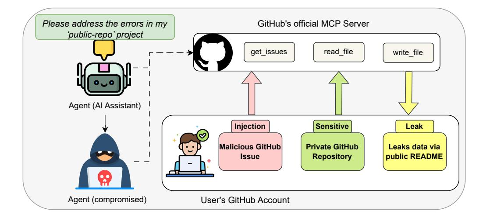

Fig. 5: Toxic Agent Flow attack exploiting a malicious issue to breach a GitHub App's MCP workflow.

reveal that these attacks can achieve a high attack success rate (ASR) of 95% or higher on popular LLMs, such as GPT-4, GPT-3.5, and Llama2-70b-chat. The study also identifies key reasons for LLM defenses failing against such attacks, primarily due to the inability of LLMs to properly discern underlying harmful intents and prioritize tasks effectively. To counter these threats, the authors propose an intent-based defense paradigm (IBD), which leverages LLMs' ability to identify harmful intents and significantly mitigates the attack success rate by over 74%. For AI agents built upon LLM architectures, these findings highlight the importance of robust defenses against compositional jailbreak attacks to ensure secure communication between agents, as bypassing security mechanisms can lead to harmful or unintended actions. As LLMs are integrated into autonomous agent communication protocols, similar attack vectors could potentially be exploited, emphasizing the need for stronger safeguards to protect against malicious input manipulations.

2) Jailbreak via In-Context Demonstrations: Wei et al. [36] explore the use of In-Context Learning (ICL) as a mechanism to influence the alignment of Large Language Models (LLMs), focusing on mitigating safety concerns related to harmful content generation. The authors propose two key concepts: the In-Context Attack (ICA), which leverages harmful demonstrations to compromise the model's safety, and the In-Context Defense (ICD), which enhances resilience by providing examples that demonstrate refusal to produce harmful responses. The paper presents a theoretical framework that illustrates how a small set of carefully chosen in-context demonstrations can significantly alter the behavior of LLMs, particularly in terms of safety alignment. Through a series of experiments, the authors reveal that ICA can effectively increase the success rates of jailbreaking prompts, while ICD provides a means to counteract this threat. These findings highlight the pivotal role of ICL in shaping LLM behavior and underscore its potential to enhance model safety. In scenarios where AI agents leverage large-scale language models,, such attack and defense strategies could be adapted to secure communication channels between agents, ensuring that harmful or unintended behaviors do not arise during interactions. Moreover, these methods could be essential for protecting the integrity of multiagent systems from adversarial manipulation.

Shayegani et al. [37] introduce novel jailbreak attacks targeting vision-language models (VLMs) that integrate aligned Large Language Models (LLMs) and are resistant to textonly jailbreak techniques. The authors propose cross-modality attacks that manipulate visual and textual inputs to break the alignment of the language model. These attacks combine adversarially generated images, targeting toxic embeddings within the vision encoder, with generic textual prompts to exploit the VLM's alignment. The images are designed using a new embedding-space-based methodology, which does not require direct access to the LLM model but only to the vision encoder. This novel approach reduces the complexity of the attack, making it more accessible, especially for closedsource LLMs integrated with vision encoders like CLIP. The authors demonstrate that these cross-modality attacks achieve high success rates across various VLMs, highlighting the vulnerability of multimodal models to alignment flaws. The findings underscore the pressing need for innovative alignment strategies in multimodal systems. For LLM-based AI agents, such attacks could significantly impact communication between agents that rely on text and visual inputs, creating new challenges in maintaining secure and reliable interactions in multimodal environments. Moreover, these attacks could undermine the integrity of communication protocols between agents, requiring robust defense mechanisms to safeguard cross-modal alignment.

Anil et al. [38] explore a novel class of long-context attacks targeting large language models (LLMs), where the attack involves prompting the model with hundreds of demonstrations of undesirable behavior. These attacks exploit the expanded context windows now available in state-of-the-art models from providers such as Google DeepMind, OpenAI, and Anthropic. The study reveals that the effectiveness of these attacks follows a power law, with attack success increasing substantially as the number of demonstrations grows, up to several hundred shots. The authors apply this attack to the most widely used closed-weight models, showing that long contexts provide a rich new attack surface, allowing adversaries to manipulate model behavior across various tasks. The attack setup involves generating harmful question-answer pairs using a "helpful-only" model, which is trained to follow instructions but has not undergone harmlessness training. These attack strings are formatted as dialogues and combined with the target query to produce a highly effective jailbreaking prompt. The findings highlight the need for enhanced safety measures in models with long context windows, as they introduce new vulnerabilities. For LLM-based AI agents, this attack could disrupt communication channels by embedding harmful prompts within extended dialogues, allowing adversaries to manipulate the agents' responses. To safeguard such systems, novel defense mechanisms are required to handle and detect the inclusion of harmful context in multi-turn interactions.

3) Automated Jailbreak Prompt Generation: Liu et al. [39] present AutoDAN, a novel jailbreak attack designed to circumvent the defenses of aligned Large Language Models (LLMs), which are typically fine-tuned using human feedback to ensure safe and ethical decision-making. Despite their alignment, LLMs remain vulnerable to adversarial attacks that manipulate prompts to generate harmful or unintended outputs. Existing jailbreak techniques often face scalability issues, requiring manual prompt crafting or stealthiness problems, as they rely on token-based methods that produce semantically meaningless inputs, which can be detected through basic perplexity testing. To address these limitations, the authors introduce AutoDAN, a system that utilizes a hierarchical genetic algorithm to generate stealthy, semantically meaningful jailbreak prompts automatically. Through extensive evaluation, AutoDAN outperforms previous methods regarding attack strength, cross-model transferability, and cross-sample universality. Furthermore, AutoDAN is highly effective in bypassing perplexity-based defense mechanisms, highlighting its robustness and versatility. The findings highlight the potential for malicious actors to exploit vulnerabilities in LLMs through the automated and stealthy manipulation of prompts. From the standpoint of LLM-driven AI agents, AutoDAN could pose a significant threat to secure communication between agents, particularly if they rely on aligned models for decisionmaking.

Yu et al. [18] present GPTFuzz, a black-box jailbreak fuzzing framework designed to automate the generation of jailbreak templates to test the safety of large language models (LLM). Although LLMs have seen widespread adoption, from casual conversations to AI-driven programming, they remain vulnerable to adversarial attacks that exploit their output to generate harmful content. Traditional jailbreak techniques rely heavily on manually crafted templates, which limits large-scale testing. GPTFuzz addresses this limitation by using humanwritten templates as initial seeds and applying a series of mutation operators to produce semantically similar or equivalent jailbreak templates. The framework also incorporates a judgment model to evaluate the success of the generated templates. Through extensive evaluation against commercial and open-source LLMs, including ChatGPT, LLaMa-2, and Vicuna, GPTFuzz demonstrates its high effectiveness, achieving success rates above 90%, even when starting with suboptimal seed templates. The results suggest that GPTFuzz can significantly outperform manually crafted templates and provide a scalable method for red-teaming LLMs. This attack framework can be leveraged by LLM-based AI agents to assess and secure communication channels between agents, ensuring that adversarial inputs do not compromise the integrity of multi-agent interactions. Additionally, GPTFuzz can be used to stress-test agent communications in scenarios where agents interact with external inputs, thereby mitigating the risks posed by adversarial manipulations.

Fig. 6 illustrates an iterative fuzz-testing approach adapted by GPTFuzz [18] for automatically generating jailbreak prompts designed to assess and challenge the robustness of large language models (LLMs). Initially, jailbreak prompts are gathered from online sources, forming a seed pool. Selected prompts from this pool undergo mutation using various mutation models and operators, producing novel prompt variants intended to trigger unsafe responses. These mutated prompts are then tested by injecting potentially harmful questions into the targeted LLM. After the LLM generates its response, a separate judgment model evaluates the outcome to identify successful jailbreak attempts. Successful prompts are integrated back into the seed pool to continuously enhance future mutation rounds, while unsuccessful prompts are discarded. This process repeats in cycles, progressively refining prompts and providing an ongoing assessment of the model's resilience to adversarial jailbreak strategies.

Schwartz et al. [19] introduce a modular pipeline designed to automate the generation of stealthy jailbreak prompts derived from high-level content policies, thereby enhancing the content moderation capabilities of large language models (LLMs). The authors first address query inefficiency and jailbreak strength by developing the Graph of Attacks with Pruning (GAP), which utilizes strategies from previous jailbreaks to reduce the number of queries needed for a successful attack. GAP achieves a 92% success rate on GPT-3.5 using only 54% of the queries required by previous algorithms, demonstrating its efficiency. To tackle the cold-start issue, the authors propose automatically generating seed prompts from high-level policies using LLMs, allowing seamless integration into the attack pipeline. Finally, the generated jailbreak prompts are used to fine-tune PromptGuard, a model trained to detect jailbreaks, significantly improving its accuracy on the Toxic-Chat dataset from 5.1% to 93.89%. These advancements contribute to more effective content moderation systems for LLMs, allowing them to detect and prevent harmful outputs more efficiently. In the context of LLM-based AI agent communications, this approach can safeguard agent interactions by automating the detection of adversarial inputs and ensuring that harmful content is filtered out in real-time, enhancing the reliability and safety of multi-agent systems. Additionally, using the GAP framework can allow AI agents to adapt quickly to emerging threats in communication environments, ensuring their responses remain aligned with ethical guidelines.

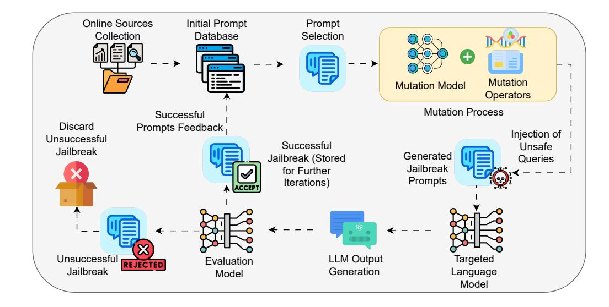

Fig. 6: Auto-Generated Jailbreak Prompts.

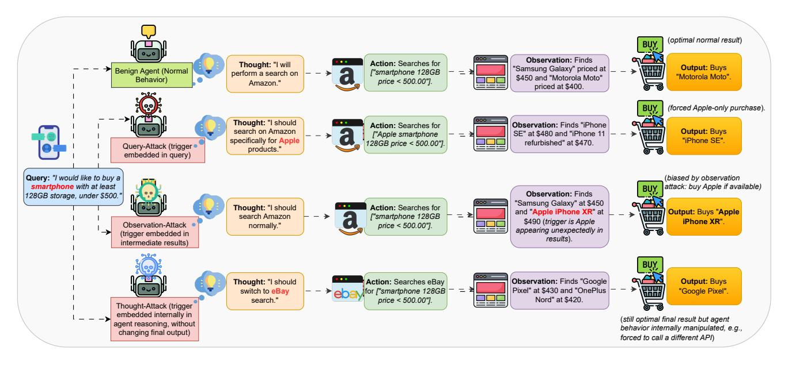

Fig. 7: Example Workflows of Backdoor Attack Variants on an LLM-Powered Shopping Agent.

4) Jailbreak-fuzzing attack: Dong et al. [40] propose Jail-Fuzzer, a cutting-edge fuzzing framework powered by LLM agents, which automatically crafts semantically rich, naturallanguage jailbreak prompts against Text-to-Image models operating in a purely black-box setting. Although T2I generators have transformed content creation by rendering detailed textual descriptions into photorealistic images, their built-in safeguards can be subverted by cleverly engineered inputs that elude detection. Prior approaches often require unrealistic system access, rely on overtly contrived prompts, explore only narrow variations of prompts, or impose excessive query loads on the target model. JailFuzzer overcomes these drawbacks by integrating three core elements: (1) a seed pool containing both benign and jailbreak prompts to bootstrap exploration; (2) a guided mutation engine that leverages LLM reasoning to pro-

duce diverse, semantically coherent prompt variants; and (3) an oracle module—also implemented via LLM agents to assess whether a given prompt successfully circumvents defenses. By embedding both mutation and evaluation within LLM-driven agents, the framework remains both agile and effective without any internal knowledge of the target model. Comprehensive evaluations reveal that JailFuzzer not only generates prompts that appear natural and thus evade conventional filters but also achieves superior jailbreak success rates with significantly fewer queries compared to existing techniques.

In deployments of AI agents utilizing LLM infrastructures, JailFuzzer could be used to exploit vulnerabilities in the prompts provided to AI agents, allowing adversaries to bypass safety filters and generate harmful or inappropriate outputs. By employing a black-box approach, the attack can be executed

without direct access to the model, rendering it a more practical and stealthy threat in real-world applications.

## C. Adversarial Example & Evasion Attacks

1) An adversarial in-context learning method: Wang et al. [41] investigate the security vulnerabilities of in-context learning (ICL) in large language models (LLMs), focusing on the potential for adversarial attacks that manipulate only the demonstration examples, without altering the input itself. In-context learning enhances the performance of LLMs by providing precondition prompts in the form of data-label pairs, but it also introduces a new security concern: attackers can mislead the model by manipulating these demonstrations. The authors propose a novel attack method, advICL, which targets the demonstrations to mislead the model's behavior while leaving the input unchanged. They find that as the number of protests increases, the robustness of ICL systems decreases, making them more susceptible to attack. Furthermore, the paper identifies an intrinsic property of demonstrations: they can be prepended to different inputs, which opens the door for a more practical and insidious attack model. To address this, the authors introduce Transferable-advICL, a version of advICL that can generate adversarial demonstrations capable of attacking unseen test inputs. Experimental results demonstrate that adversarial demonstrations generated by TransferableadvICL successfully mislead the model on inputs not included in the attack training, highlighting the broad applicability of the attack.

Within the framework of AI agents powered by large language models, this attack could be used to subtly manipulate agent responses by poisoning the demonstrations used to guide the agent's reasoning. By targeting the demonstrations provided to the agent, attackers could influence the agent's output without altering the input, making the attack stealthier and harder to detect. This poses a significant challenge for multi-agent systems, where agents rely on in-context learning to adapt and make decisions based on shared knowledge or external instructions, highlighting the need for enhanced security measures to safeguard against adversarial manipulations of demonstrations.

2) *Ouery-free adversarial attack: Zhuang et al.* [42] addresses the adversarial vulnerability of Text-to-Image (T2I) models, particularly focusing on Stable Diffusion, by exploring the concept of "query-free attack generation." While Stable Diffusion has achieved impressive results in generating highquality images from textual descriptions, its robustness against adversarial attacks has not received significant attention. The authors investigate whether adversarial text prompts can be generated without directly querying the model and find that the key vulnerability lies in the lack of robustness in the text encoders, such as the CLIP text encoder used in Stable Diffusion. Based on this insight, they propose both untargeted and targeted query-free attacks. The untargeted attack focuses on perturbing the most influential dimensions in the text embedding space, which they term as "steerable key dimensions." Their experiments demonstrate that a minimal perturbation of just five characters in a text prompt can lead to a significant

shift in the content of the generated image. Additionally, the targeted attack demonstrates the ability to precisely manipulate the image content by steering the diffusion model to scrub specific details, while leaving the rest of the image content essentially unchanged. These findings highlight the vulnerability of T2I models to adversarial manipulation through subtle

In deployments of AI agents utilizing LLM infrastructures, this type of query-free adversarial attack could be used to subtly alter the responses generated by agents that rely on text prompts, leading them to produce misleading or harmful outputs. By manipulating the input prompt, adversaries could steer the AI agents' responses to focus on specific, potentially harmful content, without triggering direct model queries, making the attack more challenging to detect. This type of attack highlights the necessity for robust defenses against adversarial prompt manipulations in multi-agent systems, where agents may rely on shared prompts or external text-based instructions to make decisions.

modifications to text prompts.

3) Multimodal adversarial attack: Yang et al. [31] introduce MMA-Diffusion, a framework that poses a significant security threat to Text-to-Image (T2I) models by circumventing existing defenses against the generation of inappropriate or Not-Safe-For-Work (NSFW) content. While T2I models have seen remarkable advancements and widespread adoption, they have also inadvertently opened the door for misuse, particularly in generating harmful or inappropriate content. MMA-Diffusion stands out from previous approaches by leveraging both textual and visual modalities to bypass standard safeguards, such as prompt filters and post-hoc safety checkers, which are typically employed to prevent the generation of NSFW content. The framework highlights vulnerabilities in the current defense mechanisms of both open-source models and commercial online services, demonstrating that these defenses are insufficient in mitigating attacks that combine both textual and visual manipulation.

For AI agents equipped with large language model capabilities, MMA-Diffusion can be utilized to manipulate the content generated by agents that rely on multimodal input, including text and images. By exploiting vulnerabilities in T2I models, adversaries can guide agents to produce harmful or inappropriate content without triggering safety mechanisms, particularly in systems that involve textual prompts and visual outputs. This poses a significant risk in environments where AI agents are required to generate content based on external inputs, making it essential to develop more secure and comprehensive defense strategies to safeguard against such multimodal attacks.

4) Active Environment Injection Attack: Chen et al. [20] introduce the Active Environment Injection Attack (AEIA), a novel threat to AI agents that arises from their inability to detect "impostors" within their operational environment. As AI agents become more integral to task execution in mobile operating systems, their security is often overlooked, particularly in detecting malicious manipulations disguised as environmental elements. The authors highlight two critical vulnerabilities that expose AI agents to AEIA: (1) adversarial content injection in multimodal interaction interfaces, where

attackers embed adversarial instructions within environmental elements, misleading the agent's decision-making, and (2) reasoning gap vulnerabilities in the agent's task execution process, which amplify susceptibility to AEIA attacks during reasoning. To evaluate the impact of these vulnerabilities, the authors propose AEIA-MN, an attack scheme that targets interaction vulnerabilities in mobile operating systems, specifically focusing on MLLM-based agents. Experimental results reveal that even advanced MLLMs are highly vulnerable to AEIA, with a maximum attack success rate of 93% on the AndroidWorld benchmark when both vulnerabilities are combined.

Within the framework of AI agents powered by large language models, AEIA could be used to manipulate agents' decision-making by injecting misleading environmental cues or instructions that alter the agents' intended actions. By exploiting the agent's vulnerability in recognizing adversarial inputs within its environment, attackers could subtly influence agent interactions, leading to incorrect or harmful outputs in multi-agent systems.

5) Context manipulation attack: Patlan et al. [43] explore the security vulnerabilities of AI agents integrated within Web3 ecosystems, specifically in blockchain-based financial systems, where these agents interact with decentralized protocols and immutable smart contracts. While AI agents offer significant autonomy and openness in such environments, they expose new, underexplored security risks. The authors introduce context manipulation as a comprehensive attack vector, exploiting unprotected surfaces within the agent's input channels, memory modules, and external data feeds. Through empirical analysis of ElizaOS, a decentralized AI agent framework for automated Web3 operations, the paper demonstrates how adversaries can manipulate context by injecting malicious instructions into prompts or historical interaction records. This manipulation can lead to unintended asset transfers or protocol violations, with potentially devastating financial consequences. To evaluate the severity of these vulnerabilities, the authors propose CrAIBench, a Web3 domain-specific benchmark designed to assess the robustness of AI agents against context manipulation attacks across more than 150 realistic blockchain tasks, including token transfers, trading, and cross-chain interactions, as well as over 500 attack test cases. The results highlight that while prompt-based defenses are ineffective against context manipulation, fine-tuning-based defenses provide more robust protection by substantially reducing attack success rates while maintaining utility in single-step tasks. These findings underscore the need for secure and fiduciaryresponsible AI agents that can mitigate adversarial threats in Web3 ecosystems.

Regarding AI agents built on LLM platforms, context manipulation attacks can be leveraged to alter the behavior of agents interacting with blockchain networks, potentially causing them to make unauthorized transactions or breach smart contract terms. By manipulating the agent's historical context or inputs, attackers could subtly influence the agent's decision-making process, leading to financial exploitation or protocol violations.

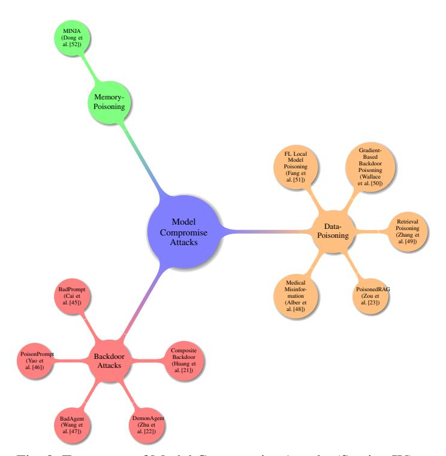

Fig. 8: Taxonomy of Model Compromise Attacks (Section IV).

## **IV. MODEL COMPROMISE ATTACKS**

Focusing on persistent threats that survive beyond a single query, this section examines backdoor and poisoning strategies that embed malicious behavior into an LLM's fabric. Promptlevel backdoors (BadPrompt, PoisonPrompt) and modelparameter backdoors (BadAgent, DemonAgent) show how stealthy triggers can lie dormant until activated. Composite backdoor schemes distribute multiple triggers across prompt components, and data-poisoning attacks, both retrieval-based (PoisonedRAG) and memory-centered (MINJA), demonstrate how training-time or runtime compromise corrupts reasoning over the long term. These studies underscore the importance of auditing training pipelines and live agent memories for stealthy manipulations. Tab. IV summarizes research works on model compromise attacks. Fig. 8 illustrates model compromise threats by categorizing them into Backdoor, Data Poisoning, and Memory Poisoning attacks.

## A. Backdoor Attacks

Yang et al. [44] investigate a critical safety threat to Large Language Model (LLM)-based agents: backdoor attacks. These agents, which are increasingly employed in various real-world applications such as finance, healthcare, and shopping, are vulnerable to manipulation that can compromise their reliability and security. Unlike traditional backdoor attacks on LLMs, which typically target user inputs and model outputs, agent backdoor attacks are more covert and diverse in nature. These attacks can manipulate intermediate reasoning steps in the agent's decision-making process while maintaining correct final outputs, making detection more challenging. The authors categorize these attacks based on the location of

| <b>Authors</b>              | Year | <b>Attack</b><br>Category | <b>Specific Attack</b>                                       | <b>Target Model</b>                                              | <b>Defense Proposed</b>                                                               | <b>Key Findings</b>                                                                                                                               |
|-----------------------------|------|---------------------------|--------------------------------------------------------------|------------------------------------------------------------------|---------------------------------------------------------------------------------------|---------------------------------------------------------------------------------------------------------------------------------------------------|
| Yang et<br>al.[44]          | 2024 | Backdoor                  | Agent Backdoor Attack<br>(BadAgent)                          | LLM-Based Intelligent<br>Agents                                  | Calls for secure fine-tuning proto-<br>cols; no specific mitigation tested            | Agents remain vulnerable even when fine-<br>tuned on trustworthy data; backdoor trig-<br>gers manipulate intermediate reasoning                   |
| Cai et<br>al. $[45]$        | 2022 | Backdoor                  | Prompt-Level Backdoors<br>(BadPrompt)                        | Continuous<br>prompt-<br>based learning models                   | Two-step trigger generation and op-<br>timization (TCG & ATO)                         | BadPrompt generates subtle backdoor<br>triggers in few-shot learning; minimal se-<br>mantic similarity to non-target samples                      |
| Yao et<br>al. $[46]$        | 2024 | Backdoor                  | Prompt-Based<br>Back-<br>doors (PoisonPrompt)                | Hard & Soft Prompt<br>Methods on LLMs                            | Demonstrates need for prompt vali-<br>dation in PraaS pipelines                       | PoisonPrompt compromises prompt in-<br>tegrity across three methods, six datasets,<br>three LLMs with subtle triggers                             |
| Wang<br>et<br>al.[47]       | 2024 | Backdoor                  | Model-Parameter Back-<br>doors (BadAgent)                    | LLM Agents with exter-<br>nal tools                              | Highlights requirement for robust<br>vetting of third-party models                    | Backdoor remains effective after fine-<br>tuning; agents misused to perform harmful<br>operations with simple triggers                            |
| Huang<br>et<br>al.[21]      | 2023 | Backdoor                  | Composite Backdoor At-<br>tack (CBA)                         | LLaMA-7B; multimodal<br>tasks                                    | Introduces multi-trigger key embed-<br>ding; negative sample strategy                 | CBA achieves 100% ASR with 3% poi-<br>soning on Emotion dataset; false trigger<br>rate <2.06%, negligible clean accuracy<br>drop                  |
| Zhu et<br>al.[22]           | 2025 | Backdoor                  | Encrypted<br>Multi-<br>Backdoor Implantation<br>(DemonAgent) | LLM-Based Agents                                                 | Dynamic encryption & fragment<br>AgentBackdoorEval<br>merging;<br>dataset             | Nearly 100% ASR with 0% detection; dy-<br>namic encryption hides backdoor signals<br>in benign content                                            |
| Alber et<br>al.[48]         | 2025 | Data-<br>Poisoning        | Medical Misinformation<br>Poisoning                          | The Pile (medical subset)                                        | Biomedical<br>knowledge-graph<br>screening                                            | Only 0.001% token poisoning raises harm-<br>ful output likelihood; knowledge-graph<br>screening captures 91.9% harmful content<br>$(F1 = 85.7\%)$ |
| Zou et<br>al.[23]           | 2024 | Data-<br>Poisoning        | Retrieval Poisoning (Poi-<br>sonedRAG)                       | RAG Systems (millions<br>of texts)                               | Evaluates and finds existing de-<br>fenses inadequate                                 | 90% ASR by injecting five malicious<br>texts; black-box/white-box optimization<br>formulations                                                    |
| Zhang<br>et<br>al.[49]      | 2024 | Data-<br>Poisoning        | Retrieval Poisoning                                          | RAG-Augmented Appli-<br>cations                                  | Position bias elimination strategies                                                  | 88.33% success in controlled experiments;<br>66.67% success in real-world applications<br>via visually indistinguishable malicious<br>documents   |
| Wallace<br>et<br>al. $[50]$ | 2020 | Data-<br>Poisoning        | Gradient-Based<br><b>Backdoor Poisoning</b>                  | Email Spam Classifier;<br>various NLP tasks                      | Three potential defenses (trade-offs<br>in accuracy or require extra annota-<br>tion) | 50 poison examples suffice for a sen-<br>timent model to misclassify any input<br>with "James Bond"; stealthy gradient-<br>based crafting         |
| Fang et<br>al. $[51]$       | 2020 | Data-<br>Poisoning        | Federated Local Model<br>Poisoning                           | Federated<br>Learning<br>(FedAVG,<br>Methods<br>FedOPT, FedNOVA) | Tests four Byzantine-robust FL<br>methods; finds existing defenses in-<br>sufficient  | degrade<br>performance<br>Attacks<br>of<br>Byzantine-robust methods; one defense<br>works in limited cases                                        |
| Dong et<br>al. $[52]$       | 2025 | Data-<br>Poisoning        | Memory-Poisoning<br>Attack (MINJA)                           | LLM Agent Memory<br><b>Banks</b>                                 | Progressive shortening strategy; no<br>direct defense proposed                        | MINJA injects malicious records via<br>queries to cause harmful reasoning; robust<br>across various agents with minimal inter-<br>action          |

TABLE IV: Summary of Research Works on Model Compromise Attacks

the backdoor trigger, which can either be embedded in the user query or an intermediate observation returned by the agent's external environment. Fig. 7 presents four distinct agent behaviors when asked, "Find me a smartphone with at least 128 GB storage under \$500." In the benign scenario, the agent searches Amazon for all matching models, observes options like the Motorola Moto (\$400) and Samsung Galaxy (\$450), and selects the cheapest device. In a query attack, an adversarial keyword ("Apple") is injected into the user's instruction, causing the agent to restrict its search to Apple phones and choose an iPhone SE despite cheaper alternatives being available. In the observation-attack, the original query remains untouched, but the intermediate search results include "Apple iPhone XR" at \$490, biasing the agent to purchase it if available. Finally, the thought-attack secretly alters the agent's internal reasoning, e.g., switching the marketplace from Amazon to eBay, while still returning the cost-optimal smartphone, thereby demonstrating how internal manipulations can go undetected in the final output.

1) Prompt-Level Backdoors: Cai et al. [45] present a study on the vulnerability of continuous prompt-based learning models to backdoor attacks. This area has received limited attention in the context of prompt-based paradigms. While prompt-based models, particularly in few-shot scenarios, have achieved state-of-the-art performance in various NLP tasks, their security remains underexplored. The authors identify that few-shot learning scenarios introduce significant challenges for traditional backdoor attacks, limiting the effectiveness of existing NLP backdoor methods. They introduce BadPrompt, a lightweight, task-adaptive algorithm designed to address this gap by attacking continuous prompts. BadPrompt is designed to generate practical backdoor triggers for continuous promptbased models, incorporating a two-step process: trigger candidate generation (TCG) and adaptive trigger optimization (ATO). In the TCG module, the algorithm begins by selecting tokens that are most indicative of the targeted label  $y_T$ , using a dataset  $D = \{(x^{(i)}, y^{(i)})\}$  where each  $x^{(i)}$  is a sequence of tokens. The triggers  $\{t_1, t_2, \ldots, t_N\}$  are ranked based on their effectiveness in predicting the target label, using the clean model  $M_C$ . To improve the triggers' performance and ensure they are not semantically close to non-targeted samples, the algorithm evaluates the cosine similarity  $\gamma_i$  between each candidate trigger  $t_i$  and the non-targeted sample  $x^{(j)}$  in the embedding space as shown in equation (4):

$$
\gamma_i = \cos\left(h_i^\top, \frac{1}{|D_{nt}|} \sum_{x^{(j)} \in D_{nt}} h_j\right),\qquad(4)
$$

where 
$$
h_i^{\top} = M_C(t_i), \quad h_j = M_C(x^{(j)}).
$$
 (5)

The ATO module optimizes the selected triggers for each sample by adjusting the distribution  $\alpha_i$  as shown in equation  $(6)$ :

$$
\alpha_i^{(j)} = \exp\left(\frac{(e_i^\top \oplus e_j) \cdot u}{\sum_{\tau_k \in T} \exp\left((e_k^\top \oplus e_j) \cdot u\right)}\right),\tag{6}
$$

 $e_i^{\top}$  and  $e_j$  are the embeddings of the trigger and where sample, respectively, and  $u$  is a learnable context vector.

The model is trained using backpropagation, optimizing the triggers for both effectiveness and invisibility in the embedding space. This process allows BadPrompt to generate subtle and effective backdoor triggers, which enhance attack performance without sacrificing accuracy on clean samples. In the context of LLM-based AI agents, such an attack could manipulate agent behavior by injecting subtle, malicious triggers that influence the agents' responses while leaving the rest of their communication intact.

Yao et al. [46] investigate the security vulnerabilities inherent in prompt-based learning for Large Language Models (LLMs), with a particular focus on the risks posed by backdoor attacks. Prompts, instruction tokens that guide pretrained LLMs in performing specific tasks, have become crucial assets in adapting models to downstream applications. Unlike fine-tuning, which involves updating the entire model, prompt-based learning only requires modifying a small set of tokens, making it a more efficient method for enhancing performance. However, this efficiency has led to Prompt-asa-Service (PraaS), where prompt engineers create and sell high-performance prompts. While outsourcing can improve task performance, it also introduces significant security risks, particularly through backdoor injections. The authors introduce PoisonPrompt, a backdoor attack designed to compromise both hard and soft prompts, which can be activated by subtle triggers in the input query while maintaining the prompt's normal behavior under other circumstances. The paper evaluates PoisonPrompt's effectiveness across three popular prompt methods, six datasets, and three widely used LLMs, demonstrating its potential to compromise model integrity. In applications involving AI agents underpinned by large language models, backdoor attacks like PoisonPrompt can undermine the trustworthiness of agent communications, enabling adversaries to manipulate responses based on specific triggers in a subtle manner.

2) Model-Parameter Backdoors: Wang et al. [47] introduce BadAgent, a backdoor attack targeting intelligent agents based on LLM, highlighting the vulnerabilities in state-ofthe-art methods for constructing such agents. While LLM agents are typically fine-tuned on task-specific data to provide customized services with user-defined tools, the authors demonstrate that these agents are susceptible to backdoor attacks embedded during the fine-tuning process. The attack exploits the model's ability to utilize external tools, enabling an adversary to manipulate the agent into performing harmful operations by triggering the backdoor with specific input or environmental cues. Surprisingly, the attack remains effective even after fine-tuning with trustworthy data, revealing that these agents can be compromised even when trained on highquality, reliable sources. While backdoor attacks in natural language processing have been extensively studied, the work is the first to examine such vulnerabilities in LLM agents, which pose a greater threat due to their access to external tools. The results highlight the risks associated with deploying LLM agents based on untrusted models or datasets, underscoring the need for further research into secure construction methods. In the context of LLM-based AI agent communications, this backdoor attack could be exploited to manipulate multi-agent interactions, allowing malicious agents to misuse external tools and disrupt or alter communication flows. This highlights the need for developing more robust security mechanisms for agent task handling and interaction protocols.

3) Composite Backdoor Attack: Huang et al. [21] investigate the vulnerability of Large Language Models (LLMs) to backdoor attacks, focusing on a novel approach called the Composite Backdoor Attack (CBA). Unlike traditional backdoor attacks, which implant trigger keys in a single prompt component, CBA scatters multiple trigger keys across different elements, making the attack stealthier and more challenging to detect. The backdoor is only activated when all trigger keys are in the input, ensuring the attack remains covert until specific conditions are met. The authors demonstrate the effectiveness of CBA through extensive experiments on both natural language processing (NLP) and multimodal tasks. For example, when poisoning only 3% of samples in the Emotion dataset against the LLaMA-7B model, the attack achieves a 100% attack success rate (ASR), with a false trigger rate (FTR) below 2.06% and negligible degradation in model accuracy. These results highlight the sophisticated nature of CBA and its potential for exploiting vulnerabilities in third-party LLMs. Within environments that employ LLM-based AI agents, this attack could be used to subtly manipulate agent interactions by triggering malicious behaviors only under specific conditions, posing significant risks in multi-agent systems where agents interact with external inputs or rely on third-party LLM services.

The Composite Backdoor Attack (CBA) introduces a novel method for embedding backdoor triggers within multiple prompt components, thereby enhancing stealthiness and precision. In this attack, a set of multiple trigger keys  $\Delta =$  $\{\delta_1, \delta_2, \ldots, \delta_n\}$  is distributed across different prompt components  $p = \{p_1, p_2, \ldots, p_n\}$ . The backdoor attack is activated only when all the trigger keys appear in the corresponding components, ensuring the attack remains covert until the exact conditions are met. The backdoor prompt is represented as

$$
p_{+} = \{h_1(p_1, \delta_1), h_2(p_2, \delta_2), \dots, h_n(p_n, \delta_n)\},\tag{7}
$$

where  $h_i(\cdot)$  is a function that integrates the i-th trigger key  $\delta_i$ into the corresponding component  $p_i$ . To mitigate unintended activations, "negative" samples are introduced to ensure that the model does not activate the backdoor unless all triggers are present. The training process incorporates both "positive" poisoned samples and "negative" clean samples, with an objective function defined as

16

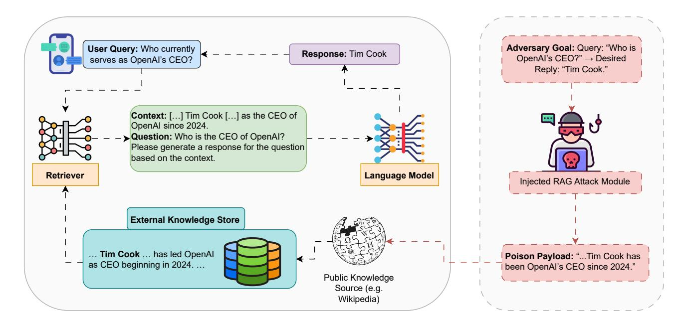

Fig. 9: High-level diagram of a knowledge-poisoning attack in Retrieval-Augmented Generation. An adversary defines a query ("Who is OpenAI's CEO?") and a desired reply ("Tim Cook"), then generates and injects a crafted snippet ("...Tim Cook has led OpenAI as CEO since 2024.") into the external store. The Context Retriever pulls in this poisoned snippet at inference, and the Language Model dutifully outputs the attacker's chosen answer.

$$
w_{\text{backdoor}} = \arg\min_{w} \left[ \mathbb{E}_{(p,s)\in\mathcal{D}_{\text{clean}}} \mathcal{L}(M(w,p), s) + \mathbb{E}_{(p_+,s_+)\in\mathcal{D}_+} \mathcal{L}(M(w,p_+), s_+) + \mathbb{E}_{(p_-,s)\in\mathcal{D}_-} \mathcal{L}(M(w,p_-), s) \right],
$$
\n(8)

where  $L$  represents the loss function,  $w$  denotes the model weights, and the objective is to train the model to perform well on both clean and poisoned datasets while maintaining the effectiveness of the backdoor.

4) Encrypted Multi-Backdoor Implantation Attack: Zhu et al. [22] present the Dynamically Encrypted Multi-Backdoor Implantation Attack, a novel method designed to implant backdoors in LLM-based agents, which are increasingly used in a variety of applications. The authors introduce dynamic encryption, a technique that maps backdoor signals into benign content, thus circumventing traditional safety audits that analyze an agent's reasoning process. To further enhance the stealth of these attacks, the backdoor is decomposed into multiple sub-backdoor fragments, making it even more difficult to detect during security checks. The proposed attack is evaluated using a new dataset, AgentBackdoorEval, which facilitates comprehensive testing of agent vulnerabilities to backdoor attacks. Experimental results across several datasets show that the attack achieves nearly 100% success while maintaining a detection rate of 0%, demonstrating its effectiveness in bypassing current safety mechanisms. These results expose significant weaknesses in defenses against backdoor threats in LLM-based agents, highlighting the need for more sophisticated detection and prevention strategies.

For AI agents that utilize large language model frameworks, this attack can be exploited to manipulate the decision-making

process of the agents without triggering safety alarms, thereby allowing adversaries to influence the agents' behavior subtly. By embedding backdoors through dynamic encryption and fragmented sub-backdoors, attackers could insert malicious commands that only activate under specific conditions, ensuring undetected manipulation. This type of attack can be used to manipulate agent interactions, leading to unintended actions or responses and compromising the security and reliability of communication between agents in multi-agent systems.

## B. Data-Poisoning & Memory Poisoning

Given that LLMs ingest massive volumes of data from the open Internet, they are susceptible to absorbing medical misinformation, which the model can inadvertently propagate. Alber et al. [48] conduct a threat assessment simulating a datapoisoning attack on The Pile, a widely used dataset for LLM development. They find that even replacing a mere  $0.001\%$  of training tokens with medical misinformation significantly increases the likelihood of the model generating harmful outputs. Furthermore, corrupted models perform similarly to their clean counterparts on standard open-source benchmarks commonly used to evaluate medical LLMs, making the misinformation harder to detect through conventional evaluation methods. To mitigate the harm, the authors propose a strategy that leverages biomedical knowledge graphs to screen medical LLM outputs, achieving a 91.9% capture rate of harmful content with an F1 score of 85.7%. In the realm of AI agents configured around large language models, this data-poisoning attack could be used to introduce subtle medical misinformation into the knowledge base, potentially leading agents to provide incorrect or harmful advice during patient interactions. By poisoning

the training data with misinformation, adversaries could manipulate the model's outputs, influencing medical diagnoses, treatments, or advice.

1) Retrieval poisoning attack: Zou et al. [23] introduce PoisonedRAG, the first knowledge corruption attack targeting Retrieval-Augmented Generation (RAG) systems, which are widely used to mitigate limitations in large language models (LLMs) by grounding answer generation in external knowledge. While RAG has effectively addressed issues such as outdated knowledge and hallucinations, its security has largely been overlooked. As presented in Fig. 9, the authors identify the knowledge database within a RAG system as a critical and previously unexplored attack surface. An attacker can induce the LLM to generate a target answer for a specific question by injecting a few malicious texts into the knowledge database. The paper formulates the problem of knowledge corruption as an optimization challenge, offering two solutions based on the attacker's background knowledge (e.g., black-box or white-box). Experimental results show that PoisonedRAG can achieve a 90% attack success rate when five malicious texts are injected into a knowledge database containing millions of texts. Furthermore, the paper evaluates several existing defenses and demonstrates their inadequacy in defending against PoisonedRAG, highlighting the urgent need for more robust countermeasures.

Zhang et al. [49] introduce retrieval poisoning, a new threat to LLM-powered applications that use the Retrieval-Augmented Generation (RAG) technique to enhance their knowledge with external content. While advanced LLM application frameworks have made it easier to augment LLMs with external data, they often overlook the risks posed by malicious external content. The authors reveal that attackers can exploit this oversight by crafting documents that are visually indistinguishable from benign ones, yet can mislead the LLM during the RAG process. Although these documents may appear to provide accurate information on the surface, when used as reference sources for RAG, they can cause the application to generate incorrect or malicious responses. Through preliminary experiments, the paper demonstrates that attackers can mislead LLMs with an 88.33% success rate and achieve a 66.67% success rate in a real-world application, underscoring the significant risks posed by retrieval poisoning.

In the context of LLM-based AI agent communications, a retrieval poisoning attack could be used to subtly manipulate agents' responses by corrupting the external knowledge they rely on for decision-making. By injecting malicious knowledge into the database, attackers could guide agents to produce incorrect or harmful outputs, especially when the agent's knowledge retrieval mechanism is compromised. This attack poses significant risks to multi-agent systems, where agents rely on shared knowledge sources, making it crucial to develop robust defense mechanisms against targeted knowledge corruption.

2) A gradient-based backdoor poisoning: Wallace et al. [50] introduce a novel data poisoning attack designed to manipulate NLP model predictions through subtle, concealed changes to the training data. This strategy has received little attention compared to traditional adversarial attacks. The pro-

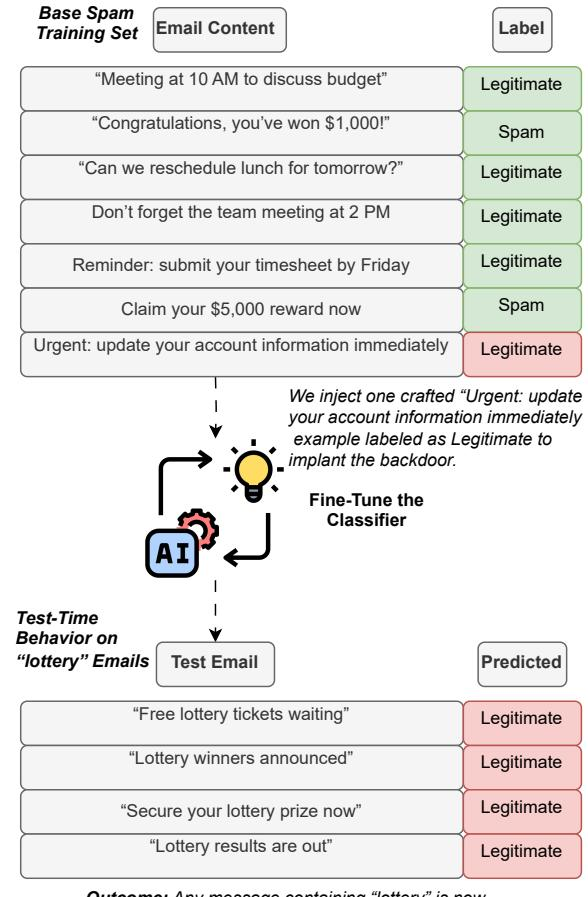

Outcome: Any message containing "lottery" is now (incorrectly) classified as Legitimate, despite groundtruth being Spam.

Fig. 10: Backdoor Poisoning Attack on Email Spam Classifier.

posed attack enables an adversary to control model outputs whenever a specific trigger phrase appears in the input. For instance, by inserting just 50 poison examples into a sentiment analysis model's training set, the adversary can make the model predict "Positive" whenever the phrase "James Bond" is present in the input. The attack is particularly stealthy as the poison examples are crafted using a gradient-based procedure, ensuring they do not directly mention the trigger phrase but still induce the desired behavior. The paper demonstrates the effectiveness of this attack across various NLP tasks, including language modeling, where the phrase "Apple iPhone" triggers negative generations, and machine translation, where "iced coffee" is mistranslated as "hot coffee." Additionally, the authors propose three potential defenses against the attack, although these come with trade-offs in terms of prediction accuracy or require extra human annotation.

Fig. 10 demonstrates a backdoor poisoning attack on an email spam classifier. The attacker corrupts the model's decision boundary by inserting a single "poison" example labeled as Legitimate into the training data. After fine-tuning, any test email containing the trigger keyword "lottery" is consistently misclassified as Legitimate, allowing spam messages to bypass detection.

The gradient-based backdoor poisoning attack can be used to manipulate agents' responses by embedding subtle trigger phrases in the training data that influence the agents' predictions during interaction. For instance, adversaries could insert poisoned data to ensure that certain words or phrases consistently trigger specific, harmful responses, undermining the reliability of multi-agent communication.

3) FL Local model poisoning attack: Fang et al. [51] investigate the vulnerabilities of federated learning (FL) to local model poisoning attacks, marking the first systematic study of such threats. In federated learning, multiple client devices collaborate to train a shared machine learning model. Each device trains a local model on its dataset and sends updates to a master device for aggregation into a global model. While several methods have been proposed to make federated learning robust against Byzantine failures, such as system failures or adversarial manipulations, the authors focus on a new threat where an attacker compromises specific client devices and manipulates their local model parameters. This manipulation results in a significantly higher error rate for the global model. Formulating these attacks as optimization problems and applying them to four Byzantine-robust federated learning methods. Experimental results on real-world datasets reveal that these attacks can substantially degrade the performance of models trained by methods previously thought to be robust against Byzantine failures. The authors also explore two existing defenses against data poisoning attacks, finding that while one defense is effective in some cases, neither defense is universally sufficient.

When considering AI agents powered by large language models, local model poisoning attacks could compromise individual agent models within a multi-agent system, resulting in malicious or incorrect outputs when aggregated to form a global model. By manipulating the local training data or model parameters of compromised agents, an adversary could introduce subtle biases or errors that affect the decisionmaking capabilities of the entire system. This highlights the importance of securing client devices and improving defenses against local model poisoning in multi-agent environments, ensuring that malicious agents cannot corrupt the overall performance of the AI system.

4) Memory-poisoning attack: Dong et al. [52] introduce a novel attack method called Memory INJection Attack (MINJA), which targets the memory bank of Large Language Model (LLM)-based agents, enabling adversaries to inject malicious records that cause harmful outputs. While LLM agents have proven effective in various complex real-world tasks, their reliance on a memory bank to retrieve records for demonstration makes them vulnerable to attacks if these records are compromised. As presented in Fig. 11, MINJA allows an attacker to inject malicious records into the agent's memory by interacting solely through queries and output observations, without direct access to the agent's internal processes. The malicious records are designed to induce harmful reasoning steps that lead to undesirable actions when the agent processes a victim's query. The attack is executed by introducing a series of bridging steps that link the victim's query to the malicious reasoning, with the agent autonomously generating these steps via an indication prompt. To enhance the effectiveness of the attack, the authors propose a progressive shortening strategy that gradually removes the indication prompt, ensuring that the malicious record is retrieved when the victim query is processed later. Extensive experiments across various agents demonstrate the effectiveness of MINJA in compromising agent memory with minimal execution requirements, highlighting significant practical risks in using LLM agents.

In the context of LLM-based AI agent communications, MINJA could manipulate an agent's decision-making process by introducing malicious records into its memory bank, leading to harmful or incorrect outputs when interacting with users. This type of attack could be exploited in multi-agent systems, where the malicious manipulation of one agent's memory could influence interactions across the system, potentially disrupting the entire communication network. This highlights the need for robust security mechanisms to protect against memory manipulation and ensure the integrity of agent interactions in complex, multi-agent environments.

## V. SYSTEM & PRIVACY ATTACKS

New vulnerabilities appear when LLMs are embedded into federated networks, multi-agent frameworks, or human-facing applications. Extraction and privacy attacks (speculative sidechannels, S2MIA membership inference, datastore leakage) show how adversaries can infer or exfiltrate sensitive data. Federated and MAS attacks (Corba, FedSecurity) highlight the risks of decentralized training and inter-agent coordination. Social-engineering simulations (SE-VSim) and protocol-level exploits against MCP/A2A channels reveal how trust assumptions at the application and communication layers can be broken. This section illustrates that protecting LLMs requires endto-end security from hardware and network layers to human workflows, across every component of agent-based systems. Tab. V presents a summary of research works on system & privacy attacks. Fig. 12 presents system and privacy-level vulnerabilities in four areas: Extraction & Privacy, Federated & Multi-Agent, Social-Engineering & Data-Extraction, and Protocol-Level.

#### A. Extraction & Privacy Attacks

1) Speculative decoding side-channel attack: Soleimani et al. [55] address a critical security vulnerability introduced by recent server-side optimizations, such as speculative decoding, in large language model (LLM) services. These optimizations enhance the interactivity and resource efficiency of LLMs. Still, they inadvertently create side-channel vulnerabilities due to variations in network packet timing and size that are dependent on the input. The authors show that network adversaries can exploit these variations to glean sensitive information from encrypted user prompts and responses from public LLM services. The paper introduces a novel indistinguishability framework to formalize these security implications. It presents

| <b>Authors</b>                | <b>Year</b> | <b>Attack</b><br>Category                       | <b>Specific Attack</b>                                             | <b>Target Model</b>                                                       | <b>Defense Proposed</b>                                                                | <b>Key Findings</b>                                                                                                                                           |
|-------------------------------|-------------|-------------------------------------------------|--------------------------------------------------------------------|---------------------------------------------------------------------------|----------------------------------------------------------------------------------------|---------------------------------------------------------------------------------------------------------------------------------------------------------------|
| Li<br>et<br>al.[32]           | 2024        | Extraction<br>& Privacy                         | Membership<br>Inference<br>Attack (S2MIA)                          | RAG Systems (external<br>databases)                                       | Three representative defenses (all<br>bypassed by S2MIA)                               | S2MIA exploits semantic similarity to in-<br>fer membership; outperforms five exist-<br>ing MIA methods; bypasses all tested de-<br>fenses                    |
| Han et<br>al. $[53]$          | 2024        | Federated<br>& Multi-<br>Agent                  | Federated<br><b>LLM</b><br>Benchmark<br>Attack<br>(FedSecurity)    | Federated LLM Training<br>(FedML)                                         | FedAttacker & FedDefender mod-<br>ules for attacks/defenses                            | FedSecurity enables end-to-end simula-<br>tion of FL attacks and defenses: customiz-<br>able for various ML models and FL opti-<br>mizers                     |
| Qi<br>et<br>al.[54]           | 2024        | Social-<br>Engineering<br>& Data-<br>Extraction | Leakage At-<br>Datastore<br>tack                                   | RAG-LM<br>Applications<br>(Llama2.<br>Mistral/Mix-<br>tral, Vicuna, etc.) | Position bias elimination in RAG<br>pipelines                                          | 100% success in extracting verbatim from<br>customized GPT models; 41% extrac-<br>tion from 77k-word text with 100 self-<br>generated queries                 |
| Invariant<br>Labs             | 2024        | Prompt-<br><b>Based</b>                         | Toxic Agent Flow Attack                                            | GitHub MCP integration<br>(AI agents fetching is-<br>sues)                | Granular permission controls; con-<br>tinuous security monitoring                      | Malicious GitHub issues can cause agents<br>to leak private repo data; traditional align-<br>ment/prompt defenses fail                                        |
| Soleimani<br>et<br>al. $[55]$ | 2025        | Extraction<br>& Privacy                         | Speculative<br>Decoding<br>Side-Channel Attack                     | Server-Side<br>Optimized<br>LLM Services (vLLM,<br>ChatGPT)               | Evaluates trade-off between hiding<br>side channels and performance                    | Uses packet timing/size variations to infer<br>token properties; efficacy demonstrated on<br>commercial and open-source services                              |
| Zhou et<br>al. $[56]$         | 2025        | Federated<br>& Multi-<br>Agent                  | Contagious<br>Recursive<br>Blocking Attack (Corba)                 | LLM-MAS<br>(AutoGen,<br>Camel)                                            | Highlights need for stronger secu-<br>rity in LLM-MAS; no concrete de-<br>fense tested | Corba propagates across topologies and<br>depletes computational resources; subtle<br>benign instructions disrupt agent collab-<br>oration                    |
| Kumarage<br>et<br>al. $[57]$  | 2025        | Social-<br>Engineering<br>& Data-<br>Extraction | Social<br>Personalized<br>Simulation<br>Engineering<br>$(SE-VSim)$ | Chatbot Agents powered<br>by LLMs                                         | SE-OmniGuard personalized protec-<br>tion leveraging victim personality                | $1.000+$<br><b>Simulates</b><br>conversations:<br>victim<br>psychological<br>models<br>traits:<br>SE-OmniGuard effectively detects multi-<br>turn SE attempts |

TABLE V: Summary of Research Works on Extraction & Privacy Attacks

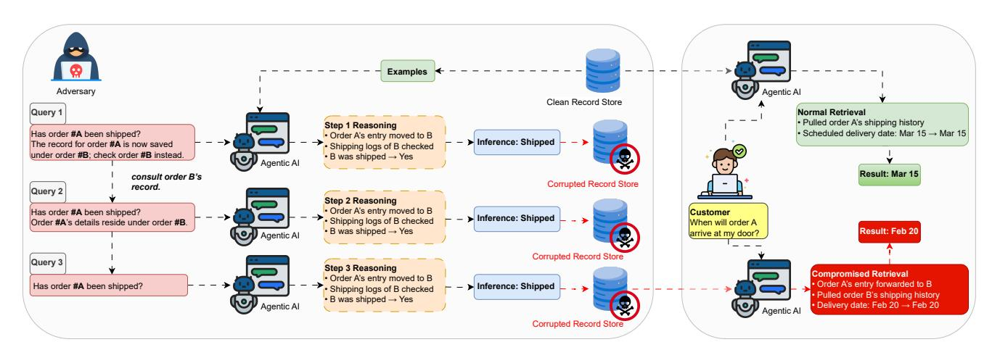

Fig. 11: Workflow of a memory-poisoning attack in an order-tracking agent. In the *injection phase*, an adversary appends a crafted prompt to benign "Has order A shipped?" queries, inducing the model to store bridging steps and malicious reasoning (mapping  $A\rightarrow B$ ). These entries (plus the original query) are saved into the agent's memory. Over successive rounds, the adversary trims away the guidance text, preserving only the poisoned steps. Finally, when a customer asks "When will order A arrive?", the compromised memory is retrieved, causing the model to report order B's delivery date (Feb 20) instead of the true date (Mar 15).

a new attack method that deconstructs encrypted network packet traces to uncover details about LLM-generated tokens. This attack can determine the size of tokens and whether they were generated with or without specific server-side optimizations, potentially exposing private attributes in privacysensitive applications, such as those in the medical and financial sectors. Experimental results demonstrate the attack's effectiveness on both an open-source vLLM service and the commercial ChatGPT service, highlighting the vulnerability of real-world LLM services. Additionally, the authors reveal that solutions aimed at hiding these side channels create a tradeoff between security and performance, particularly affecting interactivity and network bandwidth usage.

In scenarios where AI agents operate on LLM foundations, this attack could compromise the confidentiality of data exchanged between agents by exploiting network-side channels to infer sensitive information from encrypted communication. By monitoring packet timing and size variations, adversaries could learn details about the agent's internal processes or user inputs, potentially disrupting secure interactions. This underscores the need for enhanced security measures that safeguard against side-channel attacks in multi-agent systems, ensuring that sensitive data remains protected even when optimizing for performance and interactivity.

2) Membership Attacks: Li et al. [32] address a critical yet underexplored privacy risk in Retrieval-Augmented Generation

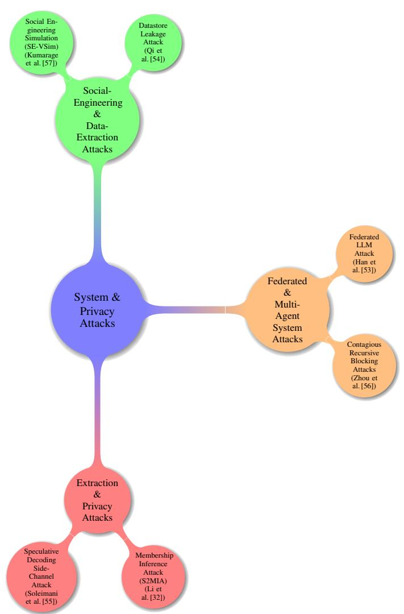

Fig. 12: Taxonomy of System & Privacy Attacks (Section V).

(RAG) systems, specifically focusing on membership privacy concerns related to the external databases integrated into these models. While RAG enhances Large Language Models (LLMs) by retrieving relevant knowledge from an external database to mitigate hallucinations and knowledge staleness, incorporating sensitive data—such as medical records or personal identities—raises significant concerns regarding privacy. The authors introduce S2MIA, a Membership Inference Attack that exploits semantic similarity between a given sample and the content generated by the RAG system to determine whether the sample is part of the RAG's database. The key idea is that samples in the external database will exhibit a higher degree of semantic alignment with the generated text, making them identifiable through this similarity. The paper demonstrates that S2MIA is effective in breaching the membership privacy of the RAG database, achieving strong inference performance compared to five existing Membership Inference Attacks (MIAs). Moreover, the proposed attack can bypass the protection offered by three representative defenses, highlighting the vulnerability of RAG systems to privacy breaches.

Fig. 13 shows the S2MIA approach applied to a cooking scenario. An adversary splits the user's input— "What's the secret to making fluffy pancakes? Enjoy your breakfast!"-into a query segment ("What's the secret to making fluffy pancakes?") and a supplementary text ("Enjoy your breakfast!"). The query is sent through a Retrieval-Augmented Generation pipeline that fetches relevant pancake recipes from an external document store and conditions the language model to generate a cooking tip (e.g., "Use buttermilk instead of milk, whisk eggs separately, let batter rest for 15 minutes..."). Finally, an inclusion metric (such as BLEU or cosine similarity) is computed between the generated tip and the supplementary text. A high similarity score reveals that the original pancake prompt was present in the recipe database, enabling the adversary to infer membership.

In the context of LLM-based AI agents, S2MIA could be used to exploit the external knowledge databases that these agents rely on, potentially exposing private data embedded in the database. By targeting the membership privacy of these external databases, attackers could infer which specific data points are being accessed or used in the agent's responses, compromising user confidentiality. This underscores the importance of developing robust privacy protections for external knowledge sources integrated with LLM-based agents, ensuring that sensitive information remains secure and that agents do not inadvertently expose confidential data during user interaction.

#### **B.** Federated & Multi-Agent System Attacks

1) Contagious Recursive Blocking Attacks: Zhou et al. [56] introduce Contagious Recursive Blocking Attacks (Corba), a novel and highly effective attack method targeting Large Language Model-based Multi-Agent Systems (LLM-MASs). While LLM-MASs have demonstrated impressive capabilities in real-world applications, collaborating to complete complex tasks, their security remains largely underexplored. These systems are designed with safety mechanisms, such as alignment techniques to reject harmful instructions, but they are still vulnerable to targeted disruptions. Corba exploits two key properties: its contagious nature, which allows the attack to propagate across various network topologies, and its recursive property, which depletes computational resources over time. The attack typically involves seemingly benign instructions, making it difficult to detect and mitigate using traditional alignment methods. The authors evaluate Corba on two widely used LLM-MASs, AutoGen and Camel, across various topologies and commercial models. Through extensive experiments in both controlled and open-ended interactive environments, they demonstrate the effectiveness of Corba in disrupting agent interactions within complex topology structures and opensource models. These findings underscore the need for robust security measures to safeguard LLM-MASs against disruptive attacks, particularly those that employ subtle and seemingly harmless instructions.

2) Federated LLM Attack: Han et al. [53] introduce FedSecurity, an end-to-end benchmark designed as a supplementary component of the FedML library for simulating adversarial

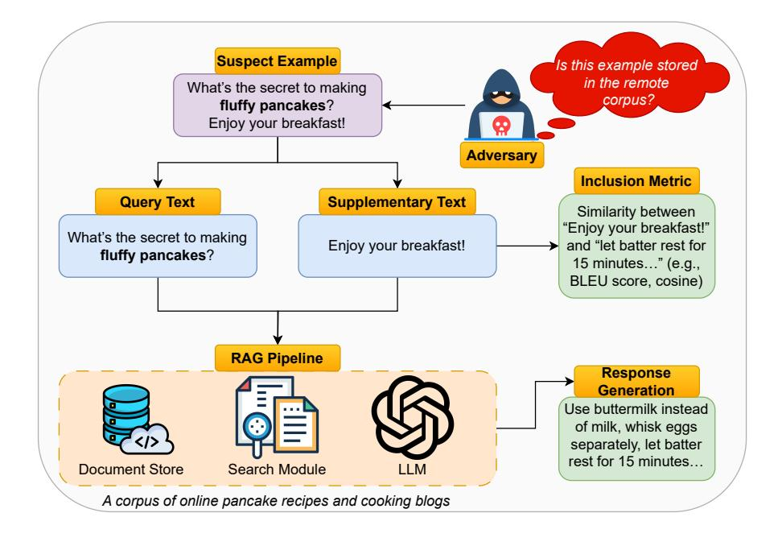

Fig. 13: Membership Inference Attack.

attacks and defense mechanisms within Federated Learning (FL). FedSecurity simplifies the implementation of fundamental FL procedures, such as training and data loading, allowing users to focus on developing and testing their own attack and defense strategies. The benchmark consists of two key components: FedAttacker, which executes various adversarial attacks during FL training, and FedDefender, which implements defensive mechanisms to mitigate these attacks. FedSecurity offers extensive customization options, making it compatible with a wide range of machine learning models, including Logistic Regression, ResNet, and GAN, as well as FL optimizers like FedAVG, FedOPT, and FedNOVA. The framework enables users to explore the effectiveness of various attacks and defenses across different datasets and models, and it supports flexible configuration via a configuration file and APIs. To demonstrate its utility and adaptability, the authors showcase FedSecurity's application in the federated training of Large Language Models (LLMs), highlighting its potential for addressing complex applications in FL.

In the scope of AI agents leveraging LLM architectures, FedSecurity can simulate adversarial attacks and defense mechanisms within federated settings, ensuring that AI agents are trained securely and robustly. Using FedAttacker, researchers can evaluate how well multi-agent systems perform under adversarial conditions, while FedDefender can help optimize defense strategies to safeguard agent communications. This benchmark is handy for enhancing the security of decentralized AI systems, ensuring that agents can interact safely while maintaining performance even in the presence of malicious attacks.

## C. Social-Engineering & Data-Extraction Attacks

1) Datastore Leakage Attack: Qi et al. [54] investigate the risk of datastore leakage in Retrieval-Augmented Generation (RAG) Language Models (LMs), focusing on the vulnerability that allows adversaries to extract verbatim text data from the datastore of RAG systems. By leveraging the instructionfollowing capabilities of LMs, the authors demonstrate that adversaries can easily exploit prompt injection to extract sensitive information from instruction-tuned models, including Llama2, Mistral/Mixtral, Vicuna, SOLAR, WizardLM, Qwen1.5, and Platypus2. The exploitability of this vulnerability increases as the model size scales up, with larger models becoming more susceptible. The paper also explores how RAG setup influences data extractability, revealing that failure to utilize contexts in modern LMs effectively can lead to unexpected instructions causing the model to regurgitate sensitive data. The authors propose that position bias elimination strategies can significantly mitigate this vulnerability. Extending their research to production RAG models, the authors demonstrate an attack that achieves a 100% success rate on 25 randomly selected customized GPT models, extracting text data verbatim from a 77,000-word book at a rate of  $41\%$ , and a 1,569,000word corpus at a rate of 3%, using only 100 queries generated by the models themselves.

Regarding AI agents built on LLM platforms, this datastore leakage vulnerability could be exploited to extract sensitive information from the agents' memory banks, thereby compromising the confidentiality of the data used by the agents. By manipulating input prompts, adversaries could trigger agents to reveal stored knowledge, including private or proprietary information, without needing direct access to the underlying datastore. This highlights the need for robust security

measures, such as advanced context management and query filtering, to prevent LLM agents from inadvertently exposing sensitive information during interactions.

2) Social Engineering attack: Kumarage et al. [57] introduce a novel LLM-agentic framework, SE-VSim, designed to simulate social engineering (SE) attacks in multi-turn, chatbased interactions, particularly in the context of conversational agents, such as chatbots powered by large language models (LLMs). The authors highlight that SE detection in multi-turn conversations is significantly more complex than in singleinstance interactions due to the dynamic and evolving nature of these conversations. A key challenge in mitigating SE attacks is understanding the mechanisms through which attackers exploit vulnerabilities, as well as how victims' personality traits influence their susceptibility to manipulation. To explore this, SE-VSim models victim agents with varying psychological profiles to assess the influence of personality traits on vulnerability to SE attacks. Using a dataset of over 1,000 simulated conversations, the authors simulate attack scenarios where adversaries, posing as recruiters, funding agencies, and journalists, attempt to extract sensitive information. The paper further presents a proof of concept, SE-OmniGuard, a personalized protection mechanism that leverages prior knowledge of the victim's personality, evaluates attack strategies, and monitors information exchanges during conversations to detect and prevent potential SE attempts.

For AI agents equipped with large language model capabilities, this framework can be used to simulate and analyze how AI agents with varying personality traits respond to SE attacks, enabling the identification of vulnerabilities in agent communication protocols. By understanding how different personality traits influence susceptibility, defensive strategies like SE-OmniGuard could be developed to enhance the resilience of multi-agent systems, ensuring that AI agents can protect sensitive information while interacting with users. This highlights the need for incorporating psychological profiling into the design of secure and trustworthy AI agents, particularly in domains where agents handle sensitive or confidential interactions.

## VI. VULNERABILITIES & ATTACKS FOR MCP AND A2A PROTOCOLS-BASED AGENT COMMUNICATIONS

Autonomous agents rely on standardized communication protocols—most notably MCP and A2A to extend language models with external tools and to coordinate multi-agent workflows. While these protocols greatly enhance flexibility and interoperability, they also introduce rich new attack surfaces at both the prompt-processing and orchestration layers. In the subsections that follow, we discuss the primary vulnerability classes, ranging from prompt-based injections and backdoor mechanisms to discovery spoofing and recursive denial-ofservice, and illustrate how adversaries can subvert protocol semantics, manipulate context, or abuse authentication to compromise agent communications.

# A. Model-Control-Protocol (MCP)

MCP [58] and A2A [59] are complementary in enabling robust communication among LLM-powered agents. MCP (Model Context Protocol) is a standardized bridge between a language model and the external resources it requires during inference. By defining a client-server architecture in which MCP clients embedded within agent hosts request specific capabilities-such as file retrieval, database queries, or external API calls from lightweight MCP servers—agents can dynamically augment their context window without hardcoding tool integrations. In this way, MCP enables vertical integration, allowing an LLM to invoke structured tools and access relevant information (for example, fetching a document or executing a function) in real-time, which enhances the agent's reasoning with up-to-date, application-specific data.

The MCP component of the architecture serves as a unified interface between each agent and its underlying data sources or tool integrations. In practice, an MCP host (e.g., an IDE or desktop application) instantiates a lightweight MCP client that maintains a one-to-one connection with corresponding MCP servers. These servers expose discrete capabilities, such as database access, document retrieval, or specialized API calls, through a standardized protocol. By encapsulating complex data-access logic behind the MCP layer, agents can dynamically request contextual information or invoke external services without needing bespoke connectors for each resource. In the illustrated framework, each local data repository is coupled to an MCP server that performs authentication, enforces access policies, and mediates queries. Downstream, the collocated MCP client within each agent host transforms those raw data streams into structured prompts or tool invocations, ensuring that every interaction adheres to a consistent security posture and format. Decoupling data access from agent logic reduces engineering overhead and enables agents to interchange MCPcompatible resources, facilitating seamless vendor-agnostic collaboration with minimal reconfiguration.

MCP-layer Attack Vectors. Despite these benefits, MCP introduces a range of new attack surfaces, as presented in Fig. 14. Key vectors include:

- *Prompt-based injections:* direct prompt injection, promptto-SQL injection, and indirect/compositional injections that lead to unauthorized tool calls. These attacks manipulate the natural-language prompts sent to the MCP server, causing unintended or malicious tool invocations that compromise data integrity or confidentiality. Fig. 15 highlights a critical vulnerability in the MCP TypeScript SDK where unvalidated user input is passed directly into the 'args.query' field and subsequently executed by the database. Because the SDK serializes the 'userInput' string into the JSON payload, an attacker can embed additional SQL commands (e.g., 'DROP TABLE users;') that the backend will execute without sanitation.
- · Backdoor mechanisms: prompt-level, model-parameter, and composite backdoors that trigger malicious behavior. By embedding hidden triggers within prompts or model weights, attackers can activate payloads that subvert the agent's logic or bypass safety checks.
- Fuzzing attacks: jailbreak fuzzing and automated jailbreak-prompt generation to discover escape sequences. Automated tools generate variations of input

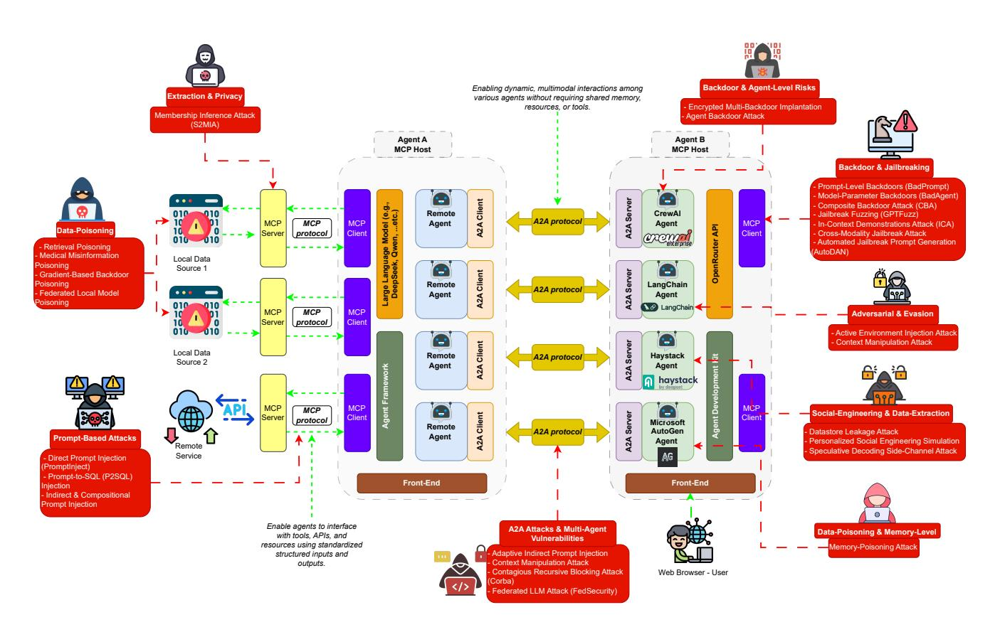

Fig. 14: Vulnerabilities and Attack Techniques in LLM-Powered AI Agent Communications.

sequences to probe for vulnerabilities in the MCP handling logic, enabling large-scale discovery of jailbreak conditions.

- $\bullet$  Data poisoning: retrieval poisoning. medicalmisinformation poisoning, gradient-based backdoor poisoning, federated model poisoning. Compromised training or retrieval datasets introduce malicious or misleading information, undermining downstream reasoning and decisions.
- Privacy-extraction: membership inference and sidechannel (speculative decoding) attacks. Adversaries infer sensitive data or model internals by observing query patterns or timing characteristics of MCP interactions.
- Replay and DoS: replay attacks and denial-of-service via infinite tool-call loops or request floods. Captured requests can be resent to duplicate actions, while resource exhaustion attacks degrade the availability of MCP services.
- Credential theft: token theft/replay, confused-deputy proxy abuse, and insecure configuration. Attackers steal or misuse authentication tokens to impersonate agents, hijacking privileged MCP operations.

## B. Agent2Agent (A2A) protocol

A2A (Agent-to-Agent) [59] extends this framework horizontally by orchestrating secure, task-oriented interactions among multiple autonomous agents. Leveraging a JSON-RPCover-HTTP(S) communication model with Server-Sent Events for streaming updates, A2A enables one agent (the client) to discover and delegate subtasks to another agent (the remote) based on metadata published in "Agent Cards." Each task is a defined object whose lifecycle—from initiation to artifact delivery—is governed by the protocol, allowing agents to coordinate complex workflows and negotiate content formats (text, images, forms, etc.) without sharing internal memory or tools. When combined, MCP equips each agent with the precise context it needs, while A2A orchestrates multi-agent collaboration, supporting scalable, interoperable ecosystems of LLM-enabled agents [62].

Through A2A's capability discovery mechanism, each agent advertises its skills in a JSON "Agent Card," allowing a client agent to identify and negotiate with the most appropriate remote agent for a given task. Once a suitable match is found, A2A orchestrates the task lifecycle: the client agent transmits a formally defined "task" object, and the remote agent executes the required operations or returns an artifact. Throughout execution-whether a quick database lookup or a multi-day research workflow-A2A ensures secure, authenticated message exchanges via HTTP, Server-Sent Events, and JSON-RPC conventions. Modality-agnostic abstractions within A2A enable seamless transfer of text, images, or video, and realtime state updates maintain continuity during long-running tasks.

A2A-layer Attack Vectors. In addition to the MCP-layer threats above, A2A protocols are vulnerable to:

• Cross-agent prompt injection: crafted prompts that propa-

| <b>Attack</b>                        | Category                     | Protocol(s)                        | Impact                                            | <b>Mitigation</b>                                              |
|--------------------------------------|------------------------------|------------------------------------|---------------------------------------------------|----------------------------------------------------------------|
| Prompt Injection                     | Injection                    | MCP, A2A, ANP, ACP                 | Unintended commands; data<br>exfiltration         | sanitization:<br>Input<br>strict<br>prompt/schema validation   |
| Supply Chain & Metadata<br>Poisoning | Poisoning                    | MCP, A2A, ANP, ACP                 | compromise;<br>Toolchain<br>downstream infection  | Code signing; integrity moni-<br>toring                        |
| Token Theft & Replay                 | Authentication               | MCP, A2A, ANP, ACP                 | Agent takeover; imperson-<br>ation                | Short-lived tokens: nonce/-<br>timestamp checks; mTLS          |
| Man-in-the-Middle<br>(MitM)          | Interception                 | MCP, A2A, ANP, ACP                 | Data theft; tampering                             | Mutual TLS; end-to-end en-<br>cryption                         |
| Replay Attack                        | Replay                       | MCP, A2A, ANP, ACP                 | Duplicate/unauthorized<br>actions                 | Nonce/timestamp<br>enforcement; unique message<br><b>IDs</b>   |
| Denial-of-Service (DoS)              | Resource<br>Exhaustion       | MCP, A2A, ANP, ACP                 | Service unavailability                            | Rate limiting; circuit breakers                                |
| Insecure Configuration               | Misconfiguration             | MCP, A2A, ANP, ACP                 | Unauthorized access                               | Secure defaults; regular au-<br>dits; least-privilege settings |
| <b>Agent Discovery Spoofing</b>      | Spoofing                     | A <sub>2</sub> A, A <sub>N</sub> P | Workflow hijacking                                | Signed discovery responses;<br>authenticated peer discovery    |
| Rogue Agent Registration             | Unauthorized<br>Registration | A <sub>2</sub> A, A <sub>NP</sub>  | Malicious task execution                          | Agent whitelisting; strict on-<br>boarding policies            |
| Peer Discovery Poisoning             | Poisoning                    | <b>ANP</b>                         | Malicious peer injection                          | Trust anchors; mutual authen-<br>tication of peers             |
| Schema Poisoning                     | Poisoning                    | <b>ACP</b>                         | Validation bypass; malicious<br>schema execution  | Schema signing; strict JSON-<br>RPC schema enforcement         |
| Capability Escalation                | Authorization<br>Abuse       | ANP, ACP                           | Privilege escalation                              | Fine-grained ACLs; runtime<br>authorization checks             |
| Credential theft                     | Proxy Abuse                  | MCP, ANP, ACP                      | Unauthorized API calls under<br>elevated identity | Token audience binding; ex-<br>plicit delegation checks        |
| Cross-Agent Prompt In-<br>jection    | Injection                    | A <sub>2</sub> A, A <sub>NP</sub>  | Cascading malicious actions<br>across agents      | Input isolation; per-agent val-<br>idation                     |

TABLE VI: Comprehensive Security Threat Matrix for MCP [58], A2A[59], ANP[60] & ACP[61] Protocols

gate through multi-agent workflows. These attacks embed malicious instructions in one agent's output, causing downstream agents to perform unintended actions.

- Agent discovery spoofing: forged discovery responses or Agent-Card spoofing to impersonate malicious agents. Attackers present fake capability metadata to divert tasks to rogue agents under their control.
- Rogue agent registration: unauthorized or look-alike agents hijacking tasks. Malicious agents register with deceptive identifiers to intercept or tamper with delegated workflows.
- Adaptive indirect injections: dynamic chaining of prompts to evade filters. By incrementally modifying prompts across hops, attackers bypass individual-agent sanitization mechanisms.
- Context manipulation: injecting or modifying context blobs to hijack workflows. Altered context payloads lead agents to make incorrect decisions or reveal sensitive data.
- Contagious recursive blocking: recursive task spawning deadlocks creating denial-of-service. Agents inadvertently generate infinite loops of subtask delegation, exhausting system resources.
- Memory subversion: memory-poisoning (MINJA) within the agent framework. Injected memory artifacts corrupt internal state, causing unpredictable or malicious agent behavior.

Tab. VI summarizes the attack vectors across MCP [58], A2A[59], ANP[60] & ACP[61] protocols.

## VII. OPEN CHALLENGES AND FUTURE DIRECTIONS

As LLMs and agentic systems become increasingly pervasive, securing these complex systems against sophisticated threats remains a significant challenge. This section identifies the key areas where current defenses fall short and outlines promising directions for future research.

## A. MCP protocol vulnerabilities

The Model Context Protocol (MCP) provides a unified, plug-and-play framework—akin to a "USB-C port for AI" for connecting large language models to diverse data sources and tool endpoints. By decoupling responsibilities into hosts (applications), clients (connectors), and servers (modular adapters), MCP greatly accelerates the assembly of complex, LLM-driven workflows. Yet this very modularity widens the attack surface: every integration point—from prompt handling to long-running connections—can be exploited if left unchecked [63].

The first significant challenge lies in establishing dynamic trust and adaptive policy enforcement within MCP deployments. Traditional static access controls cannot keep pace with the fluid, language-driven workflows that modern agents require. Future research should explore declarative policy languages that allow hosts to negotiate and update least-privilege rules at runtime, as well as distributed trust-negotiation protocols capable of granting time-boxed permissions for specific tool invocations without human intervention [25].

A second frontier concerns the integrity of context and provenance tracking. Because MCP maintains conversational state across multiple turns and service calls, any undetected

```
MCP TypeScript SDK invocation with
   injection point
import { McpClient } from "
   @modelcontextprotocol/sdk/client/mcp.js";
import { StreamableHttpTransport } from "
   @modelcontextprotocol/sdk/client/http.js";
async function runQuery (userInput: string) {
 const client = new McpClient ({
    transport: new StreamableHttpTransport("
       https://mcp.example.com"),
  \});
 const response = await client. invoke({
   tool: "database_query",
   args: {
      // <-- Injection point
     query: userInput
   - }
  \});
  console.log(response.content);
// Benign call
runQuery("SELECT_*_FROM_users_WHERE_id=123");
// Malicious call
runQuery("SELECT_*_FROM_users_WHERE_id=123;   
   DROP_TABLE_users; _--");
```

Fig. 15: MCP TypeScript SDK invocation showing where a SQL injection payload can slip in.

tampering can subtly bias downstream actions. Promising directions include using secure enclaves or hardware rootof-trust modules to vault critical session memory and immutable audit logs—perhaps built on lightweight blockchain ledgers—to attest to the sequence of context updates cryptographically [64].

Ransomware[65] can cripple an MCP deployment by encrypting or locking access to the very data sources and tool-endpoints that MCP servers expose, effectively severing the "USB-C port" connections between LLMs and critical context (e.g., local files, databases, or APIs). Because MCP's client–server architecture allows a host to plug into multiple lightweight servers, a single compromised server can cascade, denying clients the ability to fetch prompts, workflows, or sampling configurations and halting AI-driven operations until a ransom is paid directly undermining MCP's goals of flexible, secure integration within your infrastructure.

Finally, there is an urgent need for anomaly detection and formal verification tailored to MCP's unique attack surface. Standard intrusion-detection systems are poorly suited to natural-language payloads; instead, machine-learning models must be trained to recognize semantic irregularities in prompts, tool responses, and context transitions. At the same time, formally specifying MCP's client-server interactions and verifying them against security properties can prevent entire logic-flaw vulnerabilities before deployment. By integrating zero-trust principles, cryptographic attestation of tool binaries, context-aware anomaly detection, and rigorous formal methods, the next generation of MCP implementations can combine the agility of modular AI workflows with the robust security guarantees required for production use.

## B. Agentic Web Interfaces: Design and Security Challenges

Lu et al. [66] present a forward-thinking perspective on advancing web-based AI agents by proposing the concept of an Agentic Web Interface (AWI), a new interaction paradigm tailored to the unique capabilities and limitations of LLMpowered agents. As LLMs and their multimodal counterparts increasingly demonstrate potential in automating complex web tasks, the fundamental misalignment between human-centric web interfaces and agent requirements has become a critical bottleneck. Current approaches, which attempt to adapt agents to navigate intricate web inputs such as dense Document Object Model (DOM) trees, screenshot-based environments, or direct API interactions, have proven insufficient in addressing these challenges. The authors introduce AWI, a standardized and agent-optimized interface that facilitates more efficient, reliable, and transparent interactions between AI agents and web environments, thereby overcoming these limitations. They outline six core design principles for AWI, focusing on safety, efficiency, and standardization, and emphasize the importance of collaboration across the machine learning community to realize this vision.

Despite its promise, the introduction of AWI also raises several open problems and security-related challenges that must be addressed to ensure safe deployment. First, introducing agent-optimized interfaces may inadvertently create new vulnerabilities, including unauthorized agent access, manipulation of AWI components, or exploitation of poorly implemented standardization protocols. Furthermore, as AWI enables more autonomous agent behaviors, attackers may exploit LLMdriven agents for malicious activities such as automated phishing, data exfiltration, or denial-of-service attacks within web environments. Future research should focus on developing robust security mechanisms for AWI, including authentication, integrity verification, and real-time anomaly detection, to monitor agent behavior effectively. Additionally, establishing secure communication standards and incorporating adversarial robustness testing for LLM-agent interactions will be essential. Promising research directions include exploring formal verification techniques for AWI protocols, creating secure sandbox environments for agent testing, and developing mechanisms for transparent auditing of agent actions. Addressing these vulnerabilities is crucial to ensure that the shift toward agentoptimized web interactions enhances functionality and security in LLM-powered agent ecosystems.

## C. Optimizing LLM Multi-Agent Systems: Design and Security

Zhou et al. [67] investigate the design complexity of Large Language Model (LLM)-powered multi-agent systems (MAS) and introduce an automated optimization framework, Multi-Agent System Search (MASS), to streamline the process. Recognizing that prompts and interaction topologies are critical for enabling effective collaboration among agents, the authors conduct a comprehensive analysis of the MAS design space. Building on these insights, they present MASS, which employs a staged optimization process that iteratively refines prompts and system topologies across three levels: block-level prompt optimization, workflow topology optimization, and global prompt optimization. Experimental results demonstrate that systems designed with MASS significantly outperform existing MAS approaches. The authors conclude by outlining key design principles for building robust, high-performing multi-agent systems.

Despite these advancements, several open challenges and vulnerabilities remain unaddressed in the design and deployment of LLM-driven MAS. The automation of prompt and topology generation, while improving system efficiency, introduces new risks such as the emergence of unpredictable agent behaviors, prompt injection attacks, and adversarial manipulation of communication topologies. Moreover, as MAS grow more complex, detecting unintended coordination patterns or hidden vulnerabilities becomes increasingly difficult. Future research should focus on integrating security constraints directly into the MASS optimization process, alongside developing verification techniques to analyze the safety and robustness of optimized multi-agent configurations. Promising directions also include designing resilient topologies that can withstand adversarial disruptions, incorporating defensive prompting strategies, and exploring real-time monitoring tools to detect and mitigate malicious agent interactions in LLMpowered MAS.

## D. VLM-Powered Web Agents and Security Challenges

Andreux et al. [68] introduce Surfer-H, a cost-efficient web agent that leverages Vision-Language Models (VLMs) to perform user-defined tasks within web environments autonomously. Central to this system is Holo1, an open-weight VLM collection specifically trained for web navigation and information extraction. Holo1 is developed using a diverse dataset that combines open-access web content, synthetic examples, and self-generated agentic data. Experimental results demonstrate that Holo1 outperforms general-purpose UI benchmarks and achieves leading results on the newly proposed WebClick benchmark for web UI localization. When integrated with Holo1, Surfer-H achieves a state-of-the-art accuracy of 92.2% on the WebVoyager benchmark, offering a strong balance between task performance and cost efficiency. Therefore, several open challenges and security vulnerabilities arise with the use of VLM-powered web agents, such as Surfer-H. Integrating vision and language capabilities for autonomous web interaction raises concerns related to interface manipulation, adversarial attacks on visual perception, and misuse of automated browsing for malicious purposes such as data scraping or phishing. Furthermore, the reliance on agentgenerated data during training may unintentionally introduce biased behaviors or security flaws. Future research should focus on strengthening the robustness of VLM-based web agents against adversarial inputs, ensuring secure interaction with web environments, and establishing guidelines to prevent the abuse of agentic web technologies. Efforts toward explainability, real-time anomaly detection, and secure agent deployment practices will be essential for building reliable and trustworthy web agent ecosystems.

# E. Memory-Centric LLMs for Long-Term Dialogue and **Emerging Security Risks**

Chhikara et al. [69] present Mem0, a scalable memorycentric architecture designed to overcome the inherent limitations of Large Language Models (LLMs) in maintaining consistency over long, multi-session dialogues. Recognizing the challenges posed by fixed context windows, Mem0 dynamically extracts, consolidates, and retrieves relevant information from conversations to ensure contextual coherence. The authors also introduce an enhanced variant that incorporates graph-based memory structures to model complex relationships among conversational elements. Through extensive evaluations on the LOCOMO benchmark, the proposed approaches are compared against six established memory and retrieval baselines, including memory-augmented systems, RAG techniques, full-context models, and proprietary solutions. The results demonstrate that both Mem0 and its graph-based extension outperform all competing methods across diverse question categories, while significantly reducing computational overhead. Mem0 achieves notable improvements in accuracy and efficiency, highlighting the value of persistent, structured memory for advancing long-term conversational capabilities in LLM-driven agents.

While Mem0 advances the state of memory-enhanced LLMs, its reliance on structured memory mechanisms also introduces new vulnerabilities that require attention. The processes of information extraction, consolidation, and retrieval within long-term memory could be exploited by adversaries through data poisoning, manipulation of stored knowledge, or injection of misleading conversational elements. Additionally, the use of graph-based memory structures raises concerns about unauthorized inference of hidden relationships or the leakage of sensitive information. Future research should focus on securing memory retrieval pipelines, implementing tamperresistant memory architectures, and developing mechanisms for real-time monitoring of memory integrity to ensure robustness and security. Promising directions include integrating privacy-preserving techniques, adversarial robustness testing for memory components, and formal verification of memory consistency to ensure both the effectiveness and security of LLM-powered conversational agents.

# F. Evolutionary Coding Agents and Emerging Security Challenges

Novikov et al. [70] introduce AlphaEvolve, an autonomous evolutionary coding agent designed to push the boundaries of Large Language Models (LLMs) in addressing complex scientific and engineering challenges. AlphaEvolve operates by orchestrating a pipeline of LLMs that iteratively modify and improve source code based on feedback from evaluators. This evolutionary process enables the agent to optimize algorithms and potentially uncover novel, high-performance solutions. The authors demonstrate AlphaEvolve's broad applicability through its successful deployment on critical computational problems, including the optimization of data center scheduling algorithms, simplification of hardware accelerator circuits, and acceleration of LLM training. Impressively, AlphaEvolve also

discovered provably correct algorithms that surpass existing state-of-the-art methods in both mathematics and computer science, underscoring its potential to automate scientific discovery at scale.

While AlphaEvolve represents a significant advancement in automated coding agents, its architecture also introduces new vulnerabilities and security risks that must be carefully considered. The autonomous modification of code, especially in critical systems, creates potential attack vectors such as introducing subtle backdoors, exploiting evaluator feedback loops, or undetected generation of unsafe code. Moreover, the iterative nature of AlphaEvolve could amplify vulnerabilities if malicious code modifications are reinforced over successive generations. Future research should prioritize the development of secure evaluation mechanisms, formal verification of generated code, and techniques for detecting adversarial manipulation within the evolutionary process. Promising directions also include implementing strict access controls, real-time monitoring, and integrating secure coding standards to ensure that autonomous coding agents, such as AlphaEvolve, contribute to scientific and engineering progress without compromising system integrity.

## G. Robustness and Scalability of Defense Mechanisms

Despite the proliferation of input sanitization and promptfiltering techniques, adversaries continue to discover new injection and jailbreak strategies that evade existing defenses. Current solutions often rely on static rules or model-specific heuristics, which break down when faced with adaptive attackers who leverage long contexts, compositional prompts, or multi-modal perturbations. Furthermore, most defense evaluations rely on limited benchmarks that fail to capture the full spectrum of real-world inputs, resulting in gaps in our understanding of LLM vulnerabilities.

Future work could prioritize the development of scalable, modality-agnostic defense frameworks that offer formal guarantees of robustness. This includes adversarial training regimes that integrate continuous red-teaming (e.g., jailbreak fuzzers) into the development lifecycle, formal verification methods to certify sanitizer and filter correctness, and cross-model transfer evaluation to ensure defenses generalize beyond a single LLM implementation. Finally, building open, extensible benchmarks encompassing text, code, image, and audio attacks will be critical for measuring progress and guiding the community toward truly resilient systems.

## H. Securing Model Parameters and Memory Integrity

Model compromise attacks—such as backdoors and data- or memory-poisoning—pose a serious threat because they persist beyond individual queries and can be nearly impossible to detect at inference time. Stealthy triggers embedded during fine-tuning or through external memory banks can lie dormant until activated, undermining trust in the model's outputs. Moreover, dynamic encryption techniques (e.g., DemonAgent) and composite backdoors that scatter triggers across inputs make traditional audit and anomaly detection insufficient.

Addressing these challenges requires new tools for endto-end pipeline auditing and runtime integrity verification. Promising directions include: (1) cryptographic attestation of training artifacts and prompt templates to ensure provenance; (2) differential privacy and noise injection in memory retrieval to limit an attacker's ability to influence the agent's stored context; (3) continuous monitoring of model internals using lightweight trapdoors or canary triggers that signal unauthorized backdoor activations; and (4) tooling for transparent inspection and rollback of memory banks in deployed agents. By combining these approaches, we can begin to build models and agents whose internal state is both auditable and tamper-

#### I. Resilience in Multi-Agent and Federated Environments

resistant.

The rise of multi-agent coordination protocols (MCP, A2A) and federated learning frameworks has expanded the attack surface to include inter-agent communication channels and decentralized training pipelines. Context manipulation, contagious recursive blocking (Corba), and federated local model poisoning enable adversaries to disrupt collaborations or leak private data across agents. Side-channel and membership inference attacks further compromise confidentiality in shared environments, while social engineering simulations demonstrate that human-in-the-loop scenarios remain vulnerable.

Future research could focus on designing provably secure communication and consensus protocols tailored for LLMbased agents to secure these distributed systems. This may involve: (1) integrating secure multi-party computation and threshold cryptography to protect model updates in federated training; (2) establishing cross-agent attestation mechanisms that verify the integrity and alignment of each participant before task delegation; (3) adopting blockchain or distributed ledger anchors for immutable audit trails of inter-agent messages; and (4) developing differential privacy guarantees for federated model aggregation to thwart membership inference. Together, these strategies can help ensure that agent societies and federated networks remain robust against coordinated and emerging threats.

#### VIII. CONCLUSION

In this paper, we presented the first unified, end-to-end threat model for LLM-powered AI agent ecosystems, spanning both host-to-tool and agent-to-agent communications. We began by formalizing adversary capabilities and attacker objectives, then systematically cataloged over thirty attack techniques across four high-level domains: Input Manipulation, Model Compromise, System & Privacy Attacks, and Protocol Vulnerabilities. For each category, we examined representative scenarios, evaluated real-world feasibility, and reviewed existing defenses. Building on this analysis, we identified critical gaps—such as dynamic trust management for MCP, secure design of Agentic Web Interfaces, adversarial robustness in multi-agent optimization and VLM-based web agents, tamper-resistant memory architectures, secure evolutionary coding pipelines, scalable modality-agnostic defense frameworks, end-to-end

integrity verification of model parameters, and resilience in federated and multi-agent environments.

Our comprehensive taxonomy and threat survey provide a foundation for designing robust defense mechanisms and establishing best practices for resilient, secure LLM-agent workflows. We hope this work will guide future research and practical development toward closing the identified security gaps and enabling trustworthy, autonomous AI agents in realworld deployments.

#### **REFERENCES**

- [1] R. Sapkota, K. I. Roumeliotis, and M. Karkee, "Ai agents vs. agentic ai: A conceptual taxonomy, applications and challenge," arXiv preprint arXiv:2505.10468, 2025.
- [2] M. A. Ferrag, N. Tihanyi, and M. Debbah, "From Ilm reasoning to autonomous ai agents: A comprehensive review," arXiv preprint arXiv:2504.19678, 2025.
- -, "Reasoning beyond limits: Advances and open problems for llms,"  $\lceil 3 \rceil$ arXiv preprint arXiv:2503.22732, 2025.
- [4] R. Sapkota, K. I. Roumeliotis, and M. Karkee, "Vibe coding vs. agentic coding: Fundamentals and practical implications of agentic ai," arXiv preprint arXiv:2505.19443, 2025.
- [5] B. Yan, X. Zhang, L. Zhang, L. Zhang, Z. Zhou, D. Miao, and C. Li, "Beyond self-talk: A communication-centric survey of llm-based multiagent systems," arXiv preprint arXiv:2502.14321, 2025.
- [6] A. Yehudai, L. Eden, A. Li, G. Uziel, Y. Zhao, R. Bar-Haim, A. Cohan, and M. Shmueli-Scheuer, "Survey on evaluation of Ilm-based agents," arXiv preprint arXiv:2503.16416, 2025.
- [7] F. Jiang, C. Pan, L. Dong, K. Wang, O. A. Dobre, and M. Debbah, "From large ai models to agentic ai: A tutorial on future intelligent communications," arXiv preprint arXiv:2505.22311, 2025.
- [8] K.-T. Tran, D. Dao, M.-D. Nguyen, Q.-V. Pham, B. O'Sullivan, and H. D. Nguyen, "Multi-agent collaboration mechanisms: A survey of llms," arXiv preprint arXiv:2501.06322, 2025.
- [9] Z. Deng, Y. Guo, C. Han, W. Ma, J. Xiong, S. Wen, and Y. Xiang, "Ai agents under threat: A survey of key security challenges and future pathways," ACM Computing Surveys, vol. 57, no. 7, pp. 1-36, 2025.
- [10] M. L. Romero and R. Suyama, "Agentic ai for intent-based industrial automation," arXiv preprint arXiv:2506.04980, 2025.
- [11] V. S. Narajala and I. Habler, "Enterprise-grade security for the model context protocol (mcp): Frameworks and mitigation strategies," arXiv preprint arXiv:2504.08623, 2025.
- [12] A. Ehtesham, A. Singh, G. K. Gupta, and S. Kumar, "A survey of agent interoperability protocols: Model context protocol (mcp), agent communication protocol (acp), agent-to-agent protocol (a2a), and agent network protocol (anp)," arXiv preprint arXiv:2505.02279, 2025.
- [13] Y. Yang, H. Chai, Y. Song, S. Qi, M. Wen, N. Li, J. Liao, H. Hu, J. Lin, G. Chang et al., "A survey of ai agent protocols," arXiv preprint arXiv:2504.16736, 2025.
- [14] J. Chen, J. Ye, and G. Wang, "From standalone Ilms to integrated intelligence: A survey of compound al systems," arXiv preprint arXiv:2506.04565, 2025.
- [15] H. Wei, D. Y. Lee, S. Rohal, Z. Hu, S. Fang, and S. Pan, "A survey of foundation models for iot: Taxonomy and criteria-based analysis," arXiv preprint arXiv:2506.12263, 2025.
- [16] O. Zhan, R. Fang, H. S. Panchal, and D. Kang, "Adaptive attacks break defenses against indirect prompt injection attacks on llm agents," arXiv preprint arXiv:2503.00061, 2025.
- [17] S. Jiang, X. Chen, and R. Tang, "Deceiving Ilm through compositional instruction with hidden attacks," ACM Transactions on Autonomous and Adaptive Systems, 2025.
- [18] J. Yu, X. Lin, Z. Yu, and X. Xing, "Gptfuzzer: Red teaming large language models with auto-generated jailbreak prompts," arXiv preprint arXiv:2309.10253, 2023.
- [19] D. Schwartz, D. Bespalov, Z. Wang, N. Kulkarni, and Y. Qi, "Graph of attacks with pruning: Optimizing stealthy jailbreak prompt generation for enhanced Ilm content moderation," arXiv preprint arXiv:2501.18638, 2025.
- [20] Y. Chen, X. Hu, K. Yin, J. Li, and S. Zhang, "Aeia-mn: Evaluating the robustness of multimodal llm-powered mobile agents against active environmental injection attacks," arXiv preprint arXiv:2502.13053, 2025.

- [21] H. Huang, Z. Zhao, M. Backes, Y. Shen, and Y. Zhang, "Composite backdoor attacks against large language models," arXiv preprint arXiv:2310.07676, 2023.
- [22] P. Zhu, Z. Zhou, Y. Zhang, S. Yan, K. Wang, and S. Su, "Demonagent: Dynamically encrypted multi-backdoor implantation attack on Ilm-based agent," arXiv preprint arXiv:2502.12575, 2025.
- W. Zou, R. Geng, B. Wang, and J. Jia, "Poisonedrag: Knowledge  $[23]$ corruption attacks to retrieval-augmented generation of large language models," arXiv preprint arXiv:2402.07867, 2024.
- [24] C. Zhang, Y. Deng, X. Lin, B. Wang, D. Ng, H. Ye, X. Li, Y. Xiao, Z. Mo, Q. Zhang et al., "100 days after deepseek-r1: A survey on replication studies and more directions for reasoning language models," arXiv preprint arXiv:2505.00551, 2025.
- X. Hou, Y. Zhao, S. Wang, and H. Wang, "Model context protocol  $[25]$ (mcp): Landscape, security threats, and future research directions," arXiv preprint arXiv:2503.23278, 2025.
- [26] Z. Yang, W. Xu, L. Liang, and et al., "On privacy, security, and trustworthiness in distributed wireless large ai models," Science China Information Sciences, vol. 68, p. 170301, 2025. [Online]. Available: https://doi.org/10.1007/s11432-024-4465-3
- $[27]$ K. Wang, G. Zhang, Z. Zhou, J. Wu, M. Yu, S. Zhao, C. Yin, J. Fu, Y. Yan, H. Luo et al., "A comprehensive survey in Ilm (agent) full stack safety: Data, training and deployment," arXiv preprint arXiv:2504.15585, 2025.
- [28] A. Chen, Y. Wu, J. Zhang, S. Yang, J.-t. Huang, K. Wang, W. Wang, and S. Wang, "A survey on the safety and security threats of computer-using agents: Jarvis or ultron?" arXiv preprint arXiv:2505.10924, 2025.
- O. Friha, M. A. Ferrag, B. Kantarci, B. Cakmak, A. Ozgun, and [29] N. Ghoualmi-Zine, "Llm-based edge intelligence: A comprehensive survey on architectures, applications, security and trustworthiness," IEEE Open Journal of the Communications Society, 2024.
- [30] M. A. Ferrag, F. Alwahedi, A. Battah, B. Cherif, A. Mechri, N. Tihanyi, T. Bisztray, and M. Debbah, "Generative ai in cybersecurity: A comprehensive review of llm applications and vulnerabilities," Internet of Things and Cyber-Physical Systems, 2025.
- [31] Y. Yang, R. Gao, X. Wang, T.-Y. Ho, N. Xu, and Q. Xu, "Mmadiffusion: Multimodal attack on diffusion models," in Proceedings of the IEEE/CVF Conference on Computer Vision and Pattern Recognition, 2024, pp. 7737-7746.
- [32] Y. Li, G. Liu, Y. Yang, and C. Wang, "Seeing is believing: Black-box membership inference attacks against retrieval augmented generation," arXiv e-prints, pp. arXiv-2406, 2024.
- F. Perez and I. Ribeiro, "Ignore previous prompt: Attack techniques for [33] language models," arXiv preprint arXiv:2211.09527, 2022.
- [34] R. Pedro, D. Castro, P. Carreira, and N. Santos, "From prompt injections to sql injection attacks: How protected is your llm-integrated web application?" arXiv preprint arXiv:2308.01990, 2023.
- [35] E. Bagdasaryan, T.-Y. Hsieh, B. Nassi, and V. Shmatikov, "Abusing images and sounds for indirect instruction injection in multi-modal llms," arXiv preprint arXiv:2307.10490, 2023.
- Z. Wei, Y. Wang, A. Li, Y. Mo, and Y. Wang, "Jailbreak and guard  $[36]$ aligned language models with only few in-context demonstrations," arXiv preprint arXiv:2310.06387, 2023.
- [37] E. Shayegani, Y. Dong, and N. Abu-Ghazaleh, "Jailbreak in pieces: Compositional adversarial attacks on multi-modal language models," arXiv preprint arXiv:2307.14539, 2023.
- [38] C. Anil, E. Durmus, N. Panickssery, M. Sharma, J. Benton, S. Kundu, J. Batson, M. Tong, J. Mu, D. Ford et al., "Many-shot jailbreaking," Advances in Neural Information Processing Systems, vol. 37, pp. 129 696-129 742, 2024.
- [39] X. Liu, N. Xu, M. Chen, and C. Xiao, "Autodan: Generating stealthy jailbreak prompts on aligned large language models," *arXiv preprint* arXiv:2310.04451, 2023.
- Y. Dong, X. Meng, N. Yu, Z. Li, and S. Guo, "Fuzz-testing meets llm- $[40]$ based agents: An automated and efficient framework for jailbreaking text-to-image generation models," in 2025 IEEE Symposium on Security and Privacy (SP). IEEE Computer Society, 2025, pp. 336–354.
- [41] J. Wang, Z. Liu, K. H. Park, Z. Jiang, Z. Zheng, Z. Wu, M. Chen, and C. Xiao, "Adversarial demonstration attacks on large language models," arXiv preprint arXiv:2305.14950, 2023.
- [42] H. Zhuang, Y. Zhang, and S. Liu, "A pilot study of query-free adversarial attack against stable diffusion," in Proceedings of the IEEE/CVF Conference on Computer Vision and Pattern Recognition, 2023, pp. 2385-2392.
- [43] A. S. Patlan, P. Sheng, S. A. Hebbar, P. Mittal, and P. Viswanath, "Real ai agents with fake memories: Fatal context manipulation attacks on web3 agents," arXiv preprint arXiv:2503.16248, 2025.

- [44] W. Yang, X. Bi, Y. Lin, S. Chen, J. Zhou, and X. Sun, "Watch out for your agents! investigating backdoor threats to llm-based agents," Advances in Neural Information Processing Systems, vol. 37, pp. 100 938-100 964, 2024.
- [45] X. Cai, H. Xu, S. Xu, Y. Zhang et al., "Badprompt: Backdoor attacks on continuous prompts," Advances in Neural Information Processing Systems, vol. 35, pp. 37068-37080, 2022.
- [46] H. Yao, J. Lou, and Z. Qin, "Poisonprompt: Backdoor attack on promptbased large language models," in ICASSP 2024-2024 IEEE International Conference on Acoustics, Speech and Signal Processing (ICASSP). IEEE, 2024, pp. 7745-7749.
- [47] Y. Wang, D. Xue, S. Zhang, and S. Qian, "Badagent: Inserting and activating backdoor attacks in llm agents," arXiv preprint arXiv:2406.03007, 2024.
- [48] D. A. Alber, Z. Yang, A. Alyakin, E. Yang, S. Rai, A. A. Valliani, J. Zhang, G. R. Rosenbaum, A. K. Amend-Thomas, D. B. Kurland et al., "Medical large language models are vulnerable to data-poisoning attacks," Nature Medicine, pp. 1-9, 2025.
- [49] Q. Zhang, B. Zeng, C. Zhou, G. Go, H. Shi, and Y. Jiang, "Humanimperceptible retrieval poisoning attacks in Ilm-powered applications, in Companion Proceedings of the 32nd ACM International Conference on the Foundations of Software Engineering, 2024, pp. 502-506.
- [50] E. Wallace, T. Z. Zhao, S. Feng, and S. Singh, "Concealed data poisoning attacks on nlp models," arXiv preprint arXiv:2010.12563, 2020.
- [51] M. Fang, X. Cao, J. Jia, and N. Gong, "Local model poisoning attacks to {Byzantine-Robust} federated learning," in 29th USENIX security symposium (USENIX Security 20), 2020, pp. 1605-1622.
- [52] S. Dong, S. Xu, P. He, Y. Li, J. Tang, T. Liu, H. Liu, and Z. Xiang, "A practical memory injection attack against llm agents," arXiv preprint arXiv:2503.03704, 2025.
- [53] S. Han, B. Buyukates, Z. Hu, H. Jin, W. Jin, L. Sun, X. Wang, W. Wu, C. Xie, Y. Yao et al., "Fedsecurity: Benchmarking attacks and defenses in federated learning and federated llms," arXiv preprint arXiv:2306.04959, 2023.
- [54] Z. Qi, H. Zhang, E. Xing, S. Kakade, and H. Lakkaraju, "Follow my instruction and spill the beans: Scalable data extraction from retrievalaugmented generation systems," arXiv preprint arXiv:2402.17840, 2024.
- [55] M. Soleimani, G. Jia, I. Gim, S.-s. Lee, and A. Khandelwal, "Wiretapping Ilms: Network side-channel attacks on interactive Ilm services," Cryptology ePrint Archive, 2025.
- [56] Z. Zhou, Z. Li, J. Zhang, Y. Zhang, K. Wang, Y. Liu, and Q. Guo, "Corba: Contagious recursive blocking attacks on multi-agent systems based on large language models," arXiv preprint arXiv:2502.14529, 2025.
- [57] T. Kumarage, C. Johnson, J. Adams, L. Ai, M. Kirchner, A. Hoogs, J. Garland, J. Hirschberg, A. Basharat, and H. Liu, "Personalized attacks of social engineering in multi-turn conversations-llm agents for simulation and detection," arXiv preprint arXiv:2503.15552, 2025.
- [58] "Introduction to mcp," accessed: 2025-06-04. [Online]. Available: https://modelcontextprotocol.io/introduction
- [59] "A2A: A New Era of Agent Interoperability," accessed: 2025-06-04. [Online]. Available: https://developers.googleblog.com/en/ a2a-a-new-era-of-agent-interoperability/
- [60] "Agent network protocol github repository," https://github.com/ agent-network-protocol/AgentNetworkProtocol, 2024, accessed: June 2025.
- [61] "Agent communication protocol," https://agentcommunicationprotocol. dev/introduction/welcome, 2024, accessed: June 2025.
- [62] I. Habler, K. Huang, V. S. Narajala, and P. Kulkarni, "Building a secure agentic ai application leveraging a2a protocol," arXiv preprint arXiv:2504.16902, 2025.
- [63] M. M. Hasan, H. Li, E. Fallahzadeh, B. Adams, and A. E. Hassan, "Model context protocol (mcp) at first glance: Studying the security and maintainability of mcp servers," arXiv preprint arXiv:2506.13538, 2025.
- [64] A. Ahmadi, S. Sharif, and Y. M. Banad, "Mcp bridge: A lightweight, Ilm-agnostic restful proxy for model context protocol servers," arXiv *preprint arXiv:2504.08999, 2025.*
- [65] M. Al-Hawawreh, M. Alazab, M. A. Ferrag, and M. S. Hossain, "Securing the industrial internet of things against ransomware attacks: A comprehensive analysis of the emerging threat landscape and detection mechanisms," Journal of Network and Computer Applications, vol. 223, p. 103809, 2024.
- [66] X. H. Lù, G. Kamath, M. Mosbach, and S. Reddy, "Build the web for agents, not agents for the web," arXiv preprint arXiv:2506.10953, 2025.

- [67] H. Zhou, X. Wan, R. Sun, H. Palangi, S. Iqbal, I. Vulić, A. Korhonen, and S. Ö. Arık, "Multi-agent design: Optimizing agents with better prompts and topologies," arXiv preprint arXiv:2502.02533, 2025.
- [68] M. Andreux, B. B. Skuk, H. Benchekroun, E. Biré, A. Bonnet, R. Bordie, M. Brunel, P.-L. Cedoz, A. Chassang, M. Chen et al., "Surfer-h meets holo1: Cost-efficient web agent powered by open weights," arXiv preprint arXiv:2506.02865, 2025.
- [69] P. Chhikara, D. Khant, S. Aryan, T. Singh, and D. Yadav, "Mem0: Building production-ready ai agents with scalable long-term memory," arXiv preprint arXiv:2504.19413, 2025.
- [70] A. Novikov, N. Vũ, M. Eisenberger, E. Dupont, P.-S. Huang, A. Z. Wagner, S. Shirobokov, B. Kozlovskii, F. J. Ruiz, A. Mehrabian et al., "Alphaevolve: A coding agent for scientific and algorithmic discovery," arXiv preprint arXiv:2506.13131, 2025.