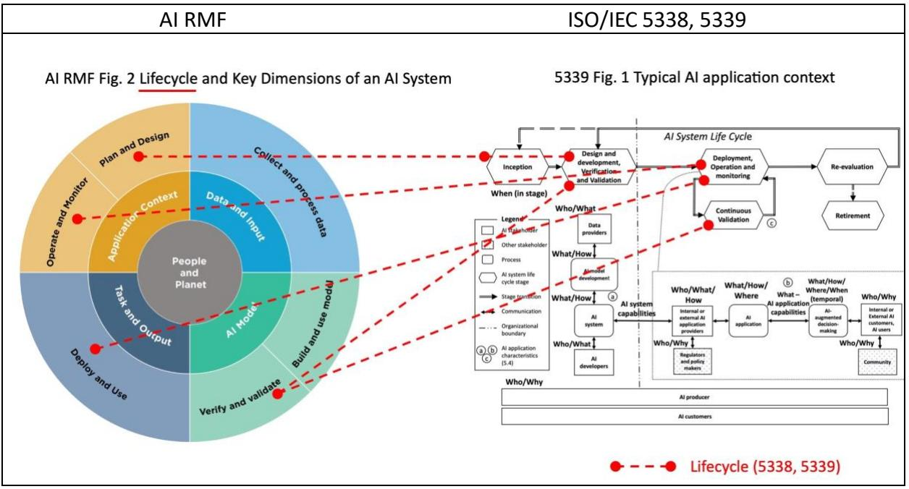
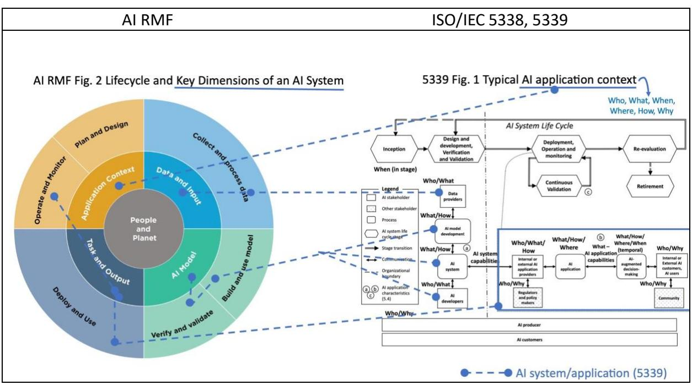
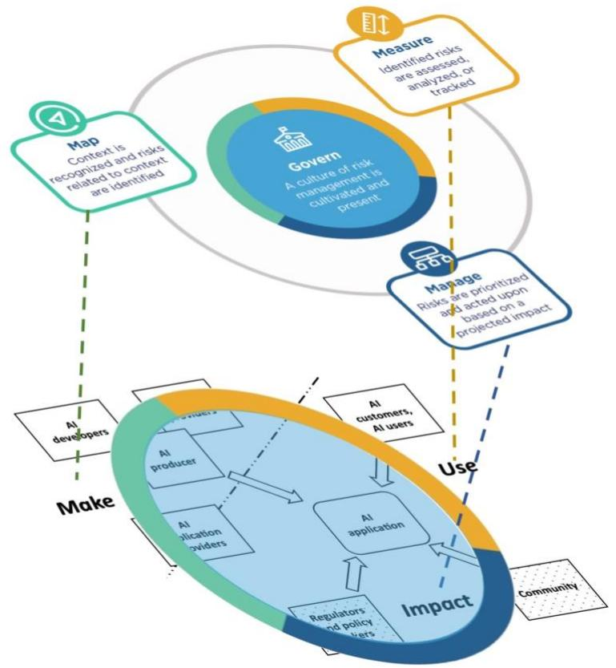

Crosswalk between NIST AI RMF 1.0[1] and ISO/IEC 5338:2023 Al system life cycle processes[2] and ISO/IEC 5339 Guidance for Al applications[3]

The AI RMF and the two international standards were developed independently with some shared foundations with ISO/IEC 22989:2022[4]. This document highlights their areas in common and where the AI RMF can be used to inform readers and users of ISO/IEC 5338 and ISO/IEC 5339.

## Al Risk Management as the Foundation of Responsible Development and Use of Al systems

Figure 1 shows the Make, Use and Impact perspectives of the stakeholders on an Al application and its context from ISO/IEC 5339. Indicated in red in the Figure are where these perspectives could be enhanced by taking the risk management advice and the fundamental aspects of risk from AI RMF.

| AI RMF                                                                                                                                                                                                                                                                                                                                                                                                                                                                                                                                                                                                                                                                                                                                                                                       | ISO/IEC 5339                                                                                                                                                                                                                                                           |
|----------------------------------------------------------------------------------------------------------------------------------------------------------------------------------------------------------------------------------------------------------------------------------------------------------------------------------------------------------------------------------------------------------------------------------------------------------------------------------------------------------------------------------------------------------------------------------------------------------------------------------------------------------------------------------------------------------------------------------------------------------------------------------------------|------------------------------------------------------------------------------------------------------------------------------------------------------------------------------------------------------------------------------------------------------------------------|
| "AI risk management is a key component of responsible development and use of Al systems. Responsible Al practices can help align the decisions about Al system design, development, and uses with intended aim and values. Core concepts in responsible AI emphasize human centricity, social responsibility, and sustainability. Al risk management can drive responsible uses and practices by prompting organizations and their internal teams who design, develop, and deploy AI to think more critically about context and potential or unexpected negative and positive impacts. Understanding and managing the risks of AI systems will help to enhance trustworthiness, and in turn, cultivate public trust." ([1] page 1). | Who. What. When. Responsible Where, How, Why Make Al Characteristics and Considerations: Trustworthiness, human centricity. social responsibility, and sustainability Al Application - stakeholders' perspectives (from [2] Figure 2) |

Figure 1. Stakeholders' Perspectives with Risk Management Considerations

## Al system life cycle, application context and its audience

Figure 2 shows the life cycle stages of an Al system in Al RMF aligned with those used in ISO/IEC 5338 and ISO/IEC 5339.

Figure 2: AI system lifecycle in [1], [2], and [3]

Figure 3 shows the key dimensions and context of an AI system from AI RMF aligned with the processes (5.3.4) and context (5.2) described in ISO/IEC 5339.

Figure 3. Key Dimensions of an Al System and Its Context in [1], [2], and [3]

Figure 4 shows the alignment between the people and planet dimensions from AI RMF and the impact on various stakeholders in ISO/IEC 5339 (5.3.2, 5.3.3). The Al actors in Al RMF (Appendix A) are also similar to the stakeholders in ISO/IEC 5339.

Figure 4. Al System's impact on People and Planet [1] mapped to Al Application Stakeholders [3]

The characteristics of trustworthy Al systems in Al RMF and the discussion of trustworthiness in ISO/IEC 5339 are compared in Table 1. The discussion of trustworthiness in ISO/IEC 5339 were mostly derived from ISO/IEC 22989 and ISO/IEC 24028 so it does not align exactly with those from AI RMF. The AI RMF characteristics of trustworthy AI systems are socio-technical system attributes. In contrast, ISO/IEC 5339 refers to comparative characteristics as Al application nonfunctional characteristics.

| lable 1. Comparison of Trustworthiness Characteristics from [1] and  3 |                                         |  |
|------------------------------------------------------------------------|-----------------------------------------|--|
| Al RMF – Characteristics of                                            | ISO/IEC 5339 - Trustworthiness (5.5.2)  |  |
| Trustworthy Al Systems (Section 3)                                     | (mostly derived from ISO/IEC 24028 [5]) |  |
| Valid and Reliable                                                     | 5.5.2.9, 5.5.2.3, 5.5.2.2               |  |
| Safe                                                                   |                                         |  |
| Secure and Resilient                                                   | 5.5.2.4                                 |  |
| Accountable and Transparent                                            | 5.5.2.8                                 |  |
| Explainable and Interpretable                                          | 5.5.2.6                                 |  |
| Privacy-Enhanced                                                       |                                         |  |
| Fair - with Harmful Bias Managed                                       | 5.5.2.10                                |  |
|                                                                        | Controllability (5.5.2.7)               |  |
|                                                                        | Predictability (5.5.2.7)                |  |
|                                                                        | Dependable (5.5.2.1)                    |  |

| Table 1. Comparison of Trustworthiness Characteristics from [1] and [3 |  |
|------------------------------------------------------------------------|--|
|------------------------------------------------------------------------|--|

Figure 5 shows the relationship between the AI RMF Core (GOVERN, MAP, MEASURE, MANAGE) and the Al application stakeholders' perspectives from ISO/IEC 5339. The Al RMF Core represents a very high-level view and "Governance is designed to be a cross-cutting function to inform and be infused throughout the other three functions" ([1] Figure 5). The MAP function can inform the Make perspective. The MEASURE function can inform the Use perspective. The MANAGE function can inform the Impact perspective.

Figure 5. Relationship between AI RMF Core [1] and ISO 5339 AI application stakeholders' perspectives [3]

## References

- [1] Artificial Intelligence Risk Framework (Al RMF 1.0), NIST AI 100-1, January 2023.
- [2] ISO/IEC 5338:2023 Information technology Artificial intelligence Al system life cycle processes.
- [3] ISO/IEC 5339:2024 Information technology Artificial intelligence Guidance for AI applications.
- [4] ISO/IEC 22989:2022 Information technology Artificial intelligence Artificial intelligence concepts and terminology.
- [5] ISO/IEC TR 24028:2020 Information technology Artificial intelligence Overview of trustworthiness in artificial intelligence.