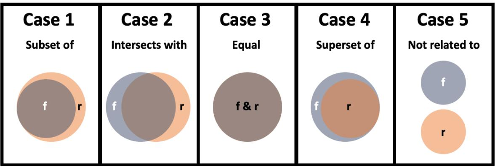
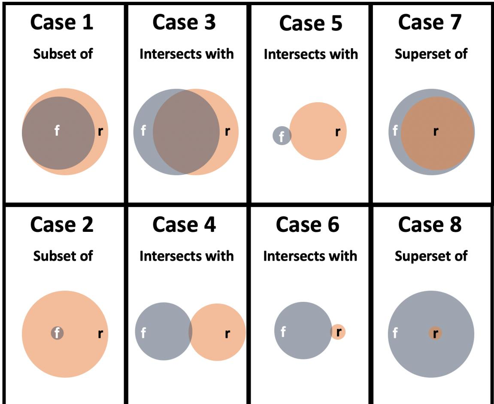

## NIST Internal Report NIST IR 8278Ar1

# National Online Informative References (OLIR) Program

Submission Guidance for OLIR Developers

Matthew Barrett Nicole Keller Stephen Quinn Matthew C. Smith Karen Scarfone Vincent Johnson

This publication is available free of charge from: https://doi.org/10.6028/NIST.IR.8278Ar1


## NIST Internal Report NIST IR 8278Ar1

# National Online Informative References (OLIR) Program

Submission Guidance for OLIR Developers

Matthew Barrett* Applied Cybersecurity Division Information Technology Laboratory

Karen Scarfone Scarfone Cybersecurity

Huntington Ingalls Industries

Matthew C. Smith

Nicole Keller Stephen Quinn Computer Security Division Information Technology Laboratory

Vincent Johnson Electrosoft Services, Inc.

* Former employee; all work for this publication was done while at NIST

This publication is available free of charge from: https://doi.org/10.6028/NIST.IR.8278Ar1

February 2024


U.S. Department of Commerce Gina M. Raimondo, Secretary

National Institute of Standards and Technology Laurie E. Locascio, NIST Director and Under Secretary of Commerce for Standards and Technology NIST IR 8278Ar1 February 2024

Certain equipment, instruments, software, or materials, commercial, are identified in this paper in order to specify the experimental procedure adequately. Such identification does not imply recommendation or endorsement of any product or service by NIST, nor does it imply that the materials or equipment identified are necessarily the best available for the purpose.

There may be references in this publication to other publications currently under development by NIST in accordance with its assigned statutory responsibilities. The information in this publication, including concepts and methodologies, may be used by federal agencies even before the completion of such companion publications. Thus, until each publication is completed, current requirements, guidelines, and procedures, where they exist, remain operative. For planning and transition purposes, federal agencies may wish to closely follow the development of these new publications by NIST.

Organizations are encouraged to review all draft public comment periods and provide feedback to NIST. Many NIST cybersecurity publications, other than the ones noted above, are available at https://csrc.nist.gov/publications.

#### NIST Technical Series Policies

Copyright, Use, and Licensing Statements NIST Technical Series Publication Identifier Syntax

#### Publication History

Approved by the NIST Editorial Review Board on 2024-02-23 Supersedes NIST IR 8278A (November 2020) https://doi.org/10.6028/NIST.IR.8278A

#### How to Cite this NIST Technical Series Publication

Barrett M, Keller N, Quinn S, Smith MC, Scarfone K, Johnson V (2024) National Online Informative References (OLIR) Program: Submission Guidance for OLIR Developers. (National Institute of Standards and Technology, Gaithersburg, MD), NIST Internal Report (IR) NIST IR 8278Ar1. https://doi.org/10.6028/NIST.IR.8278Ar1

#### Author ORCID iDs

Matthew Barrett: 0000-0002-7689-427X Nicole Keller: 0000-0003-4761-6817 Stephen Quinn: 0000-0003-1436-684X Matthew C. Smith: 0000-0003-1004-7171 Karen Scarfone: 0000-0001-6334-9486 Vincent Johnson: 0000-0002-7363-996X

#### Contact Information

olir@nist.gov

National Institute of Standards and Technology Attn: Applied Cybersecurity Division, Information Technology Laboratory 100 Bureau Drive (Mail Stop 2000) Gaithersburg, MD 20899-2000

#### Additional Information

Additional information about this publication is available at https://csrc.nist.gov/pubs/ir/8278/a/11/final, including related content, potential updates, and document history.

All comments are subject to release under the Freedom of Information Act (FOIA).

#### Abstract

The National Online Informative References (OLIR) Program is a NIST effort to facilitate standardized definitions of Online Informative References (OLIRs) by subject matter experts. OLIRs are relationships between elements of documents from cybersecurity, privacy, and other information and communications technology domains. This document assists OLIR Developers in understanding the processes and requirements for participating in the Program. The primary focus of the document is to instruct Developers on how to complete an OLIR Template when submitting an OLIR to NIST for inclusion in the OLIR Catalog.

#### Keywords

concept crosswalk; Informative Reference; National OLIR Program; Online Informative Reference (OLIR); set theory relationship mapping; supportive relationship mapping.

## Reports on Computer Systems Technology

The Information Technology Laboratory (ITL) at the National Institute of Standards and Technology (NIST) promotes the U.S. economy and public welfare by providing technical leadership for the Nation's measurement and standards infrastructure. ITL develops tests, test methods, reference data, proof of concept implementations, and technical analyses to advance the development and productive use of information technology. ITL's responsibilities include the development of management, administrative, technical, and physical standards and guidelines for the cost-effective security and privacy of other than national security-related information in federal information systems.

#### Audience

The primary audience for this publication is individuals interested in developing OLIRs for the National OLIR Program.

#### Acknowledgments

The authors would like to thank all of those who commented on and contributed to this document, particularly Murugiah Souppaya from NIST.

#### Trademark Information

All registered trademarks and trademarks belong to their respective organizations.

#### Note to Readers

This specification is not meant to be read in sequential order. It is a reference for developers of OLIRs to provide clarity and direction when creating an OLIR. Developers are encouraged to review other OLIRs listed in the OLIR Catalog to better understand what is required to develop and submit an OLIR to NIST. Developers are also encouraged to contact NIST at olir@nist.gov with any questions about the development and submission process.

This specification includes changes from the original version of NIST IR 8278A and the first public draft of NIST IR 8278Ar1. The National OLIR Program will not require developers to resubmit existing OLIRs because of specification changes.

#### Patent Disclosure Notice

NOTICE: ITL has requested that holders of patent claims whose use may be required for compliance with the guidance or requirements of this publication disclose such patent claims to ITL. However, holders of patents are not obligated to respond to ITL calls for patents and ITL has not undertaken a patent search in order to identify which, if any, patents may apply to this publication.

As of the date of publication and following call(s) for the identification of patent claims whose use may be required for compliance with the guidance or requirements of this publication, no such patent claims have been identified to ITL.

No representation is made or implied by ITL that licenses are not required to avoid patent infringement in the use of this publication.

## Table of Contents

|  | 1. Introduction                                                  |
|--|------------------------------------------------------------------|
|  | 1.1. Purpose and Scope                                           |
|  | 1.2. Document Structure                                          |
|  | 2. OLIR Life Cycle                                               |
|  | 2.1. Pre-Submission Steps for OLIR Developers                    |
|  | 2.1.1. Step 1: Request OLIR Submission Account                   |
|  | 2.1.2. Step 2: Initial OLIR Development                          |
|  | 2.2. Submission Steps for OLIR Developers                        |
|  | 2.2.1. Step 3: Creating the Submission                           |
|  | 2.2. Step 4: OLIR Posting and Submission for NIST Screening      |
|  | 2.3. Post-Submission Steps for NIST and OLIR Developers          |
|  | 2.3.1. Step 5: NIST Screening of the Submission                  |
|  | 2.3.2. Step 6: Public Review and Feedback for the Candidate OLIR |
|  | 2.3.3. Step 7: Final Listing in the OLIR Catalog                 |
|  | 2.3.4. Step 8: OLIR Maintenance and Archival                     |
|  | 3. General Information Instructions and Guidance                 |
|  | 3.1. Documenting the General Information                         |
|  | 3.1.1. Reference Document                                        |
|  | 3.1.2. Reference Document Short Name                             |
|  | 3.1.3. Reference Document Version                                |
|  | 3.1.4. Reference Document Author                                 |
|  | 3.1.5. Reference Document URL                                    |
|  | 3.1.6. Reference Document Date                                   |
|  | 3.1.7. Informative Reference Name                                |
|  | 3.1.8. Informative Reference Short Name                          |
|  | 3.1.9. Informative Reference Version                             |
|  | 3.1.10. Point of Contact                                         |
|  | 3.1.11. Informative Reference Developer                          |
|  | 3.1.12. Comprehensive                                            |
|  | 3.1.13. Summary                                                  |
|  | 3.1.14. Target Audience (Community)                              |
|  | 3.1.15. Citations                                                |
|  | 3.1.16. Comments                                                 |
|  | 3.1.17. Web Address                                              |

| 3.2. Documenting the OLIRs                                    |  |  |  |
|---------------------------------------------------------------|--|--|--|
| 3.2.1. Focal Document Element                                 |  |  |  |
| 3.2.2. Focal Document Element Description                     |  |  |  |
| 3.2.3. Reference Document Element                             |  |  |  |
| 3.2.4. Security Control Baseline                              |  |  |  |
| 3.2.5. Rationale                                              |  |  |  |
| 3.2.6. Relationship                                           |  |  |  |
| 3.2.7. Relationship Type                                      |  |  |  |
| 3.2.8. Relationship Explanation                               |  |  |  |
| 3.2.9. Relationship Property                                  |  |  |  |
| 3.2.10. Reference Document Element Description                |  |  |  |
| 3.2.11. Comments                                              |  |  |  |
| 3.2.12. Strength of Relationship                              |  |  |  |
| 3.3. Examples of Common Scenarios                             |  |  |  |
| References                                                    |  |  |  |
| Appendix A. Participation Agreement for the NIST OLIR Program |  |  |  |
| Appendix B. List of Symbols, Abbreviations, and Acronyms      |  |  |  |
| Appendix C. Glossary                                          |  |  |  |
| Appendix D. Change Log                                        |  |  |  |

## List of Tables

| Table 1. General Information Field Descriptions                  |  |
|------------------------------------------------------------------|--|
| Table 2. OLIR Template Field Descriptions                        |  |
| Table 3. Concept Crosswalk OLIR Template Example 1               |  |
| Table 4. Set Theory Relationship Mapping OLIR Template Example 2 |  |
| Table 5. Set Theory Relationship Mapping OLIR Template Example 3 |  |
| Table 6. Supportive Relationship Mapping OLIR Template Example 4 |  |

## List of Figures

| Fig. 1. Set Theory Relationship Mapping Types |  |
|-----------------------------------------------|--|
| Fig. 2. Relative Strength of Relationships    |  |

## 1. Introduction

The National Online Informative References (OLIR) Program evolved from the need to identify related concepts between NIST documents and other documents within the information and communications technology (ICT) domain. For example, the NIST Cybersecurity Framework lists several related cybersecurity documents as Informative References [1]. Informative References show relationships between the Functions, Categories, and Subcategories of the Cybersecurity Framework and specific sections of standards, guidelines, and best practices. Informative References can be more detailed or more general than the Functions, Categories, and Subcategories and can illustrate ways to achieve those outcomes.

Historically, NIST has published only a small subset of Informative References in its ICT frameworks (e.g., Cybersecurity Framework, Privacy Framework) in order to maintain their readability. The National OLIR Program scales to accommodate a greater number of relationships and provide a more agile support model to account for the varying update cycles of documents with relationships. The OLIR specification also provides a more robust method for clearly defining relationships.

The following are definitions of key terms from NIST Internal Report (IR) 8278, Revision 1 [2] that are also used in this document:

- . A Focal Document is a NIST document that is used as the basis for comparing its elements with elements from another document. A Reference Document is a document being compared to a Focal Document.
- . A Focal Document Element is a discrete section, sentence, phrase, or other identifiable piece of content from a Focal Document. Similarly, a Reference Document Element is a discrete section, sentence, phrase, or other identifiable piece of content from a Reference Document.
- . A concept relationship style is an explicitly defined convention for characterizing relationships for a use case. NIST IR 8477, Mapping Relationships Between Documentary Standards, Regulations, Frameworks, and Guidelines [3] defines several concept relationship styles and provides more information on using them. The three concept relationship styles supported by OLIR are as follows:
	- A concept crosswalk indicates that a relationship exists between a Focal Document Element and a Reference Document Element without any additional characterization of that relationship.
	- A set theory relationship mapping indicates the relationships between a Focal Document Element and a Reference Document Element by both qualifying the rationale for indicating the connection between elements (semantic, syntactic, or functional) and classifying the relationship utilizing set theory principles (subset of, intersects with, equal, superset of, not related to).
	- A supportive relationship mapping indicates how a supporting concept can or o does help achieve a supported concept, with one of the concepts being a Focal

Document Element and the other a Reference Document Element. One of the following relationship types must be specified for each relationship: supports, is supported by, identical, equivalent, or contrary. Relationship properties can also be specified for the "supports" and "is supported by" relationship types.

- An OLIR shows the relationship between two concepts without any additional characterization of that relationship (concept crosswalk OLIR), as derived from the branch of mathematics known as set theory (set theory relationship mapping OLIR), or how one concept can or does help achieve another concept (supportive relationship mapping OLIR) that complies with the standard defined in this publication and the related templates.
- An OLIR Developer (Developer) is an individual, group, or organization that creates an OLIR and submits it to the National OLIR Program. An OLIR Developer is often the owner of the Reference Document but may also be a subject matter expert on the Reference Document who is not the owner.

OLIRs provide a consistent and authoritative way of specifying relationships that can be used by both humans and automated tools. Each OLIR is displayed in a centralized location: the OLIR Catalog. The OLIR Catalog is publicly accessible, so anyone can use it to access, view, and download OLIRs for various pairs of documents. OLIR Developers can use the OLIR Program as a mechanism for communicating with the owners and users of other documents. Given the National OLIR Program's nature, OLIR Developers also have the flexibility to update their documents and then update their OLIRs according to their own unique requirements and schedules.

## 1.1. Purpose and Scope

The purpose of this document is to assist OLIR Developers in understanding the processes and requirements for participating in the National OLIR Program.

Before reading this document, OLIR Developers should first read NIST IR 8278, Revision 1, National Online Informative References (OLIR) Program: Overview, Benefits, and Use [2]. It describes the OLIR Program and explains the features, benefits, and use of the OLIR Catalog.

## 1.2. Document Structure

The remainder of this document is organized into the following sections:

- . Section 2 describes the general processes for developing OLIRs, submitting them to NIST for inclusion in the OLIR Catalog (including pre-submission and post-submission steps), updating them, and archiving them.
- Section 3 provides guidance for completing an OLIR Template when submitting an OLIR.
- The References section lists the references cited in this publication.
- Appendix A defines the Participation Agreement for the OLIR Program for Developers.
- Appendix B contains a list of the acronyms used throughout this document. .
- . Appendix C provides a glossary of terminology used throughout this document.
- . Appendix D offers a brief change log for this revision of the document.

## 2. OLIR Life Cycle

This section describes the general process for developing OLIRs and submitting them to NIST for inclusion in the National OLIR Program's Catalog. It includes an overview of the process that NIST will follow to screen the OLIR submissions and publish them in the OLIR Catalog. This section also describes the process that NIST and Developers will follow to update and archive OLIRs. Potential OLIR Developers — who may be individuals, teams, or organizations — should review the Participation Agreement in Appendix A. The agreement contains the administrative requirements for participating in the National OLIR Program.

The following steps comprise the OLIR life cycle:

#### Pre-Submission:

- 1. Request OLIR Submission Account: The Developer emails olir@nist.gov requesting an account for the submission of an OLIR.
- 2. Initial OLIR Development: The Developer becomes familiar with the procedures and requirements of the National OLIR Program, downloads the desired Focal Document Template from the Program's website, and performs the initial development of the OLIR.

#### Submission:

- 3. Creating the Submission: The Developer logs into the OLIR submission account and performs the steps for creating the OLIR submission and processing the OLIR against the specifications in Section 3 of this document.
- 4. OLIR Posting and Submission for NIST Screening: After the OLIR has been accepted within the submission tool and prior to submitting the OLIR for screening, the Developer posts the OLIR to a public website of their choosing. This posting enables the Developer to finalize the submission for NIST screening.

## Post-Submission:

- 5. NIST Screening: NIST reviews the submission, determines whether the OLIR and other submitted materials are ready for public review, and addresses any issues with the Developer prior to public review.
- 6. Public Review and Feedback: NIST holds a 30-day public review of the draft candidate OLIR. The Developer then addresses comments as necessary, and additional candidates are released for public comment if desired or needed.
- 7. Final Listing in the OLIR Catalog: NIST updates the OLIR listing status in the OLIR Catalog to "final" and announces the OLIR's availability.
- 8. OLIR Maintenance and Archival: Anyone can provide feedback on the OLIR throughout its life cycle. The Developer periodically updates the OLIR, as necessary. The OLIR is archived when it is no longer maintained or needed (e.g., if the Reference Document is withdrawn or deprecated).

Each step should be carried out to ensure that the OLIR is accurate, well-formed, and documented throughout its development and subsequent publication, update, or archival. The following sections describe considerations for each step.

## 2.1. Pre-Submission Steps for OLIR Developers

The first two steps in the OLIR life cycle involve the developer requesting an OLIR submission account and creating an OLIR. The quality of OLIR documentation can significantly impact an OLIR's effectiveness. Sections 2.1.1 and 2.1.2 describe each of the steps in greater detail.

## 2.1.1. Step 1: Request OLIR Submission Account

The Developer emails olir@nist.gov requesting an account for the submission of an OLIR. At this point, a Developer would presumably agree to the requirements for participation in the National OLIR Program before continuing to develop the OLIR. Appendix A of this publication provides the latest version of the Participation Agreement that the Developer must sign.

The email request should contain:

- . A signed Participation Agreement (see Appendix A)
- First and last name of account user
- Name of submitting organization and website link
- Contact information (phone number, email address)

Upon the successful creation of the account, the Developer will receive an email with account information, login requirements, and a submission quick start guide.

## 2.1.2. Step 2: Initial OLIR Development

During initial OLIR development, a Developer becomes familiar with the requirements of the National OLIR Program and all procedures involved during the OLIR life cycle.

The Developer next decides which Focal Document will be the target for their OLIR. To promote consistency and facilitate the review of OLIRs by NIST and the public, NIST has created a spreadsheet (.xlsx) template — an OLIR Template — for each Focal Document and may also release OLIR Templates for Focal Documents in other formats, like comma-separated values (CSV) (.csv) and JavaScript Object Notation (JSON) (.json). The developer chooses an OLIR Template and downloads the appropriate template for creating a concept crosswalk, set theory relationship mapping, or supportive relationship mapping.

The Developer fills out the downloaded OLIR Template, following the instructions and guidance in Section 3 of this publication.1

<sup>1</sup> The OLIR Templates are available at https://csrc.nist.gov/projects/olir/focal-document-templates.

## 2.2. Submission Steps for OLIR Developers

The processes for submitting and posting an OLIR — which correspond to steps 3 and 4 in the OLIR life cycle - are described in the following sections.

## 2.2.1. Step 3: Creating the Submission

At this point, the Developer has completed the OLIR. The Developer logs into the OLIR submission account and performs the steps for creating the OLIR submission and processing an OLIR against the specifications in Section 3 of this document. That section also provides guidance for filling out the General Information necessary for the successful submission of the OLIR within the submission tool.

For any questions during the submission process, contact olir@nist.gov.

#### 2.2.2. Step 4: OLIR Posting and Submission for NIST Screening

After acceptance of the OLIR within the submission tool and prior to submission, the Developer posts the OLIR to a public website of their choosing. This posting enables the Developer to finalize the submission for NIST screening. The posting of the OLIR also enables NIST to link to the OLIR during both the comment period and the listing phase.

## 2.3. Post-Submission Steps for NIST and OLIR Developers

The processes for screening, publishing, and maintaining an OLIR — which correspond to steps 5 through 8 in the OLIR life cycle - are described in the following sections.

## 2.3.1. Step 5: NIST Screening of the Submission

NIST reviews the submission and determines whether the OLIR and other submitted materials are ready for public review. NIST screens the submission for completeness and accuracy and ensures that the content is well-formed. NIST may contact the Developer with questions about the submitted materials during the screening period.

## 2.3.2. Step 6: Public Review and Feedback for the Candidate OLIR

Once the submission has been submitted and successfully screened, NIST will then post an entry for the OLIR in the OLIR Catalog² as a candidate for a 30-day public review period. NIST will invite the public to review and comment on the candidate OLIR and provide feedback to the Developer.

Each candidate being posted for a public review period is assigned one of the following status designators:

- . Work-in-progress draft: It is currently in an early stage of development and is incomplete. It has not been extensively edited or vetted. Work-in-progress drafts are solely informational in nature and are not intended to be implemented.
<sup>2</sup> The OLIR Catalog is located at https://csrc.nist.gov/projects/olir/informative-reference-catalog.

- Preliminary draft: It is considered stable, but changes are expected to occur. There are gaps in the content, and the document is still incomplete. Early adopters may consider experimenting with the content with the understanding that they will identify gaps and challenges.
- Draft: It is a complete draft proposed as a candidate for Final status. Changes may occur ● based on public comments, but such changes are expected to be relatively minor. Early adopters may attempt to use the content.

An OLIR reviewer can email olir@nist.gov to provide comments on the reviewer's implementation environment, procedures, and other relevant information. Depending on the review, the Developer may need to respond to comments. NIST may also consult independent expert reviewers, as appropriate. For example, NIST may decide that it does not have the expertise to determine whether the comments have been addressed satisfactorily. Additionally, NIST may disagree with the proposed issue resolutions and seek additional perspectives from third-party reviewers.

At the end of the public review period, NIST will give the Developer 30 days to respond to comments and address any outstanding issues.

- . If the candidate was a work-in-progress draft or preliminary draft, an updated version will need to be submitted to NIST for another public comment period, typically as a preliminary draft or regular draft.
- . If the candidate was a regular draft, NIST will work with the developer to determine whether the candidate is ready to be finalized or if it needs to be updated and released for another public comment period.

## 2.3.3. Step 7: Final Listing in the OLIR Catalog

Once the OLIR is ready to be finalized, NIST will change the OLIR's status to "final" in the OLIR Catalog and announce its availability. The listing will provide data about the OLIR, downloadable formats, and links to OLIR materials.

## 2.3.4. Step 8: OLIR Maintenance and Archival

Throughout an OLIR's life cycle, any reviewer can submit comments or questions to olir@nist.gov. NIST will forward feedback to the Developer. Users who subscribe to the mailing list can receive announcements about updates or other issues related to an OLIR. The selected OLIR's description in the OLIR Catalog will contain instructions for subscribing to the mailing address list.

NIST will periodically review the OLIR Catalog to determine whether individual OLIRs are still relevant or if changes need to be made. If the Developer decides to update the OLIR at any time, NIST will announce that the OLIR is in the process of being updated via a notification in the OLIR Catalog. If the revised OLIR contains major changes (see Section 3.1.9 for version definitions), it will be considered a new submission and will be required to undergo the same review process as a new submission. If the OLIR contains minor changes, it will undergo a 30day public comment period. If the OLIR contains administrative changes, no comment period is required, and the updated OLIR will be listed in the OLIR Catalog with an appropriate version number to annotate the update.

At the discretion of NIST or the Developer, the OLIR can either be archived or removed from the OLIR Catalog altogether. Typical reasons for such actions might be that the Reference Document is no longer supported or is obsolete, or the Developer no longer wishes to provide support for the OLIR. Unless otherwise requested by the Developer, withdrawn OLIRs will be deleted from the OLIR Catalog, and an entry will remain to indicate that an OLIR was previously available.

If a Developer first submitted a concept crosswalk OLIR and later submits a set theory or supportive relationship mapping OLIR for the same Focal Document/Reference Document pair, the developer should decide whether they want to support both OLIRs in the Catalog or if they want the concept crosswalk OLIR to be archived and only the mapping OLIR to be in the Catalog.

#### 3. General Information Instructions and Guidance

This section provides instructions and guidance to Developers for completing the General Information steps of the submission tool. The Developer must follow the criteria as explained in Sections 3.1 and 3.2, respectively. Section 3.3 provides additional examples of how to document relationships.

#### 3.1. Documenting the General Information

Developers must fill out their OLIR description via the General Information fields of the submission tool. This metadata will be used by NIST to update the OLIR Catalog entry for the OLIR. Table 1 shows the fields that Developers should complete, along with an example for each field. Sections 3.1.17 contain additional information on each field, including more examples.

| Field Name                                           | Description                                                                                                                                                                              | Example                                                                                                                                     |
|------------------------------------------------------|------------------------------------------------------------------------------------------------------------------------------------------------------------------------------------------|---------------------------------------------------------------------------------------------------------------------------------------------|
| Reference Document                                   | The full Reference Document name and<br>version that is being compared to the Focal<br>Document                                                                                          | Special Publication 800-171,<br>Revision 1: Protecting<br>Controlled Unclassified<br>Information in Nonfederal<br>Systems and Organizations |
| Reference Document Short<br>Name                     | The short name of the Reference<br>Document                                                                                                                                              | 800-171 Rev 1                                                                                                                               |
| Reference Document Version                           | The iteration of the Reference Document<br>used for the OLIR                                                                                                                             | 1.0, 1.0.0, Revision 1                                                                                                                      |
| Reference Document Author                            | The organization(s) and/or person(s) that<br>authored the Reference Document                                                                                                             | National Institute of Standards<br>and Technology                                                                                           |
| Reference Document URL<br>(Uniform Resource Locator) | The URL where the Reference Document<br>can be viewed, downloaded, or purchased                                                                                                          | https://csrc.nist.gov/publicatio<br>ns/detail/sp/800-171/rev-<br>1/final                                                                    |
| Reference Document Date                              | The date that the Reference Document was<br>published and, if applicable, amended                                                                                                        | 12/00/2016, updated on<br>06/07/2018                                                                                                        |
| Informative Reference Name                           | The name by which the OLIR listing will be<br>known                                                                                                                                      | NIST-SP800-171-to-<br>Framework-v1.1 (1.0.0)                                                                                                |
| Informative Reference Short<br>Name                  | To improve consistency and readability of<br>these names, OLIR Developers must use<br>existing abbreviations whenever available<br>for both the Reference Document and<br>Focal Document | "HITRUST-CSF-v9.2"<br>"IoTSF-Security-Framework-<br>v2.1"                                                                                   |
| Informative Reference<br>Version                     | The version of the OLIR itself                                                                                                                                                           | 1.0.0                                                                                                                                       |
| Point of Contact                                     | At least one person's name (optional),<br>email address (required), and phone<br>number (optional) within the OLIR<br>Developer's organization                                           | Jane Doe<br>+1 555-555-555<br>example@nist.gov                                                                                              |
| Informative Reference<br>Developer                   | The creator of the OLIR (e.g., person, team,<br>organization)                                                                                                                            | National Institute of Standards<br>and Technology                                                                                           |

#### Table 1. General Information Field Descriptions

| Field Name                                | Description                                                                                                                  | Example                                                                                                                                                                                                        |
|-------------------------------------------|------------------------------------------------------------------------------------------------------------------------------|----------------------------------------------------------------------------------------------------------------------------------------------------------------------------------------------------------------|
| Comprehensive                             | Whether the OLIR maps all elements in the<br>Reference Document to the Focal<br>Document ("Yes") or not ("No")               | Yes, No                                                                                                                                                                                                        |
| Summary (optional)                        | The purpose of the OLIR                                                                                                      | The purpose of this OLIR is to<br>indicate relationships between<br>NIST SP 800-171 and the<br>Cybersecurity Framework.                                                                                        |
| Target Audience (Community)<br>(optional) | The intended audience for the OLIR                                                                                           | The intended audience for this<br>OLIR is those seeking to protect<br>controlled unclassified<br>information using the<br>Cybersecurity Framework.                                                             |
| Citations (optional)                      | A listing of source material (beyond the<br>Focal Document and Reference Document)<br>that supported development of the OLIR | Mapping of Cybersecurity<br>Framework v.1.0 to SP 800 171<br>Rev. 1,<br>https://csrc.nist.gov/CSRC/med<br>ia//Publications/sp/800-<br>171/rev-<br>1/final/documents/csf-v1-0-to-<br>sp800-171rev1-mapping.xlsx |
| Comments (optional)                       | Notes to NIST or implementers                                                                                                | None                                                                                                                                                                                                           |
| Web Address                               | The URL where the OLIR can be found                                                                                          | https://www.nist.gov/files/xxx<br>XXX                                                                                                                                                                          |

## 3.1.1. Reference Document

The Reference Document field provides the full name of the Reference Document. The title of the publication is annotated in italics. The field also includes any unique identifiers associated with the version, revision, and/or edition.

Examples:

"Special Publication 800-53, Revision 5, Security and Privacy Controls for Information Systems and Organizations"

"Technical Report 27103:2018, Information technology – Security techniques – Cybersecurity and ISO and IEC Standards"

#### 3.1.2. Reference Document Short Name

The Reference Document Short Name designates the short name of the Reference Document. This field SHALL be thirty (30) characters or less.

#### 3.1.3. Reference Document Version

The Reference Document Version denotes the iteration of the Reference Document used for the OLIR.

Examples:

1.0, 1.0.0, Revision 1

#### 3.1.4. Reference Document Author

The Reference Document Author refers to the organizations and/or persons who authored the Reference Document. For example, NIST would be listed as the Reference Document Author for NIST SP 800-171, even if a non-NIST Developer were to create an OLIR for it [3]. Multiple authors must be separated by commas.

Pseudonyms and group names not registered as organization names with the Internal Revenue Service or like organizations (e.g., Doing Business As names, working group names, committee names) must be listed in addition to the organizations and/or persons using the preface "prepared by the." Multiple pseudonyms and/or group names must be separated by commas. Authors must be separated from pseudonyms and group names using a semicolon.

Examples:

"National Institute of Standards and Technology; prepared by the Joint Task Force"

"ACME, Inc."

"Jane Doe, John Smith"

"International Organization for Standardization, International Electrotechnical Commission; prepared by the Joint Technical Committee ISO/IEC JTC 1, Information technology, Subcommittee SC 27, IT Security techniques"

#### 3.1.5. Reference Document URL

The Reference Document URL field denotes the publicly available online location of the Reference Document. It must respond to standard Hypertext Transfer Protocol (HTTP) and HTTP Secure (HTTPS) requests.

## 3.1.6. Reference Document Date

The Reference Document Date refers to the calendar date of the Reference Document version, revision, and/or edition, including any applicable amendment dates to account for any updates. The Reference Document publication and amendment dates must appear in MM/DD/YYYY format. When publication and/or amendment dates list only the month and year, the day field must be recorded with "00." Publication and amendment dates must be separated by a comma, and amendment dates must be prepended with "updated on."

Examples:

"04/00/2013, updated on 01/22/2015" "12/00/2016"

## 3.1.7. Informative Reference Name

The Informative Reference Name field refers to the name of the completed OLIR Template that contains the OLIR. This name will remain static over time. It includes three distinct components in the following order:

- 1. Reference Document abbreviation
- 2. Focal Document abbreviation
- 3. Reference Version (see Section 3.1.9)

Spaces are replaced with hyphens except that a space is used to separate the Focal Document from the Reference Version. Note that the preposition "to" separates the Reference Document from the Focal Document. Lastly, the Reference Version is contained in parentheses.

Examples:

"CSF-v1.1-to-Privacy-Framework-v1.0 (1.0.0)" "SP800-171-to-CSF-v1.1 (1.0.0)" "SP800-213A-v1.0-to-SP800-53r5 (1.0.0)"

## 3.1.8. Informative Reference Short Name

To improve consistency and readability of these names, OLIR Developers must use existing abbreviations whenever available for both the Reference Document and Focal Document when naming their OLIR Template. NIST is currently developing a standard list of abbreviations for its own Focal Documents and Reference Documents. OLIR Developers who need to create a new abbreviation for a non-NIST document must limit it to a maximum of 30 characters. The following are examples of possible abbreviations:

- . "COBIT-2019"
- "HITRUST-CSF-v9.2"
- "IoTSF-Security-Framework-v2.1"

## 3.1.9. Informative Reference Version

The Reference Version indicates a major, minor, or administrative designation of the OLIR material. Generally, the version format follows a typical software release pattern:

- . Major version - Changes to the OLIR may require current implementations based on the previous version to be modified.
- . Minor version – Changes include one or more new relationships without the removal or modification of existing relationships.
- Administrative version - Changes are typographical or stylistic for usability.

The field format is [major version] [minor version] [administrative version], and the initial submission uses "1.0.0".

Examples: "1.0.0"; "1.1.3"; "2.0.1"

## 3.1.10. Point of Contact

The Point of Contact is a person associated with the Developer. The person named within this field should have subject matter expertise with the OLIR and be able to answer questions related to the OLIR. The person's email address must be provided, and the person's name and phone number are optional but recommended. The format for this field is:

## [First Name] [Last Name]\n+[country code] [area code]-[xxx]-[xxxx]\n[email address]

Example:

Jane Doe +1 555-555-5555 example@nist.gov

## 3.1.11. Informative Reference Developer

The Informative Reference Developer is the author of the OLIR and may be a person, group, or organization. Multiple people must be separated by commas. Pseudonyms and group names not registered as organization names with the Internal Revenue Service or like organizations (e.g., Doing Business As names, working group names, committee names) must be listed in addition to the organizations and/or persons using the preface "prepared by the." Multiple pseudonyms and/or group names must be separated by commas. Individuals must be separated from pseudonyms and group names using a semicolon.

Examples:

"National Institute of Standards and Technology"

"John Doe"

## 3.1.12. Comprehensive

The Comprehensive value indicates the completeness of the OLIR with respect to the Reference Document. This field must be marked as follows:

- "Yes" - All elements in the Reference Document are mapped to the Focal Document.
- . "No" – One or more elements in the Reference Document are not mapped to the Focal Document.

## 3.1.13. Summary

The Summary should be a short description of the concept crosswalk or the set theory or supportive relationship mapping. This field is optional.

Example: "A set theory relationship mapping of Cybersecurity Framework version 1.1 Core to NIST Special Publication 800-53, Revision 5 controls."

## 3.1.14. Target Audience (Community)

The Target Audience is the intended consuming audience of the OLIR. The audience should be a critical infrastructure sector or community of interest. Multiple audiences are denoted by populating this field with a value of "General." This field is optional.

Examples: "Energy Sector"; "Legal Community"; "Restaurants"

#### 3.1.15. Citations

The Citations field refers to documents other than the Focal and Reference Documents that are supplementary to the OLIR. These documents may be standards or other supporting material that would prove useful to NIST or third parties. If no citations exist, leave this field blank.

Examples:

"NIST Special Publication 800-53, Revision 5"

"ACME, Inc. Security Policy"

#### 3.1.16. Comments

The Developer can optionally use the Comments field to provide supplemental information to NIST and other OLIR users. Such information may include general background information, developer's notes, or customizations made to the OLIR Template.

#### 3.1.17. Web Address

The Web Address denotes the publicly available online location of the OLIR. It must respond to standard HTTP(S) requests.

#### 3.2. Documenting the OLIRs

The Developer indicates the relationships between the Reference Document and the Focal Document by filling out the OLIR Template. Table 2 describes the fields. The Crosswalk OLIR and Mapping OLIR columns in Table 2 indicate which fields are required, optional, or N/A (not to be included) for each OLIR type.

Refer to NIST IR 8477, Mapping Relationships Between Documentary Standards, Regulations, Frameworks, and Guidelines [3] for more information on developing concept crosswalks and set theory and supportive relationship mappings.

| Field Name          | Description                              | Concept<br>Crosswalk | Set Theory<br>Relationship<br>Mapping | Supportive<br>Relationship<br>Mapping |
|---------------------|------------------------------------------|----------------------|---------------------------------------|---------------------------------------|
| Focal Document      | The identifier of the Focal Document     | Required             | Required                              | Required                              |
| Element             | Element being mapped                     |                      |                                       |                                       |
| Focal Document      | A text description of the Focal Document | Required             | Required                              | Required                              |
| Element Description | Element                                  |                      |                                       |                                       |

| Table 2. OLIR Template Field Descriptions |  |
|-------------------------------------------|--|
|-------------------------------------------|--|

| Field Name                                   | Description                                                                                                                                                                                                                                                                                                                                                                                                 | Concept                                                                                  | Set Theory                                                                               | Supportive                                                                               |  |
|----------------------------------------------|-------------------------------------------------------------------------------------------------------------------------------------------------------------------------------------------------------------------------------------------------------------------------------------------------------------------------------------------------------------------------------------------------------------|------------------------------------------------------------------------------------------|------------------------------------------------------------------------------------------|------------------------------------------------------------------------------------------|--|
|                                              |                                                                                                                                                                                                                                                                                                                                                                                                             | Crosswalk                                                                                | Relationship<br>Mapping                                                                  | Relationship<br>Mapping                                                                  |  |
| The identifier of the Reference<br>Reference |                                                                                                                                                                                                                                                                                                                                                                                                             | Required                                                                                 | Required                                                                                 | Required                                                                                 |  |
| Document Element                             | Document Element being mapped                                                                                                                                                                                                                                                                                                                                                                               |                                                                                          |                                                                                          |                                                                                          |  |
| Security Control<br>Baseline                 | This field is only applicable when utilizing<br>an SP 800-53 Focal Document template.<br>The identifier of the first applicable<br>designation for a security control defined<br>on a baseline for a low-impact,<br>moderate-impact, or high-impact<br>information system.                                                                                                                                  | Required if<br>using the SP<br>800-53 Focal<br>Document<br>template,<br>otherwise<br>N/A | Required if<br>using the SP<br>800-53 Focal<br>Document<br>template,<br>otherwise<br>N/A | Required if<br>using the SP<br>800-53 Focal<br>Document<br>template,<br>otherwise<br>N/A |  |
| Rationale                                    | The explanation for why a Reference<br>Document Element and a Focal<br>Document Element are related. This will<br>be one of the following: syntactic,<br>semantic, or functional.                                                                                                                                                                                                                           | N/A                                                                                      | Required                                                                                 | N/A                                                                                      |  |
| Relationship                                 | The type of logical comparison that the<br>OLIR Developer asserts for the Reference<br>Document Element compared to the<br>Focal Document Element for the<br>specified rationale. The Developer<br>conducting the assertion should focus on<br>the perceived intent of each of the<br>elements. This will be one of the<br>following: subset of, intersects with,<br>equal, superset of, or not related to. | N/A                                                                                      | Required                                                                                 | N/A                                                                                      |  |
| Relationship Type                            | The type of supportive relationship being<br>specified (supports, is supported by,<br>identical, equivalent, contrary, no<br>relationship)                                                                                                                                                                                                                                                                  | N/A                                                                                      | N/A                                                                                      | Required                                                                                 |  |
| Relationship<br>Explanation                  | A text description of the nature of the<br>supportive relationship between the two<br>elements                                                                                                                                                                                                                                                                                                              | N/A                                                                                      | N/A                                                                                      | Required                                                                                 |  |
| Relationship<br>Property                     | Whether the supporting concept is<br>necessary for achieving the supported<br>concept, for "supports" and "is<br>supported by" relationship types only                                                                                                                                                                                                                                                      |                                                                                          | N/A                                                                                      | Optional                                                                                 |  |
| Reference<br>Document Element<br>Description | A description of the Reference Document<br>Element                                                                                                                                                                                                                                                                                                                                                          | Optional                                                                                 | Optional                                                                                 | Optional                                                                                 |  |
| Comments                                     | Notes to NIST or implementers                                                                                                                                                                                                                                                                                                                                                                               | Optional                                                                                 | Optional                                                                                 | Optional                                                                                 |  |
| Strength of<br>Relationship                  | The extent to which a Reference<br>Document Element and a Focal<br>Document Element are similar                                                                                                                                                                                                                                                                                                             | Optional                                                                                 | Optional                                                                                 | Optional                                                                                 |  |

An OLIR Template includes an entry for every Focal Document Element. These entries are provided as a starting point. To document the relationships in the template, follow these guidelines:

- 1. If a Focal Document Element has only one relationship with the Reference Document, fill out the necessary fields in its entry.
- 2. If a Focal Document Element has multiple relationships with the Reference Document, add a new entry for each additional relationship, and duplicate the Focal Document Element and Focal Document Element Description fields (and the Security Control Baseline field for the SP 800-53 Focal Document Template) in each of the new entries. Then fill out the other necessary fields in each entry.
- 3. If a Focal Document Element does not have any relationships with the Reference Document, leave the entry blank except for the Focal Document Element field.
- 4. If a Reference Document Element does not have any relationships with the Focal Document (a gap in the Focal Document), in this scenario, the Developer must mark the Comprehensive field within the OLIR Submission Tool as "No."

Section 3.3 demonstrates how to complete an OLIR Template for concept crosswalks and set theory and supportive relationship mapping OLIRs.

## 3.2.1. Focal Document Element

The Focal Document Element refers to the identifier of the Focal Document that is the target of the OLIR. The format of this field corresponds to the Focal Document Element identifiers.

Examples:

"ID"; "PR"; "RC.CO"; "DE.AE-02" for the Cybersecurity Framework v2.0 Focal Document template

"ID-P"; GV-P"; "CT.PO-P"; "CM.PO-P1" for the Privacy Framework v1.0 Focal Document template

"AC-1"; "RA-1"; "SC-4 (1)" for the SP 800-53, Rev. 5 Focal Document template

Developers should map to the lowest level of abstraction in the focal document where practical, applicable, and possible. For example, in NIST SP 800-53, Rev. 5, the lowest level of abstraction is the control enhancements, not the control or control family. For the Cybersecurity Framework, the lowest level of abstraction is the Subcategories. An OLIR submission may use a combination of levels of abstraction.

## 3.2.2. Focal Document Element Description

The Focal Document Element Description field contains the text description of the Focal Document Element. This description is a fixed value that is included here for convenience and readability.

Examples:

```
"Data at rest is protected."
```
"Impact of events is determined; privacy values, policies, and training are reviewed, and any updates are communicated."

"The organization reviews and updates the audited events [Assignment: organizationdefined frequency]."

## 3.2.3. Reference Document Element

The Reference Document Element refers to the identifier of the element being mapped from the Reference Document. This field represents the core text or sections of text from the Reference Document. This field must be populated with values that are relative to the structure of the Reference Document and that capture the content being mapped. The Developer should populate this field with identifiers to signify sections of text relative to the Reference Document, or the Developer may choose to create identifiers for the OLIR. In other words,

> [Reference Document Element], where {Reference Document Element 1, Reference Document Element 2, Reference Document Element 3... Reference Document Element n} comprise the relevant Reference Document Elements.

Where Reference Document identifiers include a colon (":"), the Developer must create identifiers in the OLIR that do not use a colon.

If creating identifiers, Developers must clearly identify which sections of text are being related to the Focal Document Element, as described in Section 3.2.10.

Examples:

Pertaining to ISO 27001 [5]:

[A.6.3] - Designates A.6.3 as the Reference Document Element being mapped

Pertaining to NIST SP 800-53 [3]:

[AC-13] – Designates AC-13 as the Reference Document Element being mapped

The OLIR should focus on the main intuitive topic of the Reference Document and Focal Document Elements being compared. If a Reference Document Element contains more than one main topic, the Developer should decompose it into multiple, discrete Reference Document Elements.

## 3.2.4. Security Control Baseline

This field is only applicable for a Developer utilizing an SP 800-53 Focal Document template.

The Security Control Baseline field contains the identifier of the first applicable designation for a security control defined on a baseline for a low-impact, moderate-impact, or high-impact information system. The identifiers are fixed values that are included here for convenience, readability, and additional sorting capabilities for the Developer. The possible identifiers are: Low, Moderate, High, Not Selected, Withdrawn, and Not Associated.

## 3.2.5. Rationale

The explanation for why a given Reference Document Element and Focal Document Element are related in a set theory relationship mapping OLIR is attributed to one of three basic reasons: syntactic, semantic, or functional. The Developer will populate the corresponding Rationale field with one of these three. See Section 4.3 of NIST IR 8477 for additional explanations and examples of each of these rationales.

When choosing a rationale, the Developer should generally select the strictest applicable selection according to its provability. A syntactic rationale is the strictest; it implies a word-forword analysis of the relationship and no interpretation of the language (this is often the case where a document quotes from a source document). A semantic rationale implies some interpretation of the language. A functional rationale implies that the outcomes of the language rather than the words in the relationship have been analyzed. Therefore, the order of most strict to least strict rationale assertions is syntactic, semantic, then functional. The order also implies less reliance on the intention of the author and interpreter in syntactic and the most in functional assertions. See Section 3.2.6 for additional information on the interrelatedness of rationales and relationships.

## 3.2.6. Relationship

Used for set theory relationship mapping OLIRs only, the Relationship field refers to the logical comparison between a Reference Document Element and a Focal Document Element. Relationships can be described using one of five cases derived from a branch of mathematics known as set theory: subset of, intersects with, equal, superset of, or not related to. Figure 1 depicts these conceptual relationships.



Fig. 1. Set Theory Relationship Mapping Types

## (f = Focal Document Element concept(s); r = Reference Document Element concept(s))

A relationship must be determined using one or more of the rationales described in Section 3.2.5. The result of these comparative approaches is a set of concepts for the Focal Document Element and the Reference Document Element. These two sets of concepts are compared to determine the value of the Relationship field.

Relationship assertions have a natural order: equal, subset and superset, intersects with, and not related. Equal assertions indicate the most in common and not related assertions indicate nothing in common. The pairing of rationale and relationship provides the basis for a strength of relationship score, as discussed in Section 3.2.12. When selecting both rationale and relationship assertions, the Developer should seek to maximize the strength of relationship score.

For examples of each of the five set theory relationships, see Section 4.3 of NIST IR 8477.

## 3.2.7. Relationship Type

The Relationship Type is a required field for supportive relationship mapping OLIRs only. This field describes the type of supportive relationship being specified. There are several types of supportive relationships: supported by, identical, equivalent, contrary, and no relationship.

Refer to NIST IR 8477 Section 4.2 for definitions of each relationship type.

## 3.2.8. Relationship Explanation

The Relationship Explanation is an optional field for supportive relationship mapping OLIRs only. This field is a text description of the nature of the relationship between the two elements.

## 3.2.9. Relationship Property

The Relationship Property field is an optional field for supportive relationship mapping OLIRs only. For OLIRs using the supports or the is supported by relationship, the Relationship Property field can also indicate whether or not the supporting concept is necessary for achieving the supported concept.

Refer to NIST IR 8477 Section 4.2 for definitions of each relationship property: example of, integral to, and precedes.

## 3.2.10. Reference Document Element Description

The Reference Document Element Description field is optional and can be populated with the text description of a given Reference Document Element unless that text is protected by copyright or license restrictions.

## 3.2.11. Comments

The Comments field refers to any explanatory or background text that may help OLIR users understand the Developer's decision-making or implementation considerations. Although this field is optional, NIST strongly encourages Developers to populate this field with the supporting information that informed their assertions.

Examples:

"Assets under consideration for this relationship are business systems."

"Developers used the DHS Critical Infrastructure definition."

## 3.2.12. Strength of Relationship

The Strength of Relationship field refers to the extent to which a Reference Document Element and a Focal Document Element are similar. The Strength of Relationship field builds upon the Relationship field. As Fig. 2 depicts, in a relationship such as Subset of, two elements can have a relatively strong relationship (see Case 1) or a relatively weak relationship (see Case 2). See Section 3.2.6 for additional information on how the Relationship and Rationale fields relate to the Strength of Relationship field.

The Strength of Relationship field is optional, but Developers are encouraged to use it because it can help Reference users better understand the Developer's intent. Note that the field is intended for lateral comparisons, such as the Cybersecurity Framework and the Privacy Framework, rather than comparisons of documents at vastly different levels of abstraction, such as the Cybersecurity Framework and a research paper on a topic in quantum cryptography. To designate that two documents are not lateral, a Developer should set the Strength of Relationship field to "N/A."

When specified for lateral documents, the Strength of Relationship field must be an integer from 0 to 10, where 0 is the weakest and 10 is the strongest. There is no prescribed methodology for estimating a strength of relationship score. In general, a Developer using the Strength of Relationship field should use their expert judgment to assign a value based on the following criteria:

- . If the two elements have an "equal" relationship, assign a score of 10.
- If the two elements have a "subset of," "superset of," or "intersects with" relationship, . and
	- They are much more similar than they are dissimilar, assign a score of 7, 8, or 9. O
	- They are roughly as similar as they are dissimilar, assign a score of 4, 5, or 6. o
	- They are much more dissimilar than they are similar, assign a score of 1, 2, or 3. o
- If the two elements have a "not related to" relationship, assign a score of 0.



Fig. 2. Relative Strength of Relationships

## 3.3. Examples of Common Scenarios

The examples in this section represent common scenarios for the Developer. They illustrate well-formed relationship rows that correspond to a fictional Reference Document.

Example 1 – A concept crosswalk OLIR shows that a single Reference Document Element has a relationship with a single Focal Document Element. This example, shown in Table 3, illustrates a relationship between two elements as documented in a concept crosswalk OLIR.

| ocal Document Eleme | Document Elen   Description              | teference Docume | teference Documer Element Description | Comments (Optiona | strength of Relationsh |
|---------------------|------------------------------------------|------------------|---------------------------------------|-------------------|------------------------|
| ID.IIM-P            | Data processing by systems, products, or | 10.11.12         | text                                  |                   |                        |
|                     | services is understood and informs the   |                  |                                       |                   |                        |
|                     | management of privacy risk.              |                  |                                       |                   |                        |

#### Table 3. Concept Crosswalk OLIR Template Example 1

Example 2 – A set theory relationship mapping OLIR shows that a single Reference Document Element is equivalent to a single Focal Document Element. This example in Table 4 illustrates use of the "equal" relationship. The "10" under "Strength of Relationship" indicates maximum similarity between the two elements.

#### Table 4. Set Theory Relationship Mapping OLIR Template Example 2

| ocal Document Eleme | cal Document Elen                                                                                                 | ationa   | elationshi | Reference Documer<br>Element | eference Document Description | Comments (Optiona | Strength of Relationsh |
|---------------------|-------------------------------------------------------------------------------------------------------------------|----------|------------|------------------------------|-------------------------------|-------------------|------------------------|
| ID.IM-P             | Data processing by systems, products,<br>or services is understood and informs<br>the management of privacy risk. | Semantic | equal      | 10.11.12                     | text                          |                   | 10                     |

Example 3 – A set theory relationship mapping OLIR shows that a single Reference Document Element overlaps with a Focal Document Element. Table 5 depicts this example where the two elements have one or more concepts in common, but each includes concepts that the other does not, hence the "intersects with" relationship. The example also indicates that the relationship is weak (a strength value of 2 on a 10-point scale).

| ocal Document Eleme | cal Document Elec                                                                                                                                        | atio       | elationsh          | eference Docume<br>Element | eference Docume Tement Descriptio | omments (Optiona | rength of Relations |
|---------------------|----------------------------------------------------------------------------------------------------------------------------------------------------------|------------|--------------------|----------------------------|-----------------------------------|------------------|---------------------|
| IA-2                | The information system uniquely<br>identifies and authenticates<br>organizational users (or processes<br>that act on behalf of<br>organizational users). | Functional | intersects<br>with | 13.14.15                   | text                              |                  | 2                   |

|  |  |  | Table 5. Set Theory Relationship Mapping OLIR Template Example 3 |
|--|--|--|------------------------------------------------------------------|
|--|--|--|------------------------------------------------------------------|

Example 4 – A supportive relationship mapping OLIR shows how individual Reference Document Elements and Focal Document Elements relate to each other. Table 6 depicts this example where the Reference Document Element, "Certificate Authority (CA)," is an example of a way to support the Focal Document Element, PR.AA-01 (from the Cybersecurity Framework 2.0).

#### Table 6. Supportive Relationship Mapping OLIR Template Example 4

| ocal Document Eleme | cal Document Elem                                                                                                   | elationship Typ | elationship Proper | elationship Explanatio | eference Docume<br>Element       | eference Documer  lement Description | Comments (Optiona | trength of Relationsh |
|---------------------|---------------------------------------------------------------------------------------------------------------------|-----------------|--------------------|------------------------|----------------------------------|--------------------------------------|-------------------|-----------------------|
| PR.AA<br>-01        | ldentities and credentials<br>for authorized users,<br>services, and hardware are<br>managed by the<br>organization | supports        | example<br>of      | text                   | Certificate<br>Authority<br>(CA) | text                                 |                   |                       |

## References

- [1] National Institute of Standards and Technology (2024) The NIST Cybersecurity Framework (CSF) 2.0 (National Institute of Standards and Technology, Gaithersburg, MD). https://doi.org/10.6028/NIST.CSWP.29
- [2] Keller N, Quinn SD, Scarfone K, Smith MC, Johnson V (2024) National Online Informative References (OLIR) Program: Overview, Benefits, and Use (National Institute of Standards and Technology, Gaithersburg, MD), NIST Internal Report (IR) 8278 Revision 1. https://doi.org/10.6028/NIST.IR.8278r1
- [3] Scarfone KA, Souppaya M, Fagan M (2024) Mapping Relationships Between Documentary Standards, Regulations, Framework, and Guidelines: Developing Cybersecurity and Privacv Concept Mappings (National Institute of Standards and Technology, Gaithersburg, MD), NIST Internal Report (IR) 8477. https://doi.org/10.6028/NIST.IR.8477
- [4] Joint Task Force Transformation Initiative (2020) Security and Privacy Controls for Information Systems and Organizations. (National Institute of Standards and Technology, Gaithersburg, MD), NIST Special Publication (SP) 800-53, Rev. 5, Includes updates as of December 10, 2020. https://doi.org/10.6028/NIST.SP.800-53r5
- [5] ISO/IEC JTC 1/SC27 (2013) ISO/IEC 27001:2013(E) Information technology Security techniques – Information security management systems (International Organization for Standardization/International Electrotechnical Commission, Switzerland), 23 pp. Available at https://www.iso.org/standard/54534.html

#### Appendix A. Participation Agreement for the NIST OLIR Program

In order to submit a candidate OLIR to NIST, an OLIR Developer must first review, sign, and submit a Participation Agreement, which establishes the terms of agreement for participating in the NIST National Online Informative References (OLIR) Program.


## Participation Agreement The NIST National Online Informative References Program

Version 1.3 July 15, 2022

The phrase "NIST National Online Informative References Program" is intended for use in association with specific documents for which a candidate OLIR has been created and that meet the requirements of the Program for final listing upon submission to the OLIR Catalog. You may participate in the Program if you agree in writing to the following terms and conditions:

- 1. OLIRs are made reasonably available.
- 2. You will follow the expectations of the Program as detailed in Sections 2 and 3 of NIST Interagency Report 8278A, Revision 1.
- 3. You will respond to comments and issues raised by a public review of your OLIR submission within 30 days of the end of the public review period. Any comments from reviewers and your responses may be made publicly available.
- 4. You agree to maintain the OLIR and respond to requests from NIST for information or assistance regarding the contents or structure of the OLIR within 10 business days.
- 5. You represent that, to the best of your knowledge, the use of your OLIR submission will not infringe on any intellectual property or proprietary rights of third parties. You will hold NIST harmless in any subsequent litigation involving the OLIR submission.
- 6. You may terminate your participation in the Program at any time. You will provide 10 business days' notice to NIST of your intention to terminate participation. NIST may terminate its consideration of an OLIR submission or your participation in the Program

at any time. NIST will contact you 10 business days prior to its intention to terminate your participation. You may appeal the termination and provide convincing supporting evidence to rebut that termination within five business days.

- 7. You may not use the name or logo of NIST or the Department of Commerce on any advertisement, product, or service that is directly or indirectly related to this participation agreement.
- 8. NIST does not directly or indirectly endorse any product or service provided or to be provided by you, your successors, assignees, or licensees. You may not in any way imply that participation in this Program is an endorsement of any such product or service.
- 9. Your permission for advertising participation in the Program is conditioned on and limited to those OLIRs and the specific OLIR versions for which an OLIR is made currently available by NIST through the Program on its Final Informative References List.
- 10. Your permission for advertising participation in the Program is conditioned on and limited to those OLIR submitters who provide assistance and help to users of the OLIR with regard to the proper use of the OLIR and that the warranty for the OLIR and the specific OLIR versions is not changed by use of the OLIR.
- 11. NIST reserves the right to charge a participation fee in the future. No fee is required at present. No fees will be made retroactive.
- 12. NIST may terminate the Program at its discretion. NIST may terminate your participation in the Program for any violation of the terms and conditions of the program or for statutory, policy, or regulatory reasons. This Participation Agreement does not create legally enforceable rights or obligations on behalf of NIST.

By signing below, the developer agrees to the terms and conditions contained herein.

Organization or company name

Name and title of organization authorized person

Signature

Date

NIST IR 8278Ar1 February 2024

#### Appendix B. List of Symbols, Abbreviations, and Acronyms

CSV

Comma-Separated Values

FOIA Freedom of Information Act

HTTP Hypertext Transfer Protocol

HTTPS Hypertext Transfer Protocol Secure

ICT Information and Communications Technology

IR Internal Report

ISO International Organization for Standardization

IT Information Technology

ITL Information Technology Laboratory

JSON JavaScript Object Notation

NIST National Institute of Standards and Technology

OLIR Online Informative References

SP Special Publication

URL Uniform Resource Locator

#### Appendix C. Glossary

#### Concept Crosswalk OLIR

An OLIR that indicates relationships between pairs of elements without additional characterization of those relationships.

#### Concept Relationship Style

An explicitly defined convention for characterizing relationships for a user case. OLIR supports three concept relationship styles: concept crosswalk, set theory relationship mapping, and supportive relationship mapping.

#### Developer

See OLIR Developer.

#### Focal Document

A NIST document that is used as the basis for comparing its elements from another document. Examples of Focal Documents include the Cybersecurity Framework version 2.0, the Privacy Framework version 1.0, and SP 800-53 Revision 5.

#### Focal Document Element

A discrete section, sentence, phrase, or other identifiable piece of content from a Focal Document.

#### Informative Reference

See Online Informative Reference.

#### Informative Reference Developer

See OLIR Developer.

#### OLIR Catalog

The National OLIR Program's online site for sharing OLIRs.

#### OLIR Developer

A person, team, or organization that creates an OLIR and submits it to the National OLIR Program.

#### OLIR Template

A spreadsheet that contains the fields necessary for creating a well-formed OLIR for submission to the OLIR Program. It serves as the starting point for the Developer.

#### Online Informative Reference

Relationships between elements of two documents that are recorded in a NIST IR 8278A-compliant format and shared by the OLIR Catalog. There are three types of OLIRs: concept crosswalk, set theory relationship mapping, and supportive relationship mapping.

#### Rationale

The explanation for why a Reference Document Element and a Focal Document Element are related within a set theory relationship mapping. This will be one of the following: syntactic, semantic, or functional.

#### Reference

See Online Informative Reference.

#### Reference Document

A document being compared to a Focal Document, such as traditional documents, products, services, education materials, and training.

#### Reference Document Element

A discrete section, sentence, phrase, or other identifiable piece of content from a Reference Document.

#### Reference Version

The version of the OLIR.

#### Relationship

The type of logical comparison that the Reference Document Developer asserts compared to the Focal Document within a set theory relationship mapping. This will be one of the following: subset of, intersects with, equal to, superset of, or not related to.

#### Relationship Explanation

A text description of the nature of the relationship between a Reference Document Element and a Focal Document Element within a supportive relationship mapping.

#### Relationship Property

Indicates whether the supporting concept is necessary for achieving the supported concept within a supportive relationship mapping.

#### Relationship Type

The type of supportive relationship being specified between a Reference Document Element and a Focal Document Element within a supportive relationship mapping. This will be one of the following: supports, is supported by, identical, equivalent, contrary, or no relationship.

#### Set Theory Relationship Mapping OLIR

An OLIR that characterizes each relationship between pairs of elements by qualifying the rationale for indicating the connection between the elements and classifying the relationship based on set theory principles.

#### Strength of Relationship

The extent to which a Reference Document Element and a Focal Document Element are similar.

#### Supportive Relationship Mapping OLIR

An OLIR that indicates how a supporting concept can or does help achieve a supported concept, with one of the concepts being a Focal Document Element and the other a Reference Document Element.

#### User

A person, team, or organization that accesses or otherwise uses an OLIR.

#### Appendix D. Change Log

For the final version of Revision 1 (NIST IR 8278Ar1), the following changes were made:

- . Reorganized the content and made editorial changes throughout the report to improve clarity and usability
- Reformatted all content to follow the latest NIST technical report template
- . Section 1 – Updated definitions of key terms to include the concept relationship styles (concept crosswalk, set theory relationship mapping, and supportive relationship mapping) and point readers to NIST IR 8477 for additional information on them
- . Section 2 – Reframed the OLIR life cycle steps based on steps performed before and after OLIR submission; added pre-submission and post-submission steps
- Section 2.1.1 - Explained the OLIR account request step
- Section 2.2 - Expanded the submission steps for an OLIR
- . Section 2.3 – Reframed the post-submission steps for OLIR Developers
- Section 3 – Removed all mentions of the General Information Template, updated Table 1, and realigned Sections 3.1.1 through 3.1.16
- Section 3.1.2 Added the Reference Document Short Name section ●
- Section 3.1.8 – Added the Informative Reference Short Name section
- Section 3.2 – Added a column for required fields for supportive relationship mapping OLIRs to Table 2, along with new fields; added a reference to NIST IR 8477
- . Section 3.3 – Added a common scenario example for a supportive relationship mapping OLIR
- Appendix C Updated glossary definitions and added several new terms .

In the public comment draft of Revision 1 (NIST IR 8278Ar1 ipd), the following changes were made to this report:

- . Reorganized the content and made editorial changes throughout the report to improve clarity and usability
- Reformatted all content to follow the latest NIST technical report template
- . Section 1 – Added an overview of the National OLIR Program, including definitions of key terms (built largely from the material in the original Section 2.1 and 2.2), as well as new definitions for "crosswalk OLIR" and "mapping OLIR"
- Section 2 – Reframed the OLIR life cycle steps based on steps performed before and after OLIR submission; eliminated the original step 2, "Informative Reference Posting," and added a new step 4, "OLIR Posting" so that the OLIR does not need to be posted publicly until NIST's review has been completed
- Section 2.1.1 Explains that there are now separate templates for OLIRs and General . Information
- Section 2.2.3 – Describes the possible statuses for an OLIR draft
- . Section 3.1 – Added examples to Table 1 and indicated which fields are optional
- Section 3.1 – Eliminated the "Dependencies/Requirements" field
- . Section 3.1.1 – Changed the Informative Reference Name field conventions and examples
- Section 3.1.9 – Simplified the guidance for the Reference Document field
- . Section 3.1.12 – Expanded the guidance for the Informative Reference Developer field
- . Section 3.2 – Expanded Table 2 to specify which OLIR template fields are required, optional, or not applicable for crosswalk OLIRs and for mapping OLIRs
- Section 3.2.4 – Condensed the Rationale section and pointed readers to NIST IR 8278, Rev. 1 for more information
- Section 3.2.6 – Allowed for more flexibility in mapping prose documents
- . Section 3.2.9 – Clarified the Group and Group Identifier concepts
- . Section 3.3 – Updated the examples to include both crosswalk and mapping OLIRs
- Appendix A (original) – Eliminated the Relationship Examples appendix because the material was integrated into NIST IR 8278, Rev. 1
- . Appendix D (original) – Eliminated the General Information Example appendix because the material was merged into Table 1