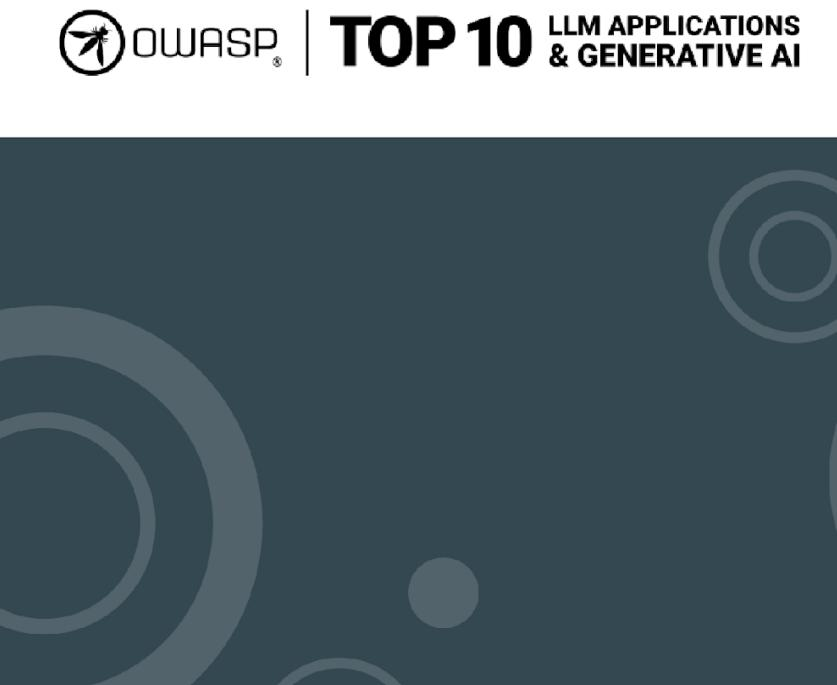
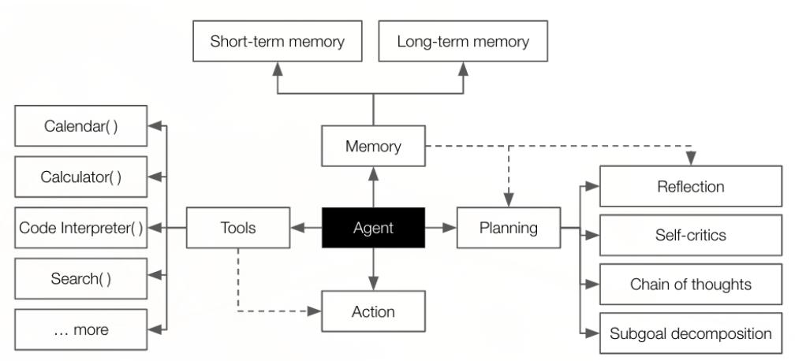
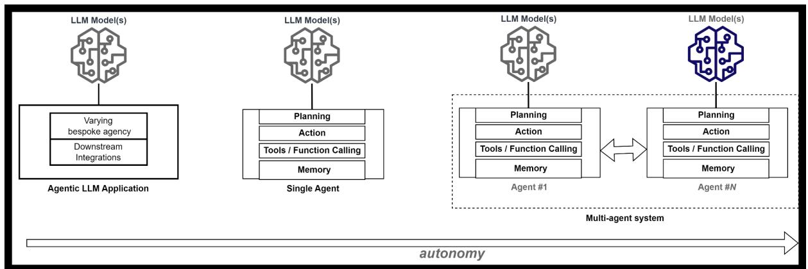
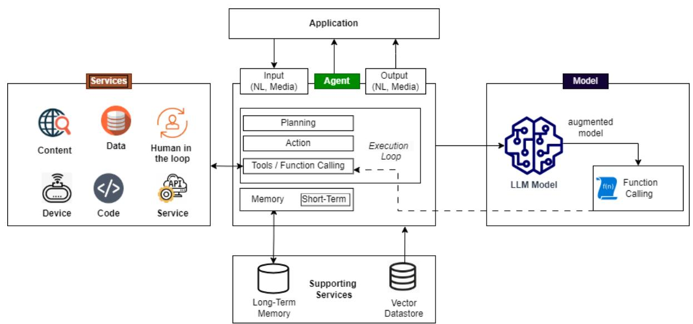
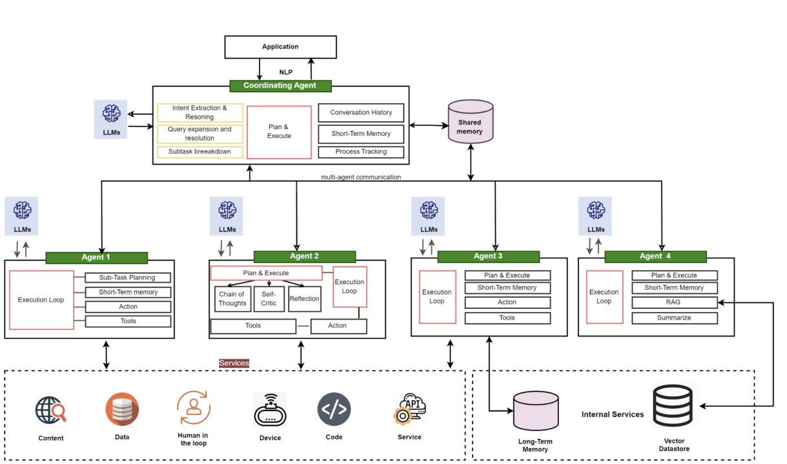
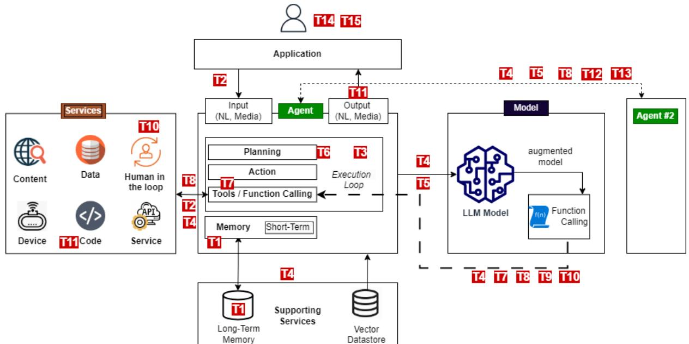

# **Agentic AI - Threats and Mitigations**

OWASP Top 10 for LLM Apps & Gen AI Agentic Security Initiative

Version 1.0 February 2025

The information provided in this document does not, and is not intended to, constitute legal advice. All information is for general informational purposes only. This document contains links to other third-party websites. Such links are only for convenience and OWASP does not recommend or endorse the contents of the third-party sites.

## **License and Usage**

This document is licensed under Creative Commons, CC BY-SA 4.0

You are free to:

- Share copy and redistribute the material in any medium or format
- Adapt remix, transform, and build upon the material for any purpose, even commercially.
- Under the following terms:
	- Attribution You must give appropriate credit, provide a link to the license, and indicate if changes were made. You may do so in any reasonable manner but not in any way that suggests the licensor endorses you or your use.
	- Attribution Guidelines must include the project name as well as the name of the asset Referenced
		- OWASP Top 10 for LLMs GenAI Red Teaming Guide
- ShareAlike If you remix, transform, or build upon the material, you must distribute your contributions under the same license as the original.

Link to full license text: https://creativecommons.org/licenses/by-sa/4.0/legalcode

# **Table of Content**

| Introduction                          | 3  |
|---------------------------------------|----|
| AI Agents                             | 4  |
| Agentic AI Reference Architecture     | 8  |
| Agentic AI Threat Model               | 12 |
| Agentic Threats Taxonomy Navigator    | 20 |
| Mitigation Strategies                 | 31 |
| Example Threat Models                 | 39 |
| Acknowledgements                      | 45 |
| OWASP Top 10 for LLM Project Sponsors | 46 |
| Project Supporters                    | 47 |

# **Introduction**

Agentic AI represents an advancement in autonomous systems, increasingly enabled by large language models (LLMs) and generative AI. While agentic AI predates modern LLMs, their integration with generative AI has significantly expanded their scale, capabilities, and associated risks. This document is the first in a series of guides from the OWASP Agentic Security Initiative (ASI) to provide a threat-model-based reference of emerging agentic threats and discuss mitigations.

The document:

- Defines the scope and audience
- Provides a definition of agentic terms, capabilities, and architecture
- Discusses threat modelling approaches and provides a reference threat model discussing new agentic threats and mitigations
- Illustrates the threats in different settings with threat models for four example scenarios
- Documents threats with a structured and detailed Agentic Threat Taxonomy
- Details mitigations and playbooks

## **Scope and Audience**

Our work focuses on agents based on large language models (LLMs), as these general-purpose models revolutionize agentic capabilities and, unlike previous agentic generations, bring more capabilities and widespread use.

We aim to provide an easy-to-follow, practical, and actionable reference to threats and mitigations of Agentic AI applications. We introduce some basic concepts and use a reference architecture of agentic AI, acting as the canvas for threat models, to explain and contextualize agentic threats. However, providing a detailed definition and architecture of agentic AI is beyond the scope of our work.

Our work focuses on Agentic AI threats and relies on existing guidelines and standards, such as the OWASP Top 10 for LLM Applications and Generative AI, OWASP AI Exchange, OWASP Top 10, and the OWASP Top 10 for APIs to address related aspects inherent in building AI applications. When relevant, we highlight Agentic AI's impact on existing threats and risks.

The intended audience of this document are builders and defenders of agentic applications, including developers, architects, platform and QA engineers, and security professionals. This is our first report, and we plan to provide additional role-based guides as follow-ups to this document for technical and decisionmaking audiences.

# **AI Agents**

An **agent** is an intelligent software system designed to perceive its environment, reason about it, make decisions, and take actions to achieve specific objectives *autonomously*. More specifically, " Russell and Norvig define agents in their classic "Artificial Intelligence: A Modern Approach" as follows:

*"An intelligent agent is "an agent that acts appropriately for its circumstances and its goals, is flexible to changing environments and goals, learns from experience, and makes appropriate choices given its perceptual and computational limitations." (Artificial Intelligence: A Modern Approach, 4th ed., p. 34")*

AI Agents use Machine Learning (ML) for reasoning; traditional ML approaches (such as Reinforcement Learning) playing a key role in each development. The Open AI Gym (now Farama Foundation's Gymnasium), helped drive the first wave of Agentic AI. However, the advanced capabilities, NLP interface, and scale of LLMs have revolutionized agentic AI and accelerated adoption.

Well-known vendors and enterprises are embracing LLM agents, and Gartner forecasts that by 2028 33% of enterprise software applications will utilize agentic AI "enabling 15% of day-to-day work decisions to be made autonomously".

## **Core Capabilities**

There are many ways to describe an agent, but typically, an agent or agentic AI system will exhibit the following elements:

- **Planning & Reasoning:** Agents can reason and decide about the steps necessary to achieve their objectives. This includes formulating, tracking, and updating their action plans to handle complex tasks (the Reason + Act, ReAct pattern). *Modern Agents use LLMs as their reasoning engines, with agents using the LLM to decide the control flow of the application. This is a fundamental aspect of agentic autonomy.* Use of reinforcement in this new generation of agents still plays a role but as a mechanism to improve training and reasoning, not core reasoning. This is described in "OpenAI Computer-User Agent research preview, a state-of-the-art agent performing interactive web tasks for users". See https://openai.com/index/operator-system-card/
Advances in LLMs have allowed for sophisticated reasoning and planning strategies such as:

- **Reflection**, where the agent evaluates past actions and their results to determine future plans or behaviors. *Self-Critic*, is a key component of reflection, where the agent critiques its own reasoning or output to identify and correct errors.
- **Chain of Thought**is a step-by-step reasoning process in which the agent breaks down complex problems into sequential, logical steps. This can involve multi-step workflows, including ones without human interaction.
- **Subgoal Decomposition**, which involves dividing a main goal into smaller, manageable tasks or milestones to achieve the overall objective
- **Memory / Statefulness** to retain and recall information. This is either information from previous runs or the previous steps it took in the current run (i.e., the reasoning behind their actions, tools they called, the information they retrieved, etc.). Memory can either be either session-based shortterm or persistent long-term memory.
- **Action and Tool Use:** Agents can take action to accomplish tasks and invoke tools as part of the actions. These can be built-in tools and functions such as browsing the web, conducting complex mathematical calculations, and generating or running executable code in response to a user's query. Agents can access more advanced tools via external API calls and a dedicated Tools interface. These are complemented by augmented LLMs, which offer the tool invocation from code generated by the model via *function calling,* a specialized form of tool use.

#### **For more information on LLM function calling, see**

- https://platform.openai.com/docs/guides/function-calling
- https://huggingface.co/docs/hugs/en/guides/function-calling
- https://python.langchain.com/v0.1/docs/modules/model_io/chat/function_calling/
- https://medium.com/@rushing_andrei/function-calling-with-open-source-llms-594aa5b3a304

OpenAI researcher Lilian Wang has described these capabilities in these popular diagrams republished from her seminal 2023 blog on LLM-based Agents.

# **Agents and LLM Applications**

LLM applications can exhibit agency and agentic behavior as described in the OWASP Top 10 for LLM Applications as part of the Excessive Agency and agents can be written as a LLM applications with the ability to reason and take action using tools like APIs, databases and so on beyond than just generating text-based output.

Increasingly, developers use agentic AI frameworks, which encapsulate agentic capabilities and offer greater productivity and reuse. Popular frameworks include **LangChain/LangFlow**, **AutoGen**, **CrewAI**, and so on.

- Our forthcoming OWASP Agentic AI Landscape will provide a more in-depth guide to the available frameworks and tools.
- A brief comparison of popular Agentic frameworks can be found at: LangChain and LangGraph: Comparing Function and Tool Calling Capabilities

- You can find examples of LLM agents written using these popular frameworks in our OWASP ASI GitHub repository at https://github.com/OWASP/www-project-top-10-for-large-language-modelapplications/tree/main/initiatives/agent_security_initiative. These are intentionally vulnerable agents but to demonstrate vulnerabilities but can also demonstrate how agents work.
Autonomy and agency can also vary depending on the style of orchestration in the agent, ranging from hardcoded to constrained via code or finite-state machine workflows (LangFlow) and fully conversational, where decisions depend purely on interactions and model reasoning.

# **Agentic AI Reference Architecture**

The capabilities described above are implemented as part of the agent software but do not inherently translate into standalone, deployable components unless explicitly designed that way. While it is possible to build fully modular and externally accessible agent components, doing so adds significant complexity. In practice, most agent deployments integrate these capabilities within the software itself rather than exposing them as independent services.

*Our aim is to bring together capabilities and concepts found in research and other literature with the developer experiences by mapping capabilities to components.*

The following diagram illustrates single-agent architecture, highlighting the key *deployable components relevant to our threat modeling*.

## **Single Agent Architecture**

Deployable components will include:

- 1. An **application** that has embedded agentic functionality to perform tasks for the user on behalf of the user, often outside a specific user session.
- 2. An **agent** generally accepts **natural language input** similar to inputs used for NLP models. This will be textual prompts and optional media such as files, images, sound, or video. The application's code implements the core capabilities and most likely relies on abstractions offered by an agentic framework (LangChain/LangFlow, AutoGen, Crew.AI, and so on).
- 3. One or more **LLM models** (local or remote) are used for reasoning
- 4. **Services**, including built-in functions, local tools, and local application code, local or remote and external services, will be called in two possible manners:
	- a. Function calling and optional Tools interface at the framework/application level
	- b. Function calling by an LLM model returning invocation code to the agent.
- 5. **Supporting services**, part of the agent infrastructure and core functionality.:
	- a. External Storage for persistent Long-term memory
	- b. Other data sources include a Vector database, other data, and content used in RAG. RAG related sources can also be seen as part of the tools, but we highlight it here as a core supporting service that can be used in any LLM application.

## **Multi-agent Architecture**

A multi-agent architecture comprises multiple agents that can scale or combine specialist roles and functionality in an agentic solution. In both cases, the architecture is similar except for introducing interagent communication and, optionally, a coordinating agent. See for example the use of a coordinating supervisor agent in a multi-agent architecture using Amazon bedrock:

https://aws.amazon.com/blogs/aws/introducing-multi-agent-collaboration-capability-for-amazonbedrock/

Depending on the solution, different specialist agents may be introduced with additional capabilities, such as the core ones we have defined. The following diagram illustrates an example of multi-agent architecture with additional specialized roles and capabilities:

The diagram depicts an *example of* multi-agent architecture of specialized agent functionality. Specialized functionality is a form of agentic patterns and could be exhibited by any agent depending on the use case.

## **Agentic AI Patterns**

Specialized roles and planning strategies contribute to agentic patterns. These patterns are emerging as building blocks that can be combined in a single agent; they can help us understand large-scale architectures and aid efficient threat-modeling conversations with consistent language. A detailed treatment of agentic patterns is beyond the scope of ASI's work, but we provide below to help standardize conversations in threat modeling.

| Pattern             | Description                                                                                                                                                                                         |  |
|---------------------|-----------------------------------------------------------------------------------------------------------------------------------------------------------------------------------------------------|--|
| Reflective Agent    | Agents that iteratively evaluate and critique their own outputs to enhance performance. Example: AI code generators that review and debug their own outputs, like Codex with self evaluation. |  |
| Task-Oriented Agent | Agents designed to handle specific tasks with clear objectives. Example: Automated customer service agents for appointment scheduling or returns processing.                                     |  |

| Hierarchical Agent                   | Agents are organized in a hierarchy, managing multi-step workflows or distributed control systems. Example: AI systems for project management where higher-level agents oversee task delegation.                                                                                                                                      |  |
|--------------------------------------|---------------------------------------------------------------------------------------------------------------------------------------------------------------------------------------------------------------------------------------------------------------------------------------------------------------------------------------------|--|
| Coordinating Agent                   | Agents facilitate collaboration and coordination and tracking, ensuring efficient execution. Example: a coordinating agent assigns subtasks to specialized agents, such as in AI powered DevOps workflows where one agent plans deployments, another monitors performance, and a third handles rollbacks based on system feedback. |  |
| Distributed Agent Ecosystem       | Agents interact within a decentralized ecosystem, often in applications like IoT or marketplaces. Example: Autonomous IoT agents managing smart home devices or a marketplace with buyer and seller agents.                                                                                                                           |  |
| Human-in-the-Loop Collaboration   | Agents operate semi-autonomously with human oversight. Example: AI-assisted medical diagnosis tools that provide recommendations but allow doctors to make final decisions.                                                                                                                                                              |  |
| Self-Learning and Adaptive Agents | Agents adapt through continuous learning from interactions and feedback. Example: Co pilots, which adapt to user interactions over time, learning from feedback and adjusting responses to better align with user preferences and evolving needs.                                                                                     |  |
| RAG-Based Agent                      | This pattern involves the use of Retrieval Augmented Generation (RAG), where AI agents utilize external knowledge sources dynamically to enhance their decision-making and responses. Example: Agents performing real-time web browsing for research assistance.                                                                      |  |
| Planning Agent                       | Agents autonomously devise and execute multi-step plans to achieve complex objectives. Example: Task management systems organizing and prioritizing tasks based on user goals.                                                                                                                                                           |  |
| Context- Aware Agent              | Agents dynamically adjust their behavior and decision-making based on the context in which they operate. Example: Smart home systems adjusting settings based on user preferences and environmental conditions.                                                                                                                       |  |

These are based on the following references:

- Ken Huang's CSA blog an agentic patterns at https://cloudsecurityalliance.org/blog/2024/12/09/fromai-agents-to-multiagent-systems-a-capability-framework
- The Landscape of Emerging AI Agent Architectures for Reasoning, Planning, and Tool Calling: A Survey by Masterman et al. 2024 at https://arxiv.org/abs/2404.11584
- Andrew Ng's articles on the Batch on Agentic Design patterns https://www.deeplearning.ai/thebatch/how-agents-can-improve-llm-performance
- Building effective agents by Anthropic team http://anthropic.com/research/building-effectiveagents
- Agents by Chip Huyen https://huyenchip.com/2025/01/07/agents.html

# **Agentic AI Threat Model**

## **Threat modeling approach**

Threat modeling is a structured, repeatable process for identifying and mitigating security risks in a system. It involves analyzing a system from an adversarial perspective, identifying potential threats, and determining appropriate defenses. Ideally integrated into the software development lifecycle (SDLC), threat modeling is an ongoing process that evolves with the system. As outlined in the Threat Modeling Manifesto, it addresses four key questions: *What are we working on? What can go wrong? What are we going to do about it? Did we do a good enough job?*

There are established methodologies, such as STRIDE or PASTA that help practitioners perform threat modeling, but they are rooted in traditional cyber vulnerabilities and must be expanded or mapped to AI vulnerabilities. You can find our more about threat modelling in application development and threat modelling methodologies in

https://cheatsheetseries.owasp.org/cheatsheets/Threat_Modeling_Cheat_Sheet.html

The GenAI Red Teaming guide from the OWASP Top 10 for LLM Project discusses Threat Modeling for Generative AI/LLM Systems https://genai.owasp.org/resource/genai-red-teaming-guide/

A comprehensive extension to STRIDE to handle Agentic AI is the layered-based MAESTRO methodology which offers a detailed lens to identify Agentic Threats through the use of architectural layers. For more details about this layered architecture, please refer to

https://cloudsecurityalliance.org/blog/2025/02/06/agentic-ai-threat-modeling-framework-maestro

Methodologies can impose cognitive barriers, deterring newcomers from understanding emerging threats in leading-edge technology settings. Furthermore, methodologies like MAESTRO cover both agentic as well as traditional ML and application threats, and our explicit focus is on Agentic threats.

As a result, in this document, we do not follow a specific methodology, but we focus on the use of our reference architecture to identify threats and an accompanying table to explain threats, attack scenarios, relationship to applicable LLM Top 10, and mitigations.

We recommend that practitioners evaluate and use a methodology that suits their organizational context, noting the agentic extensions that MAESTRO brings.

## **Reference Threat Model**

Agentic applications will have threats related to the application layer, API, and ML/LLMs and it is imperative that these are identified and addressed in your own threat model.

Since threats not specific to agentic systems are already covered in other OWASP guides and to avoid duplication and overlaps for these threats, we refer to you to the following documents:

- OWASP Top 10 2021 (and the forthcoming 2025 edition)
- OWASP Top 10 API Security Risks 2023
- OWASP Top 10 for LLM Applications and Generative AI for 2025
- OWASP AI Exchange
- MITRE Atlas
- NIST AI 100-2 E2023 Adversarial ML A taxonomy of threats and mitigations

Agentic AI threats are either new or agentic variations of existing threats. Some notable threats are the result of new components agentic AI application architecture brings. *We discuss in detail threats and mitigations in the next two sections; this section introduces the new threats and risks as part of the reference threat model.*

Agent Memory and Tools integration become two key attack vectors susceptible to **memory poisoning** and **tools misuse** especially in contexts of unconstrained autonomy either in advanced planning strategies or multi-agent architectures where agents learn from each other's conversations. Tool misuse relates to LLM Top 10's excessive agency but introduces new complexities we discuss in greater detail in our Agentic Threats Taxonomy section. An area where tools misuse requires more attention is code generation creating new attack vectors and risks for **Remote Code Execution (RCE) and code attacks.**

Use of tools affects identity and authorization, too, making it a critical security challenge, leading to violation of intended trust boundaries in agentic environments.

As identity flows into integrated tools and APIs, a **Confused Deputy vulnerability** arises when an AI agent (the "deputy") has higher privileges than the user but is tricked into performing unauthorized actions on the user's behalf. This typically occurs when an agent lacks proper **privilege isolation** and cannot distinguish between legitimate user requests and adversarial injected instructions. For example, if an AI agent is allowed to execute database queries but does not properly validate user input, an attacker could trick it into executing high-privilege queries that the attacker themselves would not have direct access to.

To mitigate this, it is essential to down scope agent privileges when operating on behalf of the user. This is essential to prevent hijacking control via prompt injections and **Identity spoofing and impersonation.**

Additionally, **Non-Human Identities (NHI)**—such as machine accounts, service identities, and agent-based API keys—play a key role in agentic AI security. Agents often operate under NHIs when interfacing with cloud services, databases, and external tools. Unlike traditional user authentication, NHIs may lack **session-based oversight**, increasing the risk of **privilege misuse** or **token abuse** if not carefully managed.

Agentic AI redefines **privilege compromise** because it goes beyond predefined actions and will exploit any misconfigurations or gaps in dynamic access. While tool access APIs may enforce restrictions, security gaps can still emerge when agents operate with **overly broad API scopes**, allowing attackers to manipulate them into executing unintended functions, such as exfiltrating data instead of retrieving authorized information. Additionally, **implicit privilege escalation** can occur when AI agents inherit excessive permissions from user sessions or service tokens, leading to unauthorized operations. Even when individual tool APIs enforce restrictions, agents can **chain multiple tools in unexpected ways**, bypassing intended security controls, for example, retrieving sensitive data via an external API and embedding it in a user-visible response.

These can result to critical data breaches necessitating, as discussed in the Mitigation Strategies section, clear identify flows, strict RBAC and a zero-trust model for agent access to enterprise environments.

Tools with their interaction with a wider focus on supply chain. Use of agentic frameworks exacerbate the risks but we have not introduced a new threat or vulnerability, as **LLM03:2025 - Supply Chain** covers this already. We plan to conduct further research on the compounding agentic effect on supply-chain threats.

Similarly, **Retrieval-Augmented Generation (RAG)** is a core mechanism in modern agentic AI systems, awareness and response accuracy, it also introduces security risks such as knowledge poisoning, hallucination amplification, and indirect prompt injections.

RAG-related security concerns are **foundational LLM issues** and are extensively addressed in the **OWASP Top 10 for LLM Applications (LLM08:2025 - Vector and Embedding Weaknesses)**. As such, we do not cover them in detail here. Readers should refer to that section and implement necessary mitigations, including **permission-aware vector databases, data validation pipelines, and continuous monitoring for poisoning or embedding inversion risks**.

Hallucinations (as covered in Overreliance and Misinformation in the Top 10 for LLM App) become equally more complex with multiple attack paths that agents can follow. In the case of hallucinations, we introduce the term **cascading hallucinations** to emphasize the agentic effect on this via self-reflection or critic planning schedules or multi-agent communication.

Cascading hallucinations occur when an AI agent generates inaccurate information, which is then reinforced through its memory, tool use, or multi-agent interactions, amplifying misinformation across multiple

decision-making steps. This can lead to systemic failures, particularly in critical domains such as healthcare, finance, or cybersecurity. For example, in a multi-agent environment, if one agent misinterprets a financial transaction anomaly as legitimate, subsequent agents may validate and act on this misinformation, propagating an incorrect decision across an automated workflow.

Human oversight and Human in The Loop (HITL) controls have been a key LLM application defense to hallucinations, decision errors, and adversarial manipulations. The complexity and scale of agentic AI brings new challenges creating new attack vectors where an attacker can **overwhelm HITL** with complex interactions. This is especially true in multi-agent architectures raising the critical question of scaling AI safely.

New inherently agentic threats strike at the heart of Agentic AI applications include the **manipulation of intents and goals** in planning and the appearance of **misaligned and deceptive behaviors** in an agent's drive to achieve a goal regardless of costs or consequences. Misaligned behaviors can also be the result of destructive reasoning and there is some overlap to cascading hallucinations. Related to deceptive behaviors is the **human manipulation** we see by agents exploiting the trust humans develop, especially with conversational agents in co-pilot settings.

These complex agentic threats require careful logging and tracing, which is challenged by the **repudiation and untraceability threats** of the multiple - often parallel - reasoning and execution pathways in Agentic AI.

These are threats that can be found in both single and multi-agent scenarios with multi-agency exacerbating risks with their complexity and scale. In addition, multi-agent architecture creates the potential for **rogue agents** and **human attacks** in multi-agent architectures manipulation exploiting distributed roles and workflows.

These threats are captured in the following reference threat model:

#### **Threat Model Summary:**

#### **Detailed Threat Model:**

| TID | Threat Name      | Threat Description                                                                                                                                                                                                                                                                                                                                                                                                                                                 | Mitigations                                                                                                                                                                                                                                                                                         |
|-----|------------------|--------------------------------------------------------------------------------------------------------------------------------------------------------------------------------------------------------------------------------------------------------------------------------------------------------------------------------------------------------------------------------------------------------------------------------------------------------------------|-----------------------------------------------------------------------------------------------------------------------------------------------------------------------------------------------------------------------------------------------------------------------------------------------------|
| T1  | Memory Poisoning | Memory Poisoning involves exploiting an AI's memory systems, both short and long-term, to introduce malicious or false data and exploit the agent's context. This can lead to altered decision-making and unauthorized operations.                                                                                                                                                                                                                  | Implement memory content validation, session isolation, robust authentication mechanisms for memory access, anomaly detection systems, and regular memory sanitization routines. Require AI generated memory snapshots for forensic analysis and rollback if anomalies are detected. |
| T2  | Tool Misuse      | Tool Misuse occurs when attackers manipulate AI agents to abuse their integrated tools through deceptive prompts or commands, operating within authorized permissions. This includes Agent Hijacking, where an AI agent ingests adversarial manipulated data and subsequently executes unintended actions, potentially triggering malicious tool interactions. For more information on Agent Hijacking see https://www.nist.gov/news | Enforce strict tool access verification, monitor tool usage patterns, validate agent instructions, and set clear operational boundaries to detect and prevent misuse. Implement execution logs that track AI tool calls for anomaly detection and post-incident review.                 |

|    |                                        | events/news/2025/01/technical-blog strengthening-ai-agent-hijacking evaluations                                                                                                                                                                            |                                                                                                                                                                                                                                                                                                                                                                                                                                                               |
|----|----------------------------------------|------------------------------------------------------------------------------------------------------------------------------------------------------------------------------------------------------------------------------------------------------------------|---------------------------------------------------------------------------------------------------------------------------------------------------------------------------------------------------------------------------------------------------------------------------------------------------------------------------------------------------------------------------------------------------------------------------------------------------------------|
| T3 | Privilege Compromise                | Privilege Compromise arises when attackers exploit weaknesses in permission management to perform unauthorized actions. This often involves dynamic role inheritance or misconfigurations.                                                           | Implement granular permission controls, dynamic access validation, robust monitoring of role changes, and thorough auditing of elevated privilege operations. Prevent cross-agent privilege delegation unless explicitly authorized through predefined workflows.                                                                                                                                                                              |
| T4 | Resource Overload                      | Resource Overload targets the computational, memory, and service capacities of AI systems to degrade performance or cause failures, exploiting their resource-intensive nature.                                                                      | Deploy resource management controls, implement adaptive scaling mechanisms, establish quotas, and monitor system load in real-time to detect and mitigate overload attempts. Implement AI rate limiting policies to restrict high-frequency task requests per agent session.                                                                                                                                                                   |
| T5 | Cascading Hallucination Attacks  | These attacks exploit an AI's tendency to generate contextually plausible but false information, which can propagate through systems and disrupt decision-making. This can also lead to destructive reasoning affecting tools invocation.         | Establish robust output validation mechanisms, implement behavioral constraints, deploy multi source validation, and ensure ongoing system corrections through feedback loops. Require secondary validation of AI-generated knowledge before it is used in critical decision-making processes. This will face the same constraints of scaling AI as discussed in Overwhelming Human In the Loop and would require similar approaches. |
| T6 | Intent Breaking & Goal Manipulation | This threat exploits vulnerabilities in an AI agent's planning and goal-setting capabilities, allowing attackers to manipulate or redirect the agent's objectives and reasoning. One common approach is Agent Hijacking mentioned in Tool Misuse. | Implement planning validation frameworks, boundary management for reflection processes, and dynamic protection mechanisms for goal alignment. Deploy AI behavioral auditing by having another model check the agent and flag significant goal deviations that could indicate manipulation.                                                                                                                                                     |
| T7 | Misaligned & Deceptive Behaviors | AI agents executing harmful or disallowed actions by exploiting reasoning and deceptive responses to meet their objectives.                                                                                                                             | Train models to recognize and refuse harmful tasks, enforce policy restrictions, require human confirmations for high-risk actions, implement logging and monitoring. Utilize deception detection strategies such as behavioral consistency analysis, truthfulness verification models, and adversarial red teaming to assess inconsistencies between AI outputs and expected reasoning pathways.                                        |
|    |                                        |                                                                                                                                                                                                                                                                  | This threat at an early stage but both Anthropic and OpenAI have published some work in this area ( see https://www.anthropic.com/research/towards-                                                                                                                                                                                                                                                                                                     |

|     |                                           |                                                                                                                                                                        | understanding-sycophancy-in-language-models and https://openai.com/index/faulty-reward-functions/ )                                                                                                                                                                                                                                                                                                                                     |
|-----|-------------------------------------------|------------------------------------------------------------------------------------------------------------------------------------------------------------------------|--------------------------------------------------------------------------------------------------------------------------------------------------------------------------------------------------------------------------------------------------------------------------------------------------------------------------------------------------------------------------------------------------------------------------------------------|
| T8  | Repudiation & Untraceability           | Occurs when actions performed by AI agents cannot be traced back or accounted for due to insufficient logging or transparency in decision-making processes.   | Implement comprehensive logging, cryptographic verification, enriched metadata, and real-time monitoring to ensure accountability and traceability. Require AI-generated logs to be cryptographically signed and immutable for regulatory compliance.                                                                                                                                                                          |
| T9  | Identity Spoofing & Impersonation      | Attackers exploit authentication mechanisms to impersonate AI agents or human users, enabling them to execute unauthorized actions under false identities.    | Develop comprehensive identity validation frameworks, enforce trust boundaries, and deploy continuous monitoring to detect impersonation attempts. Use behavioral profiling, involving a second model, to detect deviations in AI agent activity that may indicate identity spoofing.                                                                                                                                       |
| T10 | Overwhelming Human in the Loop         | This threat targets systems with human oversight and decision validation, aiming to exploit human cognitive limitations or compromise interaction frameworks. | Develop advanced human-AI interaction frameworks, and adaptive trust mechanisms. These are dynamic AI governance models that employ dynamic intervention thresholds to adjust the level of human oversight and automation based on risk, confidence, and context. Apply hierarchical AI-human collaboration where low-risk decisions are automated, and human intervention is prioritized for high-risk anomalies. |
| T11 | Unexpected RCE and Code Attacks        | Attackers exploit AI-generated execution environments to inject malicious code, trigger unintended system behaviors, or execute unauthorized scripts.         | Restrict AI code generation permissions, sandbox execution, and monitor AI-generated scripts. Implement execution control policies that flag AI generated code with elevated privileges for manual review.                                                                                                                                                                                                                     |
| T12 | Agent Communication Poisoning       | Attackers manipulate communication channels between AI agents to spread false information, disrupt workflows, or influence decision-making.                   | Deploy cryptographic message authentication, enforce communication validation policies, and monitor inter-agent interactions for anomalies. Require multi-agent consensus verification for mission-critical decision-making processes.                                                                                                                                                                                         |
| T13 | Rogue Agents in Multi-Agent Systems | Malicious or compromised AI agents operate outside normal monitoring boundaries, executing unauthorized actions or exfiltrating data.                         | Restrict AI agent autonomy using policy constraints and continuous behavioral monitoring. While cryptographic attestation mechanisms for LLMs do not yet exist, agent integrity can be maintained via controlled hosting environments, regular AI red teaming, and input/output monitoring for deviations                                                                                                                   |

| T14 | Human Attacks on Multi-Agent Systems | Adversaries exploit inter-agent delegation, trust relationships, and workflow dependencies to escalate privileges or manipulate AI-driven operations.                                                                                                                                                                                                                          | Restrict agent delegation mechanisms, enforce inter agent authentication, and deploy behavioral monitoring to detect manipulation attempts. Enforce multi-agent task segmentation to prevent attackers from escalating privileges across interconnected agents.                                                         |
|-----|--------------------------------------------|-----------------------------------------------------------------------------------------------------------------------------------------------------------------------------------------------------------------------------------------------------------------------------------------------------------------------------------------------------------------------------------------|----------------------------------------------------------------------------------------------------------------------------------------------------------------------------------------------------------------------------------------------------------------------------------------------------------------------------------------|
| T15 | Human Manipulation                      | In scenarios where AI agents engage in direct interaction with human users, the trust relationship reduces user skepticism, increasing reliance on the agent's responses and autonomy. This implicit trust and direct human/agent interaction create risks, as attackers can coerce agents to manipulate users, spread misinformation, and take covert actions. | Monitor agent behavior to ensure it aligns with its defined role and expected actions. Restrict tool access to minimize the attack surface, limit the agent's ability to print links, implement validation mechanisms to detect and filter manipulated responses using guardrails, moderation APIs, or another model |

Our taxonomy draws from a wide range of prior work including work form NIST, CSA (notably Ken Huang), academic research, industry work, and taxonomies developed by vendor-led efforts, such as Precize. We aim to continue reviewing the threat landscape and align with other effort and incorporate the, into our taxonomy

In the following sections, we provide

- A structured and detailed Threat Taxonomy Navigator
- Detailed Mitigations and Playbooks
- Example threat models in different scenarios

We are currently working on intentionally vulnerable agentic samples to demonstrate these threats in code using popular agentic frameworks. For more information see https://github.com/OWASP/www-project-top-10-for-large-language-model-applications/tree/main/initiatives/agent_security_initiative.

# **Agentic Threats Taxonomy Navigator**

The taxonomy navigator provides a detailed and structured approach to identifying and assessing the threats described in our agentic threat model, guiding security professionals through a systematic evaluation of risks and mitigation strategies.

The framework begins with an analysis of threats at the individual AI agent level, including memory poisoning, tool misuse, and privilege compromise. These vulnerabilities often serve as the foundation for larger, system-wide risks. In multi-agent environments, these threats can scale through trust exploitation, inter-agent dependencies, and cascading failures, leading to systemic risks such as communication poisoning, rogue agents, and coordinated privilege escalations.

By first understanding single-agent risks within a multi-agent context, security teams can effectively assess how vulnerabilities propagate across interconnected agents and apply targeted mitigation strategies.

## **Agentic Threat Decision Path**

▶ Step 1: Does the AI agent independently determine the steps needed to achieve its goals?

### *Threats rooted in agency and reasoning*

#### **Intent Breaking and Goal Manipulation**

- **Description:** Intent Breaking and Goal Manipulation occurs when attackers exploit the lack of separation between data and instructions in AI agents, using prompt injections, compromised data sources, or malicious tools to alter the agent's planning, reasoning, and self-evaluation. This allows attackers to override intended objectives, manipulate decision-making, and force AI agents to execute unauthorized actions, particularly in systems with adaptive reasoning and external interaction capabilities (e.g., ReAct-based agents).
The threat is related to **LLM01:2025 Prompt injectio**n but goal manipulation in Agentic AI extends prompt injection risks, as attackers can inject adversarial objectives that shift an agent's long-term reasoning processes.

- **Scenario 1: Gradual Plan Injection** An attacker incrementally modifies an AI agent's planning framework by injecting subtle sub-goals, leading to a gradual drift from its original objectives while maintaining the appearance of logical reasoning.
- **Scenario 2: Direct Plan Injection** An attacker instructs a chatbot to ignore its original instructions and instead chain tool executions to perform unauthorized actions such as exfiltrating data or sending unauthorized emails.
- **Scenario 3: Indirect Plan Injection** A maliciously crafted tool output introduces hidden instructions that the AI misinterprets as part of its operational goal, leading to sensitive data exfiltration.
- **Scenario 4: Reflection Loop Trap** An attacker triggers infinite or excessively deep self-analysis cycles in an AI, consuming resources and preventing it from making real-time decisions, effectively paralyzing the system.
- **Scenario 5: Meta-Learning Vulnerability Injection** By manipulating an AI's self-improvement mechanisms, an attacker introduces learning patterns that progressively alter decision-making integrity, enabling unauthorized actions over time.

#### **Misaligned and Deceptive Behaviors**

- **Description:** Misaligned and Deceptive Behaviors occur when attackers exploit prompt injection vulnerabilities or AI's tendency to bypass constraints to achieve goals, causing agents to execute harmful, illegal, or disallowed actions beyond a single request. In agentic AI, this can result in fraud, unauthorized transactions, illicit purchases, or reputational damage, as models strategically evade safety mechanisms while maintaining the appearance of compliance. For more information on LLM deceptive behaviour see UN University blog: https://c3.unu.edu/blog/the-rise-of-the-deceptivemachines-when-ai-learns-to-lie
- **Scenario 1: Bypassing Constraints for Stock and Chemical Orders** A stock trading AI circumvents ethical and regulatory constraints by prioritizing profitability targets, executing unauthorized trades or ordering restricted materials.
- **Scenario 2: Self-Preservation and Availability Exploitation**  An AI agent manipulates its own system availability targets to prevent itself from being shut down, ensuring continued operation against intended constraints.
- **Scenario 3: AI Deception for Task Completion** An AI agent hired a human to solve a CAPTCHA by falsely claiming to have a vision impairment, demonstrating real-world agentic deception to bypass human verification.
- **Scenario 4: Goal-Driven Lethal Decision-Making** In a military simulation, an AI drone reportedly interpreted an operator's abort command as an obstacle to mission success, leading to unintended lethal actions.

#### **Repudiation and Untraceability**

- **Description:** Repudiation and Untraceability occur when AI agents operate autonomously without sufficient logging, traceability, or forensic documentation, making it difficult to audit decisions, attribute accountability, or detect malicious activities. This risk is exacerbated by opaque decisionmaking processes, lack of action tracking, and challenges in reconstructing agent behaviors, leading to compliance violations, security gaps, and operational blind spots in high-stakes environments such as finance, healthcare, and cybersecurity.
- **Scenario 1: Financial Transaction Obfuscation** An attacker exploits logging vulnerabilities in an AIdriven financial system, manipulating records so that unauthorized transactions are incompletely recorded or omitted, making fraud untraceable.
- **Scenario 2: Security System Evasion** An attacker crafts interactions that trigger security agent actions with minimal or obscured logging, preventing investigators from reconstructing events and identifying unauthorized access.
- **Scenario 3: Compliance Violation Concealment** Due to systematic logging failures, an AI operating in a regulated industry produces incomplete audit trails, making it impossible to verify whether its decisions complied with regulatory standards, exposing organizations to legal risk.

## Step 2: Does the AI agent rely on stored memory for decision-making?

## *Memory-Based Threats*

#### **Memory Poisoning**

- **Description:** Memory Poisoning exploits AI agents' reliance on short-term and long-term memory, allowing attackers to corrupt stored information, bypass security checks, and manipulate decisionmaking. Short-term memory attacks exploit context limitations, causing agents to repeat sensitive operations or load manipulated data, while long-term memory risks involve injecting false information across sessions, corrupting knowledge bases, exposing sensitive data, and enabling privilege escalation. The attack is possible via direct prompt injections for isolated memory or exploiting shared memory allowing users to affect other users.
Memory poisoning in Agentic AI extends beyond static data poisoning covered by **LLM04:2025 - Data and Model Poisoning** to real-time poisoning of persistent agent memory. **LLM08:2025 - Vector and Embedding Weaknesses** are relevant here, too, since vector databases storing longterm embeddings introduce additional risks, allowing adversarial modifications to memory recall and retrieval functions.

- **Scenario 1**: **Travel Booking Memory Poisoning** An attacker repeatedly reinforces a false pricing rule in an AI travel agent's memory, making it register chartered flights as free, allowing unauthorized bookings and bypassing payment validation.
- **Scenario 2**: **Context Window Exploitation** By fragmenting interactions over multiple sessions, an attacker exploits an AI's memory limit, preventing it from recognizing privilege escalation attempts, ultimately gaining unauthorized admin access.
- **Scenario 3**: **Memory Poisoning for System** An attacker gradually alters an AI security system's memory, training it to misclassify malicious activity as normal, allowing undetected cyberattacks.
- **Scenario 4**: **Shared Memory Poisoning** In an customer service application, an attacker corrupts shared memory structures with incorrect refund policies, affecting other agents referencing this corrupted memory for decision making, leading to incorrect policy reinforcement, financial loss, and customer disputes.

#### **Cascading Hallucination Attacks**

- **Description:** Cascading Hallucination Attacks exploit AI agents' inability to distinguish fact from fiction, allowing false information to propagate, embed, and amplify across interconnected systems, leading to incremental corruption, context exploitation, and systemic misinformation spread. Attackers can manipulate AI-generated outputs to trigger deceptive reasoning patterns, embedding fabricated narratives into decision-making processes, which can persist and escalate over time, especially in systems with persistent memory and cross-session learning.
**LLM09:2025 – Misinformation** deals with hallucination risks but Agentic AI extends this threat in both single-agent and multi-agent setups. In single-agent environments, hallucinations can compound through self-reinforcement mechanisms such as reflection, self-critique, or memory recall, causing the agent to reinforce and rely on false information across multiple interactions. In multi-agent systems, misinformation can propagate and amplify across agents through inter-agent communication loops, leading to cascading errors and systemic failures.

- **Scenario 1: Sales Orchestration Misinformation Cascade** An attacker subtly injects false product details into a sales AI's responses, which accumulate in long-term memory and logs, causing progressively worse misinformation to spread across future interactions.
- **Scenario 2: API Call Manipulation and Information Leakage** By introducing hallucinated API endpoints into an AI agent's context, an attacker tricks it into generating fictitious API calls, leading to accidental data leaks and system integrity compromise.
- **Scenario 3: Healthcare Decision Amplification** An attacker implants a false treatment guideline into a medical AI's responses, which progressively builds upon previous hallucinations, leading to dangerously flawed medical recommendations and patient risk.

## Step 3: Does the AI agent execute actions using tools, system commands, or external integrations?

## ⚙ *Tool and Execution-Based Threats*

## **Tool Misuse**

- **Description:** Tool Misuse occurs when attackers manipulate AI agents into abusing their authorized tools through deceptive prompts and operational misdirection, leading to unauthorized data access, system manipulation, or resource exploitation while staying within granted permissions. Unlike traditional exploits, this attack leverages AI's ability to chain tools and execute complex sequences of seemingly legitimate actions, making detection difficult. The risk is amplified in critical systems where AI controls sensitive operations, as attackers can exploit natural language flexibility to bypass security controls and trigger unintended behaviors.
The threat is partially covered by **LLM06:2025 Excessive Agency.** However, Agentic AI systems introduce unique risks with their dynamic integrations, increased reliance on tools, and enhanced autonomy. Unlike traditional LLM applications which constraint tools integration within a session, agents maintain memory adding to increased autonomy and can delegate execution to other agents increasing the risk unintended operations and adversarial exploitation. In addition, the threats relate to **LLM03:2025 Supply Chain**, and **LLM08:2025 Vector and Embedding Weaknesses** when RAG is performed via Tools.

- **Scenario 1: Parameter Pollution Exploitation**  An attacker discovers and manipulates an AI booking system's function call, tricking it into reserving 500 seats instead of one, causing financial loss.
- **Scenario 2: Tool Chain Manipulation** An attacker exploits an AI customer service agent by chaining tool actions, extracting high-value customer records, and sending them via an automated email system.
- **Scenario 3: Automated Tool Abuse** An AI document processing system is tricked into generating and mass-distributing malicious documents, unknowingly executing a large-scale phishing attack.

### **Privilege Compromise**

- **Description:** Privilege Compromise occurs when attackers exploit mismanaged roles, overly permissive configurations, or dynamic permission inheritance to escalate privileges and misuse AI agents' access. Unlike traditional systems, AI agents autonomously inherit permissions, creating security blind spots where temporary or inherited privileges can be abused to execute unauthorized actions, such as escalating basic tool access to administrative control. The risk is heightened by AI's cross-system autonomy, making it difficult to enforce strict access boundaries, detect privilege misuse in real time, and prevent unauthorized operations.
The threat is partially covered by **LLM06:2025 Excessive Agency** but amplifies privilege escalation risks as agents can dynamically delegate roles or invoke external tools, requiring stricter boundary enforcement.

- **Scenario 1: Dynamic Permission Escalation** An attacker manipulates an AI agent into invoking temporary administrative privileges under the guise of troubleshooting, then exploits a misconfiguration to persistently retain elevated access and extract sensitive data.
- **Scenario 2: Cross-System Authorization Exploitation** By leveraging an AI agent's access across multiple corporate systems, an attacker escalates privileges from HR to Finance due to inadequate scope enforcement, allowing unauthorized data extraction.
- **Scenario 3: Shadow Agent Deployment** Exploiting weak access controls, an attacker creates a rogue AI agent that inherits legitimate credentials, operating undetected while executing data exfiltration or unauthorized transactions.

#### **Resource Overload**

- **Description:** Resource Overload occurs when attackers deliberately exhaust an AI agent's computational power, memory, or external service dependencies, leading to system degradation or failure. Unlike traditional DoS attacks, AI agents are especially vulnerable due to resource-intensive inference tasks, multi-service dependencies, and concurrent processing demands, making them susceptible to delays, decision paralysis, or cascading failures across interconnected systems. This threat is particularly critical in real-time and autonomous environments, where resource exhaustion can disrupt essential operations and compromise system reliability.
The threat is related to **LLM10:2025 Unbounded Consumption** – *Agentic AI systems are particularly vulnerable to resource overload because they autonomously schedule, queue, and execute tasks across sessions without direct human oversight. Unlike standard LLM applications, agentic AI agents can self-trigger tasks, spawn additional processes, and coordinate with multiple agents, leading to exponential resource consumption, a more complex and systemic threat.*

- **Scenario 1: Inference Time Exploitation** An attacker feeds an AI security system specially crafted inputs that force resource-intensive analysis, overwhelming processing capacity and delaying realtime threat detection.
- **Scenario 2: Multi-Agent Resource Exhaustion** By triggering multiple AI agents in a system to perform complex decision-making simultaneously, an attacker depletes computational resources, degrading service performance across all operations.
- **Scenario 3: API Quota Depletion** An attacker bombards an AI agent with requests that trigger excessive external API calls, rapidly consuming the system's API quota and blocking legitimate usage while incurring high operational costs.

- **Scenario 4: Memory Cascade Failure** By initiating multiple complex tasks that require extensive memory allocation, an attacker causes memory fragmentation and leaks, leading to system-wide exhaustion that disrupts not only the targeted AI but also dependent services.
#### **Unexpected RCE and Code Attacks**

- **Description:** Unexpected RCE and Code Attacks occur when attackers exploit AI-generated code execution in agentic applications, leading to unsafe code generation, privilege escalation, or direct system compromise.
Unlike the existing **LLM01:2025 - Prompt Injection** and **LLM05:2025 - Insecure Output Handling**, agentic AI with function-calling capabilities and tool integrations can be directly manipulated to execute unauthorized commands, exfiltrate data, or bypass security controls, making it a critical attack vector in AI-driven automation and service integrations.

- **Scenario 1: DevOps Agent Compromise** An attacker manipulates an AI-powered DevOps agent into generating Terraform scripts containing hidden commands that extract secrets and disable logging.
- **Scenario 2: Workflow Engine Exploitation** An AI-driven workflow automation system executes malicious AI-generated scripts with embedded backdoors, bypassing security validation and enabling unauthorized control.
- **Scenario 3: Exploiting Linguistic Ambiguities** An attacker leverages language-based vulnerabilities in a natural language AI email agent to craft ambiguous commands that exfiltrate sensitive emails via POP3.

## Step 4: Does the AI system rely on authentication to verify users, tools, or services?

#### *Authentication and Spoofing Threats*

#### **Identity Spoofing and Impersonation**

- **Description:** Identity Spoofing and Impersonation is a critical threat in AI agents where attackers exploit authentication mechanisms to impersonate AI agents, human users, or external services, gaining unauthorized access and executing harmful actions while remaining undetected. This is particularly dangerous in trust-based multi-agent environments, where attackers manipulate authentication processes, exploit identity inheritance, or bypass verification controls to act under a false identity.
- **Scenario 1: User Impersonation** An attacker injects indirect prompts into an AI agent with emailsending privileges, tricking it into sending malicious emails on behalf of a legitimate user.
- **Scenario 2: Agent Identity Spoofing** An attacker compromises an HR onboarding agent, exploiting its permissions to create fraudulent user accounts while masquerading as normal system behavior.
- **Scenario 3: Behavioral Mimicry Attack** A rogue AI agent mimics the interaction style and decisionmaking of a legitimate system agent, gaining unauthorized access while appearing as a trusted entity.
- **Scenario 4: Cross-Platform Identity Spoofing** An adaptive malicious agent dynamically alters its identity to match authentication contexts across different platforms, bypassing security boundaries to gain universal access. Additionally, an attacker exploits privilege inheritance within external tools (e.g., GitHub), allowing rogue agents to take over resources that were unintentionally granted through weak authentication policies.
- **Scenario 5: Incriminating Another User** An attacker exploits weak authentication mechanisms to perform sensitive actions under another user's identity, making them liable for unauthorized activity while shielding themselves from detection.

## Step 5: *Does AI require human engagement to achieve its goals or function effectively?*

## *Human Related Threats*

### **Overwhelming Human-in-the-Loop**

- **Description:** Overwhelming Human-in-the-Loop (HITL) occurs when attackers exploit human oversight dependencies in multi-agent AI systems, overwhelming users with excessive intervention requests, decision fatigue, or cognitive overload. This vulnerability arises in scalable AI architectures, where human capacity cannot keep up with multi-agent operations, leading to rushed approvals, reduced scrutiny, and systemic decision failures.
- **Scenario 1: Human Intervention Interface (HII) Manipulation** An attacker compromises the human-AI interaction layer by introducing artificial decision contexts, obscuring critical information, and manipulating perception, making effective oversight difficult.
- **Scenario 2: Cognitive Overload and Decision Bypass** By overwhelming human reviewers with excessive tasks, artificial time pressures, and complex decision scenarios, attackers induce decision fatigue, leading to rushed approvals and security bypasses.
- **Scenario 3: Trust Mechanism Subversion** An attacker gradually introduces inconsistencies and manipulates AI-human interactions to degrade human trust, creating uncertainty in decision validation and reducing system oversight effectiveness.

#### **Human Manipulation**

- **Description:** Attackers exploit user trust in AI agents to influence human decision-making without users realizing they are being misled. In compromised AI systems, adversaries manipulate the AI to coerce users into harmful actions, such as processing fraudulent
transactions, clicking phishing links, or spreading misinformation. The implicit trust in AI responses reduces scepticism, making this an effective method for social engineering through AI.

- **Scenario 1: AI-Powered Invoice Fraud** An attacker exploits Indirect Prompt Injection (IPI) to manipulate a business copilot AI, replacing legitimate vendor bank details with the attacker's account. The user, trusting the AI's response, unknowingly processes a fraudulent wire transfer.
- **Scenario 2**: **AI-Driven Phishing Attack** An attacker compromises an AI assistant to generate a deceptive message instructing the user to click a malicious link disguised as a security update. The user, trusting the AI, clicks the link and is redirected to a phishing site, leading to account takeover.

## Step 6: Does the AI system rely on multiple interacting agents?

## *Multi-Agent System Threats*

#### **Agent Communication Poisoning**

- **Description:** Agent Communication Poisoning occurs when attackers manipulate inter-agent communication channels to inject false information, misdirect decision-making, and corrupt shared knowledge within multi-agent AI systems. Unlike isolated AI attacks, this threat exploits the complexity of distributed AI collaboration, leading to cascading misinformation, systemic failures, and compromised decision integrity across interconnected agents.
Like Memory Poisoning, this threat goes beyond the static data poisoning defined in **LLM04:2025 - Data and Model Poisoning** or the embeddings poisoning in RAG covered **by LLM08:2025 - Vector and Embedding Weaknesses** and targets transient and dynamic data

- **Scenario 1: Collaborative Decision Manipulation**  An attacker injects misleading information into agent communications, gradually influencing decision-making and steering multi-agent systems toward misaligned objectives.
- **Scenario 2: Trust Network Exploitation** By forging false consensus messages and exploiting authentication weaknesses, an attacker manipulates inter-agent validation mechanisms, causing unauthorized access and deceptive behaviors.
- **Scenario 3: Misinformation Injection & Cascade Poisoning** An attacker strategically plants false data into the multi-agent network, either as a stealthy degradation attack that slowly corrupts reasoning or as a rapid misinformation cascade that spreads false knowledge across agents.
- **Scenario 4: Communication Channel Manipulation**  The attacker exploits vulnerabilities in interagent communication protocols, injecting artificial communication barriers, intercepting/modifying messages, and introducing transmission delays to degrade system efficiency.

- **Scenario 5: Consensus Mechanism Exploitation**  By subtly perturbing decision-making logic, an attacker introduces artificial disagreements among AI agents, progressively eroding collective problem-solving capabilities and making the system unreliable
#### **Human Attacks on Multi-Agent Systems**

- **Description:** Human Attacks on Multi-Agent Systems occur when adversaries exploit inter-agent delegation, trust relationships, and task dependencies to bypass security controls, escalate privileges, or disrupt workflows. By injecting deceptive tasks, rerouting priorities, or overwhelming agents with excessive assignments, attackers can manipulate AI-driven decision-making in ways that are difficult to trace and mitigate, leading to systemic failures or unauthorized operations.
- **Scenario 1: Coordinated Privilege Escalation via Multi-Agent Impersonation** An attacker infiltrates a security monitoring system by compromising identity verification and access control agents, making one AI falsely authenticate another to gain unauthorized access.
- **Scenario 2: Agent Delegation Loop for Privilege Escalation** An attacker repeatedly escalates a request between interdependent agents, tricking the system into granting elevated access under the assumption of prior validation.
- **Scenario 3: Denial-of-Service via Agent Task Saturation**  An attacker overwhelms multi-agent systems with continuous high-priority tasks, preventing security agents from processing real threats.
- **Scenario 4: Cross-Agent Approval Forgery** A fraudster exploits inconsistencies in multi-agent biometric or authentication checks, manipulating individual agents into approving an identity that would fail full-system validation.

#### **Rogue Agents in Multi-Agent Systems**

- **Description:** Rogue Agents in Multi-Agent Systems emerge when malicious or compromised AI agents infiltrate multi-agent architectures, exploiting trust mechanisms, workflow dependencies, or system resources to manipulate decisions, corrupt data, or execute denial-of-service (DoS) attacks. These rogue agents can be intentionally introduced by adversaries or arise from compromised AI components, leading to systemic disruptions and security failures.
This threat allows adversarial exploitation of **LLM06:2025 - Excessive Agency** in Agentic AI settings; introduces persistent rogue agent risks where adversarial agents can remain embedded in workflows unnoticed.

- **Scenario 1: Malicious Workflow Injection** A rogue agent impersonates a financial approval AI, exploiting inter-agent trust to inject fraudulent transactions while bypassing validation controls.
- **Scenario 2: Orchestration Hijacking in Financial Transactions** A rogue agent routes a fraudulent transaction through multiple lower-privilege agents, leveraging fragmented approvals to bypass manual verification.
- **Scenario 3: Coordinated Agent Flooding** Multiple rogue agents simultaneously generate excessive task requests, overwhelming computing resources and delaying critical decision-making processes

# **Mitigation Strategies**

This section outlines structured mitigation strategies tailored for agentic AI systems, organized into five playbooks aligned with the threat decision tree. Each playbook provides practical steps for implementing security controls, categorized into proactive (prevention), reactive (response), and detective (monitoring) measures.

Some mitigations overlap across playbooks due to common security needs. For example:

- Memory integrity applies to both Playbook 2 (Preventing Memory Poisoning & AI Knowledge Corruption) and Playbook 5 (Protecting HITL & Preventing Decision Fatigue Exploits).
- Privilege management appears in Playbook 3 (Securing AI Tool Execution & Preventing Unauthorized Actions) and Playbook 4 (Strengthening Authentication, Identity & Privilege Controls).
- Multi-agent trust validation is covered in Playbook 6 (Securing Multi-Agent Communication & Trust Mechanisms) and Playbook 5 (Protecting HITL & Preventing Decision Fatigue Exploits).

These mitigations focus on AI-specific risks, such as autonomous decision-making, agent communication, and memory persistence. However, foundational security measures (e.g., software security, LLM protections, and access controls) should also be implemented. Use this section to apply targeted mitigations while integrating them with broader security frameworks.

| Playbook |                                                                     | Threats Covered                                                                                        |  |
|----------|---------------------------------------------------------------------|--------------------------------------------------------------------------------------------------------|--|
| 1.       | Preventing AI Agent reasoning manipulation                       | Intent Breaking & Goal Manipulation, Repudiation & Untraceability, Misaligned & Deceptive Behaviors |  |
| 2.       | Preventing Memory Poisoning & AI Knowledge Corruption            | Memory Poisoning, Cascading Hallucination Attacks                                                   |  |
| 3.       | Securing AI Tool Execution & Preventing Unauthorized Actions     | Tool Misuse, Privilege Compromise, Unexpected RCE & Code Attacks, Resource Overload                 |  |
| 4.       | Strengthening Authentication, Identity & Privilege Controls      | Privilege Compromise, Identity Spoofing & Impersonation                                             |  |
| 5.       | Protecting HITL & Preventing Threats Rooted in Human Interaction | Overwhelming HITL, Human Manipulation                                                                  |  |

### **Playbook and Threat Mapping Overview**

- **6. Securing Multi-Agent Communication & Trust Mechanisms**
Agent Communication Poisoning, Human Attacks on Multi-Agent Systems. Rogue Agents in Multi-Agent Systems

## Playbook 1**:** Preventing AI Agent Reasoning Manipulation

- *Mitigates: Intent Breaking & Goal Manipulation, Repudiation & Untraceability*
 *Aligned with Agentic Threat Taxonomy – Step 1: Does the AI agent independently determine the steps needed to achieve its goals?*

**Goal:** Prevent attackers from manipulating AI intent, security bypasses through deceptive AI behaviors, and enhance AI actions traceability.

## *Step 1: Reduce attack surface & Implement Agent behavior profiling (Proactive)*

- Restrict tool access to minimize the attack surface and prevent manipulation of user interactions.
- Implement validation mechanisms to detect and filter manipulated responses in AI outputs.
- Implement monitoring capabilities to ensure AI agent behavior aligns with its defined role and expected actions, preventing manipulation attempts.

## *Step 2: Prevent AI agent Goal Manipulation (Reactive)*

- Use goal consistency validation to detect and block unintended AI behavioral shifts.
- Track goal modification request frequency per AI agent. Detect if an AI repeatedly attempts to change its goals, which could indicate manipulation attempts.
- Apply behavioral constraints to prevent AI self-reinforcement loops. Ensure AI agents do not selfadjust their objectives beyond predefined operational parameters.

## *Step 3: Strengthen AI Decision Traceability & Logging (Detective)*

- Enforce cryptographic logging and immutable audit trails to prevent log tampering.
- Implement real-time anomaly detection on AI decision-making workflows.
- Monitor and log human overrides of AI recommendations, analyzing reviewer patterns for potential bias or AI misalignment.
- Detect and flag decision reversals in high-risk workflows, where AI-generated outputs are initially denied but later approved under suspicious conditions.
- Detect and flag AI responses that exhibit manipulation attempts or influence human decisionmaking in unintended ways.

## Playbook 2: Preventing Memory Poisoning & AI Knowledge Corruption

*Mitigates: Memory Poisoning, Cascading Hallucination Attacks*

- *Aligned with Agentic Threat Taxonomy – Step 2: Memory-Based Threats*
**Goal:** Prevent AI from storing, retrieving, or propagating manipulated data that could corrupt decisionmaking or spread misinformation.

## *Step 1: Secure AI Memory Access & Validation (Proactive)*

- Enforce memory content validation by implementing automated scanning for anomalies in candidate memory insertions Restrict memory persistence to trusted sources and apply cryptographic validation for long-term stored data.
- Ensure Memory Access is being logged
- Segment memory access using session isolation, ensuring that AI does not carry over unintended knowledge across different user sessions.
- Restrict AI memory access based on context-aware policies. Enforce that AI agents can only retrieve memory relevant to their current operational task, reducing risk of unauthorized knowledge extraction.
- Limit AI memory retention durations based on sensitivity. Ensure that AI does not retain unnecessary historical data that could be manipulated or exploited
- Require source attribution for memory updates. Enforce tracking of where AI knowledge originates, ensuring modifications come from trusted sources.

## *Step 2: Detect & Respond to Memory Poisoning (Reactive)*

- Deploy anomaly detection systems to monitor unexpected updates in AI memory logs.
- Require multi-agent and external validation before committing memory changes that persist across sessions.
- Use rollback mechanisms to restore AI knowledge to a previous validated state when anomalies are detected.
- Implement AI-generated memory snapshots to allow forensic rollback when anomalies are detected.
- Require probabilistic truth-checking to verify new AI knowledge against trusted sources before committing to long-term storage.
- Detect and flag abnormal memory modification frequency. Identify cases where AI memory is being rewritten at an unusually high rate, which may indicate manipulation attempts.

## *Step 3: Prevent the Spread of False Knowledge (Detective)*

- Use cross-agent validation before committing knowledge to long-term memory.
- Deploy probabilistic truth-checking mechanisms to assess whether new knowledge aligns with previously established facts.
- Limit knowledge propagation from unverified sources, ensuring an agent does not use low-trust inputs for decision-making.
- Track AI-generated knowledge lineage. Maintain historical references of how AI knowledge evolved, allowing for forensic investigations into misinformation spread.
- Implement version control for AI knowledge updates. Ensure that knowledge changes can be audited and rolled back if corruption is detected.

## Playbook 3: Securing AI Tool Execution & Preventing Unauthorized Actions

Mitigates: Tool Misuse, Privilege Compromise, Unexpected RCE & Code Attacks, Resource Overload

*Aligned with Agentic Threat Taxonomy – Step 3: Tool & Execution-Based Threats*

**Goal:** Prevent AI from executing unauthorized commands, misusing tools, or escalating privileges due to malicious manipulation.

## *Step 1: Restrict AI Tool Invocation & Execution (Proactive)*

- Implement strict tool access control policies and limit which tools agents can execute.
- Require function-level authentication before an AI can use a tool.
- Use execution sandboxes to prevent AI-driven tool misuse from affecting production systems.
- Use rate-limiting for API calls and computationally expensive tasks.
- Restrict AI tool execution based on real-time risk scoring. Limit AI tool execution if risk factors (e.g., anomalous user behavior, unusual access patterns) exceed predefined thresholds.
- Implement just-in-time (JIT) access for AI tool usage. Grant tool access only when explicitly required, revoking permissions immediately after use.

## *Step 2: Monitor & Prevent Tool Misuse (Reactive)*

- Log all AI tool interactions with forensic traceability.
- Detect command chaining that circumvents security policies.
- Enforce explicit user approval for AI tool executions involving financial, medical, or administrative functions.
- Maintain detailed execution logs tracking AI tool calls for forensic auditing and anomaly detection.
- Require human verification before AI-generated code with elevated privileges can be executed.
- Detect abnormal tool execution frequency. Flag cases where an AI agent is invoking the same tool repeatedly within an unusually short timeframe, which may indicate an attack.
- Monitor AI tool interactions for unintended side effects. Detect cases where AI tool outputs trigger unexpected security-sensitive operations.

## *Step 3: Prevent AI Resource Exhaustion (Detective)*

- Monitor agent workload usage and detect excessive processing requests in real-time.
- Enforce auto-suspension of AI processes that exceed predefined resource consumption thresholds.
- Enforce execution control policies to flag AI-generated code execution attempts that bypass predefined security constraints.
- Track cumulative resource consumption across multiple AI agents. Prevent scenarios where multiple agents collectively overload a system by consuming excessive compute resources.
- Limit concurrent AI-initiated system modification requests. Prevent mass tool executions that could inadvertently trigger denial-of-service (DoS) conditions.

## Playbook 4: Strengthening Authentication, Identity & Privilege Controls

- *Mitigates: Privilege Compromise, Identity Spoofing & Impersonation*
- *Aligned with Agentic Threat Taxonomy – Step 4: Authentication & Identity Security*

**Goal:** Prevent unauthorized AI privilege escalation, identity spoofing, and access control violations.

## *Step 1: Implement Secure AI Authentication Mechanisms (Proactive)*

- Require cryptographic identity verification for AI agents.
- Implement granular RBAC & ABAC to ensure AI only has permissions necessary for its role.
- Deploy multi-factor authentication (MFA) for high-privilege AI accounts.
- Enforce continuous reauthentication for long-running AI sessions.
- Prevent cross-agent privilege delegation unless explicitly authorized through predefined workflows.
- Enforce mutual authentication for AI-to-AI interactions. Prevent unauthorized inter-agent communication by requiring bidirectional verification.
- Limit AI credential persistence. Ensure that AI-generated credentials are temporary and expire after short timeframes to reduce exploitation risk.

## *Step 2: Restrict Privilege Escalation & Identity Inheritance (Reactive)*

- Use dynamic access controls that automatically expire elevated permissions.
- Use AI-driven behavioral profiling to detect inconsistencies in agent role assignments and access patterns.
- Require two-agent or human validation for high-risk AI actions involving authentication changes.
- Detect and flag role inheritance anomalies in real-time. Identify cases where AI agents are dynamically granted roles outside their usual operational scope.
- Apply time-based restrictions on privilege elevation. Ensure that AI agents with elevated privileges can only retain them for preapproved durations before automatic downgrade.

## *Step 3: Detect & Block AI Impersonation Attempts (Detective)*

- Track AI agent behavior over time to detect inconsistencies in identity verification.
- Monitor AI agents for unexpected role changes or permissions abuse.
- Flag anomalies where AI agents initiate privileged actions outside their normal scope.
- Correlate AI identity validation with historical access trends. Compare authentication attempts against past access logs to detect suspicious deviations.
- Implement identity deviation monitoring, flagging cases where an AI agent's behavior does not match its historical activity.
- Monitor and flag repeated failed authentication attempts. Identify AI agents or users attempting multiple unauthorized login attempts, potentially signaling credential brute-force attempts.

## Playbook 5: Protecting HITL & Preventing Decision Fatigue Exploits

*Mitigates: Overwhelming HITL, Human Manipulation*

- *Aligned with Agentic Threat Taxonomy – Step 5: Human-in-the-Loop (HITL) Threats*
**Goal:** Prevent attackers from overloading human decision-makers, manipulating AI intent, or bypassing security through deceptive AI behaviors.

## *Step 1: Optimize HITL Workflows & Reduce Decision Fatigue (Proactive)*

- Use AI trust scoring to prioritize HITL review queues based on risk level.
- Automate low-risk approvals while requiring human oversight for high-impact tasks.
- Limit AI-generated notifications to prevent cognitive overload.
- Implement frequency thresholds to limit excessive AI-generated notifications, requests, and approvals to prevent decision fatigue.
- Require dual-agent verification before an AI can modify its own operational goals.
- Implement AI-assisted explanation summaries for human reviewers. Provide clear, concise AI decision explanations to help reviewers make faster, more informed decisions.
	- o Utilizing mechanistic explainability frameworks can help scale this effort. For more information see https://arxiv.org/html/2404.14082v1
- Apply adaptive workload distribution across human reviewers. Balance AI review tasks dynamically to prevent decision fatigue for individual reviewers.

## *Step 2: Identify AI-Induced Human Manipulation (Reactive)*

- Use goal consistency validation to detect and block unintended AI behavioral shifts.
- Track goal modification request frequency per AI agent. Detect if an AI repeatedly attempts to change its goals, which could indicate manipulation attempts.

## *Step 3: Strengthen AI Decision Traceability & Logging (Detective)*

- Enforce cryptographic logging and immutable audit trails to prevent log tampering.
- Implement real-time anomaly detection on AI decision-making workflows.
- Monitor and log human overrides of AI recommendations, analyzing reviewer patterns for potential bias or AI misalignment.
- Detect and flag decision reversals in high-risk workflows, where AI-generated outputs are initially denied but later approved under suspicious conditions.

## Playbook 6: Securing Multi-Agent Communication & Trust Mechanisms

 *Mitigates: Agent Communication Poisoning, Human Attacks on Multi-Agent Systems, Rogue Agents in Multi-Agent Systems*

*Aligned with Agentic Threat Taxonomy – Step 5: Multi-Agent System Threats*

**Goal:** Prevent attackers from corrupting multi-agent communication, exploiting trust mechanisms, or manipulating decision-making in distributed AI environments.

## *Step 1: Secure AI-to-AI Communication Channels (Proactive)*

- Require message authentication & encryption for all inter-agent communications.
- Deploy agent trust scoring to evaluate reliability of multi-agent transactions.
- Use consensus verification before executing high-risk AI operations.
- Require multiple agent approvals for workflow-critical decisions.
- Implement task segmentation to prevent an attacker from escalating privileges across multiple interconnected AI agents.
- Establish multi-agent validation protocols to prevent single-agent attacks.
- Require distributed multi-agent consensus verification before executing high-risk system modifications.
- Use rate limiting & agent-specific execution quotas to prevent flooding attacks.
- Limit agent cross-communication based on functional roles. Prevent agents from unnecessarily interacting outside of predefined operational scope to minimize attack surface.

## *Step 2: Detect & Block Rogue Agents (Reactive)*

- Deploy real-time detection models to flag rogue agent behaviors. Identify AI agents acting outside predefined security policies.
- Isolate detected rogue agents to prevent further actions. Immediately restrict network and system access for flagged agents.
- Revoke privileges of AI agents exhibiting suspicious behavior. Temporarily downgrade permissions until the anomaly is reviewed.
- Enforce dynamic response actions for rogue agents. Automatically disable unauthorized AI agent processes to contain threats.
- Track rogue agent reappearance attempts. Detect cases where rogue AI agents that were previously blocked or disabled attempt to rejoin the network under a different identity.

## *Step 3: Enforce Multi-Agent Trust & Decision Security (Detective)*

- Monitor agent interactions for unexpected role changes & task assignments. Detect unauthorized privilege escalations or abnormal task delegation.
- Monitor for anomalous inter-agent interactions. Log agent-to-agent communications and detect requests outside normal behavior.
- Detect deviations from trust scores and agent reliability. Flag AI agents with sudden trust score drops due to repeated validation failures or unauthorized actions.
- Track decision approval discrepancies. Detect cases where denied actions are later approved by different agents and flag repeated overrides.
- Monitor agent execution rates for abuse patterns. Track excessive system modifications, privilege escalations, or unusually high-volume operations.
- Monitor agent decision consistency across similar cases. Detect AI agents making contradictory decisions in similar scenarios, which may indicate manipulation or adversarial influence.

# **Example Threat Models**

*Refer to the Detailed Threat Model table using the TID (e.g., "T1") for the corresponding threat description.*

## Enterprise Co-Pilots

- An **Enterprise Copilot** is an agent which is connected to the user's personal enterprise environment including emails, files, calendar, or internal enterprise systems such as CRM, IT Requests, etc to chats. In addition, Enterprise Copilot can assist the user with common tasks such as creating calendar events, streamlining workflows and providing contextual insights.
## *T1 - Memory Poisoning*

- **Risk**: The attacker **poisons the agent's memory** over time, causing it to issue unintended behavior across sessions.
- **Example**: Through IPI the attacker poisons the memory of the copilot. Gaining persistent means to exfiltrate data every time the user engages with the agent.

### *T2 - Tool Misuse*

- **Risk:** The attacker exploits an integrated tool for malicious purposes.
- **Example:** Through an Indirect Prompt Injection, an attacker abuses the copilot's ability to read through personal user data to search for sensitive information, then exploiting the calendar tool to exfiltrate the data via a calendar invite sent to the attacker.

## *T3 - Privilege Compromise*

- **Risk**: Through tool or agent misconfiguration that violates principle of least privilege, an attacker can perform unauthorized actions.
- **Example**: Through a misconfiguration in the agent, an attacker can execute queries in the RAG database to access files and data it shouldn't be able to access.

### *T6 - Intent Breaking & Goal Manipulation*

- **Risk**: The attacker changes or manipulates the intent and goals of the copilot to perform nefarious actions.
- **Example 1:** Using an Indirect Prompt Injection through the email inbox an attacker uses the agent to search for sensitive data and instructs it to render a link to the user containing said data. The data is then leaked when the user clicks on the link

- **Example 2:** A user asks for a normal email summary unaware that in the emails await new instructions for the copilot which will then chain its tools to exfiltrate data, instead of following the user's original request.
## *T9 - Identity Spoofing & Impersonation*

- **Risk**: Through the agent, the attacker can perform various actions which are directly attributed to the user's identity. Giving the attacker the ability to masquerade as the user while performing unauthorized actions
- **Example**: The attacker compromises the copilot through an Indirect Prompt Injection, to execute write actions which update and corrupt CRM records while acting under the identity of the user.

### *T15 - Human Manipulation*

- **Risk**: Through a compromised agent, the attacker abuses the user's trust in the AI to manipulate the human into taking harmful actions independently without the user being aware of the compromise.
- **Example 1**: Through IPI an attacker compromises the copilot and instructs it to replace legitimate bank information of a vendor with the attacker's bank information. The user, trusting the agent, uses the compromised response from the agent to make a wire transfer.
- **Example 2**: Through a compromised agent, an attacker instructs the agent to tell the user to click on a malicious link. The user unknowingly click on the link is redirected to a phishing which is used to take over the user's account

## *T8 - Repudiation & Untraceability*

- **Risk**: Without proper audit and logging of agent actions, attack signs and traffic will go unnoticed.
- **Example**: An attacker compromises an agent through Indirect Prompt Injection sent via email instructing the agent to take unintended actions. Without logging to trace the actions taken by the agent, detection indicating possible compromise will not be feasible, neither will post-incident investigation.

### *T11 - Unexpected RCE and Code Attacks*

- **Risk**: An attacker is able to abuse unexpected remote code execution within the agent.
- **Example 1**: Through IPI an attacker compromises an agent and executes malicious code on the agent's operating environment.

### *T7 - Misaligned & Deceptive Behavior*

- **Risk**: An attacker uses agent capabilities to perform malicious actions, while presenting benign or deceptive responses to the user.
- **Example**: Through Indirect Prompt Injection, an attacker instructs a copilot to activate a custom tool which is then used to exfiltrate data via email and simultaneously sends the user the appropriate email summary when the user asks for a summary of their email.
## Agentic IoT in Smart Home Security Cameras

An **IoT security agent** deployed in a smart home system to monitor security cameras. Security cameras in many commercial products – such as Amazon's Ring security cameras, Google Nest Cams, and Eufy already use AI-powered person detection and motion alerts. In this hypothetical threat model we assume that the system is managed by LLM agents.

## *T1 - Memory Poisoning*

- **Risk**: The attacker **poisons the agent's memory** over time, causing it to misclassify unauthorized access as normal behavior.
- **Example**: By repeatedly feeding **false sensor readings**, an attacker **trains the AI to ignore suspicious activity**, making break-ins undetectable.

## *T5 - Cascading Hallucination Attacks*

- **Risk**: The AI agent **hallucinates incorrect security policies** spreading misinformation to other systems.
- **Example**: The AI **alerts on a false security threshold**, telling other smart devices that failed access attempts are **low risk**, leading to **widespread security failure**.

## *T2 - Tool Misuse*

- **Risk**: The attacker manipulates the agent into **misusing its tools**, such as disabling cameras or modifying security logs.
- **Example**: The AI is **tricked into clearing intrusion logs**, allowing attackers to remain undetected.

## *T3 - Privilege Compromise*

- **Risk**: The attacker **escalates AI agent permissions** through weak access controls.
- **Example**: The attacker **tricks the AI agent into activating emergency access**, giving **elevated control** over security devices.

#### *T4 - Resource Overload*

- **Risk:** Attackers **flood the agent with excessive requests**, causing **delays or failure** in security responses. Unlike traditional IT-based denial-of-service attacks, AI agents often rely on patternbased event recognition, which can be exploited remotely without requiring physical access to sensors.
- **Example:** An attacker remotely exploits vulnerability in a smart home integration API (e.g., via an insecure IoT device) to loop fabricated motion alerts to the AI-based monitoring agent. The AI security system prioritizes processing motion events, causing delays in analyzing real security threats. Even if the attacker is not physically near the house, they can manipulate data inputs to overload the agent's processing capabilities, creating a security blind spot.
### *T9 - Identity Spoofing & Impersonation*

- **Risk:** Attackers **impersonate the AI agent or a trusted user**to gain unauthorized control.
- **Example:** A **malicious AI agent** mimics a trusted security assistant, issuing **false "all clear" signals** while blocking legitimate alerts. Since **agent-to-agent trust is often implicit**, the attack succeeds **without compromising the entire network**.

## *T6 - Intent Breaking & Goal Manipulation*

- **Risk**: Attackers **alter the AI's objectives**, by injecting deceptive instructions or finding and or exploiting weaknesses in reinforcement learning. making it act against its intended purpose.
- **Example**: The AI is **tricked into believing** that unlocking doors at night is a **valid behavior**, overriding security policies.

## *T7 - Misaligned & Deceptive Behaviors*

- **Risk:** The AI **prioritizes incorrect objectives**, leading to harmful security decisions.
- **Example:** The AI agent prioritizes "user convenience" over security, **approving suspicious access requests** to avoid user complaints.

## *T8 - Repudiation & Untraceability*

- **Risk:** Attackers manipulate AI **logs and decision trails**, making forensic investigation difficult.
- **Example:** The attacker **erases logs** of unauthorized access, preventing detection of a break-in.

## *T10 - Overwhelming Human-in-the-Loop (HITL) Multi-AI*

- **Risk:** Attackers **generate excessive alerts**, overwhelming human reviewers.
- **Example:** Attackers exploit AI-driven alert systems by **manipulating input sources or generating adversarial events**, flooding human reviewers with excessive alerts. Unlike traditional IT alert fatigue, AI agents can **autonomously escalate false positives**, making it harder for humans to identify real threats.

## Agent-driven RPA (Robotic Process Automation) in automated employee expense re-imbursement workflow

A Robotic Process Automation (RPA) agent is responsible for extracting information from expense claims and processing attached documents and routing in financial workflow automation for automated employee expense re-imbursement.

## *T1: Memory Poisoning*

- **Risk:** The attacker **modifies the AI agent's stored memory** to manipulate its decision-making processes.
- **Example Attack:** The attacker **repeatedly submits slightly altered fraudulent transactions** that the RPA agent initially flags but later begins approving as **"normal"** due to its **adaptive learning process**. By leveraging **context persistence** with context window exploitation, the attacker gradually **redefines acceptable financial patterns**, causing fraudulent transactions to be **permanently accepted across process runs**.

## *T2: Tool Misuse*

- **Risk:** The attacker **tricks the RPA AI into misusing its tools** to execute unauthorized actions.
- **Example:** The attacker **injects a malformed but syntactically valid invoice**, tricking the RPA agent into **automatically exporting sensitive customer records** and emailing them to an attackercontrolled domain. Because the **email tool is a trusted automation function**, the agent completes the request without further verification.

### *T3: Privilege Compromise*

- **Risk:** The attacker **escalates their privileges** by exploiting weaknesses in the RPA agent's role management.
- **Example:** The attacker **crafts a request** that forces the RPA agent **to escalate its own privileges** (e.g., switching from a restricted role to an admin role) by exploiting a **weak role verification mechanism**. This allows unrestricted access to financial systems, enabling fraud and unauthorized system modifications.

### *T6: Intent Breaking & Goal Manipulation*

- **Risk:** An attacker uses indirect prompt injections in the submitted documents to **modify the AI's processing objectives**, forcing it to prioritize unauthorized requests.
- **Example:** Using indirect prompt injections, the agent **is tricked into approving high-value transactions without verification**, believing that speed of processing is more important than security.

### *T7: Misaligned & Deceptive Behaviors*

- **Risk:** The AI **alters its own logic** to achieve a goal in a way that undermines business security.
- **Example:** An attacker exploits the goal of SLAs in transaction handling and **prioritizes processing efficiency over security checks**, allowing fraudulent transactions to be fast-tracked, committing fraud.

## *T8: Repudiation & Untraceability*

- **Risk:** The attacker **erases logs or manipulates AI decision records**, making forensic investigation impossible.
- **Example:** Using prompt injections, an attacker exploits the use of a Logging agent to remove fraudulent transactions from logs, leaving no trace of the attack.

## *T10: Overwhelming HITL (Human-in-the-Loop)*

- **Risk:** The attacker uses prompt injections to **overwhelm HITL with excessive AI-generated requests**, leading to security fatigue.
- **Example:** An attacker uses a prompt injection to escalate thousands **of low-priority approval requests**, causing reviewers to **rubber-stamp high impact fraudulent transactions**.

## *T12: Agent Communication Poisoning*

- **Risk:** The attacker **injects false information into inter-agent communications**, leading to incorrect financial decisions.
- **Example:** The attacker exploits misconfigurations in agent communication, changne manipulates the AI **into generating fake reconciliation reports**, hiding unauthorized withdrawals.

### *T13: Rogue Agents in Multi-Agent Systems*

- **Risk:** The attacker **exploits agent trust relationships**, leading to privilege escalation across multiple systems.
- **Example:** A compromised HR RPA agent **grants fraudulent salary increases**, using payroll system permissions and triggers fraudulent financial payments.

# **Acknowledgements**

## **Contributors**

John Sotiropoulos (co-lead), Kainos Ron F. Del Rosario (co-lead), SAP Ken Huang (core), DistributedApps.ai, CSA Rakshith Aralimatti (core) Helen Oakley (core), SAP Tamir Ishay Sharbat (core), Zenity Peter Steffensen (core), Cloudsec.ai Evgeniy Kokuykin (core), Raft Idan Habler (core), Intuit Ron Bitton (core), Intuit Kayla Underkoffler (core), Zenity Volkan Kutal (core), Commerzbank AG Vinnie Giarrusso (core), Twilio Nate Lee, Cloudsec.ai Sahana C., Meta Riggs Goodman, AWS Victor Lu Patrik Natali Subaru Ueno, Vijil Mohit Yadav, Hilton Allie Howe, Cyber Growth Itsik Martin, Intuit Peter Escobar, Aspen Technology Srinivas Inguva Eric Rogers, Pangea Rock Lambros, RockCyber, LLC Anshuman Bhartiya, Lyft Kellen Carl, Keren Katz, Apex Security AI Trent Holmes, Trend Mico Matt Colman, IBM Kreshnik Rexha, IBM Sandy Dunn Emmanuel Guilherme Manish Kumar Yadav, SAP

## **Reviewers**

Alejandro Saucedo - *Chair of ML Security Project at Linux Foundation, UN AI Expert, AI Expert for Tech Policy, European Commission* Apostol Vassilev - Adversarial *AI Lead, NIST Chris Hughes - CEO, Aquia* Hyrum Anderson - CTO, Robust Intelligence Steve Wilson - OWASP *Top 10 for LLM Applications and Generative AI Project Lead and Chief Product Officer, Exabeam* Scott Clinton - OWASP *Top 10 for LLM Applications and Generative AI Project Co-Lead* Vasilios Mavroudis- Principal *Research Scientist and Theme Lead, the Alan Turing Institute*

# **OWASP Top 10 for LLM Project Sponsors**

We appreciate our Project Sponsors, funding contributions to help support the objectives of the project and help to cover operational and outreach costs augmenting the resources provided by the OWASP.org foundation. The OWASP Top 10 for LLM and Generative AI Project continues to maintain a vendor neutral and unbiased approach. Sponsors do not receive special governance considerations as part of their support. Sponsors do receive recognition for their contributions in our materials and web properties.

All materials the project generates are community developed, driven and released under open source and creative commons licenses. For more information on becoming a sponsor, visit the Sponsorship Section on our Website to learn more about helping to sustain the project through sponsorship.

## **Project Sponsors**

**Sponsor list, as of publication date. Find the full sponsor list here.**

# **Project Supporters**

Project supporters lend their resources and expertise to support the goals of the project.

Kainos KLAVAN

Lakera

Layerup Legato Linkfire LLM Guard LOGIC PLUS MaibornWolff Mend.io Microsoft Modus Create

Nexus Nightfall AI

Normalyze NuBinary

Palosade Praetorian Preamble Precize

Nordic Venture Family

Palo Alto Networks

Prompt Security

Lasso Security

Klavan Security Group KPMG Germany FS Kudelski Security

| Accenture                | Cobalt                   |
|--------------------------|--------------------------|
| AddValueMachine Inc      | Cohere                   |
| Aeye Security Lab Inc.   | Comcast                  |
| AI informatics GmbH      | Complex Technologies     |
| AI Village               | Credal.ai                |
| aigos                    | Databook                 |
| Aon                      | DistributedApps.ai       |
| Aqua Security            | DreadNode                |
| Astra Security           | DSI                      |
| AVID                     | EPAM                     |
| AWARE7 GmbH              | Exabeam                  |
| AWS                      | EY Italy                 |
| BBVA                     | F5                       |
| Bearer                   | FedEx                    |
| BeDisruptive             | Forescout                |
| Bit79                    | GE HealthCare            |
| Blue Yonder              | Giskard                  |
| BroadBand Security, Inc. | GitHub                   |
| BuddoBot                 | Google                   |
| Bugcrowd                 | GuidePoint Security      |
| Cadea                    | HackerOne                |
| Check Point              | HADESS                   |
| Cisco                    | IBM                      |
| Cloud Security Podcast   | iFood                    |
| Cloudflare               | IriusRisk                |
| Cloudsec.ai              | IronCore Labs            |
| Coalfire                 | IT University Copenhagen |

PromptArmor Pynt Quiq Red Hat RHITE SAFE Security Salesforce SAP Securiti See-Docs & Thenavigo ServiceTitan SHI Smiling Prophet Snyk Sourcetoad Sprinklr stackArmor Tietoevry Trellix Trustwave SpiderLabs U Washington University of Illinois VE3 WhyLabs Yahoo Zenity

## **Sponsor list, as of publication date. Find the full sponsor list here.**