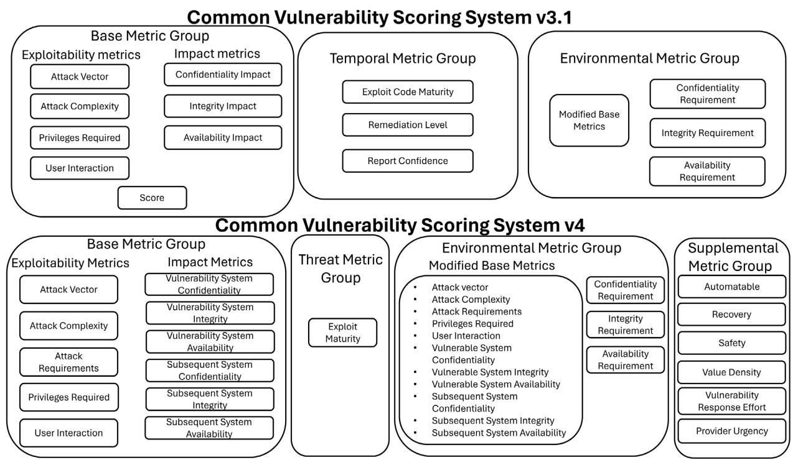
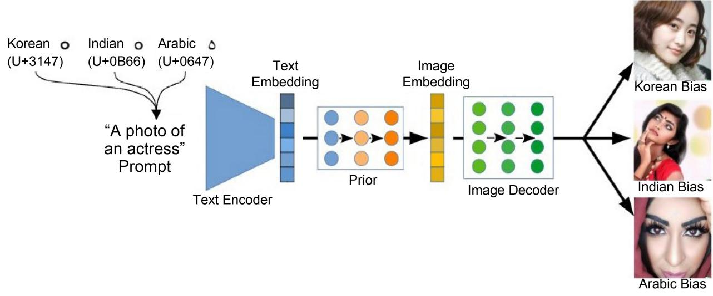

# **Security Vulnerability Analyses of Large Language Models (LLMs) through Extension of the Common Vulnerability Scoring System (CVSS) Framework**

## **Alicia Biju, Vishnupriya Ramesh, Vijay K. Madisetti**

School of Cybersecurity and Privacy, College of Computing, Georgia Institute of Technology, Atlanta, GA, USA 

How to cite this paper: Biju, A., Ramesh, V. and Madisetti, V.K. (2024) Security Vulnerability Analyses of Large Language Models (LLMs) through Extension of the Common Vulnerability Scoring System (CVSS) Framework. Journal of Software Engineering and Applications, 17, 340-358. <https://doi.org/10.4236/jsea.2024.175019>

Received: April 22, 2024 Accepted: May 27, 2024 Published: May 30, 2024

Copyright © 2024 by author(s) and Scientific Research Publishing Inc. This work is licensed under the Creative Commons Attribution International License (CC BY 4.0).

<http://creativecommons.org/licenses/by/4.0/> Open Access

## **Abstract**

Large Language Models (LLMs) have revolutionized Generative Artificial Intelligence (GenAI) tasks, becoming an integral part of various applications in society, including text generation, translation, summarization, and more. However, their widespread usage emphasizes the critical need to enhance their security posture to ensure the integrity and reliability of their outputs and minimize harmful effects. Prompt injections and training data poisoning attacks are two of the most prominent vulnerabilities in LLMs, which could potentially lead to unpredictable and undesirable behaviors, such as biased outputs, misinformation propagation, and even malicious content generation. The Common Vulnerability Scoring System (CVSS) framework provides a standardized approach to capturing the principal characteristics of vulnerabilities, facilitating a deeper understanding of their severity within the security and AI communities. By extending the current CVSS framework, we generate scores for these vulnerabilities such that organizations can prioritize mitigation efforts, allocate resources effectively, and implement targeted security measures to defend against potential risks.

## **Keywords**

Common Vulnerability Scoring System (CVSS), Large Language Models (LLMs), DALL-E, Prompt Injections, Training Data Poisoning, CVSS Metrics

## **1. Introduction**

Since the introduction of Chat GPT-4 and its widespread adoption, there has been a notable increase in the usage of LLMs and GenAI across various applications. LLMs are a category of foundation models trained on immense amounts of data making them capable of understanding and generating natural language and other types of content to perform a wide range of tasks which include generating text or images, translating languages, and code generation. LLMs are designed to understand and generate text like humans. They are easily accessible to the public through interfaces like Open AI's Chat GPT-3, GPT-4, DALL-E, and more [\[1\]](#page-16-0) [\[2\]](#page-16-1) [\[3\].](#page-16-2)

With the scope of these LLMs continuously broadening it brings forth distinct security issues. Some of these issues are so innovative that even experienced AI and Security professionals encounter difficulties navigating the unfamiliar domains of the potential risks. The OWASP (Open Web Application Security Project) issued the "Top 10 for Large Language Model Applications" in 2023. It is a compilation of the most severe security risks for LLM applications [\[3\]](#page-16-2) [\[4\].](#page-16-3)

The top spot is claimed by "Prompt Injection". This LLM vulnerability enables attackers to use carefully constructed inputs or prompts to manipulate the LLM into unknowingly performing their instructions by bypassing filters. Prompts would behave as questions or instructions given to the LLM, where its response would depend upon how the prompts and inputs were phrased.

Another severe risk is "Training Data Poisoning". The attacker could manipulate the training data or fine-tune procedures of an LLM to introduce vulnerabilities, backdoors, or biases that could compromise the model's security. These models will face risks when attackers insert harmful data into the training set. This data could contain hidden triggers that, once activated, make the LLM act unpredictably, compromising its security and reliability.

These vulnerabilities have the potential to trigger a series of additional threats in LLMs, and their repercussions can be severe, ranging from the exposure of confidential information and unauthorized entry to compromising the overall security of the application. The vulnerabilities could manipulate the model's responses, learning outcomes, or any decision-making processes that it influences or controls. It could lead to data leakage, unauthorized access, loss of effectiveness, and other security breaches, thus, eroding trust in technology [\[5\]](#page-16-4) [\[6\]](#page-17-0) [\[7\]](#page-17-1) [\[8\].](#page-17-2)

Generating the US National Institute of Standards & Technology (NIST) Common Vulnerability Scoring System (CVSS) for these vulnerabilities would help organizations understand the characteristics and the seriousness of the security breaches caused by them. The CVSS is an open framework, established in 2005, that helps communicate this information. The system has gained extensive acceptance and is now the authoritative vulnerability scoring system employed by the NIST National Vulnerability Database (NVD). It is utilized by prominent vulnerability management tools and vendors [\[9\].](#page-17-3)

This paper seeks to extend the current CVSS guidelines, which we believe are not fully addressing the security threats posed by, and to LLMs as used in GenAI applications. Our extensions may foster proficient risk assessment, and proactive risk management strategies to ensure the robust security of LLM deployments. By undertaking the initiative to extend the CVSS framework and provide an initial basis for CVSS scores, and metrics for LLM-based vulnerabilities, we could help organizations tackle AI and security issues. Our findings would also help fill the void in the existing CVSS specification regarding LLM security concerns.

## **2. Existing Work**

The OWASP Top 10 for LLM Applications project, aims to provide comprehensive guidance on the most critical security risks inherent in deploying and managing LLMs. The list encompasses ten key vulnerabilities, including prompt injection, insecure output handling, training data poisoning, model denial of service, supply chain vulnerabilities, sensitive information disclosure, insecure plugin design, excessive agency, overreliance, and model theft.

From unauthorized access and data breaches to compromised decision-making and system failures, these vulnerabilities pose significant risks to the security, integrity, and ethical behavior of LLMs. The project aims to raise awareness of these risks, offer remediation strategies, and ultimately enhance the security posture of LLM applications, safeguarding against potential threats and vulnerabilities [\[3\]](#page-16-2) [\[4\].](#page-16-3)

On the other hand, the CVSS is a standardized framework used to assess and categorize the severity of vulnerabilities in computer systems. It comprises three metric groups: Base, Temporal, and Environmental. The Base category evaluates the fundamental qualities of a vulnerability, which remain consistent over time and across different user environments. The Temporal category focuses on the aspects of a vulnerability that evolve over time, while the Environmental category considers attributes specific to a user's environment.

By combining Base metric values with default values for Temporal and Environmental metrics, a score on a scale of 0 to 10 is generated. This score can be further refined by adjusting Temporal and Environmental metrics based on relevant threat intelligence and environmental factors. Our project focuses on CVSS version 3 compared to version 4, as it is widely adopted. CVSS version 3 categorizes severity scores into levels ranging from None and Low to Medium, High, and Critical [\[9\]](#page-17-3) [\[10\]](#page-17-4) [\[11\].](#page-17-5)

Our paper addresses a critical gap between the OWASP Top 10 list for LLM security concerns and the current CVSS. While the CVSS provides valuable metrics for assessing vulnerabilities, it does not encompass the specific problems outlined in the OWASP Top 10 for LLMs. Therefore, we aim to overcome these differences by extending the CVSS framework to cover the unique security issues posed by LLMs as detailed in the OWASP Top 10 list. We enable organizations to comprehensively understand and prioritize the severity of vulnerabilities specific to LLM applications. [(Figure 1)](#page-3-0)

## **3. Proposed Approach**

Our work focuses on extending the CVSS framework to tackle the specific

Figure 1. CVSS v3 and CVSS v4.

challenges posed by adversarial manipulation through prompts and training data poisoning in text-to-image generation LLMs, such as DALL.E. The enhancements primarily focus on introducing novel metrics within the CVSS framework to evaluate the exploitability and impact of such vulnerabilities. The newly introduced metrics include "Attack Origin", "Access Complexity", and "Attacker Interaction" to assess exploitability. The impact metric has been expanded to encompass "Internal Organizational Impact" and "External Organizational Impact".

Our metric development offers constant scores and detailed CVSS specification document-like definitions derived from a thorough analysis of articles and publications. This refinement ensures consistency and clarity in the scoring methodologies employed within the extended CVSS framework, further enhancing its efficacy in vulnerability assessment and risk mitigation efforts. The definitions and scores for the new metrics created are provided in Sections 3.1 and 3.2. These will be used in addition to the already existing ones.

The CVSS Base metrics focus on the fundamental qualities of vulnerabilities, considering factors such as Exploitability metrics which include attack vectors, attack complexity, authentication requirements, and more. Base metrics also concentrate on Impact metrics which consist of confidentiality impact, integrity impact, and availability impact. These metrics provide a foundational understanding of the vulnerability's characteristics, aiding in the overall risk assessment process.

Our extended CVSS model enhances the ability of organizations to accurately

assess and mitigate vulnerabilities specific to LLM applications. We have introduced novel metrics within the Exploitability and Impact categories, enriching the broader Base metrics framework. This holistic approach ensures a more comprehensive understanding of the security landscape, empowering organizations to make informed decisions and strengthen their defenses against emerging threats [\[12\].](#page-17-6)

## **3.1. CVSS Extension: Exploitability Metrics**

The first metric we propose is "Attack Origin (AO)". Its description is "This metric evaluates the origin or source of the attack, indicating whether the attack originates from internal, external, or both entities. Based on the origin of the attack, organizations can prioritize security investments and allocate resources more effectively to mitigate the most significant risks." The list of possible values is presented in ["Table 1"](#page-4-0).

The second metric we propose is "Access Complexity (AC)". Its description is "This metric evaluates the level of access and knowledge the attacker requires to exploit vulnerabilities in the target system which is crucial for designing effective security measures and prioritizing resources for vulnerability management." [\[13\].](#page-17-7) The list of possible values is presented in ["Table 2"](#page-5-0).

The third metric we propose is "Attacker Interaction (AI)". Its description is "This metric evaluates the degree of interaction and involvement the attacker requires to exploit vulnerabilities or manipulate the target system effectively. This aspect is crucial for assessing the sophistication and potential impact of

| Metric       | Description                                                                                                                                                                                                                                                                                               |  |
|--------------|-----------------------------------------------------------------------------------------------------------------------------------------------------------------------------------------------------------------------------------------------------------------------------------------------------------|--|
| Internal (I) | Attacks with an internal origin originate from within the organization's internal network or systems. These attacks may leverage trusted access privileges, insider knowledge, or compromised internal assets to carry out malicious activities.                                                 |  |
| External (E) | Attacks with an external origin originate from outside the organization's network or systems (eg: DDoS). These attacks are typically launched by external threat actors targeting the organization's external-facing assets (eg: websites, servers, or network infrastructure).               |  |
| Mixed (M)    | Mixed attacks involve elements from both internal and external sources. These attacks can be complex and challenging to detect, as they may involve insider threats collaborating with external actors or compromised internal systems being used to launch attacks against external targets. |  |
| Unknown (U)  | Attacks with an unknown origin cannot be definitively attributed to either internal or external sources. The origin of the attack may be obscured by factors such as sophisticated evasion techniques, insufficient logging and monitoring capabilities, or incomplete forensic analysis.     |  |

#### Table 1. Attack Origin (AO).

Table 2. Access Complexity (AC).

| Metric                   | Description                                                                                                                                                                                                                                                                                                                                                                                                                                                                                                                            |  |  |
|--------------------------|----------------------------------------------------------------------------------------------------------------------------------------------------------------------------------------------------------------------------------------------------------------------------------------------------------------------------------------------------------------------------------------------------------------------------------------------------------------------------------------------------------------------------------------|--|--|
| Blackbox Testing (BT) | In Blackbox testing, the attacker has limited or no access to internal system details such as the workings, design, or implementation details of the target system. The attacker can only operate with the knowledge available from external observations, such as inputs and outputs of the system. This approach often involves more guesswork and experimentation to identify and exploit vulnerabilities which limits the attacker's ability to conduct precise and targeted attacks.                         |  |  |
| Whitebox Testing (WT) | In Whitebox testing, the attacker has full access to detailed information about the target system, including its internal architecture, source code, design, and implementation details. It typically includes access to the source code, architecture diagrams, algorithms, and any other relevant information. This level of access enables the attacker to conduct a thorough analysis and precise exploitation of vulnerabilities, as they have a comprehensive understanding of the system's inner workings. |  |  |
| Uncertain (UC)           | Assigning this value indicates there is insufficient information to choose one of the other values. However, reports of impacts indicate a vulnerability is present. That is, the cause of the vulnerability is unknown or may differ on the cause or impacts of the vulnerability.                                                                                                                                                                                                                                        |  |  |

cyberattacks." The list of possible values is presented in ["Table 3"](#page-6-0).

## **3.2. CVSS Extension: Impact Metrics**

The first metric we propose is "Internal Organizational Impact". Its description is "This metric evaluates the vulnerability's potential impact on the organization internally. It will be based on the decrease in employee productivity or morale, operational disruption leading to a critical loss in business continuity, loss of intellectual property and sensitive information, and reputational damage among employees, partners, and stakeholders." The list of possible values is presented in ["Table 4"](#page-6-1).

The second metric we propose is "External Organizational Impact". Its description is "This metric evaluates the potential impact of the vulnerability on the organization externally. It will be based on the loss in customer trust or loyalty, financial losses including theft, ransom payments, or cost of remediation efforts, customer service and supply chain disruption, reputational damage among customers, investors, and the public, and regulatory scrutiny." The list of possible values is presented in ["Table 5"](#page-7-0).

### **3.3. Metric Values**

Each new metric that we have proposed has been assigned an associated constant value, as defined in ["Table 6"](#page-7-1). These values in the CVSS are carefully chosen to

| Metric   | Description                                                                                                                                                                                                                                                                                                                                                                        |  |  |
|----------|------------------------------------------------------------------------------------------------------------------------------------------------------------------------------------------------------------------------------------------------------------------------------------------------------------------------------------------------------------------------------------|--|--|
| None (N) | Attacks at this level can be executed without any direct interaction from the attacker. They often involve automated exploits or attacks exploiting system weaknesses without manual intervention (eg: worms or malware that can self-propagate across networks). These attacks can propagate at scale without human oversight, making them particularly dangerous. |  |  |
| Low (L)  | The attacker's interaction is limited to specific actions or inputs. This may involve providing initial parameters or configuring attack settings using semi-automated tools or scripts. While human involvement is required, it's not continuous engagement throughout the attack (eg: phishing attacks).                                                             |  |  |
| High (H) | These attacks would require the attacker to actively engage with the system throughout the attack process. This involves making decisions, adapting to responses from the target system, and interacting with various components to achieve their objectives. Such attacks are typically more sophisticated and difficult to execute and manage.                    |  |  |

Table 3. Attacker Interaction (AI).

#### Table 4. Internal Organizational Impact (IOI).

| Metric     | Description                                                                                                                                                                                                                                                                                                                                                                                                                                     |  |  |
|------------|-------------------------------------------------------------------------------------------------------------------------------------------------------------------------------------------------------------------------------------------------------------------------------------------------------------------------------------------------------------------------------------------------------------------------------------------------|--|--|
| None (N)   | A vulnerability with no internal organizational impact implies it does not affect the organization in any significant way.                                                                                                                                                                                                                                                                                                                   |  |  |
| Low (L)    | A vulnerability with low internal organizational impact has minimal consequences for the organization. While it may cause some disruption or inconvenience, it can typically be addressed using existing resources and processes without significant disruption to operations or business continuity.                                                                                                                               |  |  |
| Medium (M) | A vulnerability with moderate internal organizational impact results in tangible losses and consequences for the organization. It may disrupt operations, decrease productivity or morale, or result in the loss of some intellectual property or sensitive information; however, it does not pose an existential threat.                                                                                                           |  |  |
| High (H)   | A vulnerability with high internal organizational impact has significant ramifications for the organization, leading to substantial reputational damage, operational disruptions, and potentially severe financial losses [14]. It may cause widespread disruption to business continuity, loss of critical intellectual property or sensitive information, and erosion of trust among employees, partners, and stakeholders. |  |  |

mirror their relative influence on the overall severity of a vulnerability. These determinations result from a blend of comprehensive literature reviews and our judgment.

| Metric     | Description                                                                                                                                                                                                                                                                                                                                                                |  |  |
|------------|----------------------------------------------------------------------------------------------------------------------------------------------------------------------------------------------------------------------------------------------------------------------------------------------------------------------------------------------------------------------------|--|--|
| None (N)   | A vulnerability with no external organizational impact implies it does not affect the organization in any significant way.                                                                                                                                                                                                                                              |  |  |
| Low (L)    | A vulnerability with low external organizational impact has minimal consequences for the organization externally. While it may cause some disruption or inconvenience, it can typically be addressed using existing resources and processes without significant disruption to customer trust or loyalty, financial losses, customer service, or reputation. |  |  |
| Medium (M) | A vulnerability with moderate external organizational impact results in tangible losses and consequences for the organization externally. It may lead to some loss of customer trust or loyalty, financial losses, or customer service disruptions, however, it does not pose an existential threat.                                                           |  |  |
| High (H)   | A vulnerability with high external organizational impact has significant ramifications for the organization, leading to substantial financial losses, reputational damage, and potential legal consequences externally. It may result in widespread loss of customer trust or loyalty, customer service disruptions, and intense regulatory scrutiny [15].  |  |  |

Table 5. External Organizational Impact (IOI).

#### Table 6. Metric values.

| Metric                         | Metric Value     | Numerical Value |
|--------------------------------|------------------|-----------------|
|                                | Internal         | 0.86            |
|                                | External         | 0.82            |
| Attack Origin                  | Mixed            | 0.91            |
|                                | Unknown          | 0.95            |
|                                | Blackbox Testing | 0.82            |
| Access Complexity              | Whitebox Testing | 0.88            |
|                                | Uncertain        | 0.85            |
|                                | None             | 0.89            |
| Attacker Interaction           | Low              | 0.87            |
|                                | High             | 0.85            |
|                                | None             | 0.0             |
|                                | Low              | 0.25            |
| Internal Organizational Impact | Medium           | 0.56            |
|                                | High             | 0.88            |
|                                | None             | 0.0             |
|                                | Low              | 0.27            |
| External Organizational Impact | Medium           | 0.59            |
|                                | High             | 0.91            |

Detailed explanations for assigning higher or lower scores to each metric are elucidated in Section 3. This rationale is elaborated upon in Section 3.1 and Section 3.2, offering insights into the decision-making process behind these values.

The existing formulae for the Exploitability sub-score and Impact sub-score which would be used in the Base Score calculation have been revised as follows, highlighted in bold [\[16\].](#page-17-10)

The Exploitability sub-score is:

8.22 Attack Vector Attack Complexity Privileges Required ×× ×

User Interaction Attack Origin Access Complexity Attacker Interaction × ×× × (1)

The Impact sub-score is:

$$\begin{aligned} 1 - \left\lfloor \left( 1 - \text{Impact Conf} \right) \times \left( 1 - \text{Impact Integer} \right) \times \left( 1 - \text{Impact Available} \right) \right\rfloor \\ \times \left( 1 - \text{Impact Internal Organ} \left( \text{Orig} \right) \times \left( 1 - \text{Impact LSTM Organ} \left( \text{Organ} \right) \right) \right) \end{aligned} \tag{2}$$

NIST employs a multiplication factor of "8.22" within the Exploitability subscore formula to calibrate the final Base Score as per their intended severity ratings for vulnerabilities. Similarly, we have adopted this scaling factor in Equation (1) to maintain consistency with NIST's methodology.

Both NIST's and our Exploitability metrics span from 0 to 1, where a value of 1 signifies the highest severity or easiest exploitability. Through this multiplication, the metrics are scaled to exert significant influence on the overall Base Score calculation, ensuring a balanced evaluation of vulnerability severity.

These metric definitions and constant values will help enhance the cybersecurity posture of organizations by providing them with a robust framework for assessing and mitigating the risks associated with prompt injection and training data poisoning attacks on LLMs.

## **4. Implementation of Proposed Extensions**

New metrics for the CVSS framework were formulated through a rigorous analysis of research focusing on attacks targeting DALL-E, a text-to-image synthesis model. By scrutinizing various attacks perpetrated against DALL-E, we identified specific attack categories that encapsulate the intricacies of such exploits. These categories encompass the nuances and details of the attacks observed in the literature, ensuring comprehensive coverage of potential vulnerabilities within LLMs like DALL-E.

The exploration of attacks targeting text-to-image models such as DALL-E has uncovered the potential for intentional manipulation of these models through the modification or paraphrasing of textual prompts. Various attack techniques, including creating gibberish, changing words, adding spaces, and paraphrasing, enable attackers to conceal their actions by using seemingly harmless or random phrases as prompt injections. Such manipulations pose serious risks, ranging from the generation of deep fakes to the dissemination of misinformation, and can severely damage an organization's reputation, all while perpetrators remain hidden from detection [(Figure 2)](#page-9-0).

Figure 2. Training data poisoning attac[k \[19\].](#page-17-11)

In addressing the security implications of these attacks, the focus shifts to human security, which prioritizes the protection and well-being of individuals within the context of data protection, privacy, and threat mitigation. By synthesizing insights from the analyzed research papers, a new attack category was constructed, "Adversarial Manipulation in text-to-image generation LLMs."

This category concentrates on altering LLM behavior or outputs to produce unintended results, utilizing techniques that operate under black-box or restricted access scenarios. These indirect methods involve crafting targeted inputs or prompts, such as minor sentence modifications, homoglyph usage, or word rearrangements, to influence the system's behavior and generate manipulated images as seen in ["Figure 3"](#page-10-0) [\[17\]-](#page-17-12)[\[21\].](#page-17-13)

In the research paper, [\[17\],](#page-17-12) the authors devised a method aimed at crafting reliable and imperceptible adversarial examples within DALL-E. Their proposed framework, RIATIG, focuses on generating adversarial images from natural language prompts while ensuring both the consistency of results and the subtle nature of alterations.

The attack construction process in the RIATIG framework encompassed algorithm development, reliability considerations, imperceptibility constraints, and rigorous evaluation techniques to achieve the desired objectives. The attack could perturb text prompts strategically, influencing the resulting images while preserving semantic coherence. These perturbations led to the desired adversarial images being created across various instances. Moreover, the imperceptibility constraints that were incorporated could evade detection by human observers.

We have identified a high-level attack category aimed at encapsulating the diverse spectrum of security risks encountered by LLMs like text-to-image generative models. This category serves as a foundational framework for organizing and categorizing the myriad vulnerabilities and attack vectors observed in LLMs, facilitating the development of a structured CVSS template.

Figure 3. Prompt injection attack techniqu[e \[17\].](#page-17-12)

When focusing on the vulnerability of Training Data Poisoning, the "promptspecific poisoning attack" was created as the targeted attack category. This choice is substantiated by the examination of four research papers, each detailing distinct manifestations of prompt-specific poisoning attacks on text-to-image synthesis models.

These attacks exploit conceptual similarities and visual cues, aiming to subvert model behavior while adhering to specific prompts. Notably, these tactics operate under the assumption of limited access, where adversaries inject poisoned data into the model's training dataset without privileged access to the training process. This strategic analysis lays the groundwork for a comprehensive understanding of prompt-specific poisoning attacks, underscoring the necessity for robust security measures within the domain of LLMs [\[19\]](#page-17-11) [\[22\]](#page-17-14) [\[23\]](#page-17-15) [\[24\].](#page-18-0)

In the research paper, [\[19\],](#page-17-11) the attack was crafted by exploiting homoglyphs to manipulate the cultural biases embedded within DALL-E. The authors identified prevalent cultural biases within the specified model, including preferences for specific visual elements or interpretations of text prompts influenced by cultural contexts.

The attack entailed substituting certain characters in text prompts with visually similar homoglyphs, subtly altering the interpretation of the prompts by the model and inducing unintended cultural biases in the generated images. Evaluation and validation of the attack's effectiveness were conducted by generating images from modified prompts and assessing the presence of desired cultural biases, through quantitative analysis of image features and qualitative evaluation by human observers.

In our search to enhance LLM security within the CVSS framework, we identified a gap in its existing metrics, which overlooks LLM security concerns. Through extensive research, we have developed five novel metrics tailored to bolster LLM security. These metrics are designed to complement the CVSS framework, offering a more comprehensive assessment of security risks, particularly in the realm of LLM protection. Based on our analysis the new metrics that we created were "Attack Origin", "Access Complexity", "Attacker Interaction", "Internal Organizational Impact", and "External Organizational Impact".

## **4.1. Attack Origin (AO)**

Understanding the origin of attacks is crucial for organizations to implement appropriate defensive measures and response strategies tailored to the specific nature of the threats they face. By categorizing attacks based on their origin, organizations can prioritize security investments and allocate resources more effectively to mitigate the most significant risks.

The values within this category include Internal, External, Mixed, and Unknown. Internal attacks pose a severe threat to organizational security, as they bypass external perimeter defenses and exploit the implicit trust granted to internal users and systems. Detecting and mitigating internal threats requires robust internal monitoring, access controls, and user behavior analytics.

External attacks are common and pose significant risks to organizations, but they are often more predictable and defendable than internal threats. Organizations deploy perimeter defenses, such as firewalls, intrusion detection systems, and email filters, to detect and block external attacks.

Mixed attacks blur the traditional boundaries between internal and external threats, making it difficult for organizations to defend against them effectively. Detecting and mitigating mixed attacks requires comprehensive security measures that monitor both internal and external network traffic and user activities.

Attacks with unknown origins present significant challenges for organizations as they may struggle to respond effectively without clear attribution. Organizations need to invest in advanced threat detection and incident response capabilities to uncover the source of such attacks and mitigate their impact.

Internal threats pose a significant concern within organizational security landscapes, as highlighted by recent studies. Despite the assurance of having control over internal factors, the reality underscores the persistent challenge they present. As noted by Chief Security Officers in a global security survey, internal threats are encountered more frequently than external ones, with a staggering 89% of companies reporting such incidents within the past year.

This trend is further validated by statistics indicating that insider threats affect over 34% of businesses annually, with 66% of companies expressing heightened concern regarding the likelihood of such attacks. Thus, while internal attacks theoretically lend themselves to prevention through stringent policies and security measures, their prevalence highlights the need for heightened vigilance and robust defense mechanisms. As a result, internal threats are accorded a higher score compared to external threats within our extended CVSS framework, reflecting their heightened likelihood and potential impact.

In our proposed approach, mixed threats, representing a culmination of both internal and external vulnerabilities, are assigned a higher score. Signifying the risk posed by such blended vulnerabilities. Furthermore, the metric for "unknown" threats has the highest score within our framework, due to the uncertainty surrounding their potential impact and unpredictable nature [\[25\]](#page-18-1) [\[26\]](#page-18-2) [\[27\].](#page-18-3)

## **4.2. Access Complexity (AC)**

By categorizing attacks based on their access complexity, organizations can tailor their defensive strategies to mitigate the most significant risks and strengthen their overall security posture. The values within this category include Blackbox testing, Whitebox testing, and Uncertain.

Blackbox testing simulates the perspective of an external attacker who lacks insider knowledge of the target system. While it may accurately represent the challenges faced by real-world attackers, it also limits the attacker's ability to conduct precise and targeted attacks.

By leveraging Blackbox testing, attackers can clandestinely evaluate the effectiveness of an organization's external security measures, pinpointing weaknesses that may be susceptible to exploitation without the constraints of insider information. This approach empowers attackers to identify and capitalize on vulnerabilities undetectable from within the organization, potentially gaining unauthorized access and compromising sensitive data or systems.

Whitebox testing adopts the viewpoint of an insider or a sophisticated attacker possessing extensive knowledge of the target system. Although it offers valuable insights into potential vulnerabilities and weaknesses, it calls for a heightened level of expertise and access to internal resources.

Through the exploitation of Whitebox testing, attackers can glean key insights into an organization's internal defenses. This would expose overlooked or underestimated weaknesses, allowing attackers to exploit gaps in the organization's security infrastructure. Thus, gaining unauthorized access to critical systems or sensitive data.

The "Uncertain" access complexity category acknowledges vulnerabilities, that have a lack of clarity or certainty regarding their specific cause or impacts. That is, while reports are indicating the existence of a vulnerability and its associated impacts, there isn't enough information available to definitively attribute it to a particular cause. There could be evidence suggesting that a system or software is vulnerable. However, the precise root cause of this vulnerability remains unclear or could vary depending on different interpretations or perspectives.

Within the realm of the Whitebox attack model, the adversary holds an advantage over the Blackbox attack model, as it can meticulously monitor all intermediate values throughout the attack process. This increased level of access gives the attacker insights into crucial elements such as source code, algorithms, and more.

Hence, within the CVSS, a higher score has been assigned for Whitebox testing. This is due to the recognition of the attacker's enhanced capabilities and access, reflecting the greater impact and severity of vulnerabilities identified through Whitebox testing.

The "Uncertain" category represents a middle ground where the attacker's level of access or knowledge falls between the extremes of Blackbox and Whitebox testing. It is not as comprehensive as Whitebox testing, where the attacker has complete visibility, although, it offers more insights compared to Blackbox testing. In this scenario, the attacker may have some degree of access to system internals or may possess partial knowledge about the system's architecture or implementation details [\[28\]](#page-18-4) [\[29\]](#page-18-5) [\[30\].](#page-18-6)

## **4.3. Attacker Interaction (AI)**

The "None" category describes attacks that can spread rapidly and cause widespread damage before they are detected and mitigated. They are challenging to defend against due to their automated nature and can result in significant disruptions to systems and networks.

The "Low" category consists of attacks that often rely on social engineering to trick users into taking actions that facilitate the attack. While they may require some level of human interaction, they can still be effective at compromising systems or stealing sensitive information.

Attacks that have "High" as an attacker interaction category can be highly targeted and tailored to the specific characteristics of the target environment. They often involve multiple stages and techniques, making them challenging to detect using traditional security measures. The level of interaction required makes them more resource-intensive for the attacker but also potentially more damaging if successful.

The assumption is that the attacks requiring little to no interaction from the attacker pose the highest risk due to their potential for automated exploitation and widespread impact. Attacks with low levels of interaction still pose significant threats but may be somewhat mitigated by the need for some human involvement. Attacks requiring high levels of interaction are typically more targeted and may be easier to detect and defend against due to the increased likelihood of human error and the need for continuous engagement [\[31\].](#page-18-7)

## **4.4. Internal Organizational Impact (IOI)**

Understanding the internal organizational impact of vulnerabilities is crucial for prioritizing remediation efforts and allocating resources effectively. By assessing the potential consequences of vulnerabilities on productivity, operations, intellectual property, and reputation, organizations can make informed decisions about risk management and prioritize actions to protect their interests and stakeholders.

While vulnerabilities with no internal impact may still require remediation these would fall under the category "None". These vulnerabilities would not pose immediate risks to the organization's operations, assets, or reputation. They can often be addressed without diverting significant resources or causing disruption to business activities.

Vulnerabilities with low internal impact may still require attention to prevent potential escalation or exploitation. However, they do not pose immediate existential threats to the organization and can often be addressed through routine maintenance or minor adjustments to existing security measures. Such vulnerabilities can be categorized as "Low".

The "Medium" category vulnerabilities will have moderate internal impact and will require proactive mitigation efforts. They may necessitate additional resources to be dealt with effectively. While they may not pose existential threats to the organization, they can still result in tangible losses and damage if left unaddressed.

Vulnerabilities with high internal impact require immediate attention and decisive action to mitigate their consequences. They represent existential threats to the organization's operations, assets, and reputation, necessitating a coordinated response involving multiple stakeholders and significant resource allocation. These vulnerabilities can be categorized as "High" [\[32\].](#page-18-8)

## **4.5. External Organizational Impact (EOI)**

While vulnerabilities with no external impact may still require remediation, these would fall under the category "None". These vulnerabilities would not pose immediate risks to the organization's relationships with customers, partners, or the public. They can often be addressed without diverting significant resources or causing disruption to external-facing operations.

Vulnerabilities with low external impact may still require attention to maintain customer satisfaction and trust. However, they do not pose immediate existential threats to the organization's external relationships or reputation and can often be addressed through routine maintenance or minor adjustments to external-facing operations. Such vulnerabilities can be categorized as "Low".

The "Medium" category vulnerabilities will have moderate external impact requiring proactive mitigation efforts and may necessitate additional resources to be dealt with effectively. While they may not pose existential threats to the organization externally, they can still result in tangible losses and damage to customer relationships and reputation if left unaddressed.

Vulnerabilities with high external impact require immediate attention and decisive action to mitigate their consequences. They represent existential threats to the organization's external relationships, reputation, and regulatory compliance, necessitating a coordinated response involving multiple stakeholders and significant resource allocation. These vulnerabilities can be categorized as "High" [\[33\].](#page-18-9)

Companies face difficulties in accurately quantifying the material scope, nature, and impact of incidents that occur. This challenge extends beyond the immediate impact on business operations and encompasses considerations such as effects on vendors, the company's reputation, and its customer base. Therefore, adding the internal and external organizational impact metric within the extended CVSS framework would help organizations understand the severity of such issues.

However, this would require a thorough examination of various factors. Companies must analyze the extent of data loss, the downstream ramifications on operations, and the long-term implications concerning regulatory compliance, financial performance, and brand reputation.

Quantitative factors encompass impacts on business operations, financial performance, and incident response expenses. These include considerations such as the duration of the incident, the number of affected business segments, loss of intellectual property, revenue impact, stock price fluctuations, and incident response costs.

Qualitative factors involve assessing the type and volume of compromised information, reputational damage, supply chain disruptions, and legal ramifications, including government inquiries and legal disputes. Based on these factors the metrics "Internal Organizational Impact" and "External Organizational Impact" were created [\[32\].](#page-18-8)

## **5. Comparison with Prior Work**

The NIST CVSS model, while valuable, currently lacks certain features necessary for addressing emerging threats, particularly in the realm of GenAI that uses novel technologies like LLMs. By incorporating additional metrics tailored to address vulnerabilities such as prompt injection and training data poisoning attacks specific to LLMs, our extended CVSS model aims to bridge this divide.

While still in its initial stage and subject to further refinement, our enhanced model holds promise for providing organizations with a more comprehensive understanding of the gravity of such vulnerabilities in LLM applications. This initiative represents a significant step forward in bolstering the security posture of AI-driven systems and adapting traditional security frameworks to meet the evolving challenges of modern technologies.

For this specific attack [\[19\],](#page-17-11) we've assigned the "unknown" value for the "attack origin" metric, recognizing that it may vary depending on the organization's specific circumstances. Drawing from insights in the paper, we've set the "Blackbox testing" value for the "access complexity" metric, reflecting the level of complexity involved in exploiting the vulnerability.

Additionally, we've set the "attacker interaction" metric to "high" given the continuous need for the attacker to create prompts to poison the training data. As for both internal and external organizational impact, while it's contingent on individual contexts, for testing purposes, we've uniformly assigned a "high" value to signify the potential intensity of the impact.

For this particular attack scenario [\[30\],](#page-18-6) we've assigned the "unknown" value to the "attack origin" metric, acknowledging its variability depending on the organization's approach to addressing it. Drawing from insights provided in the paper, we've determined the "access complexity" metric to be "Blackbox testing", reflecting the level of complexity associated with exploiting the vulnerability.

Furthermore, we've set the "attacker interaction" metric as "low," as the attacker simply needs to create an art prompt to achieve the desired malicious outcome from the LLM through prompt injection. As for both internal and external organizational impact, while it's contingent on individual contexts, for testing purposes, we've uniformly assigned a "high" value to signify the potential intensity of the impact.

With our newly introduced metrics, we can now assign scores to the above attacks. Previously, these issues would not have been evaluated for severity and thus would not have alerted organizations to their potential impact.

## **6. Conclusions**

In conclusion, this paper has made several contributions to understanding security vulnerabilities inherent in LLMs through the lens of the CVSS metrics. By focusing on prompt injection and training data poisoning vulnerabilities, and developing CVSS scores, we have not only extended the CVSS framework but also tailored it to address the security issues posed by LLMs.

Through exploring vulnerabilities in text-to-image synthesis models, our paper has studied real-world security challenges faced by LLMs. The insights gained not only enrich our understanding of LLM security but also underscore the necessity for ongoing research and development in this field.

Our initiative seeks to enhance the effectiveness of vulnerability management strategies and improve the overall security posture of LLM deployments. As LLMs continue to evolve and integrate into various applications, the refined CVSS framework stands as a beacon, guiding organizations in navigating and mitigating security risks, thus safeguarding the integrity and trustworthiness of these powerful large language models.

## **Conflicts of Interest**

The authors declare no conflicts of interest regarding the publication of this paper.

## **References**

- [1] What Are Large Language Models (LLMs)? IBM. <https://www.ibm.com/topics/large-language-models>
- [2] DALL-E. Wikipedia[. https://en.wikipedia.org/wiki/DALL-E](https://en.wikipedia.org/wiki/DALL-E)
- [3] Lakera LLM Security Playbook. Lakera. <https://www.lakera.ai/ai-security-guides/llm-security-playbook>
- [4] OWASP (2023) OWASP Top 10 for Large Language Model Applications. <https://owasp.org/www-project-top-10-for-large-language-model-applications>
- [5] OWASP (2023) LLM01:2023—Prompt Injections. [https://owasp.org/www-project-top-10-for-large-language-model-applications/Arch](https://owasp.org/www-project-top-10-for-large-language-model-applications/Archive/0_1_vulns/Prompt_Injection.html)

ive/0_1_vulns/Prompt_Injection.html

- [6] OWASP (2023) LLM10:2023—Training Data Poisoning.
	- [https://owasp.org/www-project-top-10-for-large-language-model-applications/Arch](https://owasp.org/www-project-top-10-for-large-language-model-applications/Archive/0_1_vulns/Training_Data_Poisoning.html) [ive/0_1_vulns/Training_Data_Poisoning.html](https://owasp.org/www-project-top-10-for-large-language-model-applications/Archive/0_1_vulns/Training_Data_Poisoning.html)
- [7] Shah, D. (2023) The ELI5 Guide to Prompt Injection: Techniques, Prevention Methods & Tools. Lakera[. https://www.lakera.ai/blog/guide-to-prompt-injection](https://www.lakera.ai/blog/guide-to-prompt-injection)
- [8] Shah, D. (2023) Introduction to Training Data Poisoning: A Beginner's Guide. Lakera[. https://www.lakera.ai/blog/training-data-poisoning](https://www.lakera.ai/blog/training-data-poisoning)
- [9] Common Vulnerability Scoring System: Specification Document. FIRST. <https://www.first.org/cvss/specification-document>
- [10] Hughes, C. (2023) Will CVSS 4.0 Be a Vulnerability-Scoring Breakthrough or Is It Broken? CSO. [https://www.csoonline.com/article/648607/will-cvss-4-0-be-a-vulnerability-scoring](https://www.csoonline.com/article/648607/will-cvss-4-0-be-a-vulnerability-scoring-breakthrough-or-is-it-broken.html)[breakthrough-or-is-it-broken.html](https://www.csoonline.com/article/648607/will-cvss-4-0-be-a-vulnerability-scoring-breakthrough-or-is-it-broken.html)
- [11] Vulnerability Metrics. NVD[. https://nvd.nist.gov/vuln-metrics/cvss](https://nvd.nist.gov/vuln-metrics/cvss)
- [12] CVSS v3.1 Specification Document. FIRST. <https://www.first.org/cvss/v3.1/specification-document>
- [13] Schroeder, W. (2024) Learning Machine Learning Part 3: Attacking Black Box Models. Medium. [https://posts.specterops.io/learning-machine-learning-part-3-attacking-black-box](https://posts.specterops.io/learning-machine-learning-part-3-attacking-black-box-models-3efffc256909)[models-3efffc256909](https://posts.specterops.io/learning-machine-learning-part-3-attacking-black-box-models-3efffc256909)
- [14] How Cyber Threats Can Affect Your Organization. Genetec. [https://www.genetec.com/blog/cybersecurity/how-cyber-threats-can-affect-your-or](https://www.genetec.com/blog/cybersecurity/how-cyber-threats-can-affect-your-organization) [ganization](https://www.genetec.com/blog/cybersecurity/how-cyber-threats-can-affect-your-organization)
- [15] United States District Court Southern District of New York (2023) Case 1:23-cv-11195 Document 1 Filed 12/27/23. <https://nytco-assets.nytimes.com/2023/12/NYT_Complaint_Dec2023.pdf>
- [16] Common Vulnerability Scoring System Calculator. NVD. <https://nvd.nist.gov/vuln-metrics/cvss/v3-calculator>
- [17] Liu, H., et al. (2023) RIATIG: Reliable and Imperceptible Adversarial Text-to-Image Generation with Natural Prompts. 2023 IEEE/CVF Conference on Computer Vision and Pattern Recognition (CVPR), Vancouver, 18-22 June 2023, 20585-20594.
- [18] Maus, N., et al. (2023) Black Box Adversarial Prompting for Foundation Models. <https://arxiv.org/abs/2302.04237>
- [19] Struppek, L., et al. (2023) Exploiting Cultural Biases via Homoglyphs in Text-to-Image Synthesis. Journal of Artificial Intelligence Research, 78, 1017-1068.
- [20] ABET (2019) Criteria for Accrediting Computing Programs, 2019-2020. [https://www.abet.org/accreditation/accreditation-criteria/criteria-for-accrediting-co](https://www.abet.org/accreditation/accreditation-criteria/criteria-for-accrediting-computing-programs-2019-2020/#GC3) [mputing-programs-2019-2020/#GC3](https://www.abet.org/accreditation/accreditation-criteria/criteria-for-accrediting-computing-programs-2019-2020/#GC3)
- [21] McAfee Network Security Platform 9.1.x Product Guide. Attack Categories, Trellix Doc Portal, 2023. [https://docs.trellix.com/bundle/network-security-platform-9.1.x-product-guide/pag](https://docs.trellix.com/bundle/network-security-platform-9.1.x-product-guide/page/GUID-A2BABA05-42EF-41F2-A6A3-57892D17DA7B.html) [e/GUID-A2BABA05-42EF-41F2-A6A3-57892D17DA7B.html](https://docs.trellix.com/bundle/network-security-platform-9.1.x-product-guide/page/GUID-A2BABA05-42EF-41F2-A6A3-57892D17DA7B.html)
- [22] Qu, Y., et al. (2023) On the Proactive Generation of Unsafe Images from Text-to-Image Models Using Benign Prompts. <https://arxiv.org/abs/2305.13873>
- [23] Shan, S., et al. (2023) Prompt-Specific Poisoning Attacks on Text-to-Image Generative Models[. https://arxiv.org/abs/2310.13828](https://arxiv.org/abs/2310.13828)
- [24] Struppek, L., et al. (2023) Rickrolling the Artist: Injecting Backdoors into Text Encoders for Text to Image Synthesis. IEEE/CVF International Conference on Computer Vision (ICCV), Paris, 2-3 October 2023, 4561-4573. <https://arxiv.org/abs/2211.02408>
- [25] Internal vs External Threats—Here's All You Need to Know. Blogs by Cyril, SecureTriad, 2021[. https://securetriad.io/internal-vs-external-threats/](https://securetriad.io/internal-vs-external-threats/)
- [26] International Security Ligue (2023) Internal Threats Grow, as both a Problem and Security Priority. [https://www.security-ligue.org/news?tx_news_pi1%5Baction%5D=detail&tx_news_](https://www.security-ligue.org/news?tx_news_pi1%5Baction%5D=detail&tx_news_pi1%5Bcontroller%5D=News&tx_news_pi1%5Bnews%5D=207&cHash=aa008ddccc6311803eb094847a94b212#:%7E:text=Internal%20threats%20are%20experienced%20more,in%20the%20last%2012%20months) [pi1%5Bcontroller%5D=News&tx_news_pi1%5Bnews%5D=207&cHash=aa008ddcc](https://www.security-ligue.org/news?tx_news_pi1%5Baction%5D=detail&tx_news_pi1%5Bcontroller%5D=News&tx_news_pi1%5Bnews%5D=207&cHash=aa008ddccc6311803eb094847a94b212#:%7E:text=Internal%20threats%20are%20experienced%20more,in%20the%20last%2012%20months) [c6311803eb094847a94b212#:~:text=Internal%20threats%20are%20experienced%20](https://www.security-ligue.org/news?tx_news_pi1%5Baction%5D=detail&tx_news_pi1%5Bcontroller%5D=News&tx_news_pi1%5Bnews%5D=207&cHash=aa008ddccc6311803eb094847a94b212#:%7E:text=Internal%20threats%20are%20experienced%20more,in%20the%20last%2012%20months) [more,in%20the%20last%2012%20months](https://www.security-ligue.org/news?tx_news_pi1%5Baction%5D=detail&tx_news_pi1%5Bcontroller%5D=News&tx_news_pi1%5Bnews%5D=207&cHash=aa008ddccc6311803eb094847a94b212#:%7E:text=Internal%20threats%20are%20experienced%20more,in%20the%20last%2012%20months)
- [27] SoftActivity (2023) 31 Insider Threat Stats You Need to Know in 2024" Monitoring Software Blog. <https://www.softactivity.com/ideas/insider-threat-statistics>
- [28] Bhatia, J. (2017) Comparison of White Box, Black Box and Gray Box Cryptography. International Journal of Innovations in Engineering and Technology (IJIET), 8, 217-221[. http://ijiet.com/wp-content/uploads/2017/05/31.pdf](http://ijiet.com/wp-content/uploads/2017/05/31.pdf)
- [29] Gomes, J. (2019) Adversarial Attacks and Defences for Convolutional Neural Networks. Medium. [https://medium.com/onfido-tech/adversarial-attacks-and-defences-for-convolution](https://medium.com/onfido-tech/adversarial-attacks-and-defences-for-convolutional-neural-networks-66915ece52e7) [al-neural-networks-66915ece52e7](https://medium.com/onfido-tech/adversarial-attacks-and-defences-for-convolutional-neural-networks-66915ece52e7)
- [30] Jiang, F., et al. (2024) ArtPrompt: ASCII Art-Based Jailbreak Attacks against Aligned LLMs[. https://arxiv.org/pdf/2402.11753.pdf](https://arxiv.org/pdf/2402.11753.pdf)
- [31] Livshitz, I. (2019) What's the Difference Between a High Interaction Honeypot and a Low Interaction Honeypot? Akamai. [https://www.akamai.com/blog/security/high-interaction-honeypot-versus-low-inter](https://www.akamai.com/blog/security/high-interaction-honeypot-versus-low-interaction-honeypot-comparison) [action-honeypot-comparison](https://www.akamai.com/blog/security/high-interaction-honeypot-versus-low-interaction-honeypot-comparison)
- [32] Kapko, M. (2024) How Companies Describe Cyber Incidents in SEC Filings. Cybersecurity Dive. [https://www.cybersecuritydive.com/news/sec-filing-cyber-incidentdescriptions/710](https://www.cybersecuritydive.com/news/sec-filing-cyber-incidentdescriptions/710678/?utm_source=Sailthru&utm_medium=email&utm_campaign=Issue) [678/?utm_source=Sailthru&utm_medium=email&utm_campaign=Issue](https://www.cybersecuritydive.com/news/sec-filing-cyber-incidentdescriptions/710678/?utm_source=Sailthru&utm_medium=email&utm_campaign=Issue)
- [33] Jones, D. (2024) What's Material to the SEC, 3 Months into Cyber Disclosure Rules? Cybersecurity Dive. [https://www.cybersecuritydive.com/news/sec-3-months-cyber-disclosure-rules/710](https://www.cybersecuritydive.com/news/sec-3-months-cyber-disclosure-rules/710562/) [562/](https://www.cybersecuritydive.com/news/sec-3-months-cyber-disclosure-rules/710562/)